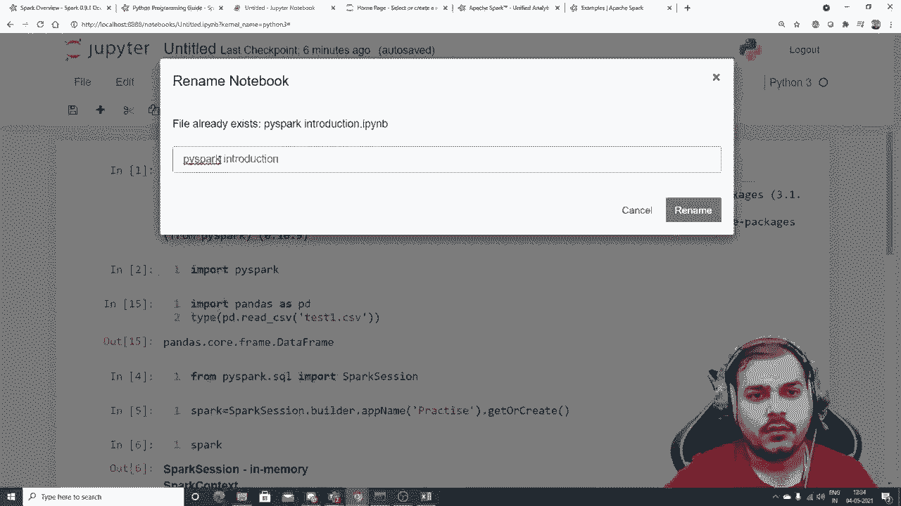

# PySpark大数据处理入门，带你玩转Python+Spark大数据操作与分析！＜实战教程系列＞ - P1：L1- Pyspark介绍和安装 

大家好，我的名字是Krisna，欢迎来到我的YouTube频道。那么，大家，我们将开始Apache Spark系列，特别是如果我谈到Spark，我们将专注于如何使用Spark与Python。所以我们将讨论一个叫做Pi Spark的库。😊

我们将尝试理解为什么实际上需要Spark，并且我们可能还会覆盖很多内容。有一个叫做Mlib Spark Mlib的东西，它基本上会告诉你如何在Apache Spark中应用机器学习。你知道，通过这个叫做Pipark库的Spark API。此外，我们还会在未来看到，一旦我们理解了Pipark库的基础知识，我们如何实际预处理我们的数据集，如何使用Pipark数据框，我们也会尝试了解。

我们如何在云平台如Databricks、Amazon、AWS中实施或使用Pipark，你知道，因此所有这些云我们都会尝试覆盖，并且记住Apache Spark非常方便。让我告诉你，给你一些理由，为什么Apache Spark非常好，因为你要理解，假设你有大量的数据。好的，假设我说我有64GB的数据，1。

8GB的数据，你知道，我们可能有一些独立系统，知道，在那里我们可能有32GB或64GB的内存。现在我正在工作的工作站有64GB的内存。因此，最大到最大，它可以直接上传一个32GB或48GB的数据集。但是如果我们有一个1.8GB的数据集，你知道，那个时候，大家。

我们不仅依赖于本地系统，还将尝试在分布式系统中预处理特定数据并执行任何类型的操作。分布式系统基本上意味着将会有多个系统，你知道，我们可以在这些系统上运行这种作业或处理，或尝试做我们真正想做的任何活动，Apache Spark肯定会帮助我们做到这一点，这真的是非常棒。而且，是的，人们非常想要这种类型的视频。所以我们将如何进行这个特定的播放列表，我们将首先。

从安装开始。我们将尝试使用Pipark，因为它也是Apache Spark，这是一个与Python一起使用的Spark API。当你实际使用Python时，我们基本上使用Pipark库。而且，是的，我们也可以使用Spark与其他编程语言，如Java、Scala等，我们将从基础知识开始，了解我们如何读取数据。

我们如何连接到数据源，可能我们如何使用数据框，在这个Apache Spark中，这是你的Pi。😊他们还提供你数据结构，比如数据框，这与Pandas数据框非常相似，但支持的操作有所不同，我们将逐一查看，然后我们将尝试进入Mlib Apache Spark Mlib，基本上称为Spark Mlib，它将帮助我们执行机器学习，在这里我们将能够执行一些机器学习算法任务，包括回归、分类、聚类，最后我们将尝试看看如何在云中执行相同的操作，我会向你展示一些示例，我们将有一个庞大的数据集，我们将尝试在分布式系统的集群中进行操作，并看看我们如何使用Spark，对吧？所以这些内容基本上都会覆盖到。现在Apache Spark的一些优势以及为什么它如此著名，因为它的工作负载速度是普通的百倍。

更快，你知道，这基本上意味着。如果你了解大数据，当我们谈论大数据时，我们基本上是在谈论巨大的数据集，对吧？如果你听说过这个叫做MapReduce的术语，Apache Spark的速度比MapReduce快得多，快100倍。好的。

并且它的一些优势在于易用性。你可以快速用Java、Scala、Python或R编写应用程序，正如我所说的。我们将专注于Python，并将使用一个叫做Pipark的库。然后你还可以结合SQL流处理和复杂分析。当我谈论复杂分析时。

我基本上是在谈论这个Mlib机器学习库，它肯定能与Apache Spark良好协作。Apache Spark可以在Hadoop、Apache Mesos、Kubernetes、独立模式或云端运行。当我谈到AWS DataBricks等各种云服务时，我们肯定可以工作。它实际上在集群中运行，集群基本上意味着分布式。因此，这些都是一些示例。

现在，如果我谈到我们将使用哪个版本的Spark，我们将使用3.1.1，并尝试进行工作。如果你在这里搜索一下，你可以看到SQL和数据框架，以及Spark流处理，机器学习被称为机器学习。除此之外，如果我查看概述，你会看到Apache Spark是一个快速的通用集群计算系统。

它提供了高效的API，可以在Java和Python中进行扩展，这使得并行作业的编写变得简单，支持通用计算图的优化引擎。所以它基本上是用来处理大量数据的。😊而且简短，你知道的。这非常方便。我们将尝试工作。现在，如果我去搜索这个Python中的Spark，你知道，这个页面基本上会打开，我们将讨论如何安装它。

在这个视频中，我们将尝试安装Pipar库。如果我谈到Pipar库，你会发现Pipar库非常棒。这个库是如果你真的想在Python中使用Spark功能的话，你基本上会使用这个特定的库。让我们继续，看看我们能多快做到这一点。

😊是的，我们如何快速安装特定的库，并检查我们可以实际做些什么。好的，所以我们将尝试看看所有这些内容。那么让我们开始吧。请确保在使用Pi时创建一个新环境。所以我创建了一个名为my的新环境。在这里，首先，我将尝试安装Pi库。

所以我将安装Pipar，让我们看看在这方面我们将专注于安装。我们将专注于读取一些数据集，并尝试看看我们实际上可以做些什么。好的，完成这个之后，我们可以看到我们的Pi已经安装。为了检查安装是否完美，我将写import Pi。所以这看起来完全正常，它正在工作。我们能够看到Pi基本上已正确安装。现在你可能会遇到某种问题。

这是关于Pipar的，所以这就是我告诉你创建一个新环境的原因。如果你遇到某种问题，😊请告诉我你遇到的错误，可能在评论区写一下。好的，现在我们来做一件事。我会打开Excel表格。好的，可能我会试着创建一个。

一些数据集，我会说名字，可能我会说名字。还有H，对吧。假设我在这里写的名字是squan，还有31。我会说Suan S。对吧，Shoan Shu。我会说，好的，30。可能我会再写一些名字，比如Sunny。可能我还会给出数据29。

所以这三个数据我们将尝试看看如何读取这个特定的文件。好的，我要保存它。让我们看看。我会将其保存在与我的Jupyter笔记本相同的位置。嗯，我创建了一个文件夹，我想。你可以将其保存在任何打开笔记本文件的位置，对吧，所以这不是必要的，只是确保你没有看到我的文件。好的。

我正在保存它。好的，我将其保存为test 1。在这里你可以看到。我将其保存为test 1.dot CSV。所以我会保存它。让我们保持这个特定的文件已保存。好的，现在如果我可能想要，你知道。😊！

用pandas读取。所以我们写的是`pd.read_csv`，对吧。我基本上使用这个数据集，叫做`testest1.CSV`，对吧？所以当我在这里执行时，你将能看到这个特定信息。现在，当我真的想用Pipar时，首先，记住。

我们需要启动一个spark会话。为了启动spark会话，首先让我创建更多字段。请看这个。请遵循创建pass会话的特定步骤。所以我将写`from Pipar`，`Dot sqL`，`Import Spark session`。好的，然后我将执行这个。你可以看到它表现得很好。然后我会写，抱歉。我不知道打开了什么。

所以我将创建一个名为spark的变量，可能我将使用`spark session.builder`。我会说应用名称，这里我只会给我的会话命名。好的，所以它将是练习。假设我在练习这些东西。然后我可以说获取或创建。所以当我实际执行时，你将能看到一个spark会话会被创建。

如果你第一次执行，它可能会花一些时间，除此之外，如果我多次执行，那你就能使用它。现在在这里你绝对可以看到，当你在本地执行时，总是只有一个集群。但当你在云中工作时，你可以创建多个集群和实例。好的。

所以你将使用的spark版本是v 3.1.1，在这里你可以看到，这基本上存在于主节点，当你可能在多个实例中工作时，你将看到主节点和集群的信息。好的，这与Spark有关。现在我将写`Df of pipar`，我将尝试读取一个数据集。😊，关于spark。好的，现在为了读取一个数据集，我可以写什么。

我可以写`spark.Read`，然后有很多选项，比如CSV格式、JDBC、parquet、scheme或文本等，所以这里我们将采用CSV，我只是写`tips1.Teps 1 do C`，对吧。如果我试着在这里执行，我收到一些错误，说这个特定文件不存在。

让我看看。我想这个文件是存在的。嗯嗯嗯。让我看看，为什么这个没有执行。`Ti 1.D F file open`。这里我能看到`test 1.CV`。好的，抱歉，我没有写那个CSV文件。我想是`test 1.CSV`。好的，这现在工作了。现在，如果我去看`D dots Pipar`，它显示这两个字符串，对吧，这两列C0和C1。现在你可以看到，伙计们。

我创建了这个特定的 Cv 文件，它只是将 A B 作为默认列，可能它在说 C0 和 C1。所以我们实际上可以做的是，可能如果你真的想看到整个数据集，你可以基本上像这样看到 `Df underscore Pipar dot show`，在这里我们能看到 name 和 age，我真的想把我的列名或 age 作为我的主要列。但当我直接读取这个 Cv 文件时。

可能我们得到了 `underscore c0 underscore C1`。为了解决这个问题，我会使用不同的技术。所以我会写 `spark dot read dot option`，这里有一个叫做 option 的东西，在这个 option 中，你可以基本上提供一个选项。

😊，Header，像我看到的，会有一些像 key value 你将在 option 中提供的东西。所以你可以这样做，你可以写 `header.commer true`。这样，第一列第一行的值将被视为你的 header。如果我写 `Csv` 以测试1，现在，我就要读取这个 test1 数据集。

`Test 1 dot CS Sv`。现在，一旦我在这里执行这个，你会看到我能够得到现在的 name 字符串和 H 字符串。好的，但让我们看看我们的完整数据集。所以在这里，如果我现在执行这个，我将能够看到整个数据集与这些特定的列。好的。所以让我迅速地将其保存在我的 `Df underscore Pi spark` 中。😊，现在。

让我们去看看 `type of D F underscore pi spa`。好的。现在，当我在这里执行这个时。你们会看到，大家，当我在阅读这个 Df 的时候。对，当我使用 pandas 的帮助来查看这个类型时，你会看到有 `pandas dot code do frame do data frame`。但在这里，你会看到，当你在读取这个特定数据集时。

它是 `Pipar do sQl do data frame do data frame` 类型。是的。所以 pandas 数据框是 `sQL dot data frame data frame`。是的。大多数 API 几乎是一样的。功能也是一样的。随着我们继续前进，还有很多东西我们会学习。但。😊，如果我快速想看到我的。可能，我不知道 `head` 是否会工作。让我们看看。是的。

`head` 也可以使用。所以如果我使用 `dot head`，你可能会看到我在这里基本展示的行信息。现在，如果我真的想看到关于我的列的更多信息，我可以使用一个叫做 `print schema` 的东西，现在这个 `print schema` 就像 `Df dot info`。

这实际上会告诉你关于列的信息，比如 name 是字符串，age 也是字符串。好的，这些都是你在安装之后实际执行的一些基本操作。我要强调的主要原因是，尽量安装这个 Spark，并为我的下一个课程做好准备，我会尝试向你展示如何更改数据类型以及如何处理数据框。

我们如何实际进行数据预处理，如何处理空值和缺失值。我们如何删除列，如何做各种事情。这些内容基本上都会在那儿讨论，如何删除列。所以我希望。😊。

像这个特定的视频。这只是我对PySpark的介绍，好的。我们将继续下一个环节。可能。我还会在我的GitHub上提供这些信息，那里我们可能会，好的，PySpark已经在那儿了。

我。基本介绍，好的，所以我们将尝试完成这个，我们会尽量涵盖所有内容。在下一个环节中。记住，大家，我们的主要目标基本上是让你理解我们如何在云端工作。在此之前，我们真的需要了解所有基本知识，关于Pipar。但确实，这是一个令人惊叹的库，它将帮助我们实现所有与Python相关的Spark API功能。

所有与机器学习相关的内容，我们也可以借助Pi来完成。所以我希望你喜欢这个视频，我们下个视频再见，祝你有个愉快的一天。谢谢大家。😊。
