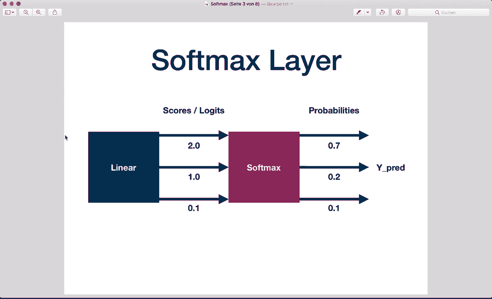
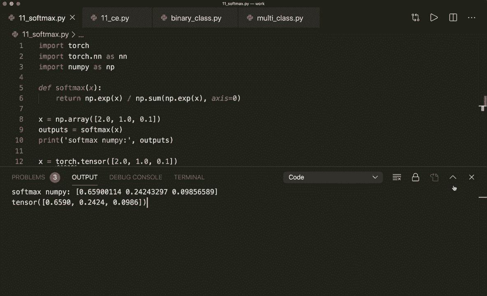
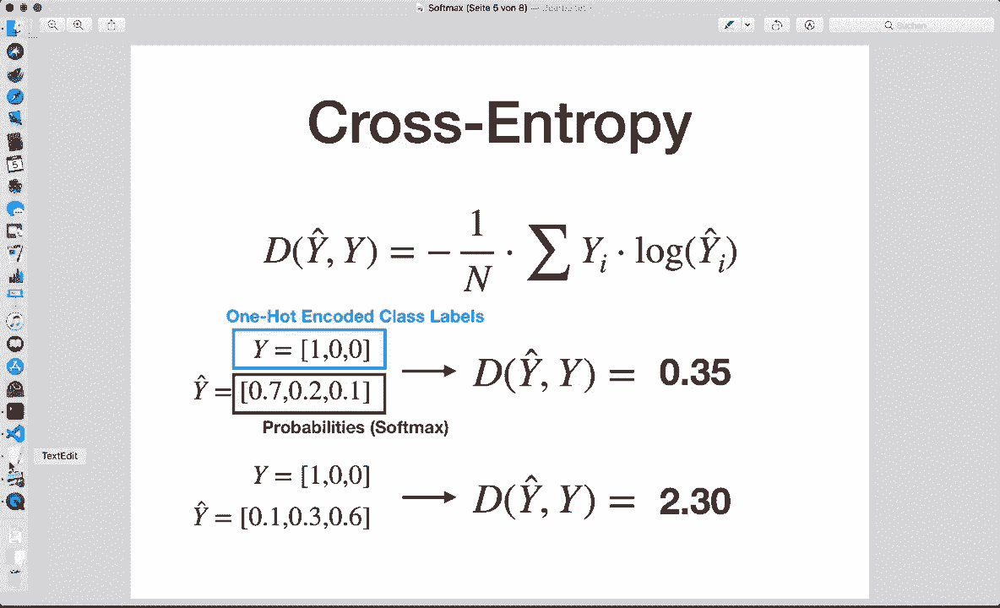
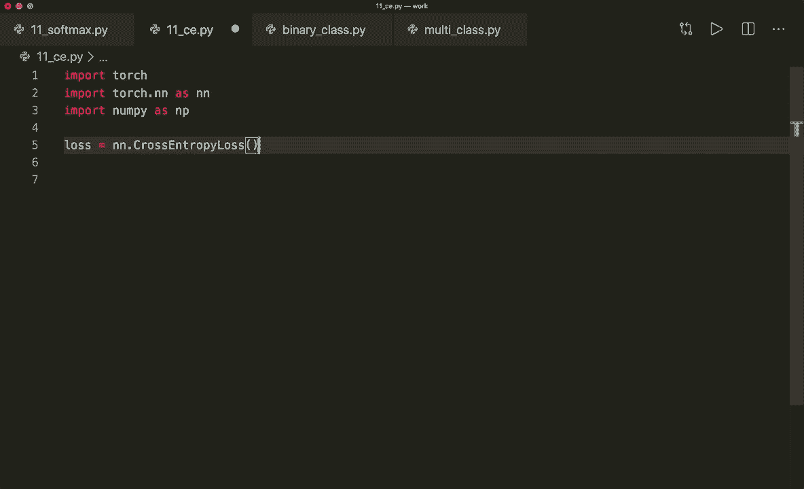
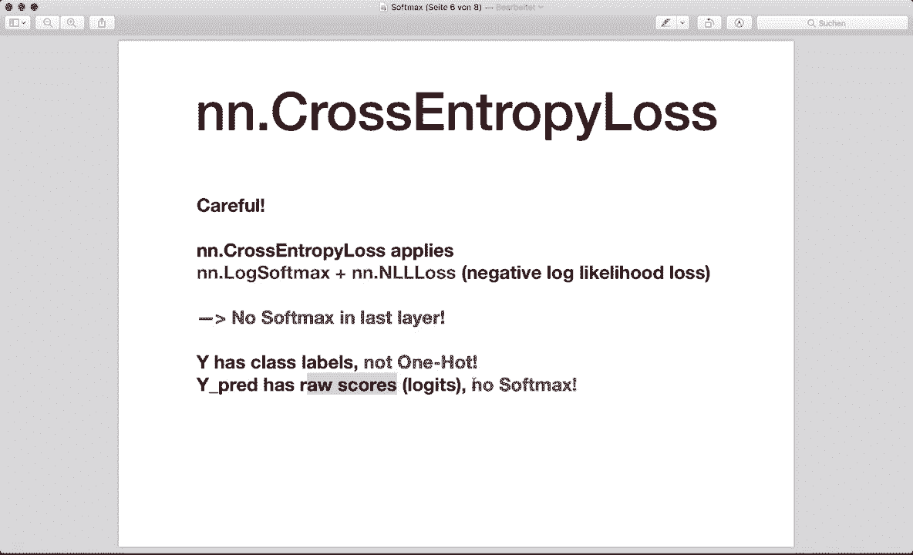
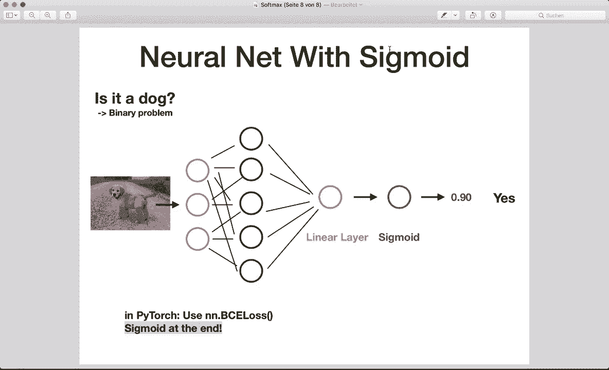

# PyTorch 极简实战教程！P11：L11- Softmax 和交叉熵 

大家好，欢迎回到新的PyTorch教程。这次我们将讨论softmax函数和交叉熵损失。这些是神经网络中最常用的函数之一，因此你应该知道它们是如何工作的。现在，我将教你这些函数背后的数学原理，以及如何在numpy和PyTorch中使用它们。

最后，我会向你展示一个典型的分类神经网络是如何运作的。让我们开始吧。😊这是softmax的公式。它将指数函数应用于每个元素，并通过所有这些指数的和进行归一化。因此，它基本上将输出压缩到0和1之间，得到概率。

让我们看一个例子。😊假设我们有一个线性层，它有三个输出值。这些值称为分数或锁定值。它们是原始值。然后我们应用softmax并得到概率。每个值被压缩到0和1之间，最高的值得到最高的概率。

如果我们将这三个概率相加，就得到1。这就是我们的预测。然后我们可以选择概率最高的类。所以，这就是softmax的工作原理。现在让我们看看代码。我已经在numpy中实现了它。我们可以在一行内计算。

我们有指数，然后我们除以总和。

所有这些指数。现在，让我们运行这个。这与我幻灯片中的值相同。在这里，我们也看到最高的值具有最高的概率。我在幻灯片中对它们进行了四舍五入，所以稍微不同，但基本上是正确的。当然，我们也可以在PyTorch中计算它。

我们创建一个张量。假设x等于torch.tensor，它得到与这个相同的值。然后我们可以说outputs等于torch.softmax(x)。我们还必须指定维度，所以我们说dim等于0。这是在第一个轴上计算。现在让我们打印这些输出。

在这里我们看到结果几乎相同。

所以，这有效。现在继续。很多时候，softmax函数与所谓的交叉熵损失结合使用。这测量我们的分类模型的性能，其输出是0到1之间的概率，可以用于多类问题。

当预测概率与实际标签偏离时，损失增加。因此，我们的预测越好，损失越低。这里有两个例子。这是一个好的预测，交叉熵损失较低。而这是一个差的预测，交叉熵损失较高。

我们还必须知道的是，在这种情况下，我们的 y 必须是热的，独热编码。假设我们有三个可能的类别，类别 0、1 和 2。在这种情况下，正确的标签是类别 0。所以这里我们必须放一个 1，所有其他类别我们必须放 0。这就是我们如何进行独热编码。

对于预测的 y，我们必须有概率。例如，我们之前在这里应用了软最大值。现在再次，让我们看看代码。我们如何在 nuy 中做到这一点。我们可以在这里计算。因此我们有实际标签的总和乘以。

预测标签的锁定。然后我们必须在开头放一个 -1。我们也可以对其进行归一化，但我们在这里不这样做，所以我们可以将其除以样本数量。然后我们创建我们的 y。正如我所说，这必须是独热编码。因此这里我们有其他示例。如果是类别 1，则必须像这样，例如。然后在下面。

我们提出了两个预测。这些现在是概率。第一个预测是好的，因为在这里，类别 0 拥有最高的概率。第二个预测是差的。在这里，类别 0 的概率非常低，而类别 2 的概率很高。然后我计算熵。

交叉熵和预测两个。所以让我们运行这个。在这里我们看到第一个预测有一个低损失，而第二个预测有一个高损失。现在再次，让我们看看如何在 Pytorch 中做到这一点。为此，我们首先创建损失。所以我们说损失等于 N，N 来自神经网络火炬和 N。模块，N，N dot 交叉熵损失。

现在我们必须知道的事情是，让我们再次查看幻灯片。在这里我们必须小心。因为交叉熵已经应用了锁定的软标记，然后是负对数似然损失。所以我们不应该或不能自己实现软标记层。这是我们必须知道的第一件事。第二件事是这里我们的 y 不能是独热编码。

所以我们应该只在这里放正确的类别标签。此外，为什么预测有原始分数。所以这里没有软标记。

所以要小心这一点。现在让我们看看实际情况。假设我们创建实际标签。这是一个 torch dot tenzor。这里我们只放正确的类别标签。假设在这个案例中，它是类别 0。不再是独热编码。然后我们有一个好的预测。Y 预测好等于。😊。

Torch dot tenzor。在这里我们必须注意大小。所以这个大小是样本数量乘以类别数量。假设在我们的案例中，我们有一个样本和 3 个可能的类别。所以这是一个数组的数组。在这里我们放入 2。01。0 和 0。1。请记住，这些是原始值。所以我们没有应用软最大值。然后这里。

最高的。或者对。类0具有最高的值。这是一个好的预测。现在让我们做一个不好的预测。所以不佳的预测。在这里，第一个值是较低的值，假设是，第二个值很高。我们也稍微改变一下这个。现在我们这样计算损失。

现在我们称这里创建的损失函数。然后我们输入预测的y和实际的y，第二个也是如此。让我们计算第二个损失，预测的y不佳和y。现在让我们打印它们。我们打印L1。Dot item。它只有一个值，所以我们可以调用item函数和L2 dot item。

让我们运行这个。是的，我们看到好的预测有较低的交叉熵损失。所以这是有效的。现在要获得实际预测，我们可以这样做。假设下划线，因为我们不需要这个。然后预测。Dicctions等于torch.dot max。然后在这里我们输入预测。即好的预测y。

然后沿着第一个维度。同样的不佳预测。所以我们称之为预测1和预测2。嗯。让我们打印我们的预测。所以预测1和打印预测2。在这里我们看到我们选择了最高的概率。因此在这种情况下，我们选择这个，在第二种情况下。

我们选择这个。所以这里是类别编号1。这就是我们获取预测的方式。还有一点非常好的是，Pyto中的损失允许多个样本。所以让我们在这里增加我们的样本。假设我们有三个样本。所以三个可能的类别。然后我们的张量必须有三个类别标签，我们的实际y。因此，例如，2，0和1。然后，我们的。

预测必须是样本数量乘以类别数量的大小。所以现在这是3乘3的大小。让我们这样做。所以在这里我们必须放入另一个带有三个值的列表。所以，嗯。像这样，像这样。假设这是一个好的预测。所以第一个类，第一个正确标签是类别编号2。

所以这个必须是最高值，这个必须是低值。假设是001。在这里，第一个类必须有高值。像这样。然后中间的值必须有最高的原始值。例如，像这样。然后，我们对不佳的预测做同样的事情。假设这里我们有一个更高的值。

还要稍微改变一下这个。然后我们可以再次计算多个样本的交叉熵。现在让我们运行这个。然后我们再次看到，我们的第一个预测是好的，并且有低损失。第二个就不太好了。是的，我们从第一个得到了正确的预测。

预测张量。所以这里我们也有2，0，1，和实际的y一样。所以，是的。这就是我们如何在Pytorch中使用交叉熵损失的方式！

现在，让我们回到幻灯片。所以现在我想展示一个典型的神经网络是怎样的。在多分类问题中，这是一个典型的神经网络。我们想要找出我们的图像显示的是哪种动物。因此我们有一个输入层，然后一些隐藏层，也许在中间有一些激活函数。

在最后，我们有一个每个类别的输出为一的线性层。所以这里我们有两个输出。在最后，我们应用softmax并获得概率。所以现在，如我所说，在PyTorch中，我们必须小心，因为我们在这里使用交叉熵损失。

所以我们在神经网络中必须不使用softmax层。因此我们必须不自己实现这个。让我们看看这个代码的样子。在多分类中。

分类，我们的网络，例如。看起来是这样的。所以我们定义我们的层。我们有一个线性层，它接收输入大小和一个隐藏大小。然后我们在中间有激活函数。最后一层接收隐藏大小，输出大小是类别的数量。对于每个可能的类别，我们都有一个输出。

在前向方法中。我们只应用我们的层，而在最后没有softmax。然后我们创建我们的模型，然后我们使用交叉熵，它适用于softmax。所以要小心这里。

这个例子也适用于更多类别。如果我们的图像也可以是鸟或老鼠或其他，那么这是正确的布局。但如果我们只是有一个二元分类问题，具有两个可能的输出。那么我们可以这样更改我们的层。所以，现在我们重新表述我们的问法。我们只是说。

这是一份文档吗？是或不是。然后在最后，我们有一个只有一个输出的线性层。我们不使用softmax函数，而是使用sigmoid函数。然后得到一个概率。如果这个概率高于0.5，我们就说是。这里在PyTorch中，我们使用BCELoss或二元交叉熵损失。

所以在这里我们必须在最后实现sigmoid函数。让我们看看在二元分类情况下的神经网络。所以在这里首先。我们设置我们的层和激活函数。最后一层的输出大小为1。在这种情况下总是固定的。然后在前向传播中，现在在应用我们的层后。

我们还必须实现sigmoid函数。所以，是的，然后在这里作为标准，我们使用二元交叉熵损失。所以在这两个不同的方面要非常小心。

不同可能的神经网络。

是的，这基本上就是我想要展示的内容。所以最后的结构也是我在逻辑回归教程中使用的，如果你还没看过，可以去看看。目前，我想展示的就是这些。希望你喜欢，并且理解了所有内容。如果你有任何问题，请在下面的评论中留言。如果你喜欢这个教程的话。

那么请订阅频道，下次再见，拜拜。
