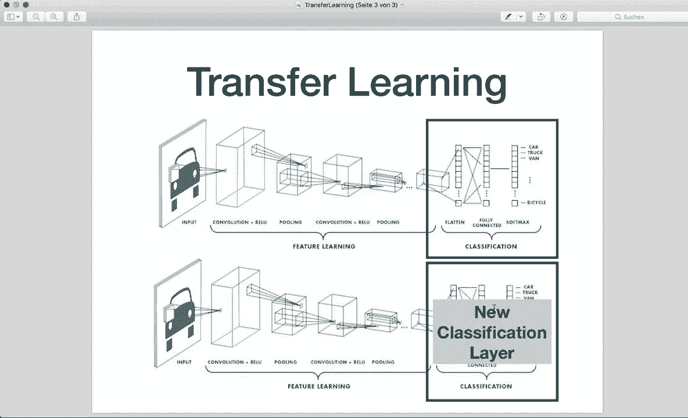
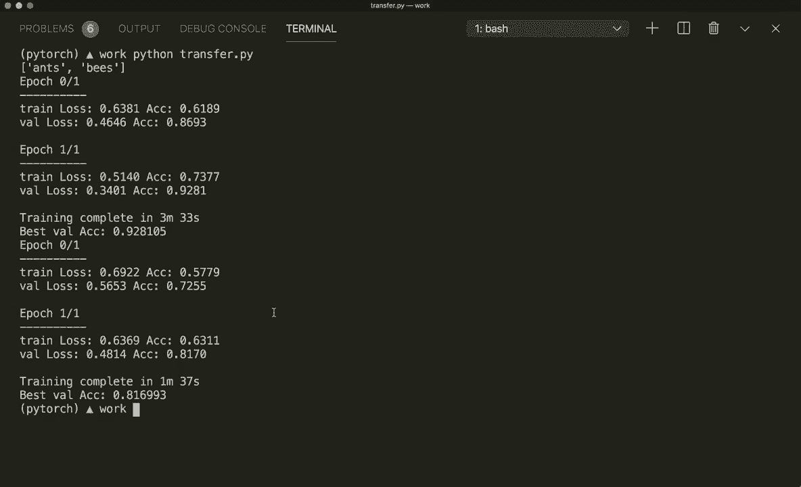

# PyTorch 极简实战教程！P15：L15- 迁移学习 

嗨，大家好。欢迎来到你的新 PyTorch 教程。在这个教程中，我们将讨论迁移学习以及如何在 PyTorch 中应用它。迁移学习是一种机器学习方法，其中为第一个任务开发的模型被重新用于第二个任务的起始点。例如，我们可以训练一个模型来分类鸟类和猫，然后使用同样的模型。

仅在最后一层稍作修改，然后使用新模型来分类蜜蜂和狗。这是深度学习中一种流行的方法，能够快速生成新模型。这非常重要，因为训练一个全新的模型可能会非常耗时，可能需要几天甚至几周的时间。因此，如果你使用一个预训练的模型。

然后我们通常只交换最后一层，而无需重新训练整个模型。然而，迁移学习能够取得相当不错的性能结果，这就是它如今如此受欢迎的原因。😊所以让我们看看这里的这张图片。我们有一个典型的 CNN 架构，我在上一个教程中已经向你展示过。

比如说，这个模型已经在大量数据上进行了训练，并且我们有优化的权重，现在我们只想保留最后一层的全连接层。所以就是这一层，然后修改它，并在我们的新数据上训练最后一层。这样我们就有了一个在最后一层经过训练和调整的新模型。是的，这就是迁移学习的概念。现在让我们在 PyTorch 中看看一个具体的例子。

在这个例子中，我们想使用预训练的 Resnet 18 CNN。这是一个在超过一百万张来自 Inet 数据库的图像上训练的网络。这个网络有 18 层深，可以将图像分类为 1000 个对象类别。而在我们的例子中，我们只有两个类别，所以我们只想检测蜜蜂和蚂蚁。😊

是的，让我们开始吧。在这一节中，我还想给你展示两个其他的新东西。首先是数据集的图像文件夹，我们如何使用它，以及如何使用调度程序来改变学习率。然后，当然，迁移学习是如何被使用的。我已经导入了我们需要的内容。

现在我们设置数据。上次我们使用了 Torch 视觉数据集中的内置数据集，而现在这里我们使用数据集的图像文件夹，因为我们把数据保存在一个文件夹中，并且这个文件夹需要具有这样的结构。我们在这里有一个文件夹，然后有一个训练文件夹和一个验证文件夹。所以是 train 和 Val。在每个文件夹中，我们都有每个类别的文件夹。这里我们有蚂蚁和蜜蜂。

在验证文件夹中，我们有蚂蚁和蜜蜂。现在在每个文件夹中，我们有这里的图像。所以，例如，这里我们有一些蚂蚁。还有，让我们看看一些蜜蜂。所以这里我们有一只蜜蜂。是的，所以你必须这样组织你的文件夹。然后你可以调用数据集.dot image folder并给出路径。

我们还在这里提供了一些变换。然后，我们通过调用image sets，image data sets.dot classes来获取类名。是的，然后在这里我定义了训练模型，在循环中进行了训练和评估。我在这里不会详细说明，你应该已经从上次的教程中知道典型的训练和评估循环是怎样的，你也可以在GitHub上查看完整代码。

所以我将在描述中提供链接。请自行查看。现在让我们使用迁移学习。首先，我们想导入预训练模型。让我们设置这个模型，这样我们就可以通过说model来做到这一点。所以model等于。这在Torch visionion.dot models模块中可用。

所以我已经导入了torch vision模型。然后我可以调用models.dot Resnet 16或抱歉，Resnet 18。在这里，我可以说pretrained等于true。这已经是针对imagenet数据训练的优化权重。现在我们想做的是交换最后的全连接层。首先。

让我们获取最后一层的输入特征数量。所以我们可以说nu features等于model。我们可以通过调用dot F fully connected来获取这个。然后是输入特征。这是我们需要的最后一层的输入特征数量。然后让我们创建一个新层并将其分配给最后一层。所以我们可以说model.Dot F C等于。

现在我们给它一个新的全连接层N N.dot linear。这获取我们拥有的输入特征的数量。然后作为新的输出特征，我们有两个输出，因为现在有两个类。现在我们将模型发送到设备。如果我们有GP支持。

所以我们在开始时创建了我们的设备，和往常一样。这是Kuda或简单的CPU。现在我们有了新模型，我们可以再次像往常一样定义我们的损失和优化器。所以我们说criterion等于N，N.dot cross entropis。然后我们可以说optr等于。这来自优化模块，Opim.dot S GD，随机梯度下降。

需要优化模型参数。我们必须指定学习率等于。让我们说0001。现在，作为一件新事物，让我们使用scheduleula。这将更新学习率。所以。为此，我们可以通过说它叫做step L R scheduleular来创建这个。并且L R scheduletula在torch优化模块中也可用。

所以我们已经导入了这一点。然后我们可以说学习率调度器执行学习率的步骤。然后在这里我们必须提供优化器。所以我们说优化器。然后我们说步长，步长等于7。然后我们说伽玛，假设为0.1。这意味着每7个轮次，我们的学习率乘以这个值。因此每7个轮次。

我们的学习率现在只有10，仅更新到10%。所以，这就是我们使用调度器的方式。通常我们想在我们的循环中，在每个轮次中进行。假设对于范围内的轮次为100。在这里我们通常使用训练，同时我们还要执行优化器的步骤。

优化器执行步骤。然后我们想要评估它，评估它。接着我们还必须调用调度器的步骤。这样我们就使用了调度器。请自己查看整个循环。因此，现在我们设置调度器，让我们调用训练函数。

所以我们说模型等于，然后训练模型。这是我创建的函数。然后我必须传递模型、标准、优化器、调度器以及训练轮数。假设训练轮数为20。那么，这就是我们如何使用迁移学习。在这种情况下。

我们使用一种叫做微调的技术。因为在这里，我们再次训练整个模型，但只是稍微调整。因此我们根据新数据微调所有权重，并使用新的最后一层。这是一个选项。第二个选项是，我复制粘贴相同的内容。让我们看看从哪里开始。

作为第二个选项，我们可以在一开始冻结所有层，仅训练最后一层。为此，我们在获得模型后必须遍历所有参数。所以我们说对于模型的参数，设置其要求梯度属性为假，所以我们可以说参数。

需要梯度。然后说，抱歉，需要梯度，要求梯度等于假。现在我们有了，这将在一开始冻结所有层。现在我们设置新的最后一层。我们在这里创建一个新层，默认情况下，这个层的要求梯度等于真。然后再次设置损失、优化器和调度器。

然后我们再次执行训练函数。所以，是的，这样甚至更快。让我们运行这个，然后查看两个评估结果。我还会打印出所花费的时间。所以，好的，让我们保存这个，并通过说Python transfer.py来运行。这可能最初会。

它将下载所有图像，这可能需要几秒钟，因为我在我的MacBook上没有GPU支持。所以我会跳过这一点，稍后再见。好的，我回来了。这在我的电脑上花了超级长的时间，所以我在这个例子中将训练轮数重置为2。让我们看看结果。在仅仅两个训练轮次之后。

这是第一次训练，我们对整个模型进行了微调。这个过程花了三分半钟，目前最佳准确率是92%。这是第二次训练，我们仅训练了最后一层，大约只花了一分半钟。

是的，准确率已经超过80%。当然，这还不如我们训练整个模型时的效果，但对于仅仅两个周期来说，已经相当不错了。现在我们假设将周期数设得更高。所以，这就是迁移学习如此强大的原因，因为我们有一个预训练的模型。

然后我们只需稍微调整一下，完成一个全新的任务，也能取得相当不错的结果。所以，现在我希望你理解了如何在Pythtorch中应用迁移学习。如果你喜欢这个教程，请订阅频道，我们下次再见。

