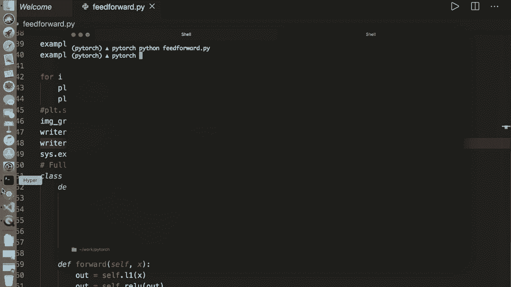
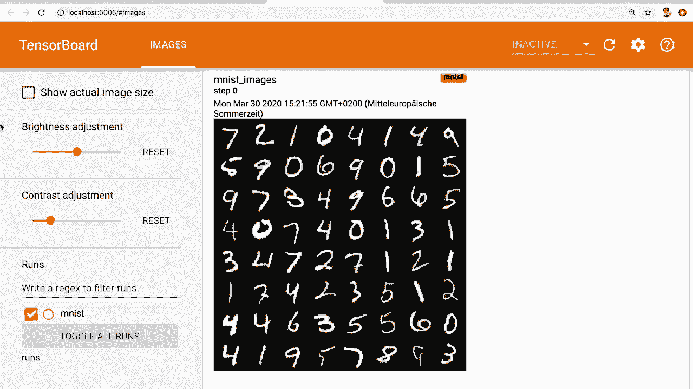
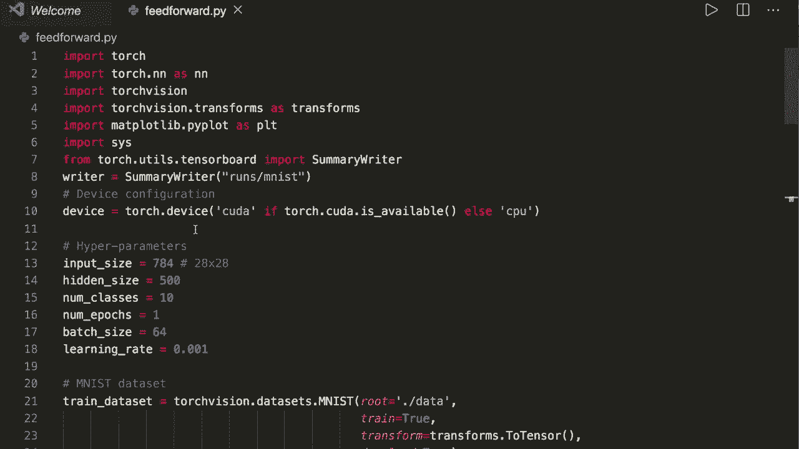
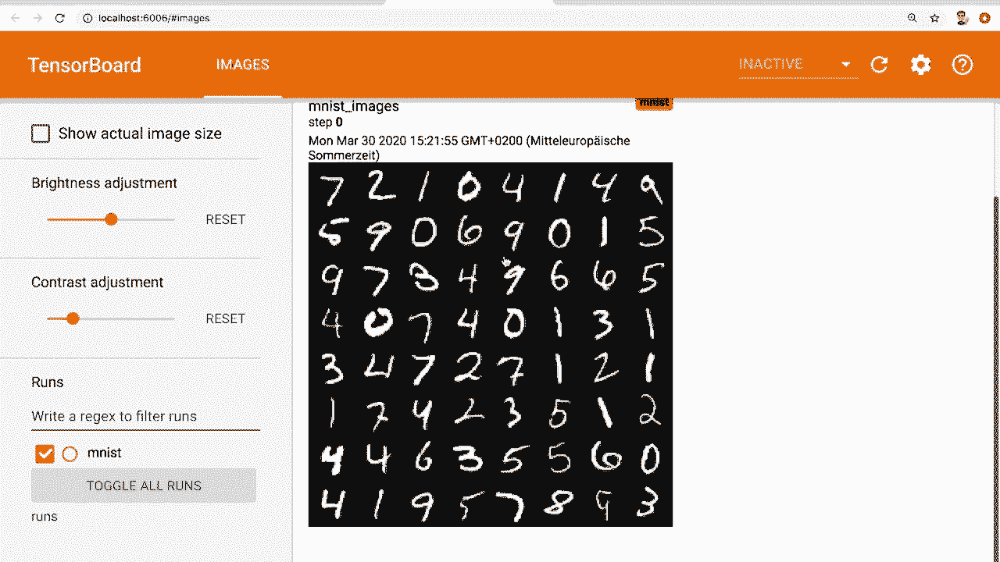
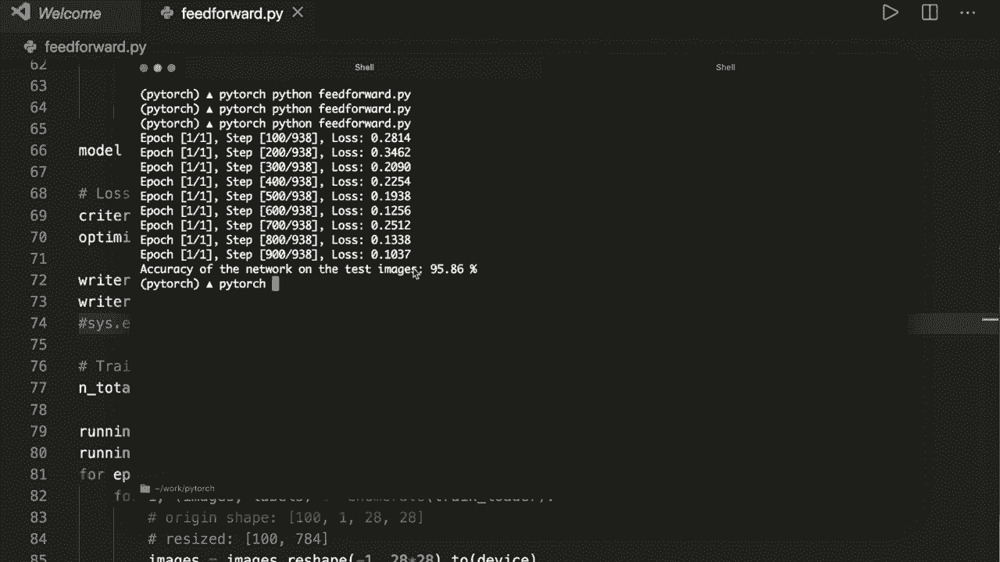
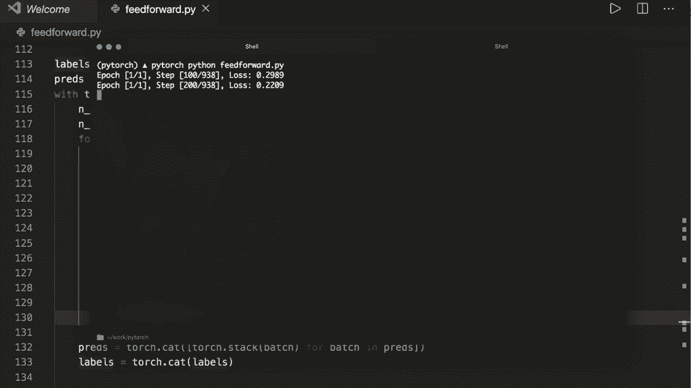
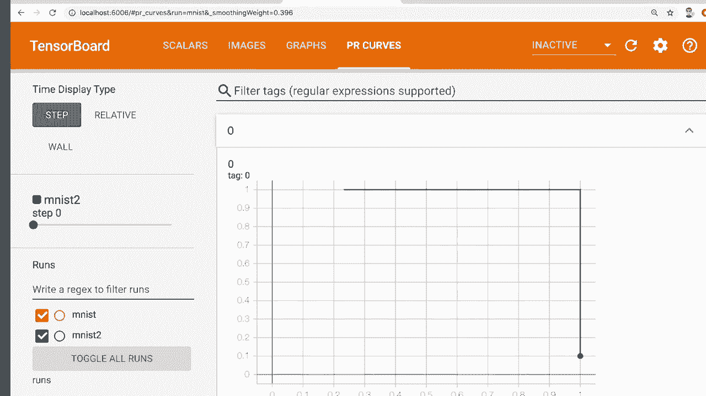

# PyTorch 极简实战教程！P16：L16- 如何使用 TensorBoard 

嗨，大家好，欢迎来到新的 PyTorch 教程。在这个视频中，我们将学习如何使用 TensorBoard 来可视化和分析我们的模型和训练管道。TensorBoard 是一个可视化工具包，用于实验我们的模型。它实际上是由 TensorFlow 的团队开发的，但同样可以与 PyTorch 一起使用。

在官方网站上，我们可以做几件事情。我们可以看到一些可以在 TensorBoard 中执行的操作。例如，我们可以跟踪和可视化指标，比如损失和准确率。我们可以可视化我们的模型图，查看直方图。

我们可以将嵌入投影到较低维空间，并可以显示图像、文本和音频数据，还可以分析我们的程序等等。😊所以现在我想向你展示我们如何在代码中使用这个。我将使用第 13 个教程中的代码。

好的，这里是代码。这是来自第 13 个教程的确切代码。如果你还没看过这个，我建议你先观看这个。因此，我现在将简要再次解释代码。在这个教程中，我们使用了 MNIST 数据集。因此，我们在这里进行了数字分类。现在我们正在加载 MNIST 数据集。

然后我们绘制了一些图像。接着我们创建了一个简单的前馈神经网络。这是一个具有一个隐藏层的全连接神经网络。我们看到，首先有一个线性层，然后是一个 ReLU 激活函数，再然后是另一个线性层。这就是我们的整个前向传播。

然后我们设置我们的训练管道。所以我们有我们的损失和优化器。接着我们进行训练。和往常一样，我们进行前向传播、反向传播，然后更新权重。最后，我们评估我们的模型并绘制准确率。因此，现在让我们使用 TensorBoard 对这段代码进行分析，以进一步分析我们的模型。

首先，我们要做的第一件事是安装 TensorBoard。为此，我们可以使用 `pip install tensorboard`。这将安装我们所需的所有内容。在我的情况下，我已经安装好了，所以这个过程很快。而且我们不需要安装整个 TensorFlow 库，在这里仅安装 TensorBoard 就足够了。现在我们可以通过输入 `tensorboard` 来启动 TensorBoard。

接着我们需要指定保存日志文件的路径，我们通过给定参数 `--logdir=` 来实现。默认情况下，这个路径在 runs 目录中。让我们按回车键。然后它将在本地主机 6006 启动 TensorBoard。

然后我们会收到一个警告，提示找不到 TensorFlow，并且将以减少功能集的方式运行。但这没关系。现在我们打开 TensorBoard。

现在我们来到了张量部分。此刻，我们看到没有活动的破折号端口。这是因为我们还没有写入任何数据。那我们来做一下吧。

让我们再跳回代码。现在我们想做的第一件事是导入Tensor板。所以，对于这个，我们说从torch的us中导入Tensor板。我们导入的叫做summary rider。这里我有一个拼写错误。现在让我们创建一个写入器。假设写入器等于summary rider。然后给它一个目录。

它应该保存日志文件，默认目录是，我说过的，运行文件夹。但让我们在这里更具体一点。我们叫这个运行，然后M N。现在我们已经设置好写入器。接下来我们想做的第一件事是在这里。在代码中，我们绘制了一些图像。现在，取而代之的是绘图。

让我们将图像添加到我们的张量板。为此，我们只需要创建一个网格。然后调用图像方法的写入器。那我们来做一下吧。假设我们的图像网格等于。我们也从torch vision中获取这个。Dot make，创建网格。然后给它数据。这里我们有一批示例数据。

让我们把这个放在这里。然后调用写入器的图像方法。这里我们给图像网格，并且一开始我们还需要提供这个图像的标签。比如我们叫这个，M Nist图像。现在。嗯。我想在这里退出，所以我使用。我导入cis或系统。然后我在这里使用提前退出，因为我现在不想运行整个训练管道。

在这里我调用cis.exit。我想确保所有事件都在这里写入。所以这就是我也调用写入器.close的原因。这确保所有输出都在这里被刷新。现在让我们保存这个。然后去终端，运行这个。假设我们说Python，然后我们的文件是feet forward.P，按回车。

现在让我们再次进入Tensor板并重新加载它。然后我们看到这里有我们的图像。

这里是我们刚创建的网格。这是60。这是8乘8，因为我们指定我们的批量大小为64。

嗯，所以现在我们可以分析我们的数据。

让我们继续在我们的Tzor板上做更多事情。接下来我们想做的是添加一个图。用于分析我们的模型。如果我们向下滚动，我们看到这里创建了我们的神经网络。让我们对此进行注释，然后在这里创建我们的模型。

然后在这里是我们的损失和优化器。现在在这里，让我们添加我们的模型图。我们可以通过说`rider.at_graph()`来实现这一点。然后在这里我们传递模型。我们还可以给它一个输入，所以我们可以再次说，我们有我们的示例数据。这是一个批次。然后我们必须以与这里相同的方式重新调整。

所以，让我们重新调整我们的批量数据。然后，再次调用`Rer.close()`和`writer.exit()`。然后系统退出。再一次，让我们运行我们的文件。

现在让我们再次去TensorBoard。让我们重新加载它。然后我们在这里看到上方也有图表选项卡。所以让我们去图表。在这里我们看到我们的模型。我们有输入，然后是神经网络。现在如果我们双击，就可以看到更多细节。这里我们看到我们的整个模型。

所以现在我们看到我们有第一个线性层。然后是ReLU激活函数。接着是第二个线性层。我们还可以看到每个线性层的权重和偏差。因此，是的，如果我们想，我们可以进一步检查。这确实有助于分析我们模型的结构。

所以，是的，现在我们有了我们的模型。现在让我们分析一些指标。我们在原始脚本中所做的是，在训练期间，我们每100步打印一次。我们打印当前的损失。现在，不只是打印这个。让我们把它添加到我们的TensorBoard中。因此，让我们添加训练损失和准确率。

对于这个，我们希望在这一批训练中得到平均损失。所以在开始循环之前，让我们在这里添加两个值。第一个是我们的运行损失。这一开始是0。然后我们还要说，运行的正确预测在一开始也是0。现在，每100步，我们……

抱歉，之前在每次迭代中。现在，我们将损失添加到运行损失中。所以我们说`running_loss += loss.item()`。我们还将正确预测的数量添加到运行的正确值中。因此，对于这个，我们想要得到预测。我们可以通过调用`torch.max`以与我们在下面所做的方式相同来做到这一点。所以，让我们在这里也这样做。我们得到预测值。

然后我们说`running_correct +=`。在这里我们说`predicted == actual_labels`，然后是求和。这是一个仅包含一个项目的张量。因此，我们可以调用`.item()`。现在，是的，我们在这里将其添加到运行损失中。现在每100步，我们想要计算平均值并将其添加到TensorBoard中。所以我们调用`rider.at_scala()`。

现在我们必须添加标签。所以在这里，让我们给它标签为训练损失。现在实际损失是运行损失除以100，因为我们为100步进行了求和。然后我们还必须给它当前的全局步骤。通过说epoch和提取的总步骤数来表示这一点。

这就是训练加载器的长度。再加上I，而I是当前批次迭代。所以这是当前的全局步骤。这里我们添加训练损失。现在让我们再做一次，添加准确性。我们说准确性。然后这里我们要说，运行。正确。除以100。然后在那之后。

我们必须将运行损失和运行预测正确的值重新设为0。所以我们说运行损失等于0.0和运行损失。不，抱歉。运行正确再次等于0。然后，是的，现在我们必须保存这个。现在我们必须运行整个训练管道。让我们再次注释掉系统退出。现在，让我们运行我们的脚本。

我们仍然应该看到这里的打印输出。因此，对于每100步，我们看到损失是如何减少的。现在我们应该完成了。现在我们也看到我们网络的整体准确性。现在让我们再次回到我们的TensorBoard，点击重新加载。

然后我们在这里还有一个条目。这是学者条目。这里我们有我们的两个图表。所以，是的，我们看到它成功了。我们看到了准确性。

对于每个步骤。我们也看到训练损失在减少。是的，所以在这里默认情况下，TensorFlow和TensorBoard会平滑这条线，因此我们可以在这里修改平滑参数。但现在我们可以分析损失是如何减少的。例如，如果我们看到在某一点上，损失没有进一步减少，我们可以看到这一点。

我们必须改进一些东西。例如，我们可以尝试不同的学习率。当然，这通常是我们想要优化的第一件事。那么，让我们修改学习率。现在，让我们称这个文件夹为mist，简单地说是simply2。

然后再次，让我们清理这个并再次运行我们的脚本。并且！

然后这应该已经在文件运行期间更新了我们的音调板。所以现在我们看到第二个图表。而且在损失图表中我们也看到第二个图表。现在，让我们再次重新加载这个。现在，是的，应该完成了。举例来说，这里我们又看到一个不同学习率的图表。

这就是我们如何互动地优化和分析我们的模型。现在，最后一件事，我想向你展示的是我们如何添加精确度召回曲线。精确度召回曲线让你理解模型在不同阈值设置下的表现。在二分类问题中，这更有意义。

但是如果我们分别分析每个类别。那我们确实有一个二元分类问题。因此让我们在这里为每个类别添加精确率-召回曲线。如果你不知道精确率和召回率的含义，我在描述中有一个链接。请查看一下。

现在我们想要做的是。让我们看看官方文档。我也建议你查看这个链接。让我们搜索一下PR。然后我们看到这里有方法at precision at PR曲线。这将添加精确率-召回曲线。这需要首先攻击。

然后需要标签。在这里我们看到标签是实际数据。每个元素的二元标签。

然后需要进行预测，预测是元素被分类为真的概率，值应在0到1之间。因此，这一点非常重要。我们需要实际标签以及这里的预测。好的，现在我们来看看代码，并为每个类别绘制精确率-召回曲线。

在我们的评估中，我们希望创建一个存储标签的列表。所以我们设置labels等于一个空列表。同样也需要一个预测的列表。所以pres等于一个空列表。在批评估期间，我们所做的是。对于标签，我们可以说标签停止追加，实际标签是预测标签。

现在对于。😊。

对于预测，我们必须小心。因此在这里，我们需要的概率在0到1之间。现在我们从模型中获得输出。如果我们再次查看神经网络，我们会发现最后有一层线性层。这些是原始值。这里甚至有一个评论。所以没有激活和没有softmax在最后。

因为在这种情况下，这应用于我们的损失函数中的交叉熵损失。但现在，再次，在评估中，我们想要获取实际概率。如果你看过我关于激活函数的教程，你就知道在这里必须使用哪种激活函数来获得概率。

这就是softmax函数。所以它将我们的值压缩为0到1之间的概率。所以我们在这里明确调用softmax用于我们的输出。为此，让我们导入F。也就是功能性。我们这里设置。😊，让我们导入torch.dot N，N.dot.functional，SF。大写F。然后，在这里，我们希望计算每个输出的softmax。

所以我们使用列表推导来实现这个。我们将其命名为类别。🤢，嗯。预测等于。现在我们在这里使用列表推导并调用F点softmax。然后我们说输出。接着我们需要给出维度。所以我们设置维度等于沿维度0。然后我们希望对每个输出执行此操作。

然后我们将这个添加到我们的，我们称之为 prettz 的对象中。prets dot，一支笔。然后在这里是类别预测。当我们完成循环时，我们想要将其转换为 a1zo。在这里我们说 labels 等于。然后 torch dot cut 这些标签。现在这是一个列表。当我们想要在一个维度上连接列表中的所有元素时。

转换为一维张量。对于预测，我们希望有一个二维张量。对于每个类别，我们想要堆叠预测。然后我们想要连接它。所以我们说。Prats 等于。然后在这里我们说 torch dot cat。接着我们再次使用列表推导，说 torch dot stack。

在这里，我们堆叠每个批次，并在预测中说四个批次。所以你应该自己检查这些张量的形状。我认为有多少。我们有，我想是10000个样本。所以这是10000乘以1，这应该是10000乘以10。对于每个类别，我们在这里堆叠它。现在当我们完成时。

所以现在我们必须做的最后一件事是得到实际的 PR 曲线。对于这个，我们说 classes。所以在这种情况下，我们的类别标签只是范围10，因为我们有从0到9的数值。现在我们迭代这个。所以4 I 在 classes 中。然后我们说我们得到的 labels I 等于。这里的 labels 等于 I。然后预测的同样操作，预测 I 等于预测。

在这里我们想要获取所有样本。但仅针对类别 I。然后我们调用 writer dot at。这称为 PR 曲线。这个需要一个标签。对于标签，我们仅使用类别标签作为字符串。然后在这里我们有。首先是标签，然后是预测。所以预测 I，然后作为全局步骤，我们就用0。

然后我们调用 writer dot close。这样我们就完成了。现在保存这个并再次运行我们的脚本。完成后，我们应该能看到每个类别标签的精确召回曲线。所以，差不多完成了。还有一支笔。我这里有个拼写错误。我有两个不同的标签变量。我们就叫这个。嗯。

我们在这里就叫这个 labels 1。这样 labels1 和 labels 1 以及 labels1。现在，我们再运行一次。抱歉。我们先清理一下，再运行一次。现在，我们又得经过训练管道。哦，我没保存。

好的，现在我们完成了。让我们再重新加载一次 tensor board。现在我们这里有一个新的条目。这是 PR 曲线。现在我们应该看到每个类别标签的精确召回曲线。在这里我们有标签0、标签1等。然后我们可以检查不同阈值下的精确度和召回率。

所以在y轴上，我们有精确度，在x轴上，我们有召回率。然后，例如，对于不同的阈值，我们可以分析一下，看看有多少个真正阳性，有多少个假阳性，有多少个真正阴性和假阴性。因此，这对分析模型也非常有帮助。没错。

这就是我想展示给你的关于Tensor板的所有内容。我希望你喜欢这个教程。请考虑订阅频道，下一次再见，拜拜。😊。
