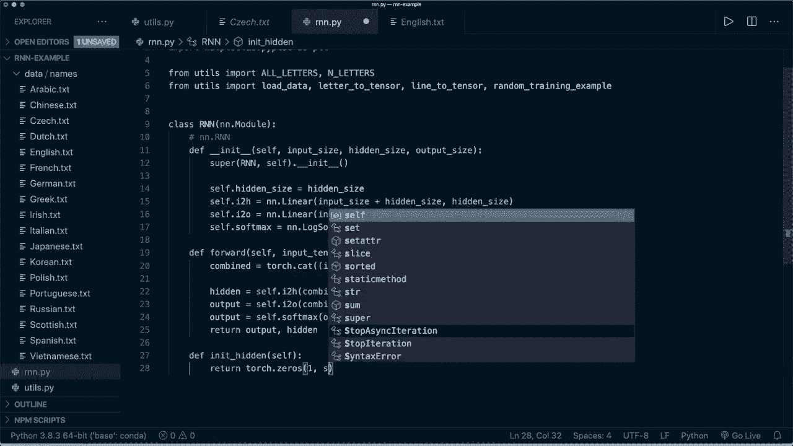

# PyTorch 极简实战教程！P19：L19- 使用循环神经网络进行名称分类 

嗨，大家好，欢迎来到你们新的 Pytorch 教程。今天，我们将讨论循环神经网络，简称 RnNs。我将简要解释 RnNs 背后的理论和不同的应用，然后我们将在 Pytorch 中从头开始实现一个 RnN 来进行名称分类。

这应该能让你很好地理解 RnNs 的内部工作原理。那么，让我们开始吧。RnNs 是一种神经网络，它允许将之前的输出作为输入，同时拥有隐藏状态。这里有一张以最简单的方式展示 RnNs 架构的图像。我们有一个输入，然后在内部进行一些操作，得到隐藏状态。

然后我们将这些隐藏状态放回到下一步。😊 所以我们可以利用之前的知识更新我们的新状态。最后，我们也会得到一个输出。因此，我们也可以展开这个图，获得更好的理解，基本上我们在这里处理的是一个序列。例如，如果我们有一个完整的句子，我们可能会将每一个单词作为一个输入。

所以我们有第一个输入和一些初始隐藏状态。然后我们进行操作，得到输出和新的隐藏状态，再将这个隐藏状态放入下一个输入中。接着，我们获取下一个输入，利用之前的隐藏状态，再次进行操作，得到新的输出和更新后的隐藏状态。

然后我们继续获取下一个输入，如此反复。这基本上就是 RnN 的架构。那么 RnN 为什么如此重要呢？对此有一篇由 And Carpathy 撰写的精彩文章。文章名为《循环神经网络的不合理有效性》，我强烈建议大家阅读一下，因此我会将链接放在描述中。

但核心要点是 RnN 非常令人兴奋，因为它们允许我们在向量序列上进行操作。与传统神经网络仅具有一对一关系不同，例如，当我们进行图像分类时。😊 那时我们的输入，也就是我们的图像，是固定长度的，输出也是固定长度的。而现在通过 RnN，我们可以处理序列。

还有很多不同类型的关系。所以基本上，我们可以在输入中有一个序列，在输出中也有一个序列，或者在输入和输出中都有。例如，我们可以有一个对多的关系，其中只有一个输入，例如，这在图像描述中使用，当我们有一张图像时，然后想要描述我们在图像中看到的内容，并得到多个输出。

然后我们也可以有多对一的关系。例如，在情感分类中就是这种情况，或者我们稍后在名称分类中所做的。因此我们将序列作为输入，然后应用我们的 RnN，接着使用最后的输出进行分类。

然后我们也可以有多对多的关系。这是在机器翻译中使用的，例如，我们有一个完整的句子，假设是英语作为输入。然后我们输出一个完整的法语句子。例如，我们也可以以同步方式建立多对多的关系。

在视频分类中，我们想对每一帧进行分类。这些就是 R 和 RNN 的可能应用。因此，它们主要用于自然语言处理和语音识别领域，但它们也可以用于图像分类。因此，这就是 RNN 的强大之处。现在我们简单看一下它的一些优缺点。

优势在于我们可以处理任意长度的输入。然后我们的模型大小不会随着输入大小的增加而增加。计算考虑了历史信息。因此，先前的数据。我们的权重在时间上是共享的。一些缺点是，计算可能会比普通神经网络慢。

从很久以前获取信息可能会很困难。而且我们也无法考虑任何对当前状态的未来输入。所以，基本上这就是 R 和 RNN 的理论。现在我们可以直接跳到代码部分。在我们的示例中，我们想进行姓名分类。因此我下载了数据。

我也会把链接放在描述中。基本上，我们有不同文件，文件名也不同。这些都是来自不同国家的姓氏，例如：阿拉伯、中文、荷兰文、英文等等。我认为这些来自18个不同国家。现在我们要做的是分类并检测这个名字来自哪个国家，我们将在这里把整个名字作为一个序列，然后使用每个单独的字母，将其作为一个输入放入我们的 RNN 中。

为此，我们需要一些函数的帮助。我已经在这里实现了它们，我将简要介绍这段代码。我们在这里首先要做的是使用一个辅助函数将我们的数据转换为 ASCII。例如，如果我们有这个带有特殊字符的名字，然后我们处理它。让我们运行这个文件。

然后我们看到它去除了特殊字符，剩下的只有 ASCII 字符。基本上，我们还打印了所有可能的字母。这是从 a 到 c 以及大写字母。我们还允许这些符号。😊然后我们有一个辅助函数来加载数据。这基本上加载了所有这些文件，然后加载了所有的名字。

它从文件名中获取国家名。这就是 load data 函数的功能。然后我们有一些函数将数据转换为张量。所以我们有字母到索引、字母到张量和行到张量的转换。我们在这里使用了一种叫做独热编码的技术。

所以我们需要一种显示数据的方式，以便用于训练。为此，我们使用**独热编码**。如果你看过我关于Pyr中聊天机器人的教程，你可能已经知道了这一点。一个独热向量用零填充，除了在当前字母的索引处有一个1。例如。

如果我们只有五个可能的字符：A、B、C、D和E。那么我们的A将是长度为5的向量，在A所在的位置上有一个1，B也是同样，长度为5的向量，第二个索引为1，其余为0。这就是独热编码。所以如果我们回到我们的文件中，我可以给你展示`load data`函数的样子。

这将返回一个字典，其中国家是键，相应的名称是值。例如，如果我们运行这个并查看键`Italian`，只取前五个条目，那么我们看到这里有五个不同的意大利名字。然后，正如我所说的，我们做独热编码。为此，我们可以使用`letter to tenor`函数。所以现在如果我们运行这个。

现在让我们保存这个并运行，然后打印`tenzo`给`ch`。我们看到它的大小。这是形状为1x57，因为我们有57个可能的字符。这是我在这里打印的。这些都是字母，然后我们在大写J的位置有一个`cha`。所以这就是我们的输入稍后会是什么样子，当然。

我们不仅为单个字符做这个，而是为整个名称做这个。为此，我们有`line to tensor`函数。现在如果我们在这里打印大小。这将是5x1x57的大小。1是因为我们的模型希望它呈现这种形状，而5是字符的数量，57是所有不同字符的数量。

好的，这些是我们需要的所有帮助函数。当然，我会把代码放在Github上。我还提供数据的链接，以便你可以下载这些文件。现在我们可以开始编写我们的**R和N**。所以为此，当然，我们导入我们需要的东西。我们导入`torch`。我们导入`torch.nn`作为`NN`。

然后我还想导入`mapplotlib`和`plot`，因为我想稍后给你展示一个图。接着我们导入我们的实用函数。我说从`us`中导入所有不同的字母，以及不同字母的数量。所以这是57。然后我们还说从`u`中导入这些帮助函数。所以加载数据。

然后将字母转换为张量，行转换为张量以及随机训练示例。这基本上是一个函数，将从这些名称中随机选择，并返回相应的国家。所以现在我们有了这个，我们可以开始实现我们的**R和N**。我们需要有一个类，称为**R和N**。这应该从**N**继承。

N.dot module作为我们所有的Pytor模型。顺便说一句，Pytch中已经有一个R和N模块可用，所以你可以直接使用这个。但这是我们在下一个教程中要做的。所以现在我们想从头开始实现这个，以更好地理解。所以让我们再看看我们的模型架构。这就是我们的R和N用于名称分类的样子。

所以我们有一个输入和一个隐藏状态，然后在内部处理。这就是我们在内部所做的。我们将它们结合起来，然后处理我们的组合张量，并应用两个不同的隐藏层。因此，我们的输入连接到输出，我们的输入连接到一个隐藏层。

这些只是两个普通的线性层，然后我们得到一个隐藏输出，然后我们将其用于下一个输入，我们还得到一个输出，由于我们正在进行分类，因此这是一个多类分类任务，我们应用softmax层然后得到输出。

所以现在这是我们想要实现的。因此，首先，当然。我们定义我们的初始化函数。这将获得self。然后它获取输入大小。它还获取隐藏大小，这将是我们可以指定的超参数。我们还获取输出大小。在我们的初始化函数中，首先。

我们想调用super R和N以及self。然后初始化。😊，抱歉。初始化。然后在这里我们想存储我们的隐藏大小。所以我们说self.dot hidden size等于hidden size。然后我们定义我们两个不同的线性层。所以我们称之为输入到隐藏I到H等于NN.dot linear，大小是输入大小加上隐藏大小，因为我们将它们结合起来。对于这个，输出大小仍然是隐藏大小。然后我们对输出做同样的事情。

所以我们说输入到输出。这也将是一个线性层。因此输入大小是相同的。在这里我们使用输出大小。然后我们还需要一个softmax层。因此我们说self.dot softmax等于NN.dot softmax。然后我们说该维度等于长维度1，因为我们的输入，例如。

只需测试形状为1 x 57。我们需要第二个维度。这是我们的初始化函数。然后我们，当然，还需要定义前向传播。因此我们定义前向函数。它接收self，然后获取一个输入张量。正如你现在应该知道的，这也会获取隐藏张量。因此，我们使用隐藏张量进行前向传播。

然后在这里我们处理这个。所以首先，让我们再看一下这个。我们将输入和隐藏张量结合起来。然后我们应用这些线性层和softmax。然后我们返回两个不同的张量。所以输出张量和新的隐藏张量。我们来做这个。我们称之为combined等于。对于这个，我们可以使用torch.dot cat。

然后作为一个元组，我们想要组合输入张量和隐藏张量。在这里再次沿着维度1。然后我们应用我们的线性层。所以我们说隐藏等于self dot I to H。然后在这里我们放入组合后的张量，然后我们说我们的输出等于self dot I to O，O与我们的组合张量。对于输出，我们也应用soft max。

我们说output等于self dot soft max与输出。最后，我们先返回输出，然后返回新的隐藏状态。这基本上是我们R和N实现所需的一切。我还要添加一个新的辅助函数，我称之为init hidden。

所以我需要一个初始的隐藏状态。这里我想做的很简单，就是返回一个空的张量。所以我说torch dot zeros。这个张量的形状是1乘以self dot hidden size。是的，现在我们可以开始应用它。接下来我们加载数据。假设我们的类别行和所有可能的类别等于加载数据。

这是一个以国家为键、名称为值的字典。这只是所有不同国家的列表。然后是类别的数量。

Gorries等于所有类别的长度。例如，我们可以打印类别的数量。我们先保存这个，看看一切是否正常。假设我们用Python运行R和N。现在这个是可行的，我们看到有8个不同的类别。这是因为我们有8个不同的文件。现在我们需要定义或设置我们的R和N。

所以我们说R和N等于，然后我们使用我们的R和N类，这获取输入大小，也就是可能的字母数量。然后它需要隐藏大小。所以N hidden。它需要输出大小，也就是类别的数量。现在我们的隐藏大小。因此，N hidden是一个超参数，我们可以定义。因此，在这里，我们尝试128。现在，作为一个示例。

让我们做一个单独的步骤。比如说，我们的输入张量等于。然后我们使用字母到张量的函数，比如说字母a，然后我们需要一个隐藏张量。所以隐藏张量等于R和N dot init hidden，然后我们处理这个。所以我们说output和下一个隐藏状态等于R和N与输入张量和初始隐藏张量。

现在，例如，我们可以打印输出的大小或形状。我们还打印下一个隐藏状态的形状或大小。让我们运行这个，看看是否正常。因此，我们看到我们的N R和N应用了前向传递，我们得到了一个新输出和这个形状，以及一个新的隐藏状态和这个形状。因此，这仍然是定义的隐藏大小的大小。这就是它对于单个字符的工作方式。

现在如果我们回去。因此基本上我们想把我们的名字当作一个序列，然后每个单独的字符是一个输入。因此我们对名字中的所有字符重复应用R和N。然后在最后。我们获取最后的输出，应用软标记，然后选择概率最高的一个。这就是我们想为一个名字做的。所以现在我们说我们有整个序列。

整个名称，这里我们说我们的输入张量等于，然后我们使用线性到张量，这里。比如说，我们用名字阿尔伯特。然后我们的隐藏张量是一样的。并且也是。这次调用是一样的。所以我们抓住这个并复制它。然后在这里我们使用切片。所以我们现在只使用第一个字母作为这个简单例子。

所以让我们尝试这个并运行它，看看是否有效。嗯，是的。所以这个有效。而且现在在这里。我们必须重复应用这些字符。因此，为此，让我们先写一些帮助函数。所以让我。再将打印语句注释掉。所以现在让我们定义一个函数。并称之为从输出转换类别到类别。

这样就得到了输出。正如我所说，我们在最后应用了软标记。所以这基本上是每个类别中每个字符的可能性。因此我们想要返回最大值的索引。所以我们可以得到这个。因此类别索引等于。然后我们可以使用torch.dot.arc。😊，Max，然后在这里我们放入输出。

然后我们可以调用点项目，因为这只有一个值。然后我们可以返回所有类别，这个。使用这个索引类别索引的列表。所以这是一个。举个例子，假设我们现在打印输出的类别，然后从这个名称听到我们的输出。然后如果我们运行它。然后我们得到，现在，这是爱尔兰的。而且，当然，这还没有训练过。

所以这在我看来不像是爱尔兰的名字。因此现在我们想要做的是训练我们的R和N，当然。因此这里，和往常一样，我们想要设置一个标准和一个优化器。所以我们说标准等于。这里我们使用N N.dot N L L损失。这是负对数似然损失。然后我们需要指定学习率。在这种情况下，我们必须小心。

我尝试point005。学习率在这里非常重要。所以你可能想在这方面玩得多一点。然后我们说我们的优化器等于torch.dot.optim.dot S G D，因此随机梯度。下降。然后我们想要优化R N N.dot参数。作为学习率。

我们使用定义的学习率。因此现在我们有我们的损失和标准，并且让我们定义另一个帮助函数并称之为训练。这将是一个训练步骤，并且这得到一个行张量。因此整个名称作为张量。它也得到类别。类别张量。所以这是实际的类标签或类标签的索引。现在在这里我们想要获得初始隐藏状态。

所以我们说隐藏等于R和N点初始化隐藏。然后，正如我所说。我们想重复这样做。所以我们需要一个四个循环。我们说4 I在范围内，然后是行张量的长度。所以我们说行张量点大小，然后索引0。所以这基本上是名称的长度。然后我们应用这个。所以我们说输出和隐藏等于R和N与当前索引或当前字符的行张量以及之前的隐藏状态。请注意，我们放入隐藏状态并将其也分配给相同的变量。

所以新的隐藏状态将是来自R和N的输出。然后我们对整个名称执行此操作，然后对于最后一个字符。我们得到最终输出，然后我们用它来计算损失。所以我们说损失等于在这里我们应用我们的标准与输出和类别音调。

然后像往常一样，我们进行优化器步骤。所以首先，我们说优化器0梯度。然后我们说损失点反向传播，然后我们说优化器点步骤。然后在每个训练步骤结束时。让我们返回输出。也让我们返回损失点项目，所以不是作为音调，而是作为浮点值。

现在我们有这个训练步骤的辅助函数。现在我们可以进行典型的训练循环。所以为此，让我们跟踪一些东西。让我们说当前损失一开始等于0。然后所有损失等于一个空列表。在这里我们想放入所有的损失。这样我们可以稍后绘制它们。

然后我们说我们的绘图步骤和打印步骤等于。我们说1000和5000。迭代次数等于，让我们说100000。然后我们说4 I在范围内和。Eers。现在我们想要做的是获取一个随机训练样本。所以我们有这个作为辅助函数。它返回类别。

然后它返回实际的行或名称。然后类别是音调，也作为音调的行。我们通过调用实用类中的随机训练示例函数来获取这一点。这需要类别行作为输入和所有类别。然后我们调用训练函数。所以我们说输出和损失等于训练，这会得到行音调。

然后它获取类别音调，我们将损失加到当前损失中。所以我们说当前损失加等于损失。然后我们想打印一些信息。所以我们说如果我加。一种模式。Ploot步骤。所以每千步。如果这等于0。所以在这里我们想计算当前的运行损失并将其附加到所有损失中。

我们说所有损失点附加。在这里我们说当前损失除以绘图步骤的数量。然后我们将当前损失重置为0。因为在这里我们为每次迭代累加它。然后每千步我们才附加它。所以我们必须将其除以数量。然后我们得到平均值。现在我们对打印步骤做同样的事情。

所以我们说如果我加一模。打印步骤等于等于0。那么我们想打印一些信息。所以首先，我们想要获取猜测。所以我们说猜测等于从输出中获取类别，当然我们放入输出中。然后我们检查这是否正确。所以我们说正确等于。然后我们说。正确。

并且这是正确的。如果猜测等于我们从随机训练示例中得到的实际类别。如果这不正确，那么我们打印错误。我们还想打印实际类别。所以我们在这里使用F字符串。然后我们打印实际类别。接着我们再次以F字符串的形式打印当前迭代步骤。然后我们还。

让我们打印我除以迭代次数乘以100。然后我们也打印当前损失。所以我们说损失。并且我们只打印四个小数值。我们还打印当前行。所以基本上，这是名称。然后我们打印猜测。我们还打印是否正确。现在我们完成了。所以这基本上就是我们需要的全部。

现在当我们完成时，让我们绘制我们的损失。所以让我们用matplotlib绘制一个图形。所以PLDT.figure和PLT.plot，这里我们想要绘制所有的损失，然后说plot show，现在我们可以开始我们的训练了。现在我们可以做的事情是，我们可以在这里保存我们的模型，然后稍后用于我们想要的任何事情。但在这个情况下，我只是想自己试试。所以我说while true。

然后我说我获得一个句子作为输入。嗯。让我们说。输入。然后我把这个放入一个函数中。或者我首先说如果句子等于等于退出，那么我中断。否则，我想预测这个句子。所以为此。让我们创建另一个小助手函数，称之为。预测。

这会获取原始文本的输入行。所以首先，我打印。让我们打印一个新行。然后我们也打印输入行。所以为此，当然，我们需要一个F字符串。现在。在我们的预测中，我们应该使用torch.no_grad。我们现在可以关闭梯度。然后我们想要做的是说我们的行张量等于从原始输入行获取行张量。

现在我们想要做与训练步骤中相同的事情。所以我们有初始隐藏状态，然后反复应用我们的R和N。让我们这样做。让我复制这个并放在这里。所以我们有初始隐藏状态。然后我们说4我在行数十或大小0中。然后我们通过应用R和N来获取新的输出和新的隐藏状态。

然后在最后，我们想要获取猜测。所以我们说猜测等于。然后我们说从输出中获取类别。我们使用上一步的最后输出。然后我们简单地在这里打印猜测。在这个例子中。我没有计算准确性或其他任何东西。我只是打印猜测，看看它是否正确。

所以是的，让我们保存这个。然后让我们运行这个，希望一切正常。这可能需要几秒钟或几分钟。这是我给你展示的第一个例子？

现在我们看到有步骤。这应该是5000，实际上。这应该是训练的5%。然后我们有损失，还有名字，我们看到猜测是错误的，因为这实际上是Po。

好的，现在完成了，它正在绘制损失图。你会看到损失值迅速下降。然后它有些波动，但仍在下降。我认为这是一个相当不错的结果。那么我们来看一些。

训练期间的随机猜测。所以我们看到在开始时，几乎每个猜测都是错误的。然后它开始学习一些东西。现在它开始进行正确的预测。但当然，它仍然不是完美的。所以仍然有错误的修正。但在最后，我们得到了这个损失。这相当不错。现在我们可以自己尝试。现在。

例如，我们可以尝试一些来自那些文件的名字。比如说，让我们从一些德国名字开始。让我们试试acker。我们看到它说是德国的。再试试Oler，这也是正确的。再来试一些意大利名字。我觉得这些很容易识别。让我们试试Abba Dhi，它说是意大利的。

这是正确的。再试一些俄语名字，比如说a ba off。它说是俄语。好极了。再试一些更困难的，例如中文。让我们试试Bao，它说是正确的Bao。再试试bai。仍然是中文。所以看起来它在这个例子中运行得相当不错。当然，它仍然不是完美的。但现在。

所有的猜测都是正确的。所以现在你可以看到我们如何训练R和N进行名字分类。希望你喜欢这个教程，现在知道如何在Pytorch中实现R和N。如果你喜欢这个教程，请考虑订阅频道并给我一个点赞，下次再见，拜。😊

