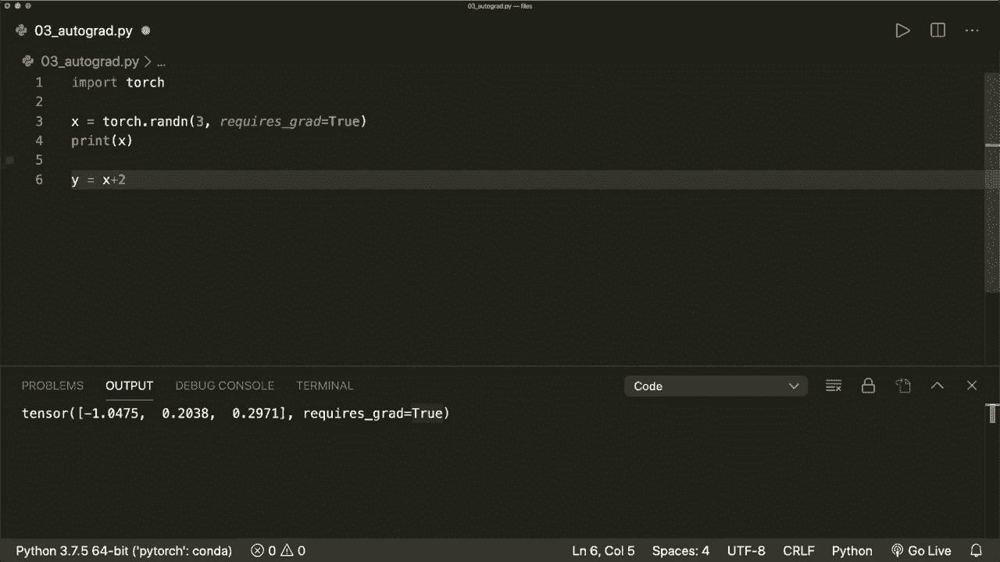
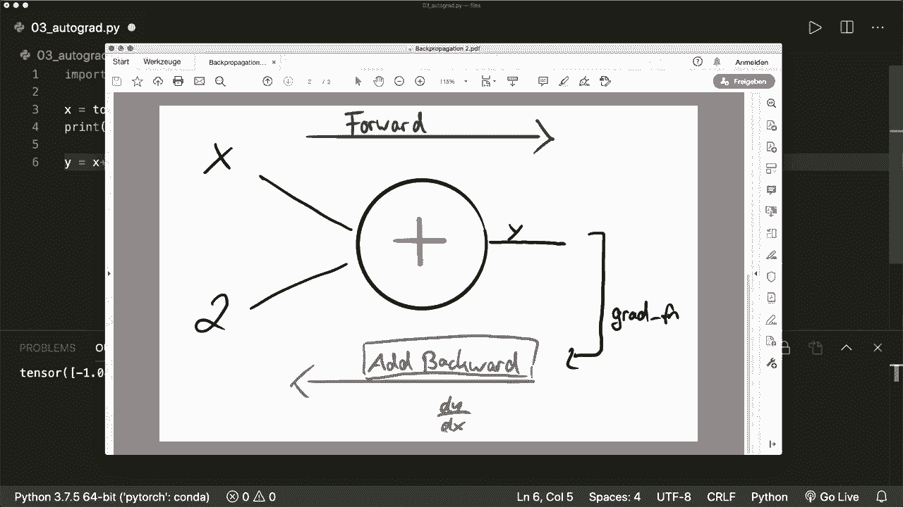
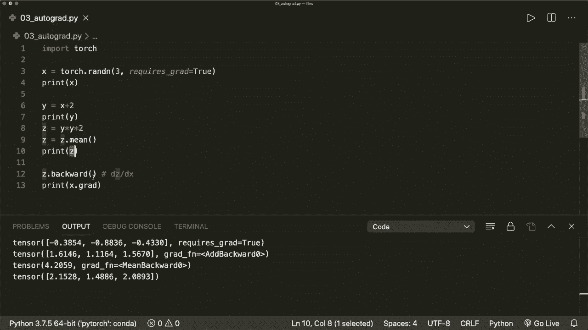
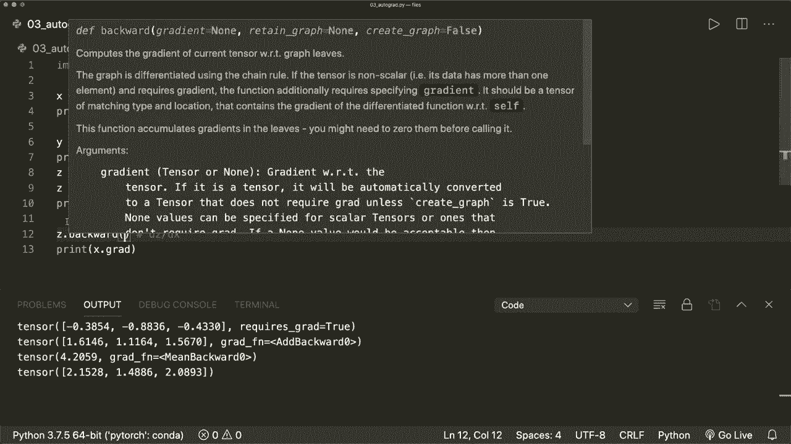

# PyTorch 极简实战教程！P3：L3- 使用 Autograd 计算梯度 

嗨，大家好。欢迎来到新的 pytorrch 教程。今天，我们将学习 pytorrch 中的 autograd 包，以及我们如何用它计算梯度。梯度对于我们的模型优化至关重要。因此，这是一个我们应该理解的重要概念。幸运的是，Pytorch 提供了 autograd 包，它可以为我们执行所有计算。

我们只需要知道如何使用它。因此，让我们开始看看如何在 pytorrch 中计算梯度。首先，我们导入 torch。当然。😊 然后让我们创建一个张量 x 等于 torch dot R n，大小为 3。现在让我们打印我们的 x。这是一个包含三个值的张量。三个随机值。现在。假设我们稍后想计算某个函数相对于 x 的梯度。

那么我们要做的就是指定参数 requires Gr 等于 true。默认情况下，这是 false。现在如果我们再次运行这个，我们会看到 Pyto 也跟踪它需要梯度。现在，每当我们对这个张量进行操作时，Pytoch 会为我们创建一个所谓的计算图。因此，现在假设我们进行操作 x 加 2，并将其存储在输出中。

所以我们说 y 等于 x 加 2。这将创建计算图。

这看起来像这样。对于每个节点，我们有一个遍历操作。我们有一个带输入和输出的节点。所以这里的操作是加法。因此，输入是 x 和 2，输出是 y。现在通过这个图和称为反向传播的技术，我们可以计算梯度。我将在下一个视频中详细解释反向传播的概念。

但现在，只需知道我们如何使用它就可以了。因此，首先我们进行前向传递。在这里，我们应用这个操作。在前向传递中，我们计算输出 y。由于我们指定它需要梯度，Pytoch 会自动为我们创建并存储一个函数。

这个函数随后用于反向传播以获取梯度。因此，y 拥有一个属性 Gr underscore F N。这将指向一个梯度函数。在这种情况下，称为 at add backward。通过这个函数，我们可以在所谓的反向传递中计算梯度。

所以这将计算 y 对 x 的梯度。在这种情况下。如果我们打印 y。

然后我们将看到这个 grat Fn 属性。这里，这是一个反向函数。因为在这里，我们的操作是加法。然后，我们再进行反向传播。因此，这就是为什么称之为反向。让我们用我们的张量做一些更多的操作。假设我们有 C 等于 y 乘以 y 乘以 2。

所以这个张量也有这个 gra 函数属性。因此这里 Grt Fn 等于 mile backward，因为这里我们的操作是乘法。例如，我们可以说 C 等于 C.mean。这样我们就可以应用均值操作。然后我们的梯度函数就是 mean backward。现在，当我们想要计算梯度时，我们必须做的唯一事情就是调用 C.backward。

因此，这将计算 C 关于 x 的梯度。所以 x 具有一个梯度，一个 dot Gr 属性，其中存储了梯度。我们可以打印它。现在如果你运行这个。那么我们看到在这个张量中有梯度。因此，这就是我们必须做的所有事情。现在让我们看看当我们不指定这个参数时会发生什么。所以首先。

如果我们打印我们的张量。然后我们看到它们没有这个 gra 函数属性。如果我们尝试调用反向函数，那么这将产生一个错误。因此，它显示张量不需要 gr 并且没有 gr 函数。所以记住，我们必须指定这个参数，然后它将正常工作。

我们还应该知道的一件事是，在后台这基本上做了什么。这将创建一个标量向量雅可比乘积以获得梯度。所以它将看起来像这样。我不会深入数学细节。但我们应该知道，我们有雅可比矩阵与偏导数。

然后我们将其与梯度向量相乘。然后我们将得到我们感兴趣的最终梯度。这也称为链式法则。我将在下一个视频中更详细地解释这一点。但我们应该知道，实际上我们必须将其与一个向量相乘。因此在这种情况下，由于我们的 C 是一个标量值，我们不需要传递参数。

在这里对于我们的反向函数。

所以我们的 C 这里只有一个标量值。这是可以的。但假设我们没有应用均值操作。那么现在我们的 C 中有多个值。所以它的大小也是 1x3。现在，当我们尝试像这样调用反向函数时。这将产生一个错误。因此，Gr 只能为标量输出隐式创建。在这种情况下，我们必须。

给它梯度参数。所以我们必须创建一个相同大小的向量。所以，假设 V 等于 torch.dot(1)。在这里我们放置，例如，011.0 和 0.0，0，1。并且我们将数据类型设置为 torch.float32。然后我们必须将这个向量传递给我们的反向函数。现在它将再次正常工作。所以现在，如果我们运行这个。那么这是可以的。

我们应该知道，在后台，这是一个向量雅可比乘积。很多时候，最后一个操作是某个操作，将创建一个标量值。因此，可以在没有参数的情况下像这样调用。但如果这不是标量，我们必须提供向量。还有一些其他事情我们应该知道，如何防止Pyth跟踪历史并计算这个grad_fn属性。

例如，有时在我们的训练循环中，当我们想更新权重时，这个操作不应该是梯度计算的一部分。在接下来的教程中，我会给出一个具体的示例，说明我们如何应用这个autograd包。然后可能会变得更清晰。但现在是这样。

我们应该知道如何防止跟踪梯度，并且我们有三个选项。第一个是调用requires_grad下划线函数，并将其设置为false。第二个选项是调用x dot detach。因此这将创建一个不需要梯度的新张量。

第二个选项是将其包装在一个宽度语句中。因此使用torch，dot，不需要梯度。然后我们可以进行操作。是的，让我们尝试每一个。这是第一步。我们可以说x dot需要梯度，带下划线，并将其设置为false。因此，每当一个函数在Pytorch中有一个尾随的下划线时。

这意味着它将在原地修改我们的变量。因此，现在，如果我们打印x。然后我们会看到它不再具有这个requires_grad属性。所以现在这是false。这是第一个选项，第二个选项是调用x.detach。因此我们说y等于x.detach。这将创建一个具有相同值的新向量或新张量。

但它不需要梯度。因此在这里我们看到我们的y具有相同的值，但不需要梯度。最后一个选项是将其包装在一个torch的with语句中，使用torch.no_grad。然后我们可以进行一些操作，例如y等于x加2。现在，如果我们打印我们的y，我们会看到它在这里没有梯度函数属性。因此，是的。

如果我们不使用这个并且像这样运行它。那么我们的y就会有梯度函数。因此，这三种方法可以阻止Pytorch创建梯度函数并跟踪我们计算图中的历史。而现在还有一个非常重要的事情，我们也应该知道的是，每当我们调用backward函数时，梯度将被累积到dot_grad属性中。

这样值就会被求和。在这里我们必须非常小心。因此让我们创建一些虚拟的训练示例，其中我们有一些权重。这是一个全为1的张量，大小为4，并且需要梯度。因此requires_grad等于true。现在假设我们有一个训练循环，我们说对于每个epoch在范围内。

我们先进行一次迭代。这里我们假设模型输出等于权重乘以3的总和。这只是一个虚拟操作，用来模拟一些模型输出。然后我们想计算梯度。所以我们调用模型输出的`.backward()`。现在我们有了梯度，可以调用`weights.Gr`并打印出来。

这里的梯度是3，所以张量填充了三的值。如果我们进行第二次迭代，那么第二次的`backward`调用将再次累加值并写入`Gr`属性。现在我们的`grs`中有六。再进行第三次迭代后，它将变为九。

所有值都已被求和。现在我们的权重或梯度显然不正确。在进行下一次迭代和优化步骤之前，我们必须清空梯度。因此，我们必须调用`weights.Gr.0_`。现在如果我们运行这个，梯度将再次正确。这是我们在训练步骤中必须了解的一个非常重要的事项。

接下来我们将使用Pytorch内置的优化器。假设我们有一个来自torch优化包的优化器。torch的optim模块提供了随机梯度下降（SGD），它的参数包括我们的权重和一些学习率，现在有了这个优化器。

我们可以调用或进行一个优化步骤，然后在进行下一次迭代之前，必须调用优化器的`do0_gra`函数，它会执行完全相同的操作。所以，是的。我们将在后面的教程中讨论优化器。但现在，你应该记住的是，每当我们想计算梯度时。

我们必须指定`require_gr`参数并设置为true。然后我们可以简单地调用`backward`函数来计算梯度。在进行下一个操作或优化步骤的下一次迭代之前，我们必须清空我们的梯度。因此，我们必须再次调用`the0`函数。我们还应该知道如何防止某些操作在计算图中被跟踪。

这就是我想向你展示的有关autograd包的内容。希望你喜欢。请订阅频道，下次再见，拜。
