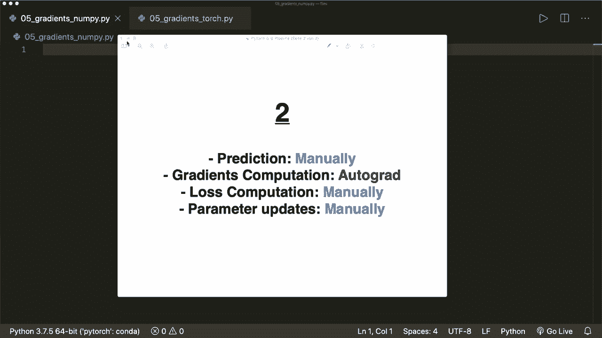
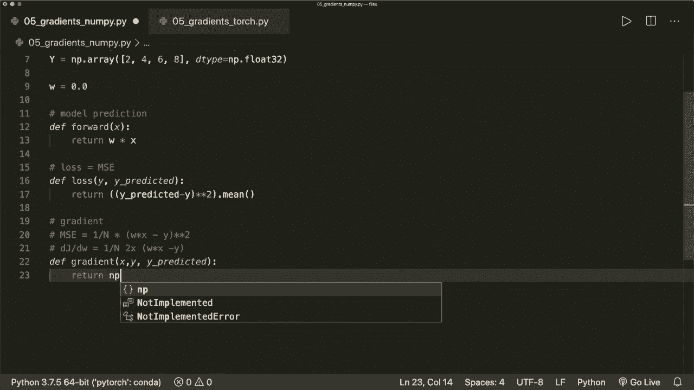
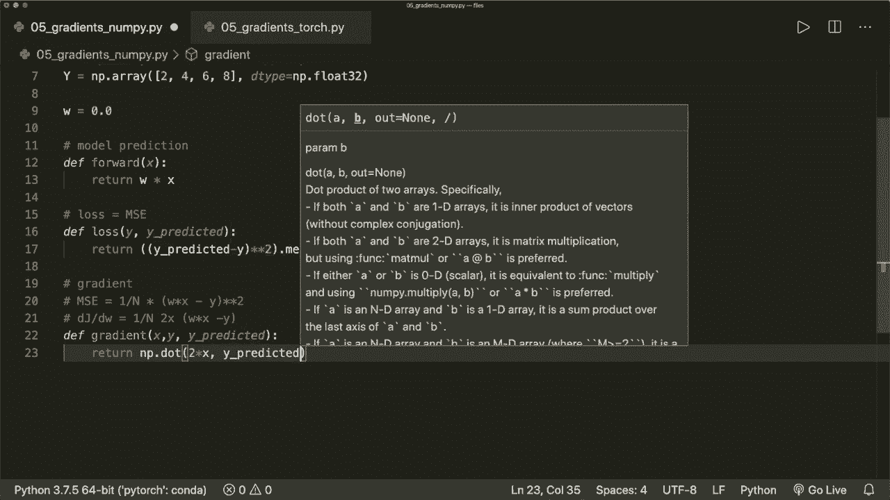
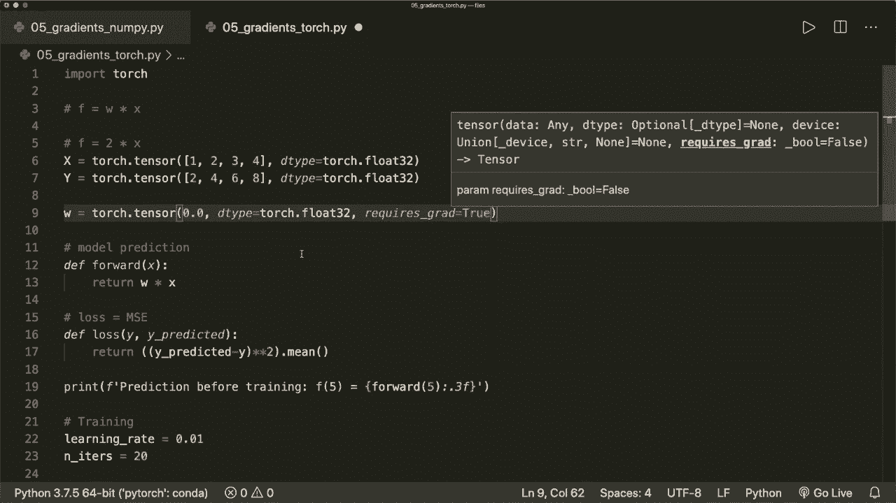

# PyTorch 极简实战教程！P5：L5- 带有 Autograd 和反向传播的梯度下降 

嗨，大家好。欢迎来到新的Pytorch教程。在这个教程中，我向你展示如何使用pytorch autograd包自动梯度计算来优化我们的模型的具体例子。因此，我们从零开始实现线性回归算法，在每一步中都手动进行。因此，我们实现计算模型预测和损失函数的方程。

然后我们进行梯度的数值计算并实现公式。接着我们实现梯度下降算法来优化我们的参数。当这一切正常时，我们看到如何将手动计算的梯度替换为Pytorch的自动反向传播算法。😊所以这是第二步。在第三步中，我们在第三步。

我们通过使用Pytorch中的损失和优化类来替换手动计算的损失和参数更新。在最后一步中，我们通过实现一个pytorch模型替换了手动计算的模型预测。因此，当我们理解这些步骤时，Pytorch可以为我们做大部分工作。当然，我们仍然需要设计我们的模型，并且要知道应该使用哪个损失和优化器。

但我们不必再担心底层算法。因此，这个视频将涵盖步骤1和2。在下一个视频中，我们将看到步骤3和4。那么让我们开始。我假设你已经知道线性回归和梯度下降是如何工作的。如果不知道，请观看我关于这个算法的从零开始的机器学习教程。

因为现在我不会详细解释所有步骤。

但我把链接放在描述中了。因此我们现在从头开始做所有事情。我们只使用nuy。然后我们导入nuy的S和P，然后我们使用线性回归。我们使用一个仅仅进行一些权重与输入的线性组合的函数。这里我们不关心偏差。在我们的例子中，假设F等于2倍的x。

所以我们的权重必须是2。然后我们做一些训练样本。假设x等于numpy.dot.array。然后我们放一些测试或训练样本。假设是1、2、3和4。这将是numpy的。或者，让我们给它一个数据类型，比如说这是Nmpy.dot.float32。然后，我们也想要一个y。因为我们的公式是，这就是2x。

我们必须将每个值乘以2。因此是2、4、6和8。现在我们初始化我们的权重。我们简单地说w在开始时等于0。现在我们必须计算我们的模型预测。同时我们也要计算损失。然后我们要计算梯度。现在我们手动执行每一个步骤。那么我们定义一个函数，我们称之为forward。

这是一个遵循pytorch约定的前向传播，将获取x。然后我们的模型输出仅仅是w乘以x。这是前向传播。现在，损失。这里我们定义损失函数，它依赖于y和预测的y。所以，这是模型输出。现在在这种情况下。

这是或损失等于线性回归情况下的均方误差。我们可以通过说，这是。嗯。假设y预测减去y。然后平方。然后我们进行平均操作。所以这是损失。现在我们手动计算损失相对于我们参数的梯度。

让我们来看看均方误差。公式是1除以n，因为这是平均值。然后我们有我们的w乘以x，我们的预测减去实际值的平方。现在如果你想要导数。那么这个导数，让我们称之为j或目标函数关于w等于1除以n，然后我们有两个乘以x。

然后乘以W乘以x减去y。所以这是数值计算的。计算出的导数。请自行仔细检查数学。现在我们实现这个。我们说定义梯度，它依赖于x和y以及预测的y。现在我们可以一行完成。我们返回numpy.dot。我们需要两个乘以x的点积。

然后这里我们有预测的y减去y。

说这是这里的公式。当然，我们还需要平均值。假设这是点平均。我们可以简单地在Ny中这样做。现在，这些是我们需要的东西。现在，让我们在训练之前打印我们的预测。所以我们打印。我们使用F字符串。所以训练之前的预测。假设我们想预测值5。

应该是10。在这里，我们可以在F字符串中做到。在这个表达式中我们可以调用这个forward方法，传入5。假设我们只想要三位小数。现在，让我们开始训练。我们定义一些参数。我们需要学习率，假设是0.01。

然后我们需要一个迭代次数。我们说its等于10。现在让我们进行训练循环。所以我们说对于epoch在范围内和iter。然后首先，我们进行预测，即前向传播。这是前向传播。我们可以简单地用我们的函数来完成这个。所以我们说y预测或y pre等于forward。

然后我们输入我们的大写x。现在我们想要损失。所以我们的损失L等于实际y的损失。和我们的预测y。现在，我们需要获取。梯度，即关于W的梯度。所以D W等于我们刚刚实现的梯度函数，依赖于x和y以及预测的y。

现在我们必须更新我们的权重。是的，所以梯度下降算法中的更新公式就是我们朝着梯度的负方向前进。所以是负x。在这里，步长或所谓的学习率乘以我们的梯度。

所以这是更新公式。然后我们假设我们还想在这里打印一些信息。所以我们说如果epoch取模，假设这里为1，因为我们想在每一步打印。如果这是0。我们想打印，比如说。我们想打印epoch。在这里我们打印epoch加1。然后我们想得到权重，即。权重。W，保留三位小数。

然后我们还想要有损失。损失等于。损失。在这里我们说，点。8。就这样。然后在最后。我们想在训练后打印预测。所以，现在。让我们预测。预测并打印预测。在训练后。是的，那么。现在。让我们运行这个，看看会发生什么。一切应该都能正常工作。现在，是的。

在我们的训练之前，预测为0。然后对于每一步。记住我们的公式应该是2倍的x。所以我们的w一开始应该是2。我们看到每个训练步骤都在增加我们的权重，并且减少我们的损失。因此，每一步都会变得更好。训练后，我们的模型预测为9.999。

所以快到了。我们举个例子，现在我们想要更多的迭代。假设我们只进行了10次迭代，这并不多。现在，如果我们运行这个，并且每隔一步打印一次。然后我们看到，最后我们的损失是0，预测是正确的。现在，这是我们手动实现的部分。

现在让我们替换梯度计算。所以我们选择所有这些并将其复制到一个单独的文件中。现在我们不再使用numpy了。所以现在我们只需导入torch，并使用torch来完成所有工作。当然，我们现在想要去掉的是这个梯度，即手动计算的梯度。因此我们简单地删除它。我们不再需要这个。现在我们也没有nuy数组了。

所以现在这是一个Torch dot Tzar。我们的数据类型现在是torch dot float 32，y也是如此。它现在是一个Torch dot Tensor，并且数据类型来自torch模块。但其他一切在这里都是一样的。因此，语法相同。现在我们的W也必须是一个张量。所以我们说这是一开始为0.0的torch dot tensor。它也会有一个数据类型。

说是torch dot float 32。由于我们对损失关于这个参数的梯度感兴趣，我们需要指定这需要梯度计算。所以requires grad = true。

现在，前向函数和损失函数仍然相同，因为我们可以在 pytorrch 中使用相同的语法。 现在，在我们的训练循环中，前向传播仍然相同。 损失是相同的。 现在梯度等于反向传播。 所以记住，在反向传播中，我们首先进行前向传播。 这就是我们使用这种语法的原因。 然后再进行梯度计算。

我们使用反向传播。 所以这里我们简单地调用 L dot。Backward。这样就会计算我们损失对 W 的梯度。 所以 Pyto 为我们完成所有计算。 现在我们更新我们的权重。 但在这里我们要小心。 我在关于 auto gridd 包的教程中解释过这一点。

因为我们不希望这个操作成为我们梯度追踪图的一部分。 所以这不应成为计算图的一部分。 我们需要用 torch dot。no gr 语句将其包装。 还有一件我们也应该知道的事情。 我也已经谈到过，我们必须再次清空或置零梯度。

因为每当我们调用 backward 时，它会写入我们的 Grads，并将其累积在 W dot Gr 属性中。 所以在下一次迭代之前，我们要确保我们的梯度再次为 0。 所以我们可以说 w times gra times 0 underscore。 这样将就地修改它。 现在，我们完成了。

现在让我们运行这个，看看它是否有效。 W 还未定义。 哦，是的，当然。 现在是 W dot gra。 让我们再试一次。 现在它工作正常。 现在我们也看到它会增加我们的 W，并且会减少我们的损失。 这里我们说我们有 20 次迭代。 但这并不完全正确。

这是因为反向传播并不像数值梯度计算那样精确。 所以让我们在这里尝试更多的迭代。 假设我们想要 100 次迭代，并在每 10 步时打印我们的更新。 所以让我们再试一次。 现在我们看到训练完成后，我们有了正确的预测。 所以，没错，这就是本视频的内容。 在下一个视频中。

我们将在这里继续，将手动计算的损失和权重更新替换为 Pytorch 的损失和优化器类。 如果你喜欢这个视频，请订阅频道，下次见，再见！
