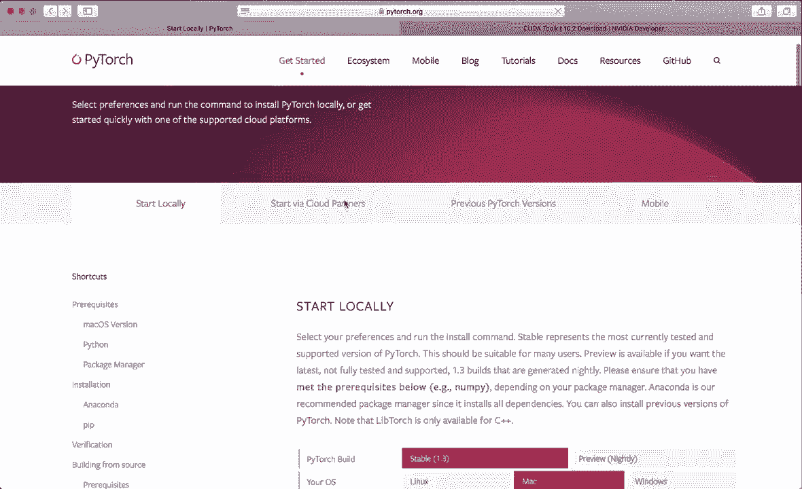
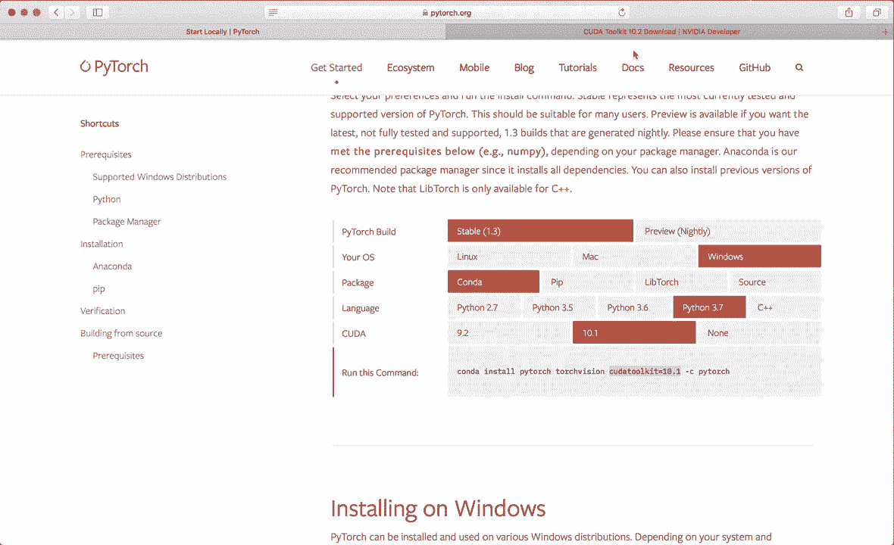
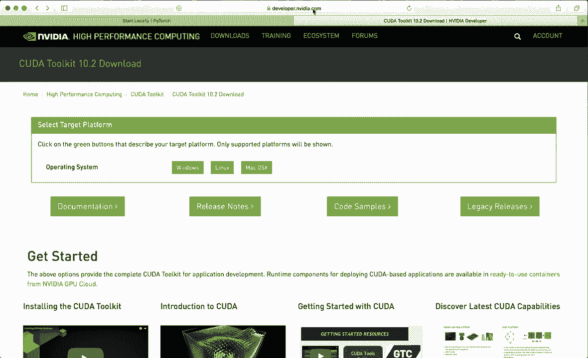
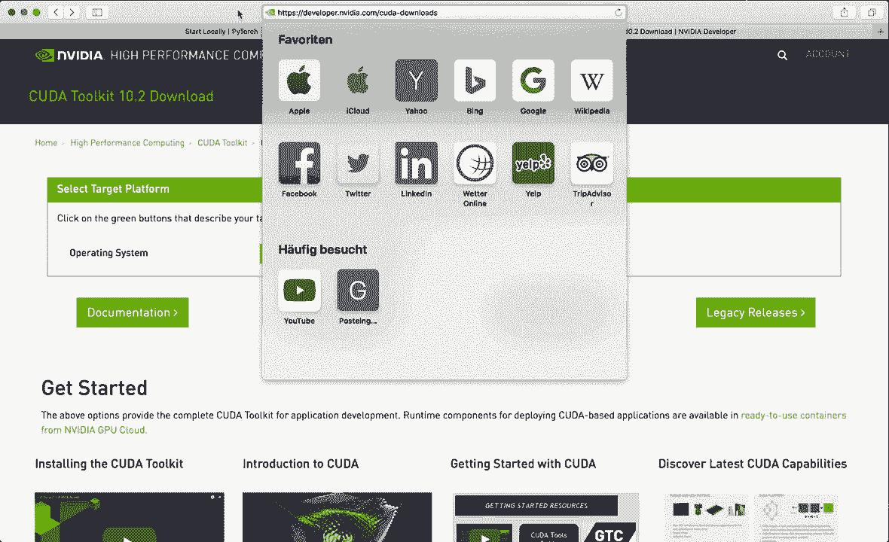
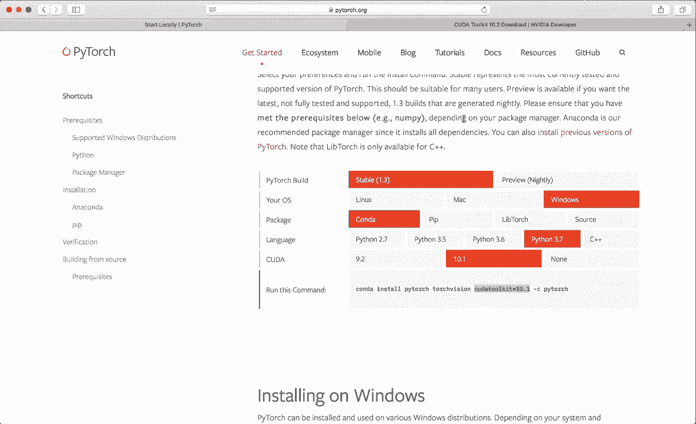
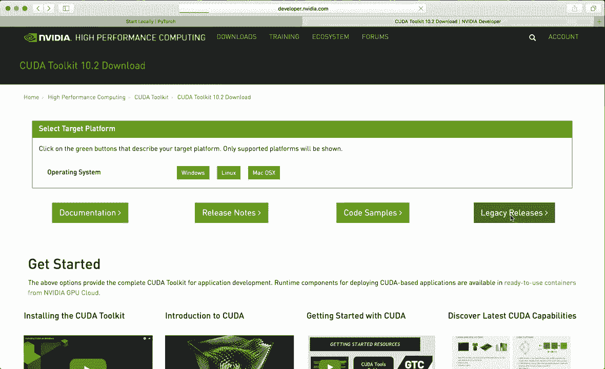
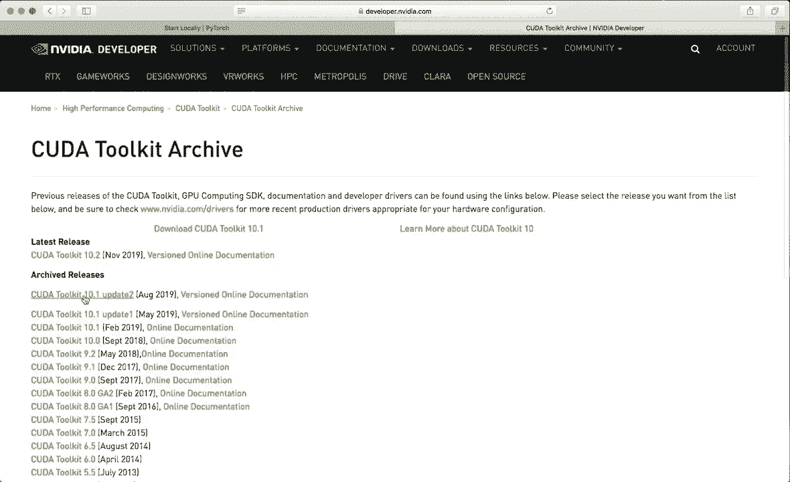
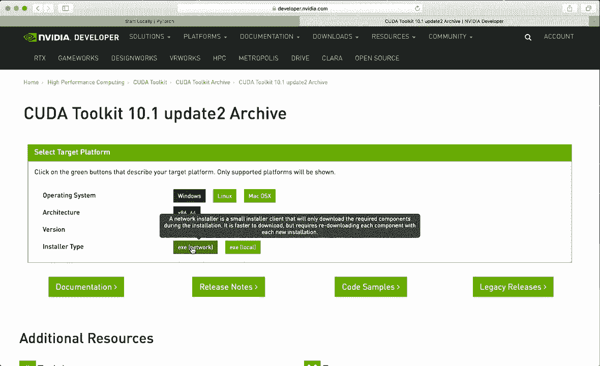
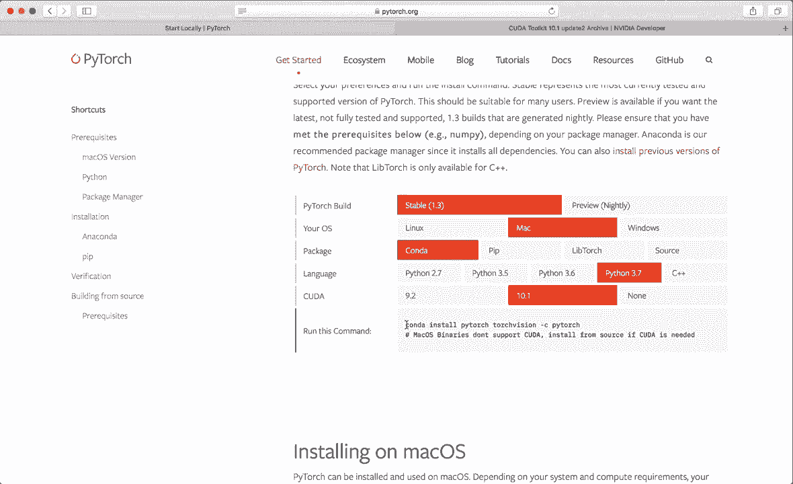

# PyTorch 极简实战教程！全程代码讲解，在实践中掌握深度学习&搭建全 pipeline！＜实战教程系列＞ - P1：L1- 安装 

大家好，欢迎来到你们的新教程系列。在这个系列中，我们将学习如何使用 Pytorch。Pytorch 是最流行的机器学习和深度学习框架之一。与之一起工作并开发酷炫的应用程序真的很有趣。所以我希望你们观看这个系列，并学习到关于这个框架所需的基础知识。

在这个第一视频中，我会展示如何安装 Pytorch。让我们开始吧。😊，为此，我们访问官方网站 Pytorch dot org。然后点击“开始”。接着选择最新的 Pytorch 构建。目前这是版本 1.3。

然后选择你的操作系统。在我的例子中，是 Mac。接着选择你想用来安装 Pytorch 的包管理器。所以我强烈推荐使用 Anaconda。如果你还没有安装 Anaconda，并且不知道如何使用它，请观看我关于 Anaconda 的其他教程。

我会把链接放在下面的描述中。然后选择最新的 Python 版本。所以这里我选择 Python 3.7。不幸的是，在 Mac 上，你目前只能安装 CPU 版本。但如果你在 Linux 或 Windows 上并希望获得 GP 支持，那么你还需要先安装 Kuda 工具包。

Kuda 工具包是用于创建高性能 GP 加速应用程序的开发环境。为此，你的机器上需要有一个 Nvidia GP。如果你有的话，可以访问网站，developer dot Nvidia dot com slash kuda minus downloads。

然后我们需要小心，因为目前 Pytorch 支持的最新 Kuda 版本是 Kuda 10.1。所以我们需要获取这个版本。目前最新版本是 10.2。因此我们需要去旧版发布页面。

然后选择最新的 Kuda 工具包 10.1。

然后选择你的操作系统。例如，Windows，Windows 10。接着下载安装程序并按照说明操作。这也会检查你的系统是否适合 Ka 工具包。

如果成功，那么我们可以返回 Py chart 网站并复制这个命令。在我的例子中，现在在 Mac 上，我需要这个命令。让我们复制这个。

现在让我们打开一个终端。首先，我们想使用 Conda 创建一个虚拟环境，在其中安装我们所有的包和安装 Pytorch。所以让我们创建一个环境。假设使用命令 Conda create minus n，然后给它一个名称。我把这个叫做 Pytorch。😊，简单地称为 Pytorch，然后还指定 Python 版本。

假设Python等于3。7，然后按回车。这将创建你的Python 3。7虚拟环境。再按一次回车以继续。这将花费一些时间。现在完成了。所以现在我们可以用Conda激活这个环境，输入pytorch。现在我们处于这个环境中，这一点在开头可以看到。

我们在括号中有pytorch。这是环境的名称。😊，现在，让我们从网站复制我们的命令。这将安装pytorch及所有必要的包。这也将花费几秒钟。现在，再次按回车以继续。现在完成了。我们已经安装了Pytorch，可以通过在这个环境中启动Python来验证。

所以假设输入Python并按回车。现在我们有Python在运行。现在我们可以导入torch模块。如果安装不正确，你将会遇到“找不到模块”的错误。但在这种情况下，它是正确的。现在我们可以，例如，创建一个torch张量。假设x等于torch.dot.R，大小为3。

现在我们想打印我们的张量。这也可以正常工作。我们还可以检查kuda是否可用。因此我们可以说torch.dot.kuda.is_available。在我的情况下，它显示为false。但如果你安装了kuda工具包以及支持GP的Pytorch包，那么这里应该显示为true。所以，是的。现在我们已经在pytorch上安装了，可以开始使用它。

所以我希望你喜欢这个教程，下次见，拜拜。😊。
