# PyTorch 极简实战教程！全程代码讲解，在实践中掌握深度学习&搭建全pipeline！＜实战教程系列＞ - P13：L13- 前馈神经网络 

嗨，大家好。欢迎来到新的 Pytorch 教程。今天，我们将实现第一个多层神经网络，该网络可以基于著名的无尽数据集进行数字分类。在这个教程中，我们将上一期教程的所有内容结合在一起。因此，我们使用数据加载器来加载我们的数据。我们对数据应用变换。

然后我们将实现一个输入层、隐藏层和输出层的神经网络，并且我们还将应用激活函数。接着我们设置损失和优化器，并实现可以使用批量训练的训练循环。最后，我们评估我们的模型并计算准确率。此外，我们还将确保我们的整个代码也可以在支持 GPU 的情况下运行。

那么让我们开始。首先，我们导入我们需要的东西。所以我们导入 torch。然后我们导入 torch 和 N 作为 N。接着我们导入 torch。😊，Vision 用于数据集。我们导入 torch vision.transforms 作为 transforms。我们还导入 Matpllip.pipl SPLT 来稍后显示一些数据。然后首先。

我们进行设备配置，因此设备配置。而对于这个，我们通过说设备等于 torch.dot.device 来创建一个设备，并且它的名称是 Kuda。如果我们有 GPU 支持。所以如果 torch.kuda 是可用的。如果不可用，那么我们只称我们的设备为 CPU。然后稍后，我们需要将我们的张量推送到设备上。

这将保证如果支持的话，它将运行在 GPU 上。那么，是的，让我们定义一些超参数。在这里我们定义输入大小，这就是 784。这是因为稍后我们看到我们的图像大小为 28x28。然后我们将把这个数组展平为一维张量，28 乘 28 是 784。

所以这就是为什么我们的输入大小必须是 784。然后我们定义一个隐藏层大小。在这里我会说这是 100。你也可以尝试其他不同的大小。还有类别的数量，这必须是 10，因为我们有 10 个不同的类别。我们有数字 0 到 9。然后我们定义训练的轮数。

在这里我会简单设置为 2，这样训练不会花太长时间。但你可以将其设置为更高的值。然后我们在这里定义批量大小，假设为 100。我们也在这里定义学习率，设为学习率等于 0.001。现在让我们导入著名的 Amnes 数据。你可以通过说训练数据集等于从 Pytorch 库中获取它。

在这里，我们使用 torchvision.data.datasets.Amist。

这将需要指定根目录，根目录。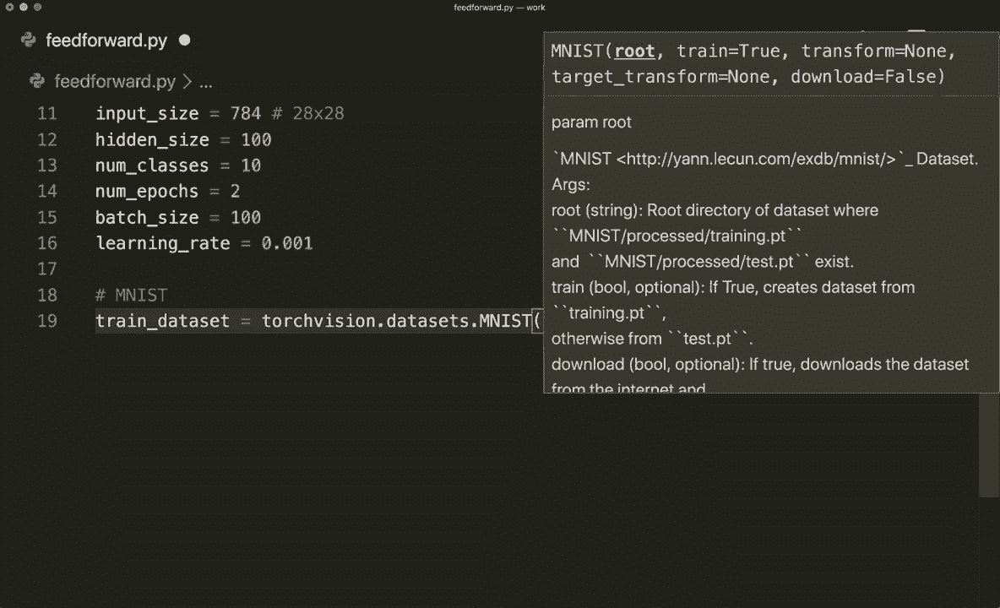

等于，这里应该在同一个文件夹中。所以 .，然后它应该创建一个名为 data 的文件夹。

然后我们说 train 等于 true。这是我们的训练数据集。

然后我们说立即应用一个变换。所以我们说变换等于 transforms.dot to tenzo。我们在这里将其转换为一个tenzzo。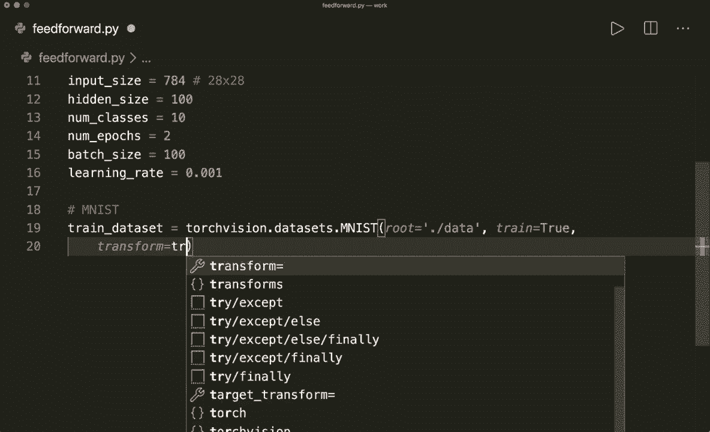

然后我们还说 download 等于 true。所以如果它尚不可用，则应该下载。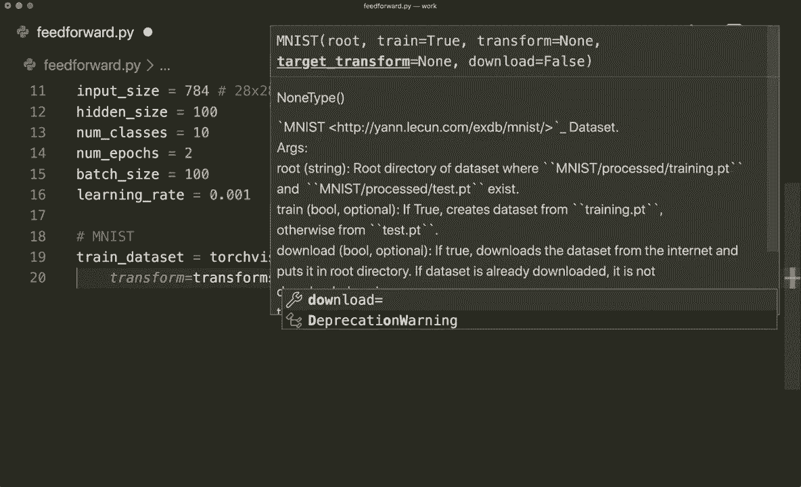

然后我们复制这个，对我们的测试数据集做同样的事情。在这里我们必须说 train 等于 false。而且我们也不需要再下载它。现在让我们继续，通过说 train loader 等于来创建数据加载器。在这里我们从 torch.dot u.dot data.dot data loader 获取这个。

然后必须设置数据集，方法是说数据集等于。这里进行训练。

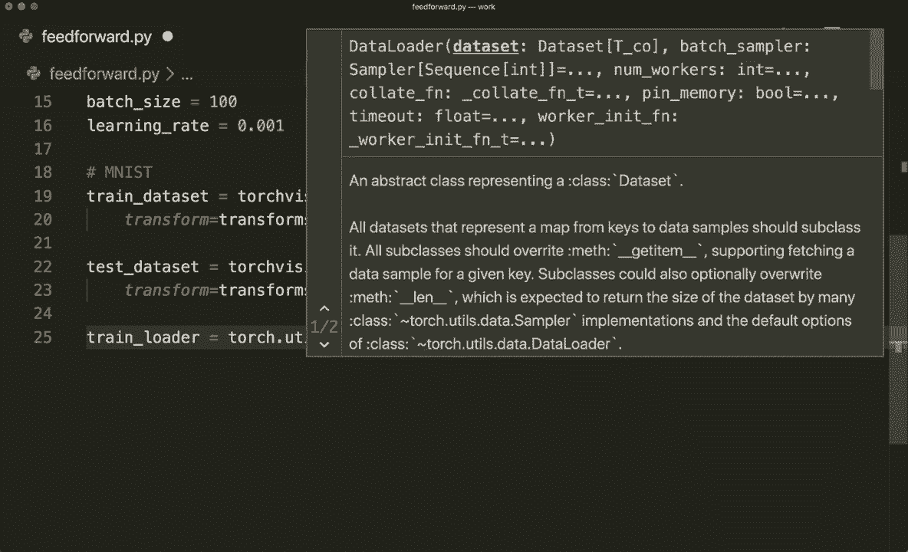

数据集，一个训练数据集。然后我们必须指定批量大小。所以这等于批量大小。

然后我们还要说，或者可以说 shuffle 等于 true。这对训练非常好。然后我们再复制这个，并对我们的测试加载器做同样的事情。所以测试加载器等于获取测试数据集。我们可以说 shuffle 等于 false，因为对于评估来说这无关紧要。现在我们通过说 examples 等于来看一下这一批数据。

然后我们将其转换为内部对象，即训练加载器的迭代器。然后我们可以调用下一个方法，并通过说这等于 examples.dot next 将其解包为样本和标签。现在我们打印这些的大小。所以让我们打印 samples.dot shape。

还有，打印，打印标签的形状。

现在让我们保存并运行这个。所以我们调用 Python feet forward.dot p，看看到目前为止是否有效。是的，这里我们有样本的大小。所以这是 100 乘 1 乘 28 乘 28。这是因为我们的批量大小为 100。因此我们在批次中有 100 个样本。然后的 1 是因为我们只有一个通道。因此我们这里没有任何彩色通道。

所以只有一个通道。这是我们的实际图像数组。所以是28乘28，正如我一开始所说的。我们的标签只有一个大小为100的张量。所以对于每个类别标签，我们在这里有一个值。是的，这就是我们的一些示例数据。现在我们也在这里绘制一下，看看效果如何。所以对于 I 在范围 6 中，这里我们使用 matplotlip，因此我调用 PLT.dot subplot，设置两行三列，索引为 I 加 1，然后我可以说 PLT.show。

我想展示实际数据，所以样本为 I，然后为 0，因为我们想访问第一个通道，然后我还会给它一个颜色映射。因此 cmap 等于 gray。

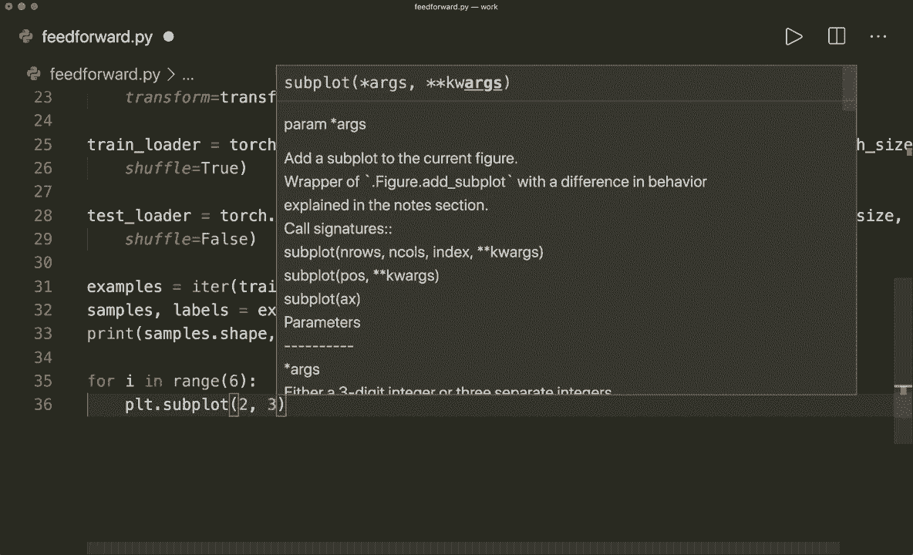

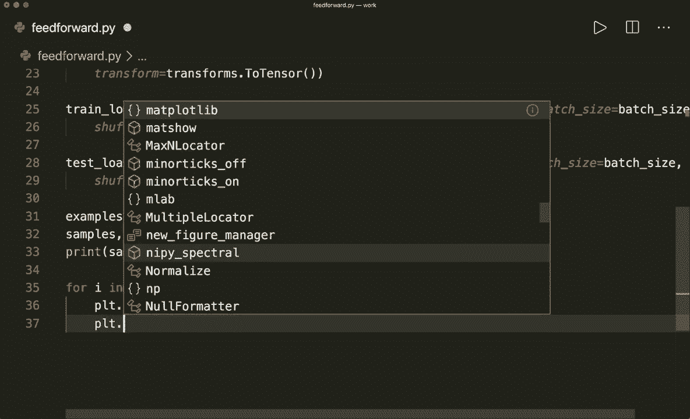

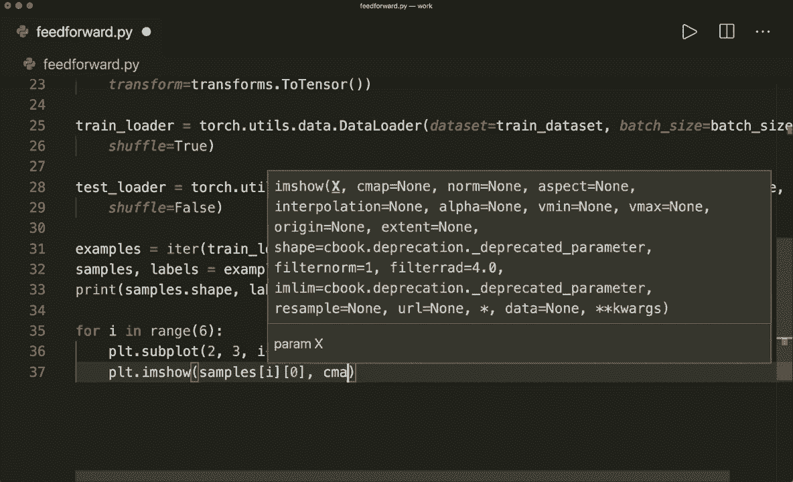

然后我说P，LT.show。让我们保存这个，并再次运行它。

现在我们来看看数据。这些是一些手写数字的示例。现在我们想对这些数字进行分类。因此，我们想建立一个具有一个隐藏层的全连接神经网络。让我们开始吧！

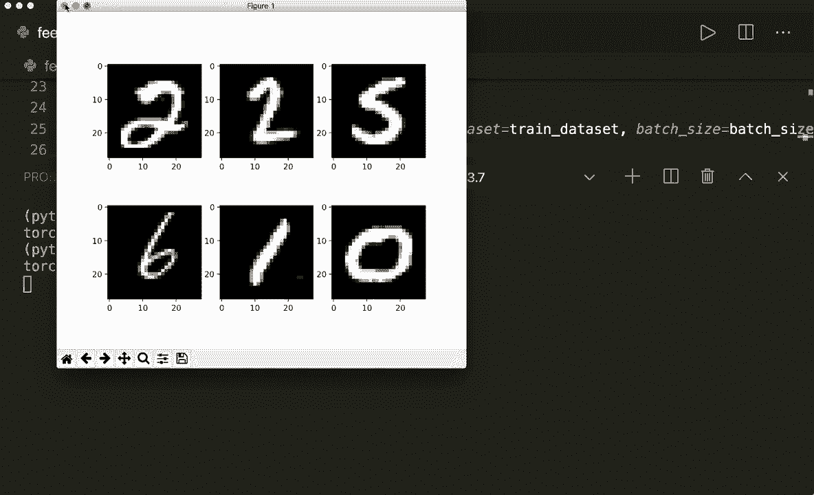

所以让我们再次注释掉这一点。现在让我们创建一个神经网络类。这必须从一个模块中派生。现在我们必须定义初始化和前向方法。因此，初始化方法将包含self。然后它必须有输入大小、隐藏大小和输出大小。

所以输出大小是类别的数量。首先，我们想调用super的初始化。因此super of neural net和self的初始化。self.dot.init。然后我们创建我们的层。因此，首先我们想通过说self.dot.L1等于Nn.dot.linear来拥有一个线性层。这将把输入大小作为输入，输出大小是隐藏大小。

然后在第一层之后，我们想应用激活函数。这里我简单地使用著名的relu激活函数。因此self.dot.relu等于N N.dot.relu。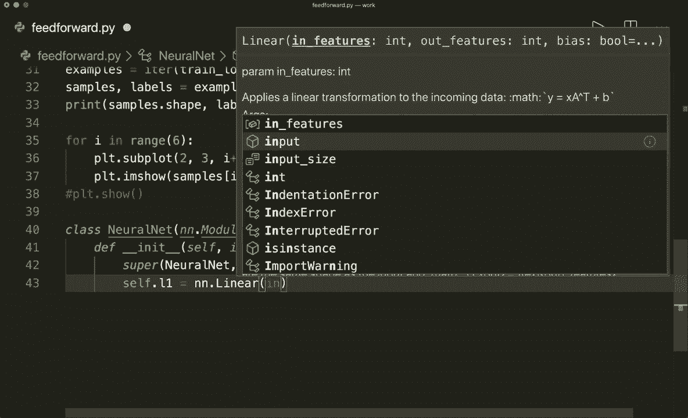

然后在最后，我们有另一个线性层。因此self.dot.L2等于。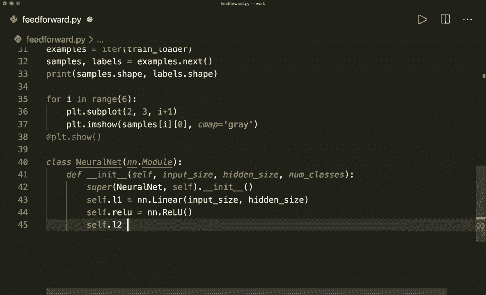

N，N 点线性。现在我们必须小心。因此，输入大小是隐藏大小，输出大小是类别的数量。

现在让我们定义前向方法。这将包含self和一个样本X。现在我们应用所有这些层。因此，我们说输出等于。现在我们使用第一层L1，它获取样本X，然后下一个输出是self.dot.relu，使用激活函数。最后的输出等于self.dot.L2输出。

这将应用第二个线性函数，现在我们必须再次小心，因为在最后，我们不想要激活函数。因此我们不会像通常在多类分类问题中那样应用softmax，因为稍后我们将看到我们将使用交叉熵损失，而这将会应用。

为我们应用软最大值。因此这里没有软最大值。我们简单地返回输出。这是我们的整个模型。然后我们可以通过说模型等于神经网络来创建它。这将获取输入大小，然后是隐藏大小和类别数量。所以，没错。现在我们有了模型。现在让我们创建损失和优化器。

所以在这里我们说criterion等于N N.dot.cross_entropy_loss。这将为我们应用softmax。因此我们不想在这里使用这个。所以对此要非常小心。现在让我们通过说tor.optimizer等于torch.optim来创建我们的优化器。嗯。现在，让我们在这里使用Adam优化器。并且这必须获取参数。

在这里，我们可以使用模型的点参数。并且它还需要获取学习率。学习率等于学习率。

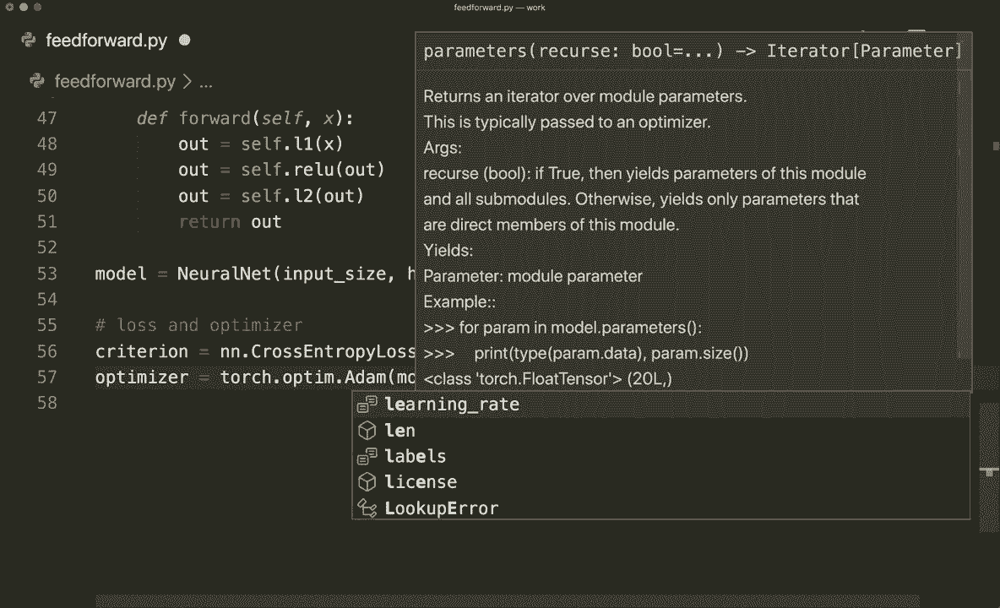

现在我们有了损失和优化器。现在我们可以进行训练循环。因此，现在是训练循环。为此，让我们首先定义总步骤数。因此，总步骤数等于。这是训练加载器的长度。所以现在我们可以进行典型的循环。我们说四个周期在范围内。

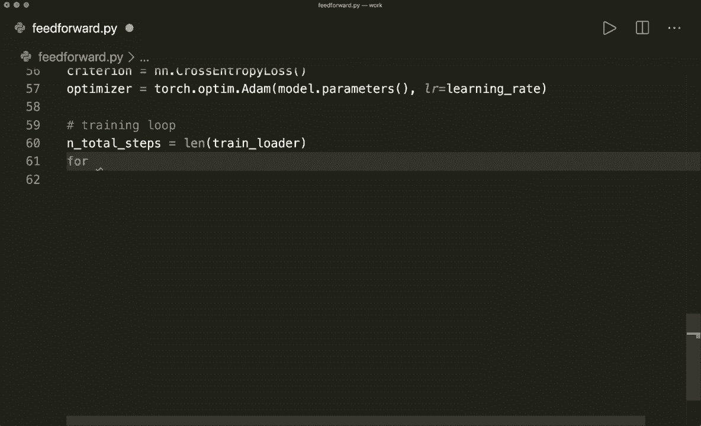

Noum epochs。

因此，这将循环遍历周期。现在我们循环遍历所有批次。因此，在这里我们说for I。然后再次，我们解包这个。因此，我们说images，images和labels。然后我们遍历enumerate我们的训练加载器。因此，enumerate函数将给我们实际的索引，然后是数据，而这里的数据是图像和标签的元组，现在我们必须首先重塑我们的图像。因为如果我们看看形状，我们看到这是100乘1乘28乘28。

正如我在开始时所示。现在我们设置我们的输入大小为784。因此，我们的图像张量需要的大小是100乘784，这是第二个维度。

所以首先是批次数。因此，让我们重塑我们的张量。我们可以通过说images等于images.dot.reshape来做到这一点。在这里，我们将-1放在第一个维度。因此，Tsor可以为我们自动找到这个。在这里作为第二个维度，我们希望有28乘28。然后我们也调用设备。

如果可用，我们将把这个推送到GPU。我们还必须将标签推送到设备。因此，labels等于labels.to.device。现在让我们进行前向传播。因此，首先，我们进行前向传播。然后是反向传播。所以前向传播，我们简单地说outputs等于model。

这将获取图像。然后我们通过说loss等于来计算损失。然后在这里我们调用我们的标准。这样将获取预测输出和实际标签。这是前向传播。然后在反向传播中，首先我们要做的是调用optr.dot0 gra以清空梯度属性中的值。

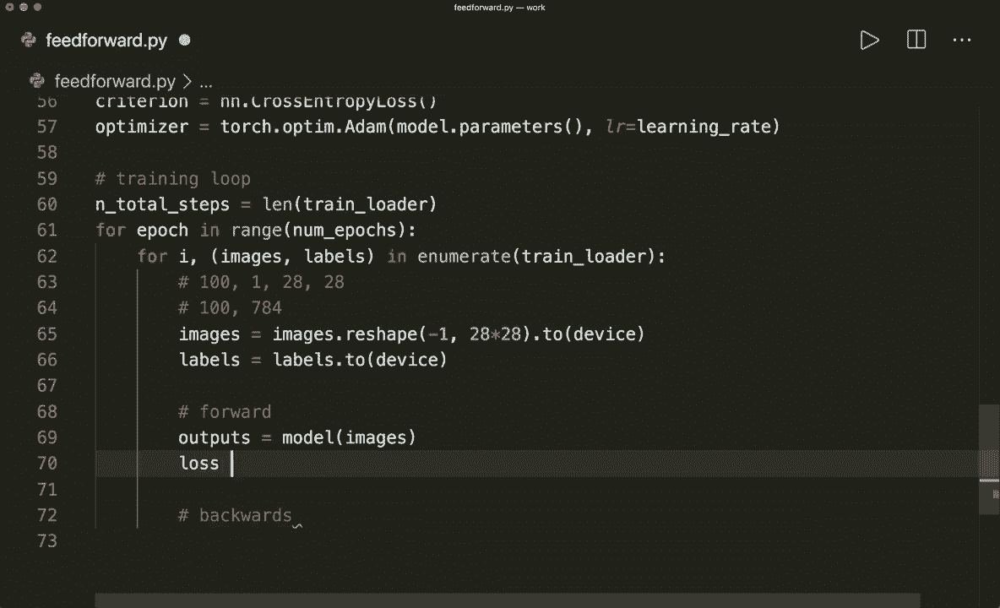

然后我们可以通过说“丢失的点向后”来进行下一步。这将进行反向传播。现在我们可以调用`optr dot step`。这样将执行更新步骤并为我们更新参数。现在，让我们打印一些信息。打印损失。假设，如果我加1。`Moulular 100`等于0。那么每100步，我们想打印一些信息。让我们打印当前的纪元。

通过说这是`epoch epoch plus one`。然后我们想打印所有的纪元。即纪元数量。然后让我们也通过说`step`打印当前步骤。这是`I plus1`。然后通过说`n total steps`打印总步骤数量。我们还想通过说`loss equals loss dot item`打印损失。

另外，让我们说我们只想打印四位小数。因此，是的。现在我们完成了训练。这是整个训练循环。现在让我们进行测试和评估。为此，我们不想计算所有步骤的梯度。

我们希望将其包装在`with torch dot no gra`语句中。首先，我们说正确预测的数量等于0，样本数量等于0。在开始时。然后我们遍历所有测试样本中的批次。我们说“对于图像和标签”，在这里我们可以简单地说在`test loader`中。然后我们需要重新调整形状。

就像我们在这里做的那样。图像和标签，我们想调整形状并将其推送到设备上。然后让我们调用。通过说`outputs equals models`来计算预测。这是我们现在训练的模型，这将获取测试图像。然后让我们通过说下划线和`predictions equals torch dot max`来获取实际预测。

输出和沿着维度，沿着维度1。因此，`torch up max`函数将返回值和索引。我们对实际索引感兴趣。所以这就是类别标签。因此我们不需要第一个实际值。这些就是我们的预测。现在。

假设样本数量加1。在这里我们说`labels dot shape 0`。这将给我们样本的数量和当前批次。所以应该是100。然后我们说正确的数量。那么正确预测的数量等于。在这里我们可以说`predictions equals equals the actual labels`，然后`dot sum`和`dot item`。

对于每个正确的预测，我们将加1。然后，当然，我们必须说`plus equals the number of correct`。然后当我们完成循环时。通过说`a equals 100 times the number of correct`来计算总准确率。预测除以样本数量。这是以百分比表示的准确率。

现在让我们打印这个。所以打印。嗯。我们想打印准确率等于。然后我们简单地说a。这样我们就完成了。现在让我们保存这个，清空它，然后运行，希望一切正常。所以现在我们的训练开始了，我们应该看到损失在每一步都应该增加。有时它也会再次增加。但最后，它应该越来越低。现在。

这应该完成，并且测试非常快。所以现在我们看到准确率是94.9。所以它成功了。我们的第一个前馈模型完成了。希望你能理解这一切，并且享受这个过程。如果你喜欢，请订阅频道，我们下次见，拜。

