# PyTorch 极简实战教程！全程代码讲解，在实践中掌握深度学习&搭建全pipeline！＜实战教程系列＞ - P17：L17- 保存和加载模型 

嘿，大家，欢迎来到新的Pytorch教程。今天我想展示如何保存和加载我们的模型。我会展示你必须知道的不同方法和保存选项，以及在使用GPU时需要考虑的事项。那么，我们开始吧。

这三种不同的方法你必须记住。所以我们有torch.dot.safe，接着是torch.dot.load和model.dot.load.state_dit。😊这些都是我们必须记住的方法，我会详细展示所有这些方法。torch.dot.Sa这里可以使用tensor模型或任何字典作为保存参数。所以你应该知道我们可以用它保存任何字典。

我会展示如何在训练管道中后续使用这些。😊所以torch doa然后利用Python的pickle模块来序列化对象并保存它们。结果是序列化的，不可读。而现在保存我们的模型，我们有两种选择。第一种是懒惰的方法。我们只需在模型上调用torch.do.save。

我们还必须指定路径或文件名。然后，当我们想加载模型时，只需设置模型，方法是model等于torch.do.load，再加上文件名。接着，我们还想将模型设置为评估模式，所以可以说model.do.evil。这是懒惰的方法，这种方法的缺点是序列化数据与模型保存时使用的特定类和确切目录结构绑定在一起。

还有第二个选项，这是推荐的保存模型方式。😊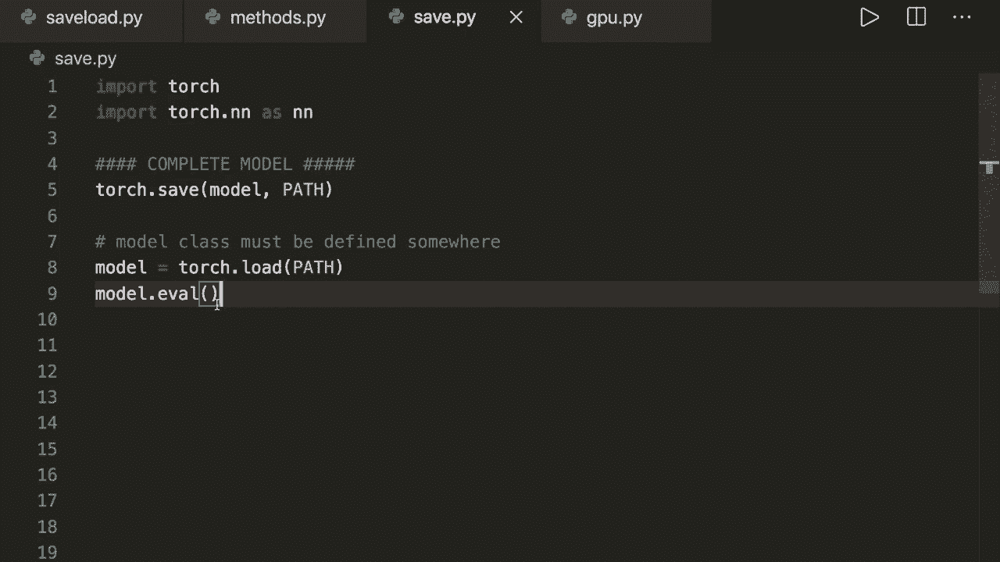

如果我们只想保存我们的模型、训练好的模型，并在之后进行推理，那么只需保存参数即可。你应该记得，我们可以用torcha保存任何字典。所以我们可以通过调用torch.dot.save，然后model.dot.state_di来保存参数。因此，这里持有参数和路径，然后在之后使用。

当我们想再次加载模型时，首先必须创建模型对象，然后调用model.dot.load.state_dit。在这里，我们调用torch.dot.load路径。注意，load.state_di不仅接受路径，还接受加载的字典年。

我们将模型设置为评估模式。这是你应该记住的首选方式。现在让我们跳到代码中，看看实践中的不同保存方式。

在这里我有一个小脚本，其中我定义了一个小模型类，在这里我创建了我们的模型，现在让我先给你展示懒惰的方法。所以首先我们定义我们的文件名，所以我们说文件等于，让我们称之为模型do p，所以它是个好习惯使用结尾.dot p，缩写为pytorch。然后我们通过说`torch.save`来保存整个模型，然后是模型和文件。所以让我们保存这个并运行脚本。所以我们说Python save load do pi，现在如果我们打开浏览器，我们可以忽略这个警告，然后我们看到我们有模型do p。

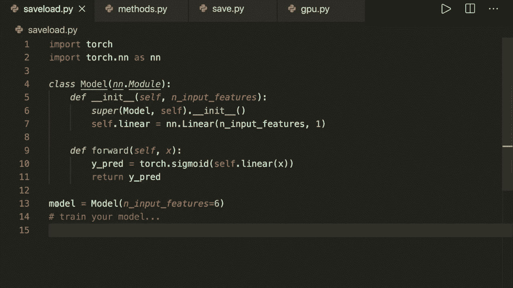

在Exper。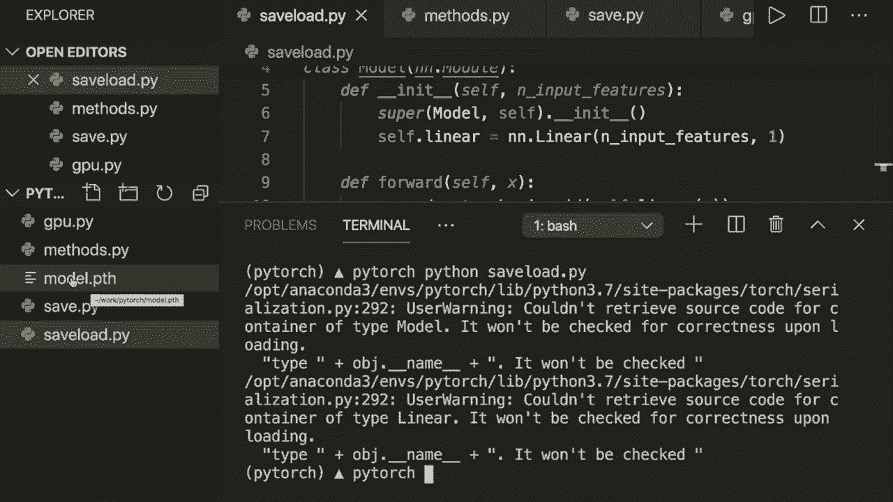

如果我们打开这个，我们会看到这是一部分序列化数据，因此这是不可读的。现在如果我们回到我们的代码。我们加载我们的模型，所以我们可以注释掉这个。我们也可以注释掉这个。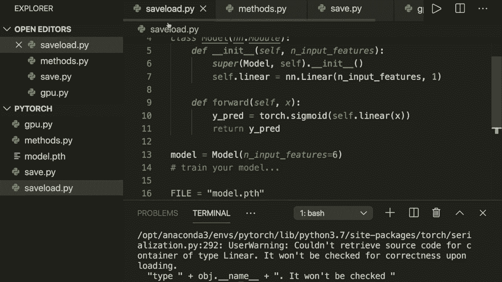

然后我们可以通过说，模型等于来加载我们的模型。等于`torch.load`，然后是文件。然后记住，我们想要设置为评估模式。所以我们说模型.dot evil。然后我们可以使用我们的模型。例如，我们可以检查参数。所以我们假设对于Para在模型的参数中。

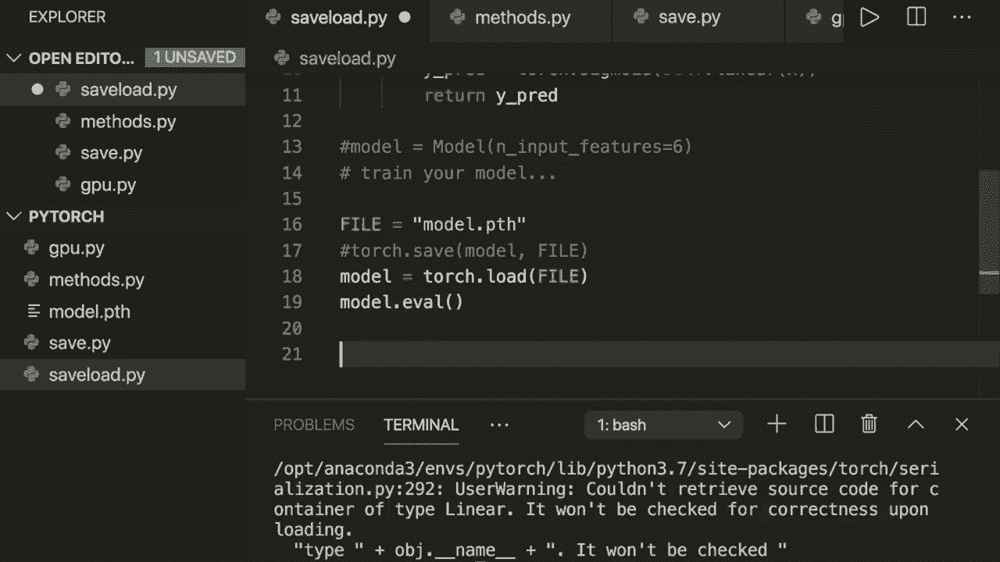

然后，让我们打印我们的Para。并保存这个。然后让我们清除这个并再次运行我们的脚本。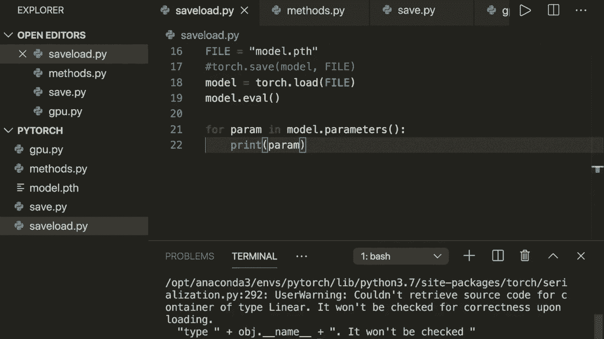

让我把这个放大给你看。所以现在如果我们再次运行我们的脚本，那么我们可以看到我们加载了模型并可以使用参数。所以这是懒惰选项。现在，让我给你展示做这件事的首选方式。所以不是仅仅说`torch.save model`，而是我们想要做的是说`torch.save`。

然后我们想要保存状态字典。所以这里我们再次有我们的模型。然后我们说`torch.model.`。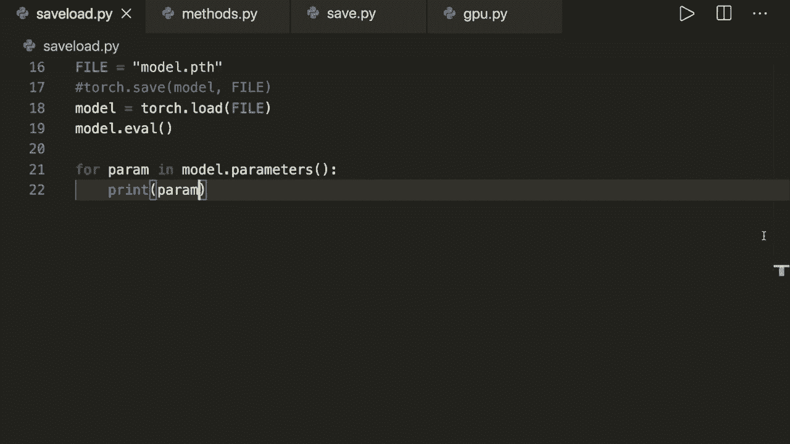

`torch.save model.state dict`。然后，让我们运行这个。所以，让我清除这个。然后打开资源管理器，删除这个文件。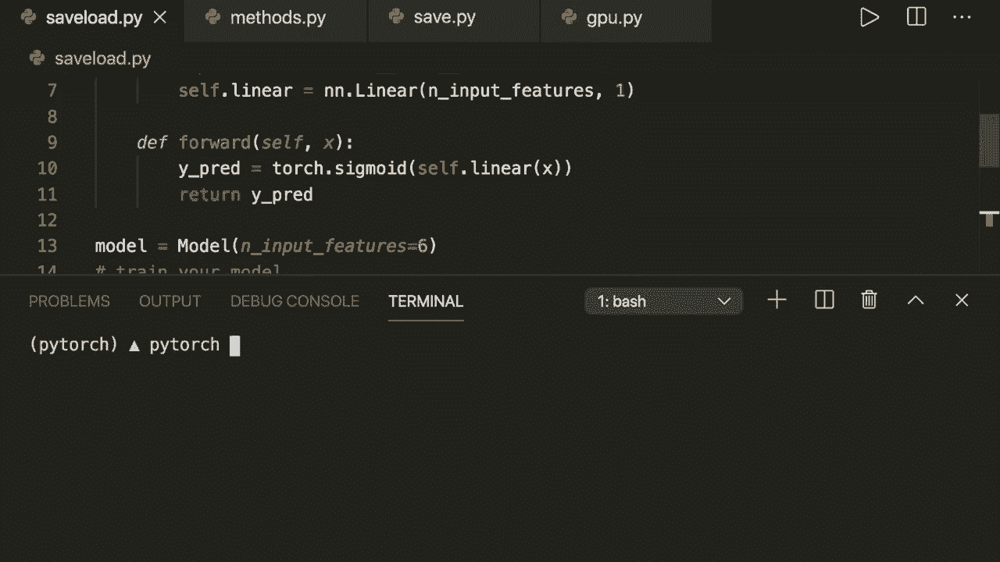

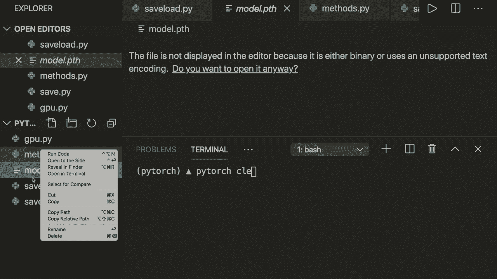

现在如果我们再次运行脚本，那么我们又有文件。但现在它只保存状态字典。现在如果我们想要再次加载模型，我们首先必须定义它。

所以让我们称这个为加载的模型。加载的模型。等于。然后我们还说模型和输入特征的数量是相同的。所以是6。然后我们调用加载的模型.dot load state dict。在里面。记住，我们必须调用`torch.load`，然后是文件名。然后再次。

我们将加载的模型设置为评估模式。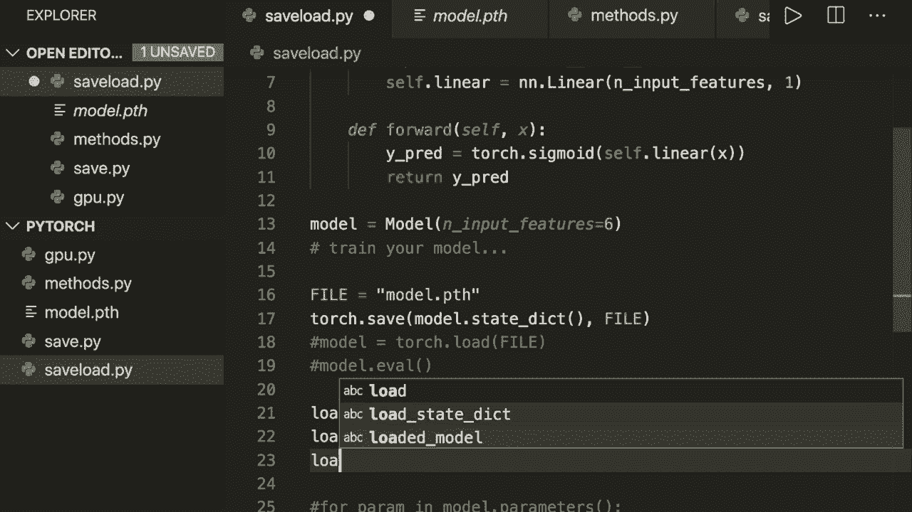

然后如果我们运行这个，所以让我们打印加载模型的参数。再上面，*让我们也打印一下我们正常模型的参数*。

所以如果我们在这里不进行任何训练，那么我们的模型仍然会初始化为一些随机参数。所以让我们运行脚本，检查参数是否相同。

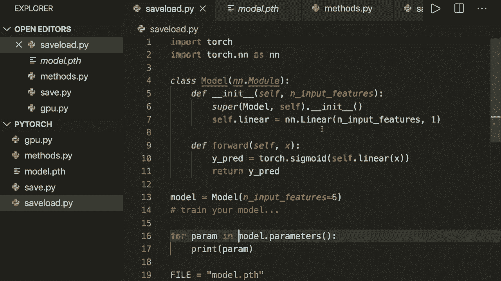

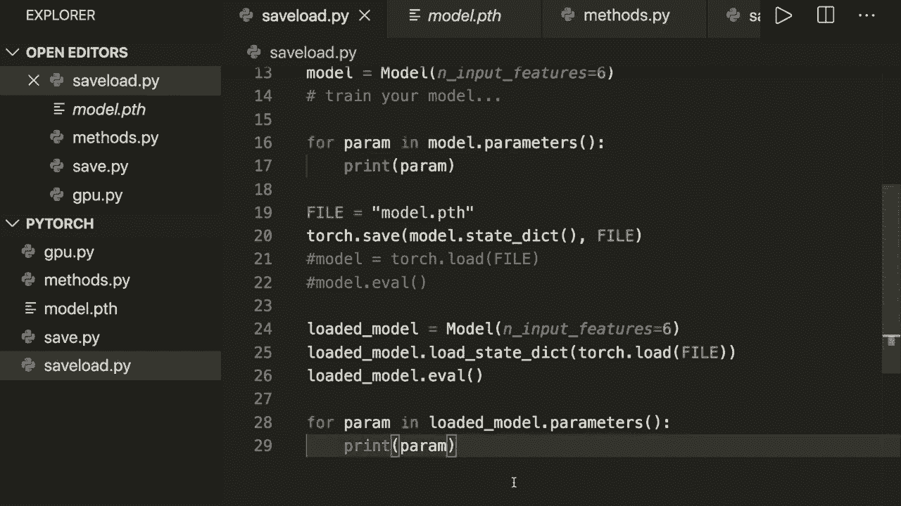

所以在这里，我们看到它成功了。它首先打印了正常模型的参数，然后是加载模型的参数。所以这些是相同的。所以我们看到有一个包含权重的张量，还有一个包含偏置的张量，这对我们的两个模型都是一样的。所以我们看到这也成功了。所以是的，再次。

这是推荐的做法，通过调用`safe dot model state dict`。然后当我们加载它时，我们调用一个`load state dict`方法。

是的，所以在这里我们只是保存状态字典。所以这保存了参数。让我展示一下这个状态字典的样子。所以当我们有我们的模型时，让我们打印`model.state`。😊！

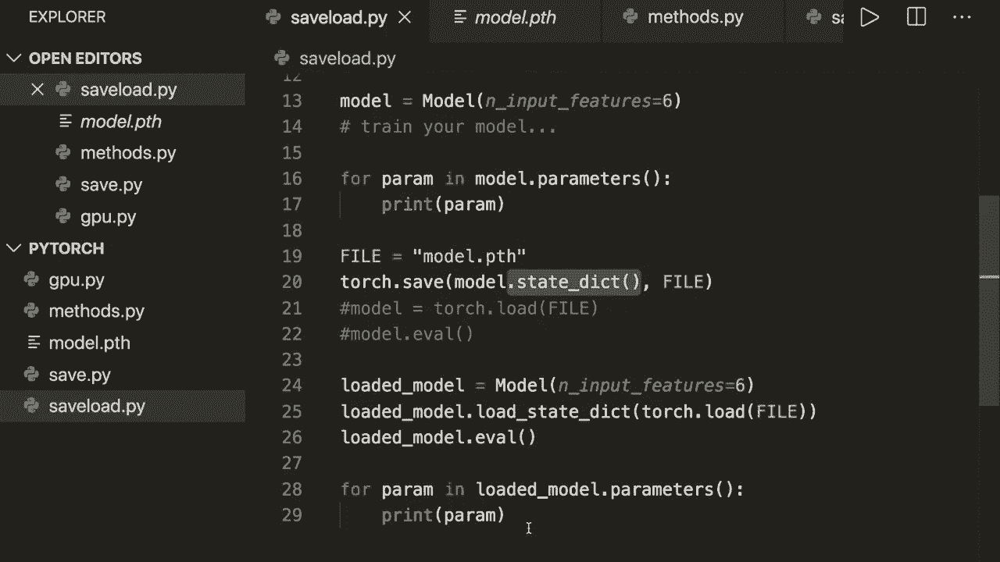

然后，*让我们保存这个*。接下来清除这个并运行脚本。然后我们看到这里有我们的状态字典。因此这里我们有线性权重，包含权重的张量。接下来我们还有一个张量。所以这就是我们的状态字典。现在让我给你展示一个在训练期间保存整个检查点的常见方法，正如你所知道的。

我们可以在这里保存任何字典。假设我们在这里也有一个优化器。假设我们定义一个学习率。设为`0.0001`。我们还有一个优化器。假设这是`torch.optim`，让我们使用随机梯度下降。在这里我们想优化模型参数。

我们还需要给它学习率，设置为`learning rate = learning rate`，我们的优化器也有一个状态字典。因此我们也可以打印优化器的状态字典。现在，如果我们清除这个并运行这个。那么我们看到优化器的状态字典，其中可以看到，例如，学习率和动量。因此现在在训练过程中。

假设我们想在训练过程中某个时刻暂停并保存一个检查点。那么我们可以这样做，所以下面是！

我们创建我们的检查点，这必须是一个字典。所以我们来创建一个字典。首先，我们想保存的内容是，比如说，纪元。所以我们来定义这个纪元。键叫做epoch。假设我们正处于第90个纪元。然后我们想保存模型状态。所以我们必须给它一个键。假设是model state。

在这里我们使用模型的状态字典。然后我们还想保存优化器状态字典。键，假设为optim state。然后这里的值，我们必须调用optr state字典。所以这是我们的检查点。现在我们可以调用torch dot save。

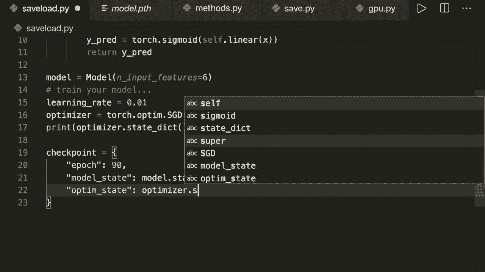

然后保存整个检查点。所以假设torch checkpoint作为文件名。我们称这个为check.Point dot P， T H。

现在再次，让我给你看看资源管理器，运行脚本。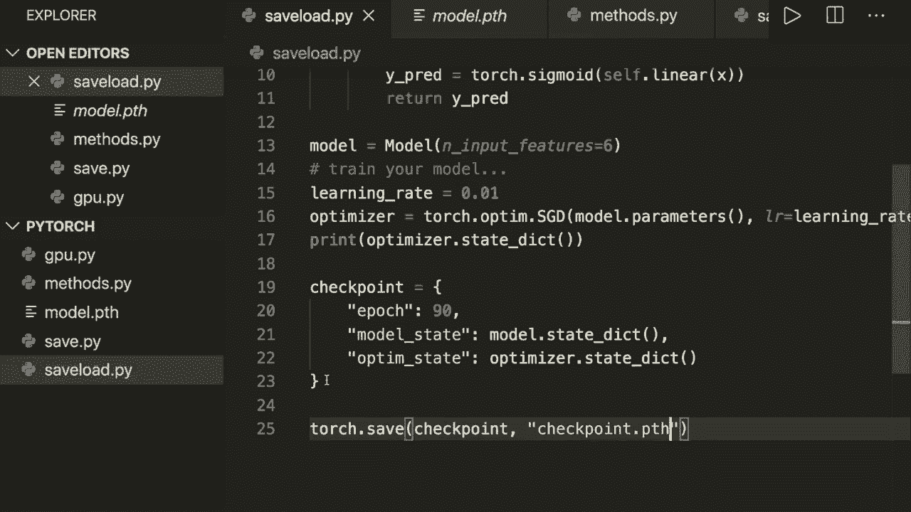

现在我们清除这个并运行它。然后我们看到这里有我们的检查点。现在，当我们加载这个时，我们想加载整个检查点，所以。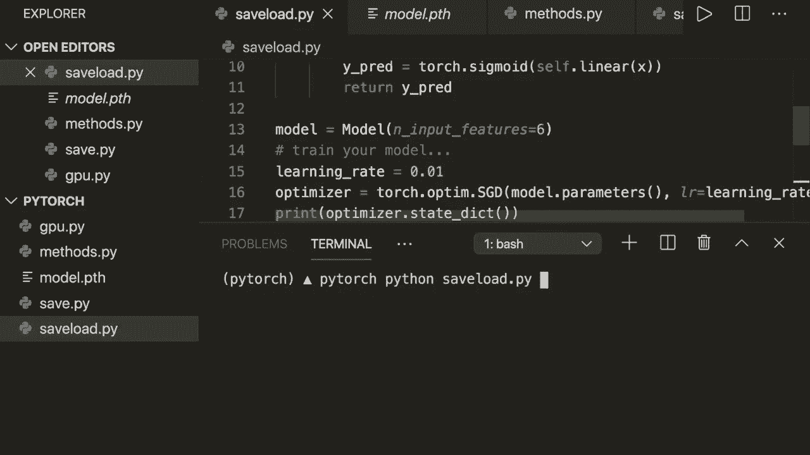

我们可以注释掉这个。同时，我们也不需要这个，所以。

假设我们的加载检查点。假设，loaded checkpoint等于torch dot load。然后文件名与这个相同。

现在你必须重新设置不同的模型和优化器，以便我们可以立即获得纪元，方法是说epoch等于load at checkpoint。这是一个字典，所以我们可以直接。

调用。或者访问纪元键。然后对于模型。记住。我们必须在这里再次创建我们的模型。所以假设模型等于。然后模型的输入特征数量等于6，优化器与这个相同。实际上我们不必使用相同的学习率。

让我把这个复制过来，粘贴在这里。例如。我们可以使用学习率0。然后稍后，我们可以看到我们将正确的学习率加载到优化器中。所以。

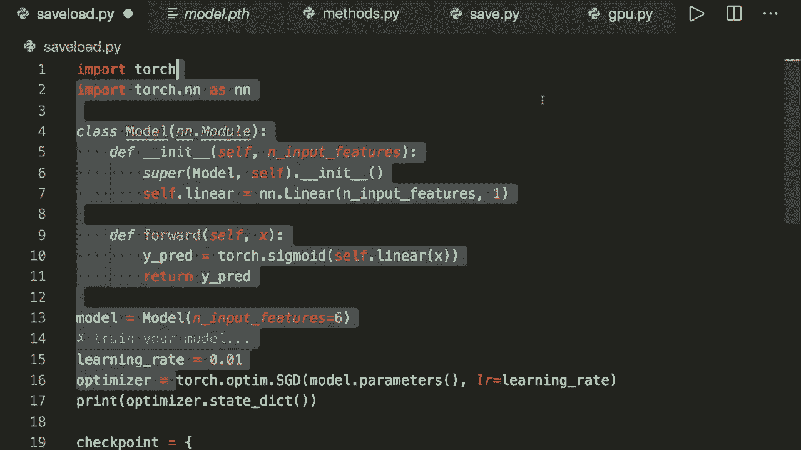

现在，假设模型加载状态。然后这里我们给它检查点。然后我们访问键。我们称之为model state。所以这将加载所有参数到我们的模型中。优化器也是如此。我们称优化器为load state dis。然后使用检查点。

在这里我们称它为optim state。所以现在我们有了加载的模型和优化器，以及当前的纪元。所以我们可以继续训练。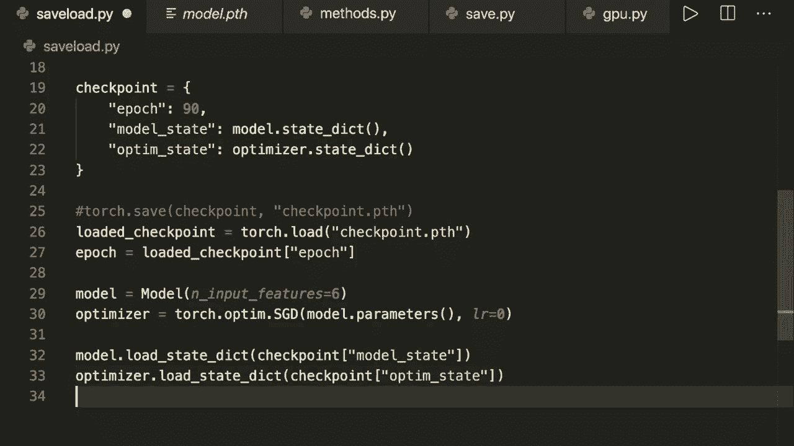

让我通过打印优化器的 `state_dict` 来验证这一切是否正确。所以如果你注意到，我们将学习率设置为 0，然后加载了正确的 `state_dict`。现在如果我们运行这个。最后，我们打印了优化器的 `state_dict`，然后看到我们有与初始优化器相同的学习率。因此这有效。

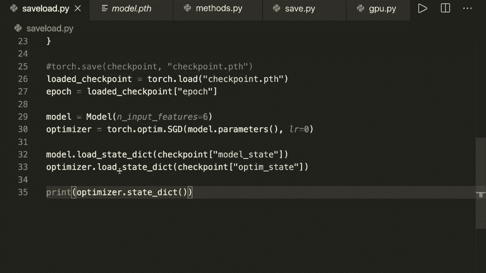

这就是我们如何保存和加载整个检查点。是的，这三种保存方法你必须知道。最后，我想告诉你在使用 GPU 进行训练时需要考虑的事项。如果你在 CPU 上进行训练和加载，那么你不需要做任何区别。

所以你可以像我在这里做的那样使用它，但如果你在 GPU 上保存模型，然后稍后想在 CPU 上加载，那么你必须这样做。假设在你训练的某个时刻，你设置了 CUDA 设备并将模型发送到设备，然后通过使用 `state_dict` 保存它。

然后你想要加载到 CPU。所以你有你的 CPU 设备，然后重新创建模型，再调用 `load_state_dict` 和加载路径。在这里你必须指定映射位置，并给它 CPU 设备。如果你想在 GPU 上保存并在 CPU 上加载，就这样做。

现在，如果你想在 GPU 上同时进行这两项操作。你将模型发送到 CUDA 设备并保存，然后你也想在 GPU 上加载它，你只需这样做。设置你的模型，加载 `state_dict`，然后将模型发送到 CUDA 设备。

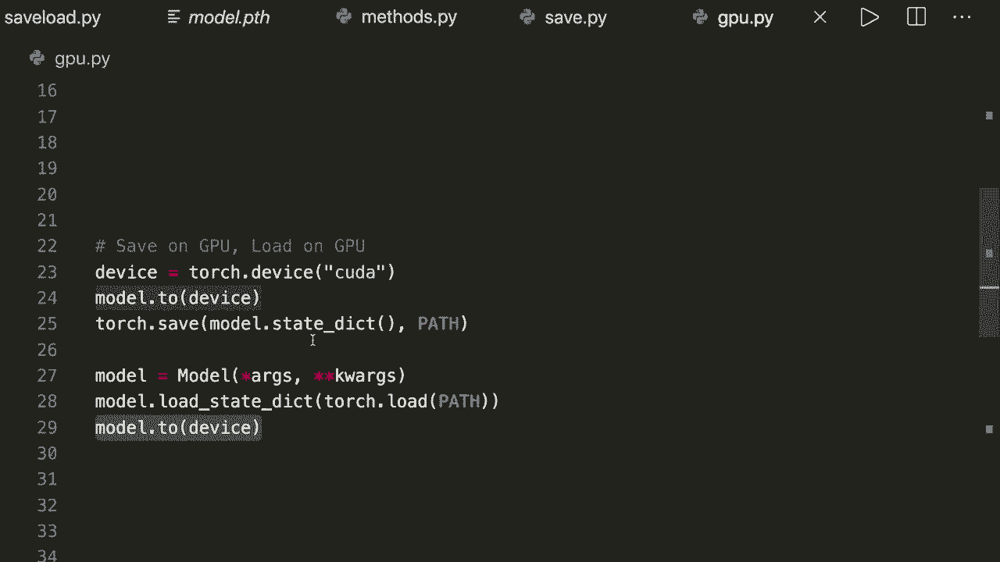

现在作为第三个选项。假设你在 CPU 上保存了模型，所以你没有将模型发送到 CUDA 设备上。但后来在加载时，你想将其加载到 GPU 上，你必须这样做。首先，你指定你的 CUDA 设备，然后创建你的模型。

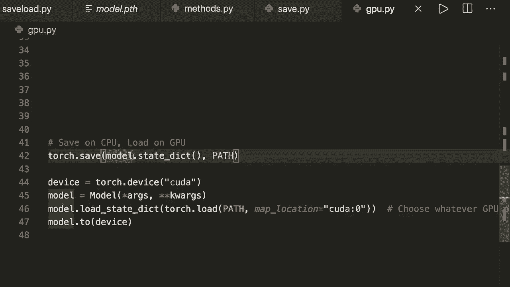

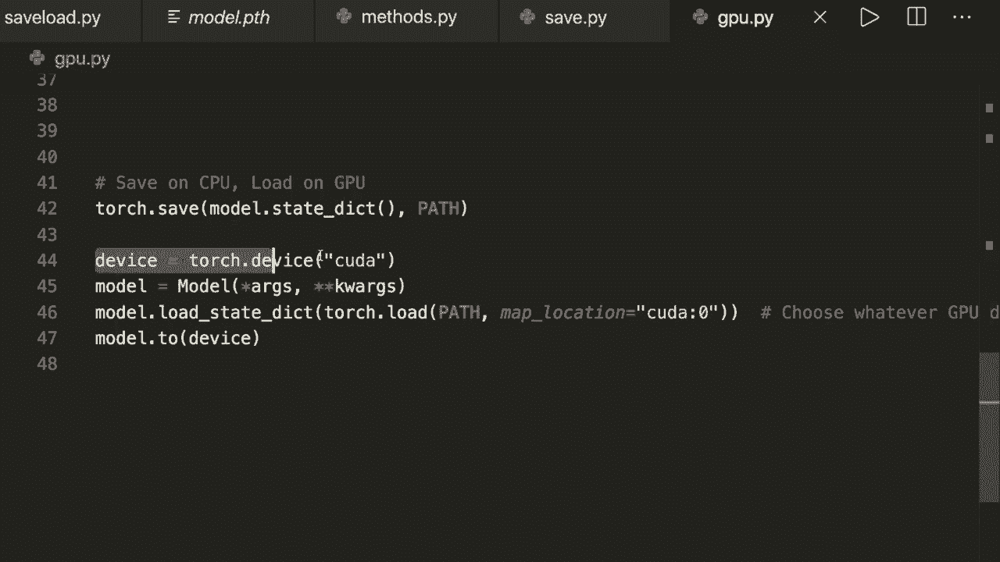

然后你调用模型的 `load_state_dict`，接着用路径调用 `torch.load`，并指定映射位置。你需要指定 CUDA，然后是冒号，再加上你想要的任何 GPU 设备编号。例如，CUDA:0。然后你还需要调用模型到设备，所以指定到 CUDA 设备。这会将模型和所有加载的参数张量发送到设备上。这样你就可以继续在 GPU 上进行训练或推理。

当然，你还必须将所有训练样本发送到用于前向传播的设备上。

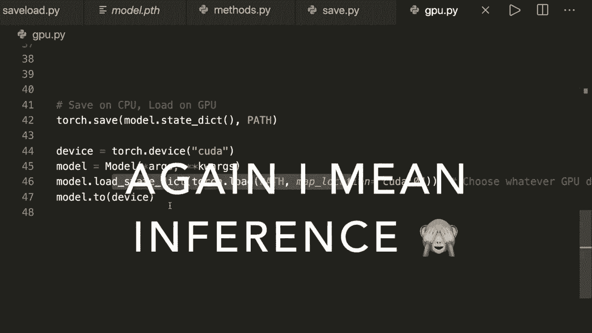

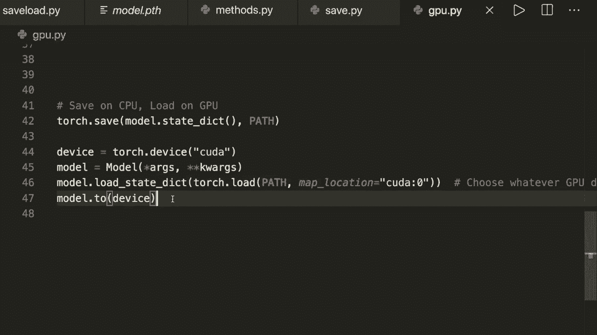

所以，是的，当你使用GPU时，这些是你需要考虑的事项。

现在，你了解了保存和加载模型的各种方法。 是的，这就是目前为止的所有内容。 希望你喜欢这个教程。如果你喜欢，请考虑订阅频道，下次见，再见。😊。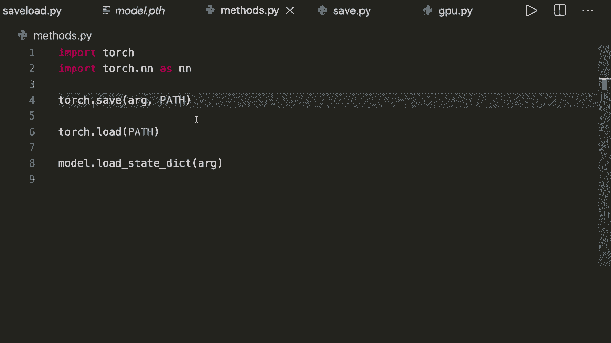
