# PyTorch 极简实战教程！全程代码讲解，在实践中掌握深度学习&搭建全pipeline！＜实战教程系列＞ - P20：L20- RNN & LSTM & GRU - 循环神经网络 

嗨，欢迎来到你的新Pytorch教程。今天，我将向你展示如何使用内置的RnN模块实现一个递归神经网络。在上一个教程中，我们从头开始实现了RnN。我强烈建议先观看这个教程，以了解RnN的内部结构。😊

今天，我们专注于使用Pytorch自己的模块进行实现，所以我们不必自己实现所有内容。我将向你展示如何使用RnN模块。最后，我还会向你展示如何轻松切换我们的RnN模型，并使用特殊类型的Rn，如LSTM和GRU。所以让我们开始吧。我们将以我的简单神经网络教程作为起点。

这是我Pytorch初学者课程的第13个教程。你可以在下面的描述中找到视频和代码的链接。正如我所说，这是第13个教程。我已经将这段代码抓取并复制到我的编辑器中。在这个例子中，我们在Mnes数据集上进行数字分类。

我必须说，图像分类并不是RnN的典型例子。但我想在这里演示的是我们必须如何处理输入。😊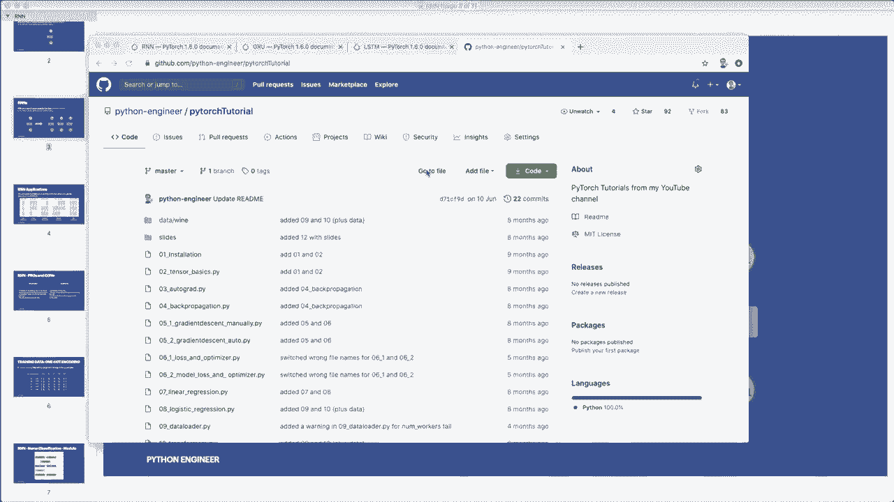

将其视为一个序列，然后设置正确的形状，这也表明RnN确实可以用于在这个分类任务中获得高准确度。所以下次我们了解到，RnN的特殊之处在于我们在这里处理向量的序列。

所以我们将输入视为一个序列。RnN有不同类型。在这个例子中，我们使用了这种多对一的架构。这里我们有一个序列作为输入，最后只有一个输出。这个就是我们的类标签。所以让我们跳到代码。

首先我们必须改变的是超参数。所以Ms数据集由28乘28像素的图像组成。上次我们将其压缩为一维。我们的输入大小为28乘28或784。这次，如我所说，我们将图像视为一个序列。

所以现在我们做的是将一个图像维度视为一个序列，另一个图像维度视为输入或特征大小。你可以将其视为我们一次查看一行。让我们注释掉这个，然后创建一个新的。假设我们的输入大小等于。现在，如我所说，我们一次查看一行。这是28。然后我们也创建序列长度。

这也是28。然后我们将隐藏层大小更改为128。所以你可以在这里尝试不同的大小。我们再添加一个超参数，这是层数。这里我设置为2。默认情况下为1。这意味着我们在此情况下叠加两个RnN。

第二个R和N将第一个R和N的输出作为输入。这可以进一步改善我们的模型。现在我们想要实现R和N类。所以我们将名称改为R和N。在这个超类方法中也是如此。然后我们下面的模型现在也是R和N。

现在让我们删除所有这些，开始一个新的、干净的实现。所以现在我们的R和N仍然有输入大小、隐藏大小和类别数作为参数。它还获取新的参数层数。我们将其放在这里。因此，假设层数在这里。那么，当然。

我们在创建模型时也必须将其传递给模型。这是我们的超参数。😊。然后我们在这里首先想做的是简单地存储层数和隐藏大小。所以我们说self nu layers等于nu layers。还有，self.dot hidden size等于hidden size。然后我们创建R和N模型，并使用内置的Pytorch R和N模块。

所以你可以在官方文档中找到这个。所以这是Pytorch为我们提供的R和N类。我们将使用这个。因此，我们创建一个R和N并说self R和N等于。现在这在NN模块中。所以NN.dot R和N。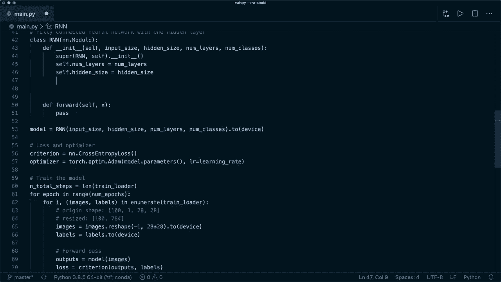

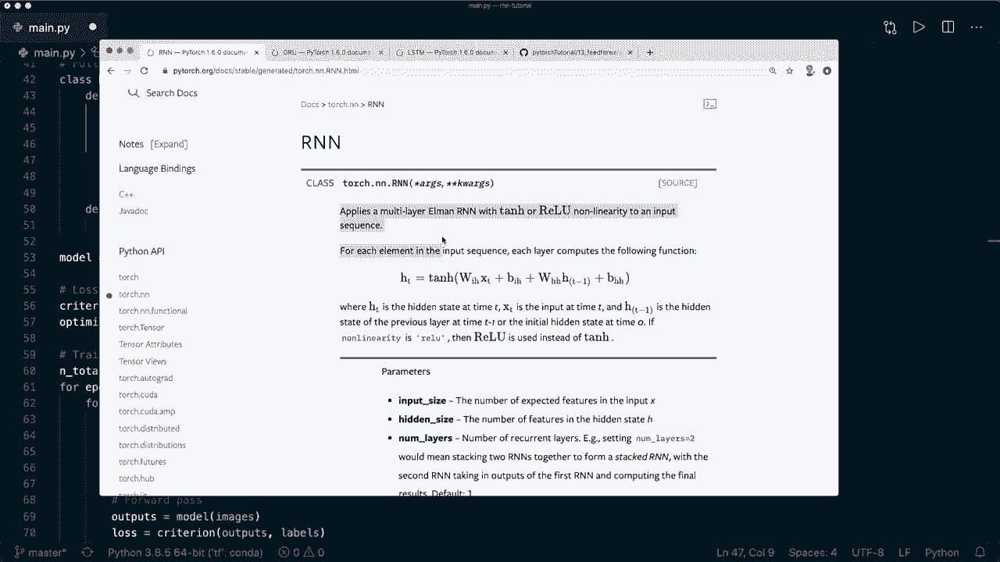

R和N需要输入大小。它需要隐藏大小，并且需要按此顺序的层数。然后我们还使用一个叫做batch first的参数，并将其设置为true。这意味着我们必须将batch作为第一维。因此，我们的输入需要具有形状。Batch size，Batch size，然后是序列长度。

然后是输入或特征大小。所以这是我们输入所需的形状。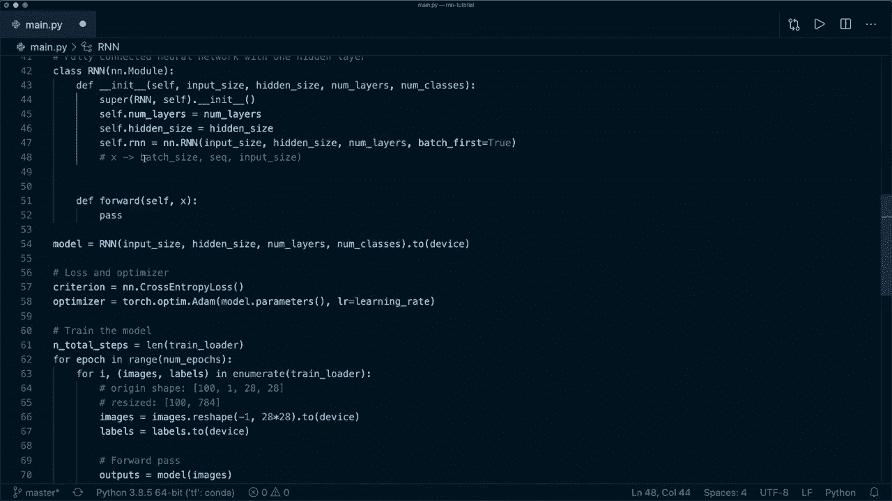

再次，你可以在文档中找到这个。所以如果你将batch first设置为true，那么在这里你需要这个形状。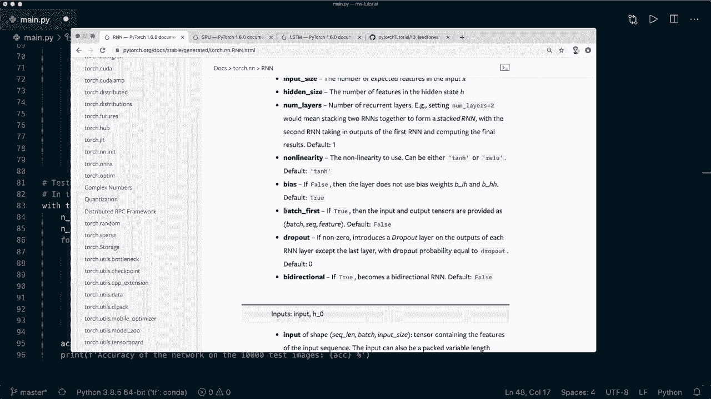

所以现在我们想要做的是在将图像传递给我们的模型之前。所以下次我们将其调整为这个大小。因此，最初我们的batch或图像的大小是batch size，然后是1，然后是28，然后再28。因此，这次我们只想要batch size，然后是28乘28。所以在这里我们将其调整为这个大小，然后是28。

第一个是我们的序列长度，第二个是我们的输入大小。所以这两个都是28。在我们的训练循环中也是如此，然后在我们的评估循环中，我们也做同样的事情。因此，在这里我们还需要将其调整为这个大小。现在我们的输入形状正确了。现在我们还需要一层。因此，正如我所说。

我们正在使用这种多对一的架构。所以最终我们有一个分类任务。这意味着我们使用一个线性层，然后是 softmax 和交叉熵。因此让我们再创建一个线性层。我们可以说 self dot Fc，表示全连接层等于 nn dot linear。在这里我们要小心。对于输入大小。

我们使用隐藏大小，输出大小是类别的数量。我稍后会再次解释，但基本上正如我们在这张图像中看到的，或者在这张图中，我们只使用最后一个时间步的隐藏状态来进行分类。因此，我们只需要最后一个隐藏大小作为线性层的输入大小。这基本上就是整个初始化函数。现在，当然。

我们还需要实现前向传播。因此我们的 R 和 N。如果我们查看文档。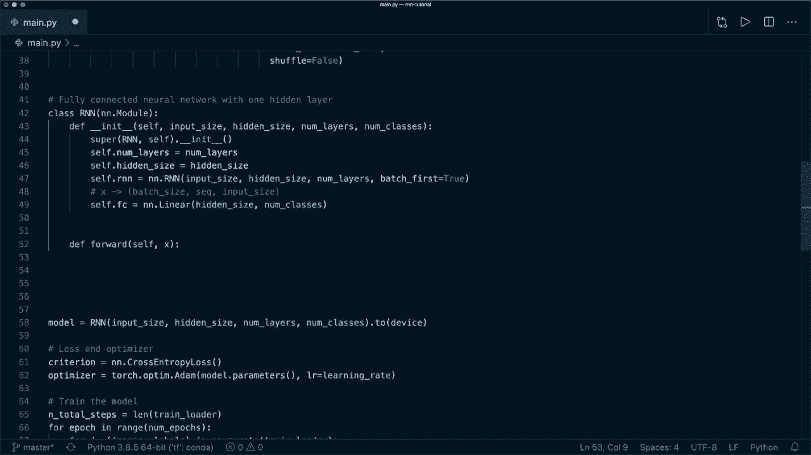

然后它需要两个输入，第一个是输入，第二个是初始隐藏状态。所以我们需要以正确的形状来处理这个。因此，让我们创建一个 tensor，内容为 just0。所以我们说 H0 等于。然后我们说 torch dot0s。在这里，第一个是层数，第二个是批大小。

所以我们通过说 x dot size0 得到这个。下一个维度是隐藏大小。因此我们说 self dot hidden size。然后我们还想将其推送到设备上。如果你在使用一个。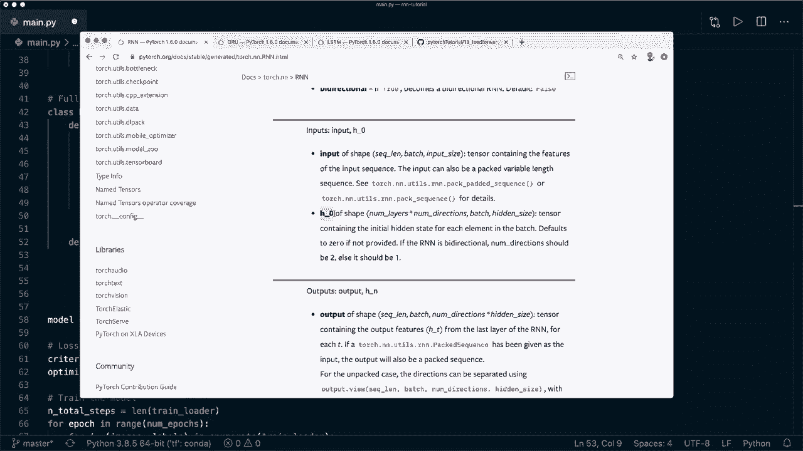

所以现在这是我们的初始隐藏状态，现在我们可以调用我们的 R 和 N 模型。所以我们说 out，然后加下划线，因为我们不需要这个。然后我们说 self dot R 和 N。这会得到 x 和 H0。所以再次查看文档。它返回两个输出，第一个 tensor 包含来自所有时间步的输出特征或隐藏状态。

而另一个只是步骤 N 的隐藏状态。因此在这种情况下我们不需要这个。所以现在我们有了输出，输出的大小是。这是批次。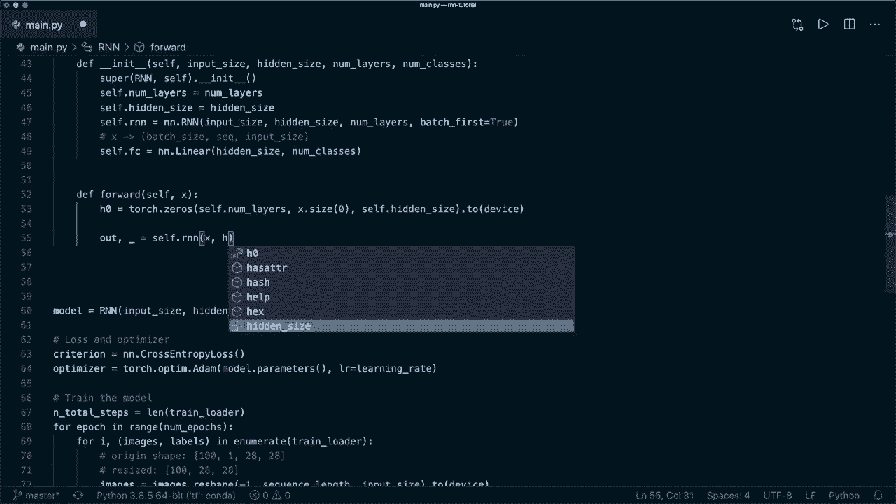

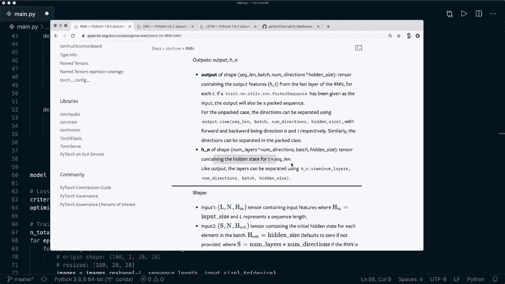

批大小，然后我们有序列长度，然后是隐藏大小。这是我们输出的新形状。现在我们想做的是仅解码最后一个时间步的隐藏状态。因此我们这里再次写出数字。这是 n，和 28，而我们的隐藏大小是 128。现在我们只想要最后一个时间步。

所以我们希望我们的输出在 n 和 128。因此我们通过说 out equals out 得到这个。然后我们在这里使用切片，获取批次中的所有样本，且仅取最后一个时间步。我们可以说 -1。然后再次使用冒号获取隐藏大小中的所有特征。现在我们得到了这个大小的输出。

这就是我们需要隐藏大小作为线性层输入大小的原因。所以现在我们可以调用它。现在我们可以说out等于self.fully_connected与我们的out。然后我们返回out。这就是我们为R和N所需的整个实现。所以，我们训练和评估循环中的其他一切保持不变。再次。

我们需要注意的是将输入视为一个序列。当我们使用内置的R和N时，我们需要使用正确的形状。然后我们还需要将初始隐藏状态设置为正确的形状。在将其传递给全连接层之前，我们必须重新调整它的形状。所以我们来试试看。

那么我们可以说Python main.pi。😊，好的，现在训练完成，正如你所看到的，我们得到了93%的准确率。因此我们的R和N有效，你可以看到它可以应用于这个分类任务。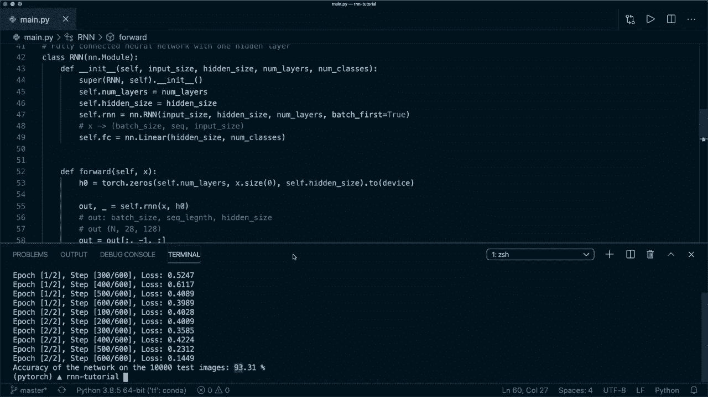

现在最后，我还想向你展示两个R和N模块。所以两种特殊类型。第一个是GRU或门控递归单元。第二个是LSTM或长短期记忆。两者也是非常流行的R和N。我现在不会解释它们的理论。

我将向你展示我们如何轻松地使用这些实现。所以我们首先使用RU。我们可以简单地说nn.GRU。然后再称之为self.GRU，下面也称为self.GRU。其他一切保持不变。所以它接受相同的输入参数。

它还需要这个隐藏状态。然后输出具有相同的形状。现在让我们使用GRU并测试一下。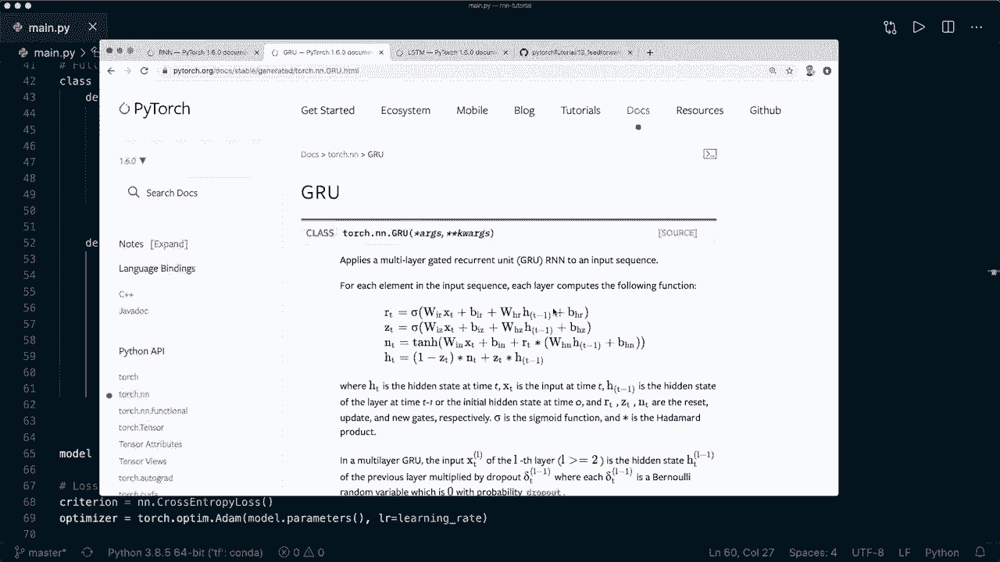

好的，正如你所看到的，GRU也能正常工作。这里的准确率甚至更高。最后一件事，让我们也试试LSTM。正如你可能知道的，对于LSTM，我们需要一个初始单元状态。所以让我们使用LSTM。首先调用cell.LSTM。然后在这里使用nn.LSTM。输入参数仍然是相同的。

然后这里我们需要一个初始的单元状态。所以我们称之为C0。这具有相同的形状。接下来我们调用自我LSTM。这需要隐藏状态和单元状态作为一个元组在这里。😊。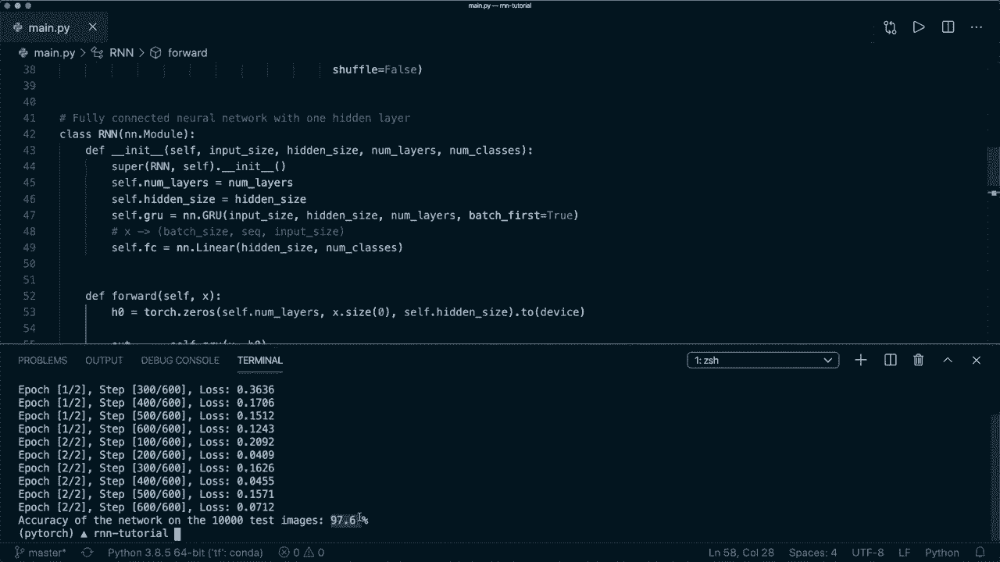

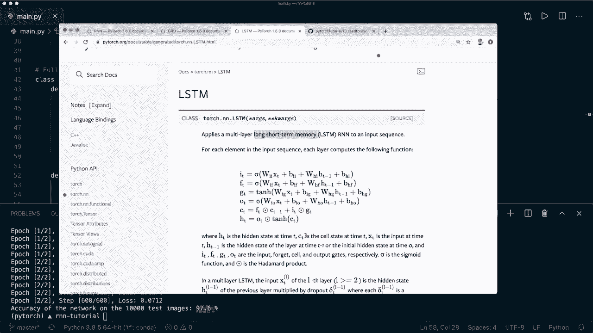

所以现在这就是我们应用LSTM所需的一切。让我们清理一下，再运行一次。好的，这一次工作得很好。你可以看到准确率是97%。所以，是的，现在你知道如何在Pyar中实现R和N，使用内置的R和N模块。你也知道如何使用GRU和LSTM。嗯，是的。

希望你喜欢这个教程。如果你喜欢它，请考虑订阅频道并点击点赞，下次见，拜拜。😊。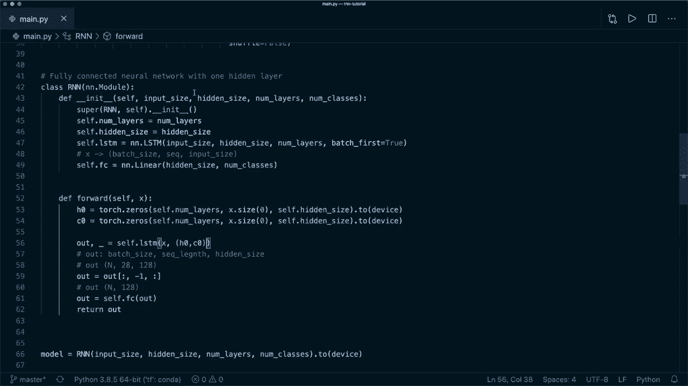
