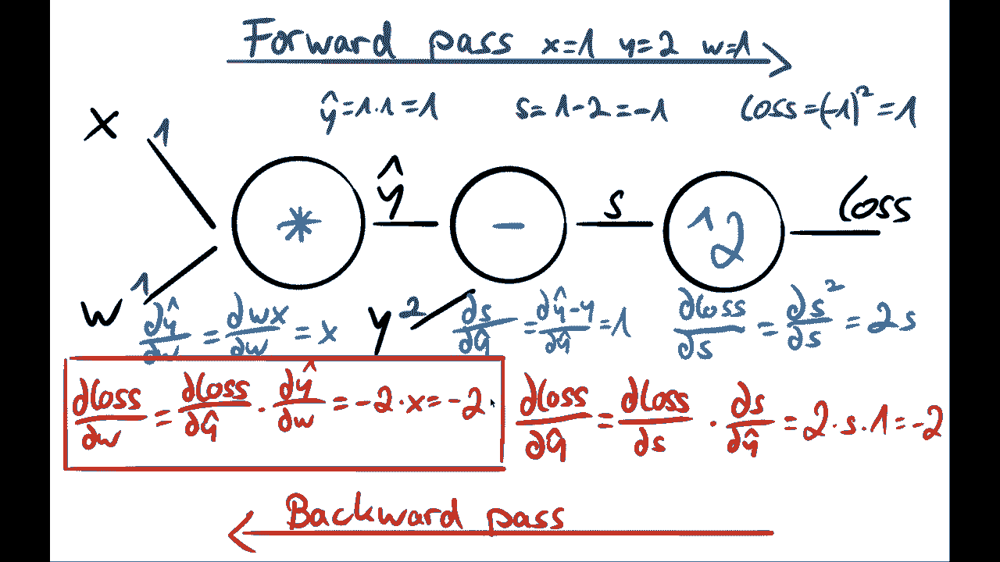
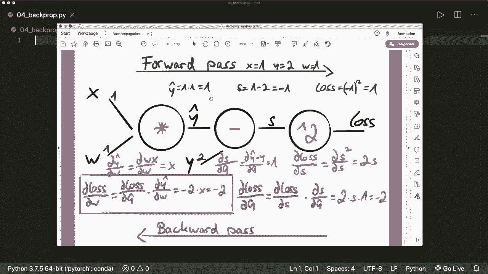

# PyTorch 极简实战教程！全程代码讲解，在实践中掌握深度学习&搭建全pipeline！＜实战教程系列＞ - P4：L4- 反向传播 - 理论与实例 

大家好，欢迎来到新的 PyTorch 教程。在这个视频中，我将解释著名的反向传播算法，以及我们如何用它计算梯度。😊我将解释这项技术的必要概念，然后带你通过一个具体的示例和一些数字。最后。

然后我们将看到在 PyTorch 中应用反向传播是多么简单。所以让我们开始。首先，我们必须了解的概念是链式法则。假设我们有两个操作或两个函数。首先，我们有输入 X，然后我们应用一个函数 A，得到输出 Y。

然后我们将这个输出作为我们第二个函数的输入。第二个函数 B。然后我们得到最终输出 C。现在我们想要最小化我们的 C。因此，我们想知道 C 关于我们最开始的 x 的导数。我们可以使用所谓的链式法则来做到这一点。

我们首先计算 C 关于 y 的导数，并将其与 y 关于 X 的导数相乘。然后我们得到我们想要的最终导数。所以首先，在这里，我们计算这个位置的导数。这个输出相对于这个输入的导数。然后在这里，这个输出相对于这个输入的导数。

然后我们将它们相乘，得到我们感兴趣的最终梯度。这就是链式法则。接下来要了解的概念是所谓的计算图。对于我们在 PyTorch 中进行的每一个操作，PyTorch 会为我们创建一个图。在每个节点上，我们应用一个操作或一个函数，并获得输出。

在这个例子中，我们使用乘法操作。我们将 x 和 y 相乘，然后得到 C。在这些节点上，我们可以计算所谓的局部梯度，稍后可以在链式法则中使用它们来得到最终梯度。在这里，局部梯度，我们可以计算两个梯度，C 关于 x 的梯度。

这很简单，因为我们知道这个函数。所以这是 x 和 y 关于 x 的导数的梯度，即 y。在底部，我们计算 x 和 y 关于 y 的导数，结果是 x。局部梯度很简单，因为我们知道这个函数。我们为什么要它们呢？

因为通常我们的图有更多操作。在最后，我们计算一个我们想要最小化的损失函数。因此，我们必须计算这个损失关于我们最开始的参数 X 的梯度。现在，假设在这个位置，我们已经知道损失关于 C 的导数。

然后我们可以得到我们想要的最终梯度。通过链式法则。损失相对于X的梯度是损失相对于C的梯度乘以我们的局部梯度。因此，C相对于x的导数。是的，这就是我们得到最终梯度的方式。现在，整个概念由三个步骤组成。

首先，我们进行前向传播，应用所有的函数并计算损失。然后在每个节点，我们计算局部梯度。接着我们进行所谓的反向传播，在这里我们使用链式法则计算损失相对于我们的权重或参数的梯度。这就是我们将要做的三个步骤。现在我们看一个具体的例子。

所以我们在这里想要使用线性回归。如果你不知道这如何工作，那么我强烈推荐我的《从零开始的机器学习》教程，关于线性回归。我会在描述中放上链接。因此，基本上，我们用一些权重和输入的线性组合来建模我们的输出。

所以我们的y hat或预测的y是w乘以x。然后我们制定一些损失函数。在这种情况下，这就是平方误差。实际上，它应该是均方误差，但为了简单起见，我们只使用平方误差。否则，我们还需要进行另一个操作来获取均值。因此，损失是预测的y与实际y的差值，然后我们对其进行平方。

现在我们想要最小化我们的损失。我们想知道损失相对于我们权重的导数。我们如何得到这个呢？所以我们应用我们的三个步骤。首先，我们进行前向传播，输入x和W。然后在这里我们输入y，并在这里应用我们的函数。然后我们得到损失。

然后我们在每个节点计算局部梯度。在这里，损失相对于我们的S的梯度。然后这里，S相对于我们的y hat的梯度。在这个节点上，Y hat相对于我们的W的梯度。接着我们进行反向传播，从最后开始。

在这里我们有第一个，我们有损失相对于我们的S的导数。然后我们使用它们，我们还使用链式法则来获取损失相对于Y hat的导数。然后再次，我们使用这个和链式法则来获得损失相对于我们的W的最终梯度。所以让我们用一些具体的数字来做这个。假设我们有x和y。

而y在开始时是2。所以这些是我们的训练样本。我们初始化我们的权重。假设，例如，我们说我们的w在开始时是1。然后我们进行前向传播。在第一个节点，我们将x和W相乘。所以我们得到Y hat等于1。然后在下一个节点，我们进行减法。所以y hat y是1-2等于-1。在最后，我们对我们的S进行平方。

我们有 S 的平方，因此我们的损失是 1。现在我们计算局部梯度。在最后一个节点，我们有损失对 S 的梯度。这很简单，因为我们知道函数。这是 S 的平方的梯度，也就是 2 S。在下一个节点，我们有 S 对 Y hat 的梯度。

这是函数 Y hat 减去 y 对 Y hat 的梯度，值为 1。在最后一个节点，我们有 Y hat 对 W 的导数。这是 W 乘以 x 对 w 的导数，结果是 x。同时，注意我们不需要了解这个图线中的导数。

因此，我们不需要知道 S 对 Y 的导数。而且在这里，我们也不需要这个，因为我们的 x 和 y 是固定的。因此，我们只关注想要在这里更新的参数。然后我们进行反向传播。首先，我们使用我们的局部梯度。

我们想要计算损失对 Y hat 的导数。在这里，我们使用链式法则，结合我们刚刚计算的两个局部梯度，也就是 2 S 乘以 1，而 S 是 -1，这个我们在上面计算过。结果是 -2。现在我们使用这个导数和这个局部梯度来得到最终的梯度。

损失对我们的 W 的梯度，就是损失对 Y hat 的梯度乘以 Y hat 对 W 的梯度。结果是 -2 乘以 x，而 x 是 1。因此，最终的梯度是 -2。这就是我们想知道的最终梯度。这就是反向传播的全部工作原理。让我们跳到代码部分，验证 PyTorch 是否能得到这些确切的数字。

让我们记住 x 是 1，y 是 2，而 w 是 1。那么我们的第一个梯度应该是 -2。

让我们看看如何在 PyTorch 中使用这个。首先，我们当然要导入 torch。然后我们创建我们的向量或张量。因此，我们说 x 等于 torch.dot.tenor。这是 1。然后我们的 y 等于 torch.dot.tenor，值为 2。接着我们的初始权重是一个张量，值为 1。因此，1.0 使其成为浮点数。然后用我们的权重。

我们对梯度感兴趣。因此我们需要指定 `require Sc` 等于 true。然后我们进行前向传播，计算损失。因此我们简单地说，Y hat 等于 W 乘以 x，这就是我们的函数。然后我们说损失等于 Y hats 减去实际的 y。然后我们将其平方。所以我们说，这个平方。现在，让我们打印我们的损失，看看结果。

这是开始的内容。现在我们想要进行反向传播。因此，让我们进行反向传播。`pi touch` 将自动为我们计算局部梯度，同时也自动计算反向传播。因此，我们唯一需要调用的就是 `loss backward`。这就是整个梯度计算。现在我们的 w 有了这个 dot Gr 属性。

我们可以打印这个。现在这是第一个梯度。在第一次前向和后向传播之后。记住，开始时应该是-2。在这里我们看到有一个张量为-2。所以这个是有效的。接下来的步骤是。例如，现在我们更新我们的权重，然后进行下一次前向和后向传播，并进行几次迭代。

是的，这就是反向传播的工作原理，以及在Pytorch中使用它是多么简单。希望你喜欢这个教程。请订阅频道，下次见，拜！😊。
