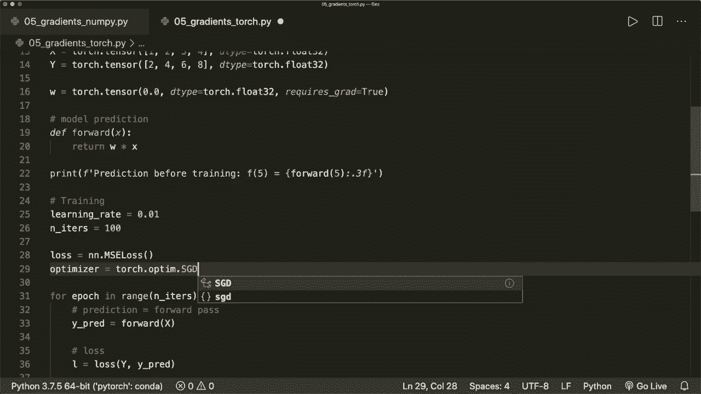
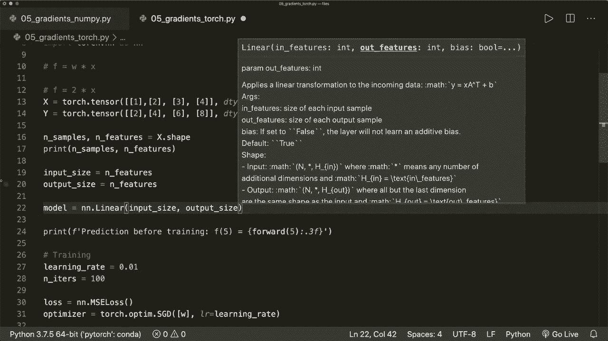
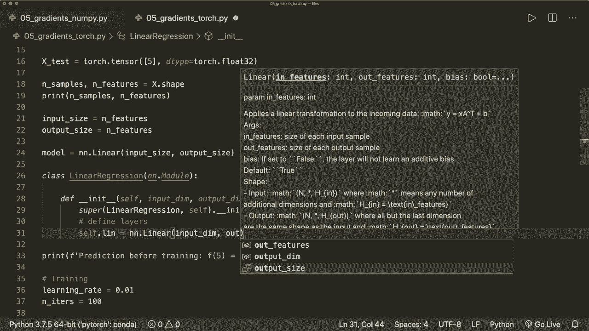

# PyTorch 极简实战教程！全程代码讲解，在实践中掌握深度学习&搭建全pipeline！＜实战教程系列＞ - P6：L6- 训练管道：模型、损失和优化器 - ShowMeAI - BV12m4y1S7ix

大家好。欢迎回到新的 PyTorch 教程。在上一个教程中，我们从头实现了逻辑回归，然后学习了如何使用 Pyt 来计算梯度，现在，我们将继续之前的内容。现在我们要用 PyTorch 中的损失和优化器类替代手动计算的损失和参数更新。😊然后我们还通过实现一个 PyTorch 模型替换了手动计算的模型预测。

然后 PyTorch 可以为我们完成整个管道。所以这个视频涵盖了步骤 3 和 4。请先观看之前的教程以了解步骤 1 和 2。那么现在让我们开始吧！

首先，我想谈谈 PyTorch 中的一般训练管道。通常，我们有三个步骤。第一步是设计我们的模型。我们设计输入和输出的数量，即输入大小和输出大小。然后，我们还设计了前向传播及所有不同的操作或不同的层。

然后作为第二步，我们设计或构建损失和优化器，最后一步是进行训练循环。这是训练循环。我们从前向传播开始。这里我们计算，或者让我们写下来。计算预测。然后我们进行反向传播，获取梯度。

PyTorch 可以为我们做一切。我们只需定义或设计我们的模型。然后在获得梯度后，我们可以更新权重。现在我们更新权重，然后迭代几次直到完成。这就是整个管道。现在让我们继续，替换损失和优化。

我们导入神经网络模块，因此我们导入 torch dot N N S 和 N，以便可以使用其中的一些函数。现在我们不再想手动定义损失，所以可以简单地删除这一部分。在我们训练之前，我们仍需要定义我们的损失。因此我们可以说损失等于。这里可以使用 PyTorch 提供的损失。所以我们可以说 N N dot M E loss。

这正是我们之前实现的。所以这是均方误差。这是一个可调用的函数。然后我们还想从 p chargech 获取一个优化器。所以我们说 optr 等于 torch dot optim 来自优化模块，然后在这里我们使用 S GD，代表随机梯度下降，需要一些参数。

一些需要优化的参数，并且它将需要作为列表。因此我们把 W 放在这里。然后它还需要 Lr，即学习率，具体是。

我们之前定义的学习率。

然后在我们的训练循环中。损失计算现在仍然是一样的，因为这是一个可调用的函数，它获取实际的 y 和预测的 y。然后我们不再需要手动更新我们的权重，因此我们可以简单地说 optr.dot.step。

这将进行一次优化步骤。然后我们在优化步骤之后仍然需要清空我们的梯度。因此我们可以说 optimizer.dot0.gra。现在我们完成了步骤 3。让我们运行这个看看是否有效。嗯，所以，是的，仍然有效。我们的预测在训练后是不错的。让我们继续进行步骤 4，并用 pytorch 模型替换我们手动实现的前向方法。

所以，对于这个，我们也不再需要我们的权重，因为我们的模型已经知道了参数。所以在这里我们说 model 等于 N N.dot.linear。通常我们需要自己设计这个。但由于这对于线性回归来说非常简单。这只有一层，这在 pytorch 中已经提供了。所以这是 N N.dot.linear。

这需要我们特征的输入大小和输出大小。为此，我们需要做一些修改。因此，现在我们的 X 和 y 需要有不同的形状。因此这必须是一个二维数组，现在行数是样本的数量。每行对应特征数量。因此这个有一个新形状。抱歉。

新形状看起来像这样。y 的形状也是一样的，所以是 2、4、6 和 8。所以现在让我们获取形状。所以是 y。我现在得小心。所以我们可以说样本数量和特征数量等于 x.dot.shape。现在让我们打印这个。所以打印样本数量和特征数量。现在让我们运行这个。

这会导致一个错误。但我想我们可以做到这一点。所以形状现在是 4×1。我们有四个样本，每个样本一个特征。现在我们定义我们的模型。这需要一个输入和一个输出大小。输入大小等于特征的数量，输出大小仍然是一样的。所以这也是特征的数量。

所以这是一个输入大小和一个输出大小。现在我们需要把这个给我们的模型。所以我们在这里说输入大小。

输出大小。

然后再一次，当我们想要获取预测时。我们可以简单地说我们可以调用模型。但现在这不能是一个浮点值。因此这必须是一个张量。让我们创建一个测试张量。假设 X.Test 等于 torch.dot.Tensor，它只获取一个样本，值为 5。然后它的数据类型为 torch.dot.float32。然后在这里我们传递测试样本。

由于这个只有一个值，我们可以调用点项目来获取实际的浮点值。所以现在让我们把这段复制粘贴到这里。嗯。现在我们还需要修改我们的优化器。因此现在我们没有权重。所以这个列表中包含参数，我们可以简单地说 model.dot。

Terrameter，并调用这个函数。现在在这里，对于预测，我们也简单地调用模型。

现在我们完成了。所以现在我们正在使用pieytor模型来获得这个。此外在这里，如果我们想再次打印它们，我们必须解包它们。所以我们说W和一个可选的偏置等于模型参数。这将解包它们。如果我们想打印实际的，这将是一个列表的列表。

所以让我们用这个获取第一个或实际的第一个权重，我们也可以调用这个项目，因为我们不想看到张量。现在我觉得我们完成了。所以让我们运行这个，看看它是否有效。是的，最终输出并不完美。这可能是因为初始化现在是随机的。此外，这个优化技术可能有点不同。所以你可能想要尝试一下。

尝试一下学习率和迭代次数。但基本上，它有效。随着每一步，它变得越来越好。是的，所以这就是我们如何构建整个训练管道。还有一件事。在这种情况下，我们不必自己提出模型。所以在这里我们只有一层。

这已经在Pytorch中提供了。但假设我们需要一个自定义模型。让我们写一个自定义的线性回归模型。然后我们必须从N，N.dot.module派生。这将得到一个初始化的方法。它有self，并获取输入维度和输出维度。

然后在这里我们调用super，超类。所以线性回归的super和self。然后点。

在这里，这就是我们如何调用超类。我们会定义我们的层。所以在这种情况下，我们说我们的self.dot线性层等于Nn.dot.linear。这将获取输入维度和输出维度，然后我们将它们存储在这里。然后我们还必须在我们的模型类中实现前向传递，所以self和x。

在这里我们可以简单地返回self.dot.linear的x。

这就是整个内容。现在我们可以说我们的模型等同于线性回归，输入大小和输出大小。现在这将做同样的事情。所以现在这只是一个虚拟示例，因为这是一个简单的包装器，它将完全相同。但基本上，这就是我们设计pieyto模型的方式。所以现在让我们注释掉这个，使用这个类来看看它是否有效。

是的，所以它仍然有效。现在就这些。现在，Pyto可以为我们完成大部分工作。当然，我们仍然需要设计我们的模型，并且需要知道我们想要使用哪个损失和优化器，但我们不必再担心底层算法了。所以，你可以在Giub上找到所有代码。如果你喜欢这个。

请订阅频道，下一次见，拜拜。
