# PyTorch 极简实战教程！全程代码讲解，在实践中掌握深度学习&搭建全pipeline！＜实战教程系列＞ - P7：L7- 线性回归 - ShowMeAI - BV12m4y1S7ix

嗨，大家好。欢迎回到新的Pytarch教程。这一次，我们实现线性回归。所以我们已经在前几个教程中逐步实现了这个。这应该是一个重复的过程，让我们可以应用所有学到的概念，并迅速再次实现我们的算法。😊如我之前所示，我们典型的pyytorch管道由这三个步骤组成。首先。

我们设计我们的模型。所以我们定义输入和输出大小，然后进行前向传播。接着我们创建我们的损失和优化器函数。然后我们执行实际的训练循环，包括前向传播、后向传播和权重更新。让我们来做这个。首先，我们导入一些需要的内容。所以我们导入torch。

然后我们导入torch点和N S和N。也就是神经网络模块。然后我们导入nuy S和P以进行一些数据转换。然后从S K learn中导入数据集。我们想生成一个回归数据集。然后我们稍后也想绘制这个。所以我说导入matplot clip的pie plot作为P LT。

然后我们进行我们的三个步骤。所以我们设计模型，第一步。然后第二步，我们定义损失和优化器。最后第三步，我们的训练循环。让我们来做这个。首先，我们做一个步骤0，准备我们的数据。所以准备数据。让我们生成一个回归数据集。我们可以通过说让我们称这个为x nuy和y nuy来实现。

然后我们可以使用数据集点make regression。获取，假设100个样本。所以n samples等于100。在这个例子中只需要一个特征。所以n features等于1。然后我们添加一些噪声。我们还要设置一个随机状态。假设这个是1。

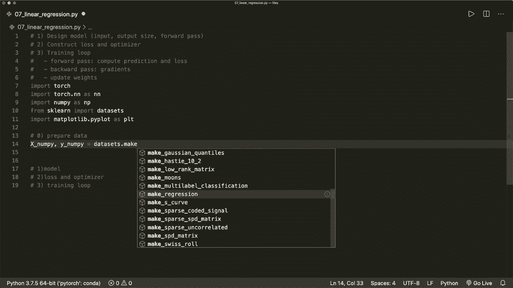

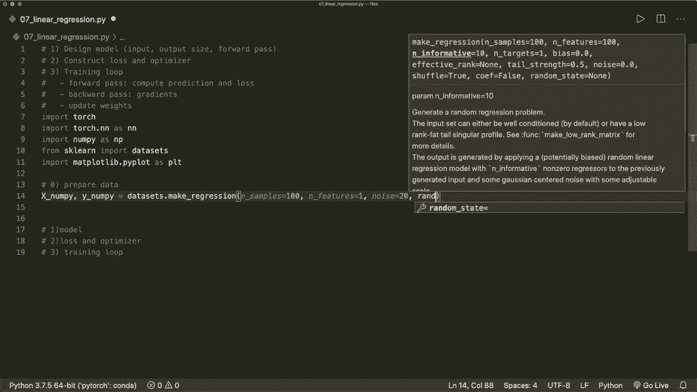

然后我们想把这个转换为一个torch张量。所以我们说x等于。然后我们可以使用函数torch从numy中提取。然后我们说x点。X下划线nuy。但我们想在此之前将其转换为一个float 32数据类型。所以现在这是一个双精度数据类型。如果我们在这里使用双精度。

然后我们稍后会遇到一些错误。所以我们只需通过说S类型，然后说nuy点float 32来转换，并且对我们的y做同样的事情。所以我们说y等于从我们的nuy数组转换的torch张量。现在我们还要重塑我们的y。因为现在它只有一行，我们想把它变成列向量。我们希望将每个值放在一行中，整个形状只有一列。

让我们说y等于y点view。在这里我们放入新的大小，所以y点shape0。所以值的数量。然后只需要一列。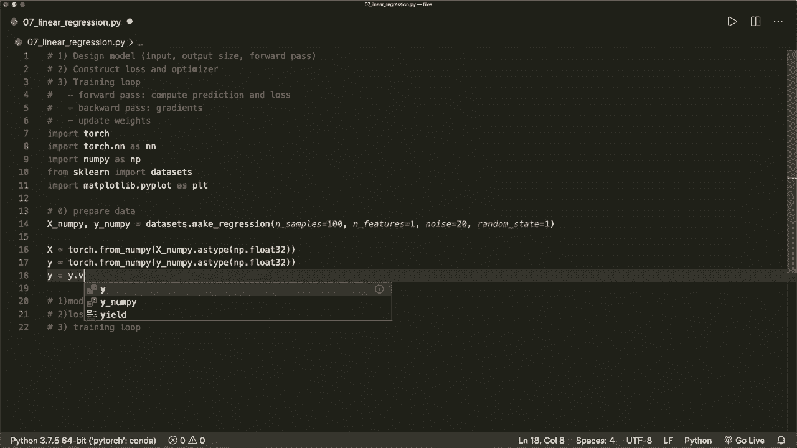

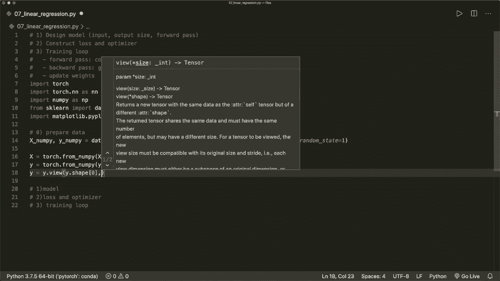

所以这个方法是一个内置的PyTorch方法，将重新调整我们的`tensor`。然后通过说`x.shape`来获取样本数量和特征数量。这样我们就可以在稍后使用。现在让我们进行三步操作。现在我们有了数据。现在我们定义模型。在线性回归的情况下，这只是一个层。我们的。

因此，我们可以使用内置的线性模型。我们说`model = NN.Linear`。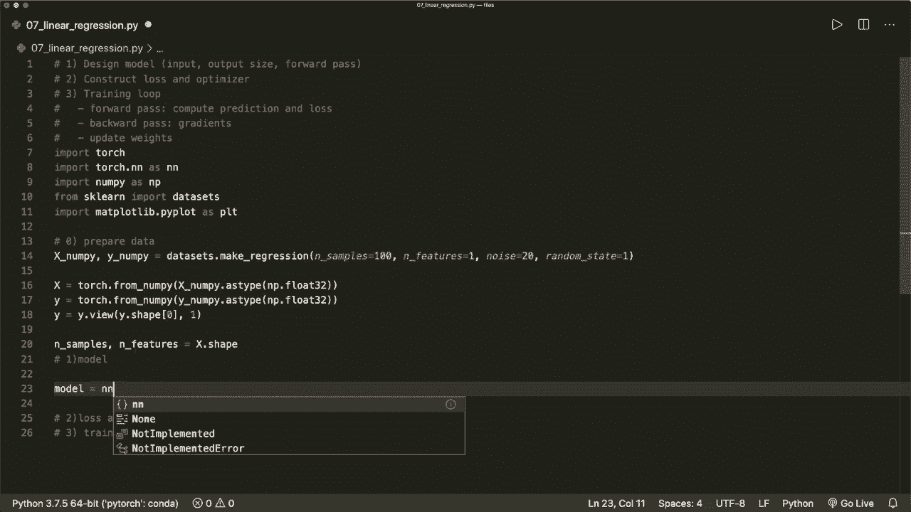

这是线性层，它需要我们特征的输入大小和输出大小。所以假设输入大小等于。这是我们拥有的特征数量。在我们的示例中，这仅为1。输出大小等于1。所以我们只想为每个样本生成一个值。

现在我们的模型得到了输入和输出的大小，输入大小和输出大小。

这就是我们设置模型所需做的全部。现在让我们继续处理损失和优化器。所以我们称之为`criterion`。

在这里，我们可以使用Pytorch内置的损失函数。在线性回归的情况下，这就是均方误差。所以我们可以说这是`NN.MSELoss`。这样就会计算均方误差。这是一个可调用的函数。然后我们还设置优化器。所以我们说，`optimizer = ...`。

假设我们使用`torch.optim.SGD`。这就是随机梯度下降。我们的优化器需要优化的参数。所以这里我们可以简单地说这是`model.parameters`。然后它需要一个学习率。我们在这里定义为一个变量。假设学习率等于`0.01`。

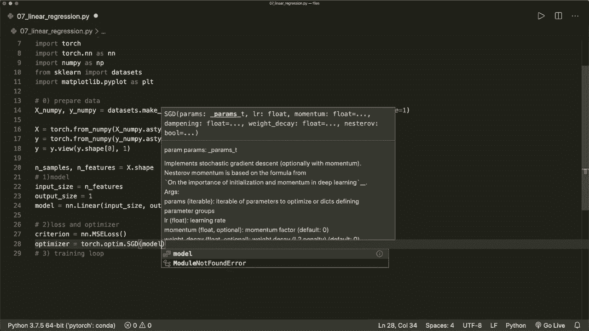

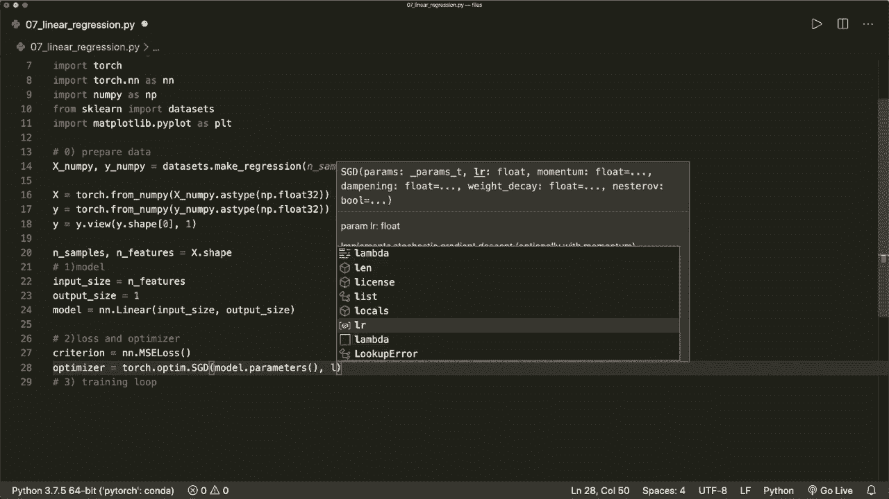

然后`lr = learning rate`。

这是第二步。现在让我们进行训练循环。首先，定义一下迭代的次数。假设我们想进行100次训练迭代。然后，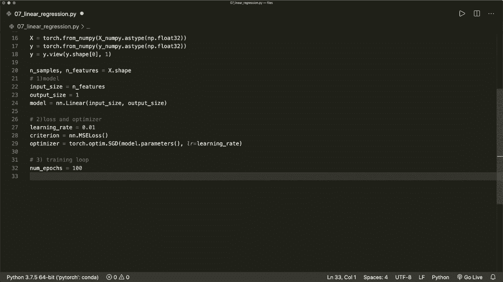

在`range(epochs)`中进行循环。现在在训练循环中执行我们的步骤，前向传播，反向传播和权重更新。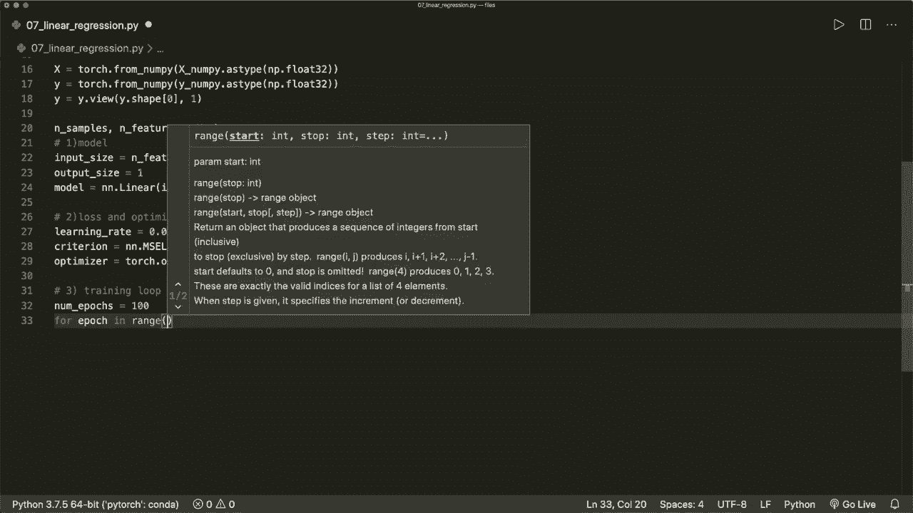

所以首先我们做前向传播以及这里的损失。然后是反向传播。然后是更新。前向传播和这里的损失，我们可以说，为什么预测它。

等于，然后我们调用我们的模型。作为数据，它获取`x`。这就是前向传播。然后我们通过说`loss = ...`来计算损失。

这是我们的`criterion`。

这需要实际标签和预测值。那么为什么要预测呢？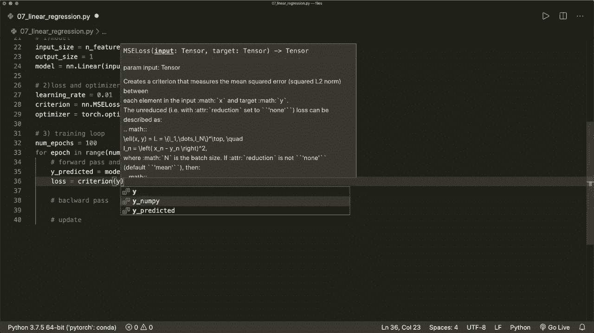

在反向传播中计算梯度时，我们只需说 lost dot backward。这将进行反向传播并为我们计算梯度。然后我们在这里的更新，只需说 optimizer dot step。这将更新权重。在下一次迭代之前，我们必须小心，因此我们必须现在清空梯度。

因为每当我们调用 backward 函数时，这将把梯度累加到 dot Gr 属性中。所以现在我们想再次清空这个。我们简单地说 optimizer dot 0 gra。所以你永远不要忘记这个。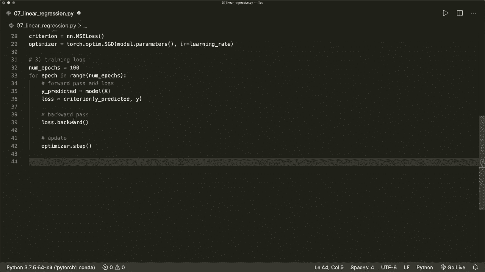

然后我们完成了训练循环。让我们打印一些信息。假设如果 Epoch plus 1 modular1s 等于 0。每第 10 步，我们想打印一些信息。所以让我们打印 epoch。这里我们说 epoch plus one。让我们也打印损失，损失等于。我们可以说 loss dot item。然后让我们格式化这个。

所以让我们只绘制或打印小数值。🤢，现在我们完成了。现在我们也来绘制这个。我们来说，获取所有的预测值，称为 predicted。现在我们调用我们的最终模型，model X。带着所有的数据。现在我们想把它转换回 nu pipe，但在此之前。

我们想要分离我们的 tenzo，以防止此操作被跟踪在我们的图形和计算图中。因为现在，这个 tenzo。这里我有个错别字预测了。所以这个 tenzo 需要梯度参数设置为 true。但现在我们希望它变为 false。这样将生成一个新的 tenzo，其中我们的梯度计算属性为 false。

这是我们的新 tenzo。然后我们调用 numpy 函数。现在我们将其转换为 numpy，并绘制这个。所以我们先绘制所有的数据。所以，x nuy 和 y nuy。我们希望将其绘制为红点。然后我们希望绘制我们的生成或近似函数。所以说 P，L T dot plot。

在 X 轴上是 X nuy，Y 轴上是我们的预测标签。让我们用蓝色绘制这个。然后我们说 P L T dot show。现在让我们运行这个，希望一切都是正确的。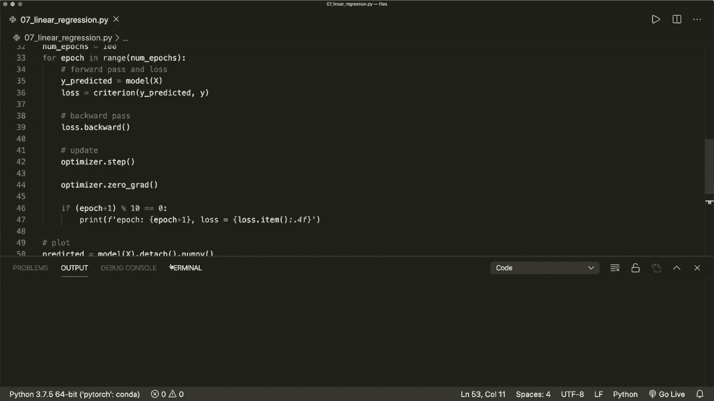

现在这个图出现了。我们看到这条线很好地近似了我们的数据，我们看到这个是有效的。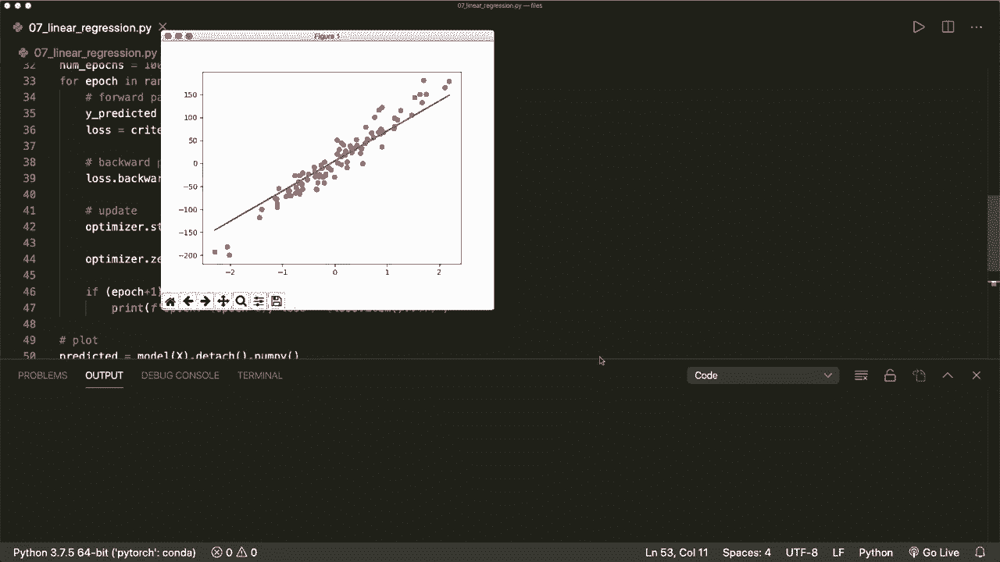

是的，现在我们完成了。希望你喜欢这个。如果你喜欢，请订阅频道，下次见，再见。😊。
