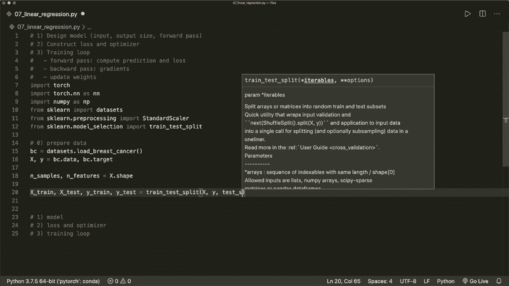
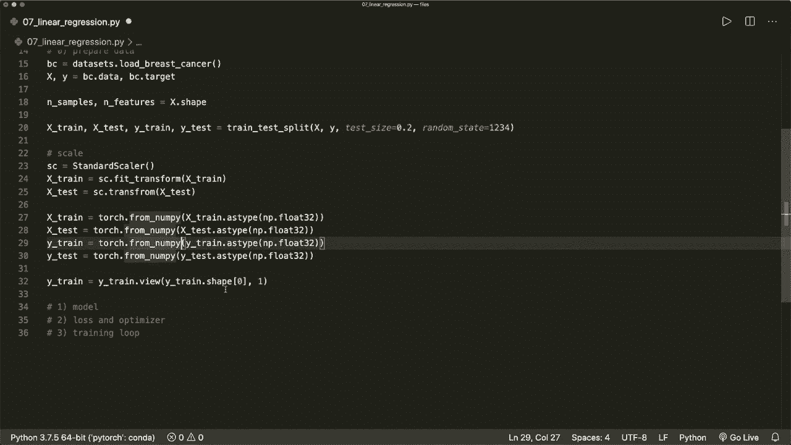
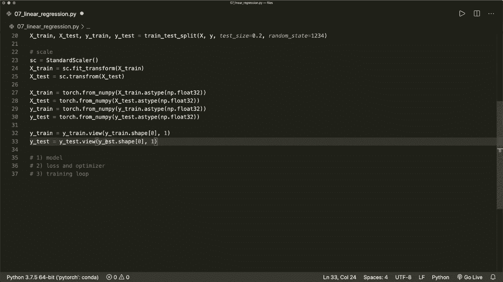
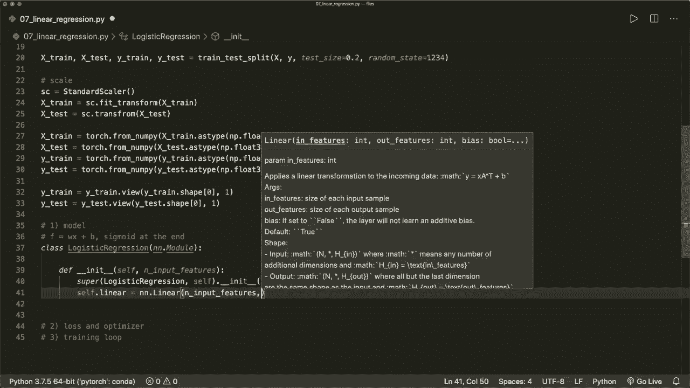
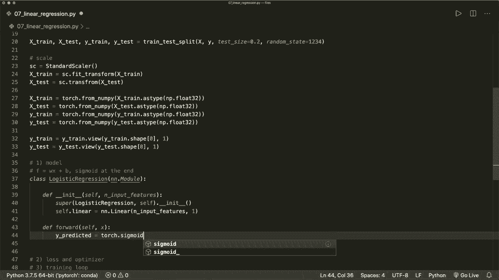
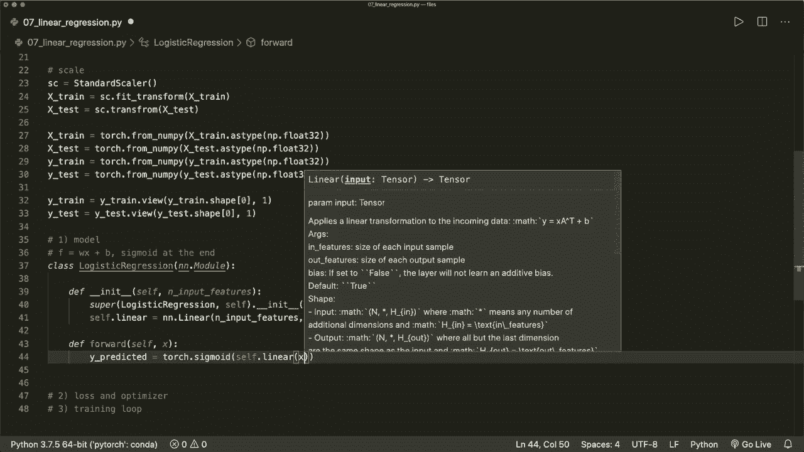
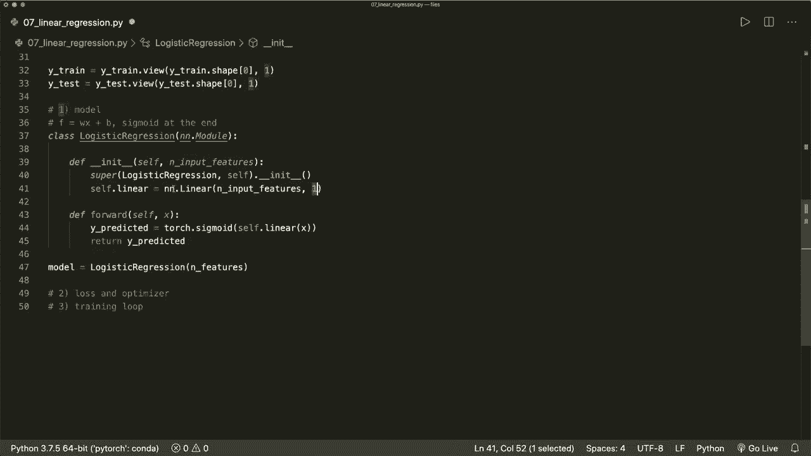
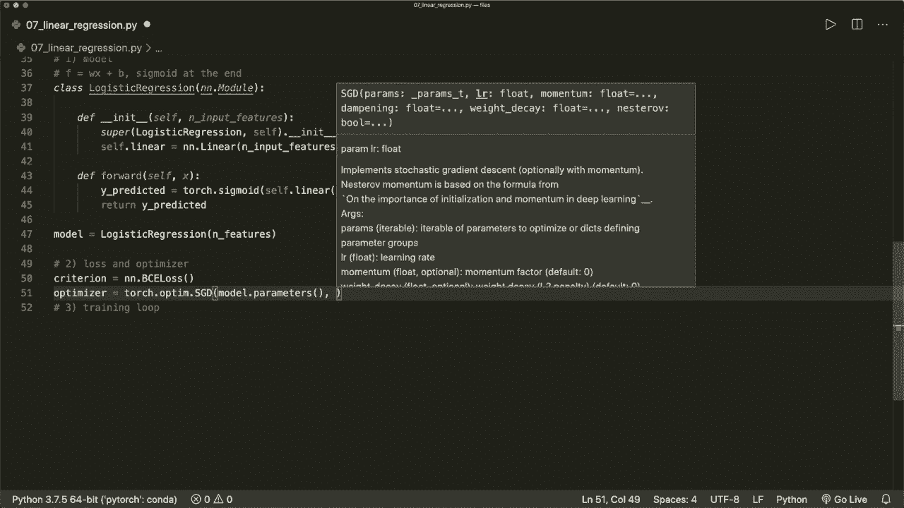

# PyTorch 极简实战教程！全程代码讲解，在实践中掌握深度学习&搭建全pipeline！＜实战教程系列＞ - P8：L8- 逻辑回归 - ShowMeAI - BV12m4y1S7ix

大家好，欢迎回到新的Pytorch教程。这次，我们实现逻辑回归。如果你看过之前的教程，那现在应该非常简单。再次，我们实现我们的典型Pytorch管道，包含这三个步骤。所以首先，我们建立我们的模型。我们定义输入和输出大小以及前向传播。

然后我们创建损失和优化器函数。然后我们进行实际的训练循环，包括前向传播、反向传播和权重更新。😊这里的代码应该与上一个教程中实现线性回归的代码非常相似。我们只需要对模型和损失函数进行稍微调整。

所以我们在模型中增加一层，并选择一个不同的损失函数来自Pytorch内置函数。首先，让我们导入一些我们需要的东西。我们导入torch，当然，还有torch点nn作为n。所以神经网络模块。然后我们导入Numpy来进行一些数据转换。然后从Sklearn。

我们导入数据集来加载一个二分类数据集。然后从Sklearn点预处理。我们想导入标准缩放器，因为我们想对特征进行缩放。然后从Sklearn点模型选择，我们导入训练测试拆分，因为我们希望对训练和测试数据进行分离。现在让我们进行我们的三个步骤。所以首先，我们想建立模型。

然后我们想建立损失和优化器。然后在第三步中，我们进行实际的训练循环。作为第0步。我们想准备数据。让我们这样做。让我们从Sklearn加载乳腺癌数据集，所以我们可以说B等于数据集点加载乳腺癌。这是一个二分类问题，我们可以根据输入特征预测癌症。

所以假设X和Y等于B点数据和B点目标。然后我们想说，哦，首先，让我们通过说这是来获取样本数量和特征数量。X点形状。

所以让我们先打印这个，打印样本数量和特征数量，看看我们的数据集长什么样。

我们看到我们有569个样本和30个不同的特征。这里有很多特征。现在让我们继续。当我们说X训练和X测试，以及X测试和Y训练和Y测试等于这里时，我们可以使用训练测试拆分函数，将X和Y放入其中。

我们想进行测试。大小。

为了达到20%。所以这是02。

让我们还给这个一个随机状态，等于，假设是1，2，3，4。

应该有一个小S。现在让我们转换。或者，首先。现在我们想要缩放我们的特征。Sc它们。在这里，我们设置一个标准的标量S C等于标准标量。这将使我们的特征具有零均值和单位方差。这在处理逻辑回归时总是推荐的。

现在我们对数据进行缩放，所以我们说x train等于sc dot fit transform。然后作为输入我们放入x train。接着我们希望对测试数据做同样的事情。所以我们说x test等于SC dot，这里我们只进行转换。嗯。我们在这里放入X test。现在。我们缩放了我们的数据。现在我们想把它转换为torch tenzoos。所以假设x train。

等于torch dot。这里我们可以使用nuy的函数。然后我们放入x train并将其转换为flow 32数据类型。所以我们说x train dot S。类型。Numpy dot float 32。因为现在，这的类型是double。然后我们会在以后的某些错误中遇到问题。所以我们将其转换为tenor。

现在让我们对所有其他数组执行此操作。所以假设x。

Test。等于。这。还有我们的Y train。还有，我们的y test tenzon。W test。现在，准备数据的最后一步是重塑我们的y。Tenzo。所以Y train等于Y train dot V。这是Pytorarch的内置函数，将根据给定的大小重塑我们的Tzo。所以它获取大小。Y train。

那个形状，0。

只有一个。所以现在，我们的y只有一行，我们希望把它变成列向量。所以我们希望将每个值放在一行中，只有一列。所以这将完全做到这一点。也适用于我们的y test。所以Y test等于这个y test。

现在，我们正在。

我认为我们已经完成了数据准备。所以现在让我们建立我们的模型。在这里，我们的模型是权重和偏差的线性组合。在逻辑回归的情况下，我们在最后应用一个sigmoid函数。所以让我们这样做。为此，我们想编写自己的类。所以我们称之为模型。

或者我们也可以称之为逻辑回归。Chatic。回归。这必须从N和dot模块派生。然后这将得到一个init。它有self。然后它获取输入的数量。特征。这里，首先，我们调用super init。所以我们说super。

逻辑回归和self dot init。

然后我们定义我们的层。所以我们只有一层self dot linear等于。这里我们可以使用内置的layer N N dot linear。这将获取输入大小。所以输入特征。而输出大小只有一个。所以我们只想在最后得到一个值，一个类别标签。

然后我们还必须在这里实现前向传播，其中包含self和数据。我们的前向传播首先是应用线性层，然后是sigmoid函数。所以这里我们说为什么预测它。等于torch.sitete。

所以这也是我们可以使用的构建和功能。这里我们应用线性层。将线性层与我们的数据X相结合，然后返回我们的y预测。

所以这是我们的模型。现在让我们创建这个。所以model等于大小的logistic regression。在这里我们输入我们拥有的特征数量。所以现在我们的层大小为30乘1。

而且。不好意思，30个输入特征和一个输出特征。

现在我们有了我们的模型。现在我们可以继续进行损失和优化器。因此，对于损失，损失函数现在与线性回归情况下不同。这里我们说criterion等于N.N.B.E loss。所以这里是二元交叉熵损失。我们的优化器是一样的。所以这可以是。嗯。这是torch.optim.SGD，用于随机梯度下降。

这获取一些我们想要优化的参数。所以这里我们只说model.dot parameters。同时也需要一个学习率。我们说。

学习率等于0.01。然后这里我们说LR等于学习率。这是步骤2，现在是步骤3。我们定义一些训练周期，等于，比如说100次迭代。现在我们进行训练循环。所以现在我们进行四个周期。在范围内的训练周期中。然后首先，我们进行前向传播和损失计算。

然后我们进行反向传播，然后进行更新。所以我们说y预测等于这里我们调用我们的模型，作为theta，它获取x训练。然后我们说loss等于criterion，这将获取y预测和实际y训练。所以训练样本或训练标签。

现在我们进行反向传播并计算梯度，再次。我们只需调用loss.dot.backward，Pytorch会为我们完成所有的计算。现在我们更新权重。所以这里我们只需说optimizer.dot.step。再一次，Pytorch会为我们完成所有的更新计算。

然后我们不，或者说，我们绝不能忘记再次清空我们的梯度，所以。想要设置梯度为 0。因为这里的反向函数将始终将所有梯度相加到 `dot_grad` 属性中。所以在下一次迭代之前，我们需要再次清空它们。我们只需说 `optimizer.zero_grad()`。然后，让我们也打印一些信息，如果 `epoch + 1 % 10 == 0`。

因此每十个步骤，我们想打印一些信息。让我们在这里使用一个格式化字符串。假设是 `epoch`。在这里我们可以使用 `epoch + 1`。然后我们还想查看损失。因此损失等于 `loss.item()`。让我们格式化为只打印四个小数位。好吧，现在我们完成了。这是我们的逻辑回归实现。

现在让我们评估我们的模型。因此，评估不应该是我们想要跟踪历史的计算图的一部分。我们想要使用 `torch.no_grad()`。

然后在这里进行评估。所以我想得到准确率。让我们从测试样本中获取所有预测类别。假设这是模型，并且在这里我们放入 `X_test`。

然后让我们将其转换为类别标签。所以 0 或 1。所以记住，这里的 sigmoid 函数将返回一个介于 0 和 1 之间的值。

而且，如果这个值大于 0.5，我们说这是类别 1。否则就是类别 0。所以假设 `y_predicted_classes = y_predicted.round()`。这里我们可以再次使用构建函数。这将正好做到这一点。如果我们不使用这个语句，那么这将是计算图的一部分。

它将为我们跟踪梯度计算。因此我们不想这样。我们不需要这样，因为我们已经完成了。这就是我们在这里使用 `with` 语句的原因。现在让我们通过 `act = y_predicted_classes` 计算准确率。在这里我们可以调用 `equal` 函数，等于 `y_test`，然后对其求和。因此我们想对其求和。

对于每个正确的预测，我们会加一。然后我们将其除以测试样本的数量。所以为什么使用 `test.shape[0]`。这将返回测试样本的数量，然后让我们打印我们的准确率。

准确率等于。嗯，`ac:.4f`，也只显示小数位。现在让我们运行这个，希望一切都是正确的。

而且，标准缩放器没有属性 transform。因此我这里有一个拼写错误。

转换。现在，让我们再运行一次。转换。再试一次。现在完成了，我们的准确率是089。所以还可以，挺好的，但不是完美的。你可能想要调整一下，比如迭代次数。我们在哪里设置的呢？

例如，周期数或学习率。或者也许在这里尝试不同的优化器。基本上，这就是我们如何实现逻辑回归。我希望你喜欢。如果喜欢，请订阅频道，我们下次见，再见。

