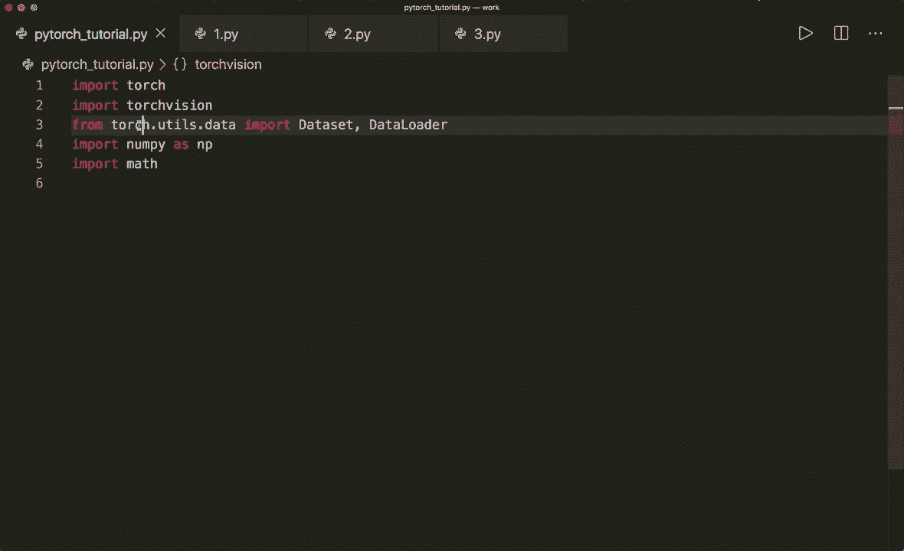
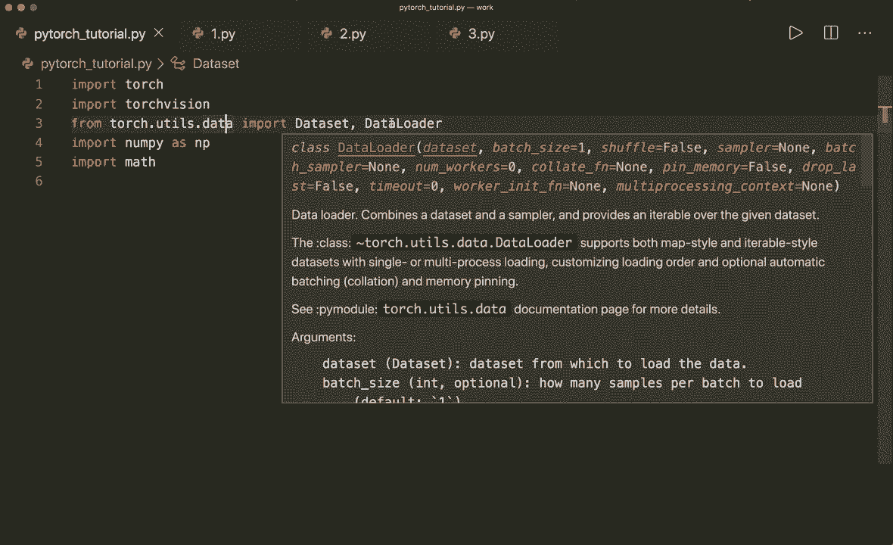
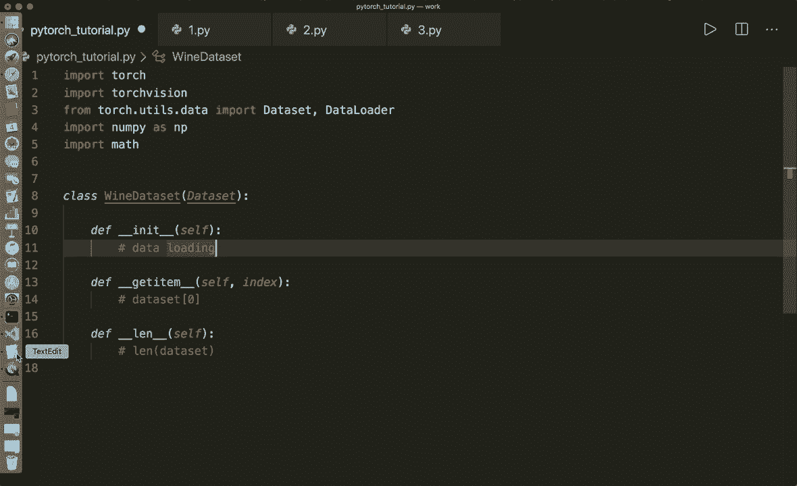
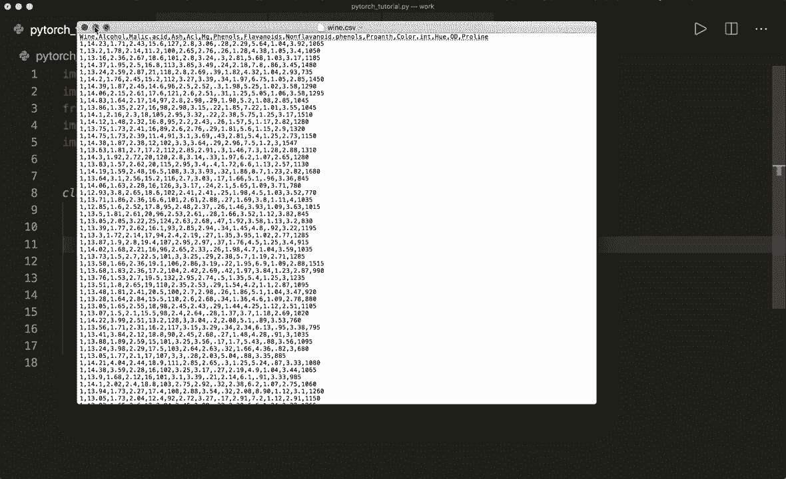
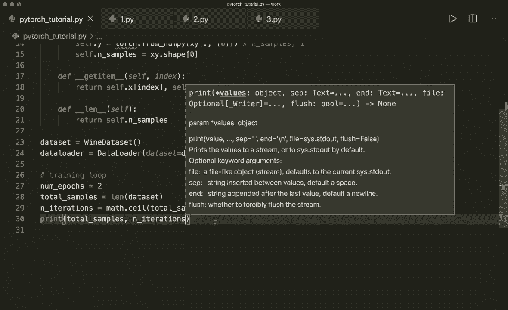
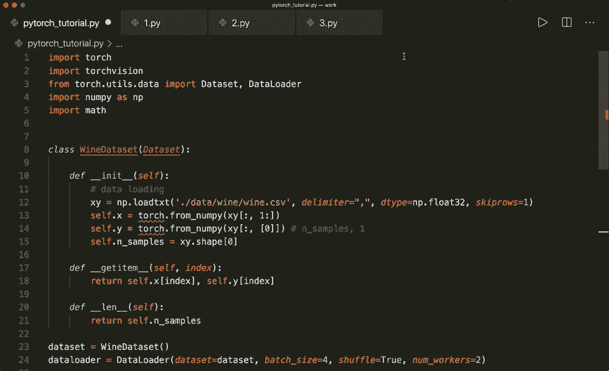

# PyTorch 极简实战教程！全程代码讲解，在实践中掌握深度学习&搭建全pipeline！＜实战教程系列＞ - P9：L9- 数据集和数据加载器 - 批量训练 

大家好，欢迎回到新的Pytorch教程。今天，我想向你展示Pytorch的数据和数据加载器类。到目前为止，我们的代码看起来是这样的，我们有一个以某种方式加载的数据集。例如，从一个CSV文件。然后我们有一个训练循环，循环遍历时代的数量，然后我们基于整个数据集优化我们的模型。

所以，如果我们在整个训练数据上进行梯度计算，这可能非常耗时。因此，对于大数据集，一个更好的方法是将样本划分为所谓的小批量。然后我们的训练循环看起来大致是这样的😊，我们再次循环遍历时代，然后再进行另一个循环，遍历所有批量。

然后我们获取x和y批量样本，并仅基于这些批量进行优化。所以现在如果我们使用Pytorch内置的数据集和数据加载器类，那么Pytorch可以为我们进行批量计算和迭代，因此使用起来非常简单。现在我想向你展示我们如何使用这些类，但在跳到代码之前。

让我们快速谈谈一些批量训练时的术语。所以首先，一个时代意味着对所有训练样本进行一次完整的前向和反向传递。而一个批量大小是指在一次前向和一次反向传递中的训练样本数量。迭代次数是指每次使用批量大小样本的传递次数。

所以这里我们有一个例子。如果我们有100个样本，而我们的批量大小是20。那么我们对于一个时代有5次迭代，因为100除以20等于5。所以是的，这就是我们应该知道的。现在让我们跳到代码。所以首先，我已经实现了一些我们需要的模块。所以torch，当然，还有torch vision。

然后从torch dot u导入数据。我们导入数据集和数据加载器。所以我刚刚提到的类。然后让我们也导入Ny和math。现在我们可以开始实现我们自己的自定义数据集。我们称这个为酒数据集。

这必须继承数据集。然后我们需要实现三件事情。我们需要实现初始化方法。并且使用self。在这里我们进行一些数据加载，例如。然后我们还必须实现双下划线get item方法，它接收self和一个索引。这将允许以后进行索引，因此我们可以用索引0调用数据集，例如。

然后我们还必须实现长度方法，它只有self。这将允许我们调用数据集的长度。那么现在让我们开始。在我们的案例中，我们想查看酒数据集。所以我这里有CSV文件，我也把它放在我的Github仓库中，你可以在这里查看。

数据集看起来是这样的。所以第一行是标题。在这里我们希望计算或预测葡萄酒类别。我们有三种不同的葡萄酒类别，1，2和3。类别标签在第一列。然后所有其他列都是特征。

所以让我们加载这个并将我们的列拆分为X和Y。因此在这里我们可以说X，Y等于Ny dot load T。X，T。

在这里我必须指定文件名。所以这是在数据文件夹中，然后我有一个葡萄酒文件夹。然后它叫做wine dot csv。接下来让我们给定一个分隔符，等于逗号，因为这是一个逗号分隔文件。接下来让我们也给它一个数据类型。因此我们假设数据类型等于nuy dot float64。然后让我们说跳过行等于一。因此我们希望跳过第一行。

因为这是我们的头部。现在让我们将整个数据集拆分为x和y。所以我们说self dot x等于。在这里我们可以使用切片。所以X，Y。我们希望获取所有样本。然后我们不想要第一列。所以我们希望从列号一开始，一直到最后。

这将给我们X。然后self dot y等于X，Y的。在这里我们再次希望获取所有样本，但只获取第一列。我们将其放入另一个数组中，以便我们有样本数量乘以一。这将使后面的某些计算更容易。嗯。所以，是的。

并且这也将其转换为一个十组。因此，我们可以说使用Numpy的torch dot，然后将其传递给我们这里的函数。所以torch dot来自Numpy。我们不需要这个，但我们可以做到。我们也可以稍后转换，但我们可以在这里直接做。那么我们来做这个吧。并且让我们也获取样本数量。所以我们假设self dot样本数量等于X。

Y dot shape。然后是0。因此第一维是样本数量。然后我们可以在这里返回。这是我们的整个长度函数。所以返回self dot样本数量。在这里我们也可以将其实现为一行。因此我们可以说返回self dot X的这个索引，然后self dot Y的这个索引。

所以这将返回一个元组。是的，现在我们完成了。这是我们刚刚实现的数据集。现在让我们创建这个数据集。所以我们假设数据集等于wine数据集。现在让我们看看这个数据集。因此现在我们可以说first data等于数据集。现在我们可以使用索引。

让我们看看第一个样本。现在让我们将其拆分为特征和标签。这个是第一数据。现在让我们打印特征并打印标签，以查看是否有效。是的，我们有一列特征或仅一行。因此这是一个行向量。然后是标签。因此在这种情况下标签是1。是的。

这就是我们获取数据集的方式。现在让我们看看如何使用数据加载器，所以我们可以说`data loader`等于内置的数据加载器类，然后传递。我们说数据集等于这个数据集。然后我们也可以给定批次大小。所以批次大小等于，假设在这种情况下为4。然后假设`shuffle`等于`true`，这对训练非常有用。这将对数据进行洗牌。

然后我们还说`nu workers`等于2。所以你不需要这样做，但这可能会使加载更快，因为现在使用了多个子进程。好的。现在让我们看看如何使用这个数据加载器对象。现在我们可以将其转换为迭代器。所以假设`data iter`等于`Iter data loader`。

然后我们可以调用`next`函数，所以我们可以说`data`等于`data iter`。`Dot next`。然后我们再次解包，称为`features`和`labels`等于`data`。现在让我们打印特征和标签，看看是否有效。好的。在这种情况下，我指定了批次大小为4。

这就是我们看到四个不同特征向量的原因。然后对于每个特征向量，类标签。所以在我们的标签向量或标签张量中有四个类标签。现在我们也可以遍历整个数据加载器，而不仅仅是获取下一个项目。现在让我们进行一个虚拟训练循环。假设一些超参数。假设`nu epochs`。

假设`epoch`等于2。然后我们获取总样本数量。总样本等于我们的数据集的L。现在让我们获取一个`epoch`中的迭代次数。这是总样本数除以批次大小，除以4。然后我们还需要进行取整。所以用`math seal`。嗯。现在让我们打印总样本和迭代次数。

然后我们看到有178个样本和45次迭代。所以现在让我们开始循环。假设对于`epoch`在范围内的epoch数量。现在我们进行第二个循环，遍历训练加载器。假设对于`I`。在这里我们可以通过说`inputs`和`labels`在`enumerate`中解包。

数据加载器。这就是我们需要做的所有事情。现在，这个`enumerate`函数将给我们索引，然后是`inputs`和已经解包的`labels`。在训练中，我们通常应该进行前向和反向传播，然后更新权重。这只是一个虚拟示例。在这种情况下，我只想打印一些关于我们这里的批次的信息。

假设如果`I + 1`模5等于0。那么每第五步，我们想打印一些信息。打印`epoch`。在这里，让我们打印当前的`epoch`。然后所有的`epoch`，假设`nu epochs`。然后我们也打印当前步骤。步骤为`I + 1`。然后是总步骤，这就是迭代次数。

然后我们也打印一些关于输入的信息。所以输入。假设我们想只打印 `input.shape`。好的，现在让我们运行一下，看看它是否正常工作。是的，我们在这里看到了打印语句。我们看到我们有两个轮次，每个轮次有 45 步，每第五步我们打印一些信息。

我们还看到我们的 Tensor 是 4 x 13。所以我们的批量大小是 4，每个批次有 30 个不同的特征。好的，这就是我们如何使用数据集和数据加载器类。然后我们可以非常轻松地获取一个单独的批次。单个批次。嗯，这样。当然。

Pytorch 还内置了一些数据集。因此，例如，从 `torchvision.datasets.AMNIST`，我们可以获取著名的 MNIST 数据集。我们还可以获取 Fashion MNIST 数据集或 CIFAR 数据集，甚至是 COCO 数据集。是的，这个数据集是我们在接下来的教程中会使用的。现在。

这就是我想向你展示的数据和数据加载器类。我希望你喜欢它，请订阅频道，下次见，再见！
