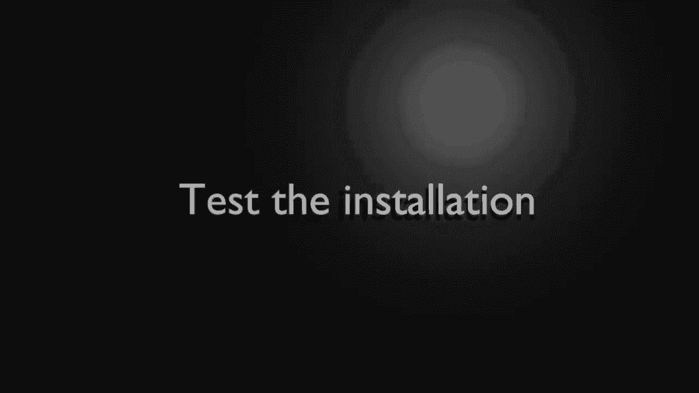

# Python 3全系列基础教程，P1：1）Python介绍和设置 

大家好，我的名字是Brian，我们要学习Python 3。这个视频系列面向完全的初学者。所以如果你没有任何编程经验，这就是你需要观看的内容。现在，我们将在这个特定的视频中介绍如何安装、配置和测试Python 3。我会尽量每周做一个视频。所以一定要经常回来查看，因为我会尽快更新这个系列。

😊，让我们开始吧。好的，第一步非常简单。检查Python是否已经安装。现在，你可以并且可能应该使用你的操作系统文档来确认是否已安装，但一个非常快速的方法是打开命令行。你不知道如何打开命令行，我强烈建议你去谷歌搜索一下如何打开命令行。

这并不难，一旦你到了这个步骤，输入类似这样的内容。Aan。3。如果你看到这里有“Python”，然后是某个版本，那就已经安装好了，可以跳过下一步。然而，如果你没有看到这个，如果出现命令未找到或未知命令的提示。

然后你需要跟随下一步，实际上安装Python。特别说明，很多文档会提到输入“Python”这个词。这是Python的旧版本，这是Python 2。

看到这里，完成Python 2，我们将使用Python 3。

好吧，假设你打开了命令行并尝试Python 3，但得到了一个“命令未找到”或“未知命令”的提示。你需要安装它，去Python.org然后进入下载页面。

从这里你可以选择所有版本，或者进入你特定的操作系统。我们将去所有版本，它会尝试自动检测你正在做的事情。然而，你可能需要选择你的操作系统。你们中的大多数人可能都会使用Windows，所以我将直接点击Windows。

然后点击Python 3版本的最新一个，注意这是Python 3，而不是Python 2。然后向下滚动。他们把这些混在一起了。你会注意到，你猜对了，有一个tar包，适用于Mac。然后还有适用于Windows的内容，Windows有大多数选项，这就是为什么会有点混乱。

说实话，我会选择这个。Windows X 86 64可执行安装程序。这将是一个离线安装程序，应该包含运行所需的所有内容。你将下载这个可执行文件并运行它。你可能会被提示以管理员身份运行，并且在安装完成后可能需要重新启动计算机。

你绝对需要回去仔细检查。你应该能够打开命令行并输入Python 3。如果你无法到达这一步，你可能需要去谷歌查找你的特定错误信息，以弄清楚发生了什么。

现在Python已安装和配置好，我们可以打开命令行并输入Python 3。我们需要测试这个东西，确保它确实按照我们预期的方式工作。首先，我会把这个拖上来，以占据屏幕的其余部分。我们在一个叫做交互式Shell或交互模式的环境中。

我们不会太多地使用这个，因为，嗯，这有点繁琐。如果你拼写错误，几乎不可能回去修正它。所以我们将使用一个IDE。不过现在我们只是测试，我希望你做一些类似的事情，比如说。X等于5乘以3。现在我们要输入单词print。然后，假设X。注意这在括号里。

所以我们稍后会介绍所有这些，现在我们只是简单的测试。你应该在屏幕上看到15。坦率地说，输入Python 3并查看版本才是真正的测试，这是否有效。然而，我想给你展示如果你想的话，有一个交互模式。不过，再次提醒。

回去编辑配置真的很困难，你会犯错误。所以我们根本不打算使用这个。我们将使用IDE或集成开发环境。我们将在下一步中介绍它。

说到集成开发环境，实际上有很多很多。如果你在谷歌上输入Python IDE，你将会得到很多。

数以百万计的结果，因为字面上有成千上万的ID。坦率地说，你不需要任何花哨的东西，你可以使用一个简单的文本编辑器。真的。IDE实际上就是一个非常花哨的文本编辑器，具有很多额外功能。你可能会发现很多文档说IDLE直接与Python一起提供，但这已不再准确。

你必须单独安装它。个人而言，我不喜欢它。我觉得它不是最好的，Pycharm是另一个不错的选择。但我们将使用一个叫做Visual Studio Code的工具。我知道很多人并不是微软的粉丝。

你不必强迫自己使用这个，虽然这是我将用于这一系列的工具，而我可能会在过程中随意更改ID，具体取决于我想编写的代码，因为Python让这变得非常简单。

我使用Visual Studio Code的原因是，它非常简单，直接，这就是它的样子。

所以我在这里要做的就是添加一个文件夹。

我将进入Python 3。关闭这个。现在我需要添加一些扩展。这就是我喜欢Visual Studio Code的原因。你可以扩展它以支持几乎任何语言。所以我将说Python。你会看到，很多，我是说，非常多。我可以永远向下滚动，几乎到无穷无尽的地步。

有很多扩展，但它很出色地将最佳扩展放在最上面。你可以看到这个家伙。从微软，2600万次观看，5星评级，你只需简单地去。好的，你真的需要它吗？这是个好问题。因为你可能会花几个小时去安装这些扩展，却不知道自己真正需要什么。

所以我们将稍作绕行。回到这里。这只是我们打开的文件夹。我将说新文件。我们称之为test.py。它会自动为我们推荐扩展。Python文件以.py结尾。所以它检测到这个扩展并说，嘿。你想使用推荐的扩展吗？

所以我想说，为什么不呢？它将自动去安装它们。并且会显示已安装。并且在全局使用，搞定了。我们甚至可以点击这个小齿轮图标来玩一下。如果我们真的想的话。让我们回到文件，或者我们可以在这里使用，取决于你想怎么去。现在这是我对Visual Studio Code唯一的真实批评，它确实会稍微混乱UI。

所以偶尔你会看到我关闭一些东西。我将开始使用这个家伙。好的，来总结一下这个视频。我们将创建一个叫做hello world的程序。这是你在任何编程语言中都会制作的第一款应用程序，实际上是程序员的入门仪式。它非常简单，只是在屏幕上打印出“hello world”这几个字。

这就是我们如果没有完全配置时会遇到一些障碍的地方。所以在你面前应该是我们迄今为止所做的一切，你应该有你的IDE，无论你使用的是什么，即使只是一个简单的文本编辑器。你应该有一个名为test.pyy的空白文件，文件名并不重要。最后但同样重要的是。

你应该能看到Python解释器。我有Python 3.6.9。如果你想，可以切换到不同的版本，只需注意你可以使用不同的版本。我将输入单词print。然后我们给它加上括号。括号里的任何内容，它都会尝试打印出来。现在用Python。

你可以使用双引号或单引号。我有使用双引号的习惯，但实际上选择哪个都无所谓。然后输入单词“hello”和“world”。点击保存。现在你应该有一个小图标，上面写着在终端中运行 Python 文件。如果没有，你可以在这里找到几个选项。

开始调试和在不调试的情况下运行。如果你是新手，立刻就会觉得这些意思不明。调试听起来真的很糟糕。那么这到底是什么意思呢？调试是编程中的一种特殊模式，如果你的代码中有错误或故障，它会引导你解决问题，或者更确切地说，会指出它们，以便你可以修复。

通常，我会在不调试的情况下运行，因为这样会快一些。你应该在屏幕上看到类似于“Hello world”的内容。所有这些看起来都很糟糕，但实际上发生的事情是你有 Python 3 的安装路径，然后你猜到了它在后台所做的一切。

它在调用这个启动器，并且说运行这个脚本。最终结果就是这样。现在，因为我不是“Hello World”的忠实粉丝，因为它太过简单，所以我们实际上。要去掉它。我们想回到之前做的事。交互式 shell。在那里我们要说 x 等于 5 乘以 3。我们正在创建一个变量，接下来我们将在下一个视频中讨论变量。

但我们现在要做的就是简单地打印出来。保存这个，然后我将继续运行。

你可以看到，这里有 15。
