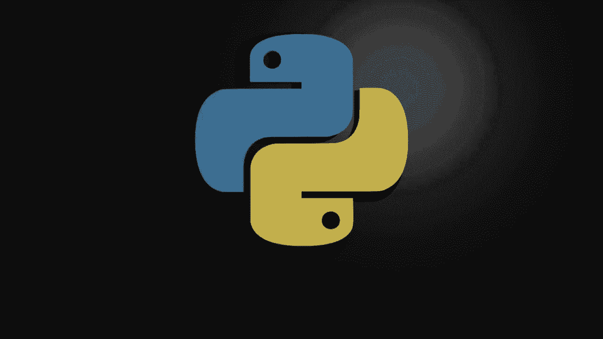
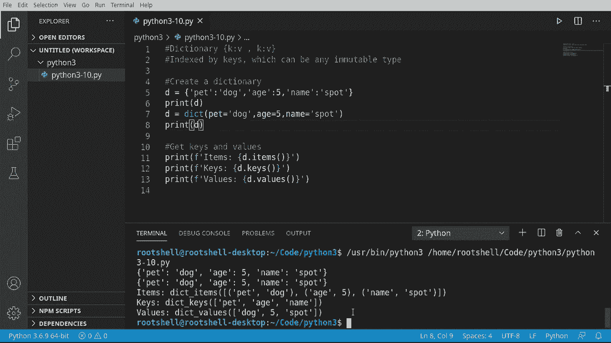
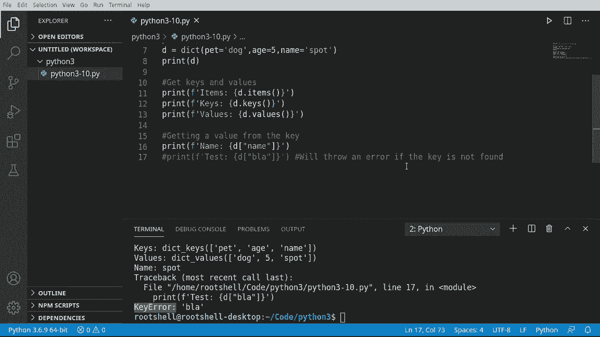
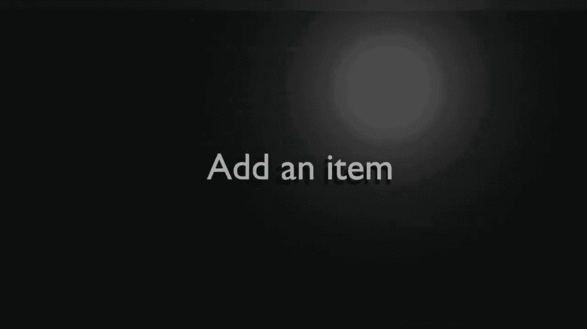
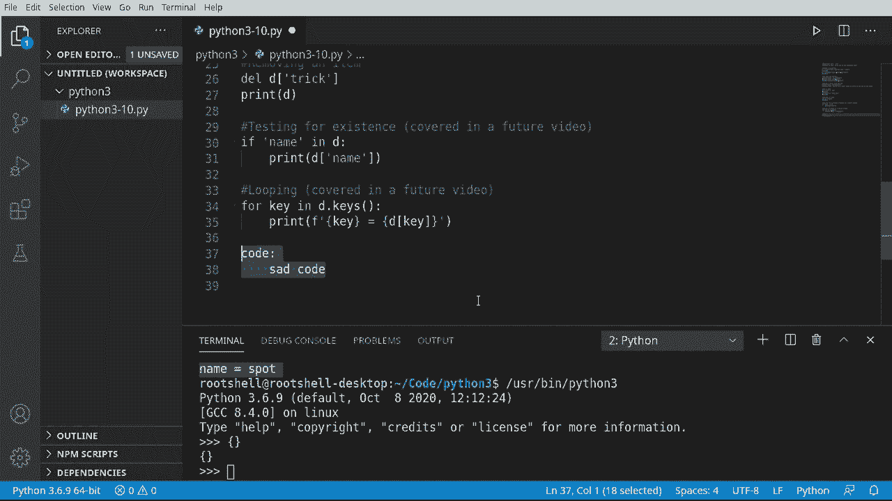

# Python 3全系列基础教程，P10：10）Python字典：键值对与索引 

大家好，我是布赖恩。在这个视频中，我们将讨论 Python 3 中的字典。那么什么是字典呢？它是一个键值对，更确切地说，它是一个由键索引的列表。如果你想更具体一点。你注意到括号了吗？这实际上是一个由键索引的集合。

😊，这可以是任何不可变类型，这意味着任何不可变类型意味着不可更改？

所以让我们来看看，创建和使用字典需要什么。让我们看看实际创建字典需要什么。我们将用两种不同的方法来完成这个。我们将用困难的方法和简单的方法。首先，我们先用困难的方法。我必须说 D 等于。我们有了我们的括号。

我们需要一个键值对。所以让我们创建这个键。它将是字符串 pet。Polen。现在我们需要一个值。我们说，狗。就这样。这就是所有内容。现在，如果我们想再创建一个，我们只需用逗号分开。现在我们需要一个键。我们称这个为 age。B 将是五。让我们再创建一个。

我们称它为 name。它的值将是 spot。我总是很难为宠物取名。然后将字典完整打印出来。看，这就是它。宠物狗，年龄 5，名字 spot。现在，让我们用简单的方法来做。我将说 D 等于，我们将调用 diic 函数。兔子名字。在课堂上大声说出来，看看大家的反应。

但我们将说 pet 等于。狗。年龄等于。5，名字 spot。所以这里真正发生的事情是它为你做了所有这些格式化。这就是我称之为简单的方法。最终结果。然而，完全相同。它们是完全相同的，无论你以哪种方式创建它。

只要知道，你必须有一个键值对，例如，pet dog H5 name spot。让我们看看键和值，以及我们如何获取它们。实际上还有第三种类型，它叫 items。我们将首先处理这个。所以我们将说 print。然后我们调用 F。Items。我们将调用字典的 It 函数。保存并运行。

这将返回一个 di underscore items，正如你所猜的那样。看看这个东西。这太疯狂了。所以我们有一个包含元组的列表。但它真正做的是将其打包成单独的项目，以便你可以非常清楚地看到键值对。对我们来说并不是非常有用，我们真正关心的是，嗯，键和项目。

那么我们来快速查看一下。我只想说keys和values，我之前提到过items。好吧，我们想查看键和值。保存并运行，瞧，我们返回三种不同的东西，di_underscore_items，di_underscore_keys，di_underscore_values。但我们得到的是这个字典中所有的信息，正好在这三个函数中。

看一下项目返回的内容几乎是所有打包好的信息，关键是。这将告诉我们可用的键，因为要记住，所有内容都是键值对。所以当我们查找某个内容时，我们不能按索引查找，而是必须通过键查找。这就是这些键存在的原因。你可以轻易将这些键设为整数或其他类型的数字。

但我们已经将其作为字符串处理。我们还可以获得值dogg5和spot。没有键的话，这些值几乎没有用。所以在接下来的部分中。我们将看看如何实际获取这些值。

让我们看看如何从一个键获取一个值，因为这些是键值对。之所以称之为键，是因为它解锁了值的大门，让我们看看我的意思。因此我想格式化这个，我要说。Name，让我们将其大写。然后我们要说D，你倾向于这样做，D0。让我们在键错误中运行这个。

这是什么意思，键错误，它意味着未找到该键。我们没有名为0的键。然而，我们有一个名为name的键，还有一个名为PE和age的键。所以你必须使用键来获取值。让我们演示一下。看，名字是spot。现在，你会注意到我有不同的引号，我有单引号和双引号。

这里有一个非常有趣的问题，如果我们在单引号内再使用单引号。坏事很快就会发生，我们会得到一个无效的语法错误。你会想，现在等一下。应该将这些括号中的内容视为一个独立的实体，但实际上并不是，因此你确实有。我们在之前的视频中讨论过的引号问题。

好吧，现在我们对这一点有了初步了解。让我们深入研究一下键错误。我们称之为测试。假设blah是一个我们知道不存在的键。实际上，这里的情况是它正在查找任何该值的键。

如果找不到它，会抛出键错误。在这一切的最后，我们将向你展示一个使用一些简单逻辑的小技巧，我们还没有讨论过，以解决这个问题，确定键是否存在。但现在，请知道你必须拥有该键，否则它会抛出错误。所以请记下这一点，如果未找到键，我们会抛出一个错误。

让我们看看将项目添加到字典中有多难。其实并不难。这简单得可笑。你只需这样做。就这么简单。你只需说字典，然后一个未使用的键等于一个值，它会自动添加。这真的很酷。现在，你应该注意，我们只是复制并粘贴这个。

如果键已经存在会发生什么？所以我们在这里添加。那么，接下来会发生什么呢？让我们运行一下看看。它只是简单地改变了。这就是我所说的键是不可变的。我们不能改变这个键。我们可以删除它然后重新添加。但一旦这个键在这里，我们能做的只是更新值或删除它。键本身无法改变。

让我们看看移除项目需要什么。我们老朋友，删除语句。所以我们要删除。你猜对了，那个技巧。现在这就是我所说的键值对，当我们运行它时。如果我们删除一个键，那个键关联的值也会被移除。你在这里看到。技巧滚动。

我们已经删除了它，现在它就简单地消失了。它不在里面。这很简单。但要理解的是，一旦你删除了键，值就消失了。然而，如果你试图删除值，键会存在，但你会得到一个空值。这可能会导致一些问题，这是一个更复杂的话题，我们将在未来的视频中讨论，我只是希望你注意到这一点。

我收到了很多关于这个视频系列的好评，有人说，嘿，伙计，你的速度有点慢。我意识到这些是给初学者的，但我现在想要更多。所以我们将给你一个即将到来的小预览。我们将测试存在性，并做一些叫做循环的事情。

这两者可能对新手程序员来说有点挑战，但如果你是经验丰富的程序员，现在只想学习一下。让我们过一下，先搞定它。所以我们说，如果，这就是基本逻辑。我说，名称。在。李可文。然后按回车。我们在这里做的是一个if语句，这是一种逻辑。如果。

这个键在字典中做某事。现在，Python有这个小家伙，在最后有一个冒号，表示嘿，这不是语句的结束。还要期待更多。然后你必须有。它可以是空格或制表符。其实没关系，但必须是相同的数量。如果你来自其他语言，你可能会期待这样的东西。你可能会想。

为什么需要制表符？嗯，如果你考虑一下，你的代码。是的。如果你去掉制表符，效果就是这样，所以这很合理。但很多初学Python的人无法理解制表符或空白，这让他们很沮丧。

所以。这就是我之前说的，我们要测试这个键是否存在，然后再尝试访问它。如果这个键不在字典中，就会抛出一个键错误，但我们是说如果。所以，只有当这个键在字典中存在时，我们才会运行这段代码。我们会在未来的视频中更详细地讨论这些内容，但我已经听到很多人说嘿。

他们现在想要更多，所以有一个，现在让我们来讨论循环。这是另一个让人感到困惑的事情，尤其是在新手阶段，因为他们是新手。他们不理解这些东西。没有人向他们解释过。什么是循环呢。你小时候有没有遇到麻烦，你的妈妈或爸爸说。

你知道，继续这样做，直到我告诉你停止，这基本上就是你在告诉计算机做的事情。你会说四。K。在这些。这可能会让完全新手感到困惑。再次强调，你必须有那个空白。我们接下来打印。让我们格式化一下。接下来我会解释这个。但此刻。

你要在这里和我一起大胆尝试。所以我们得到了我们的键。然后我们会说字典，然后是具体的键。如果你是新手，这看起来很糟糕。但让我们运行它，确实有效。所以它在说。狗狗，H 5名字spot。这就是我们正在做的事情。那么这里发生了什么呢？我们在说对于每个键。

那个“in”关键字又出现了，字典的键，记得我们在这里提到过。对于字典中的每个键，打印出该键及其相关的字典值。再次提醒，你必须有那个制表符。我们将在未来的视频中涵盖循环，但这是因为人们一直在说我们想要更多，现在就想要更多。所以，如果你对这两个内容感到困惑。

不用担心，我会制作一个未来的视频来深入探讨这些内容，我们会讨论它们，我确实是说深入探讨。但如果你是一个有经验的程序员，这样做非常简单。如果你在理解这些制表符时遇到困难，只需想象成这样。你有一些代码。然后，通常你会做这样的事情。

Python在这里试图帮助我，但你会有类似的代码，把它替换成那个。当然，你这里会有一些。糟糕的代码，我知道。假设这里是糟糕的代码。但然后你将这些去掉，它就变成了那样。这就是为什么Python比其他语言更简洁，相较于像Java这样的语言。

Javascript，因为它将所有特殊字符移除了。
