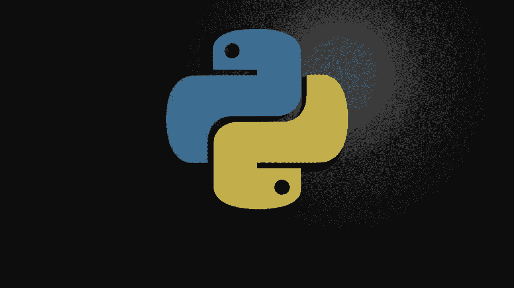
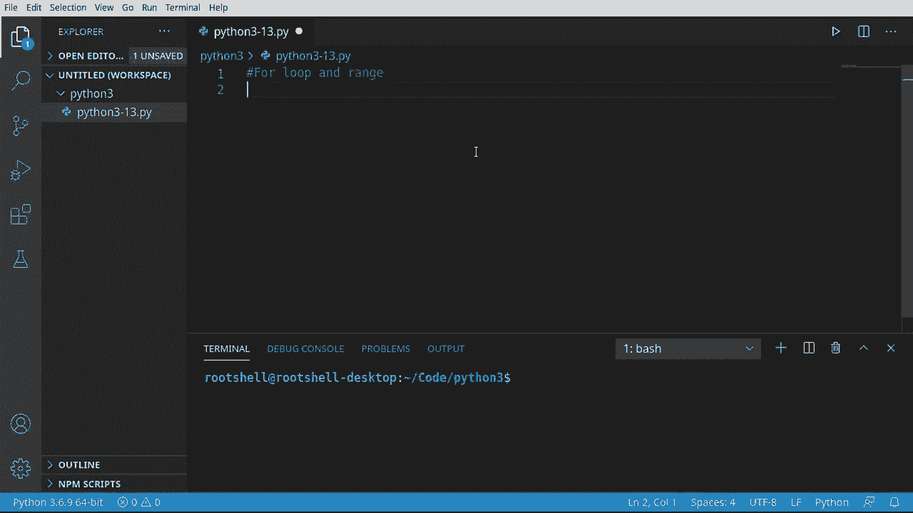
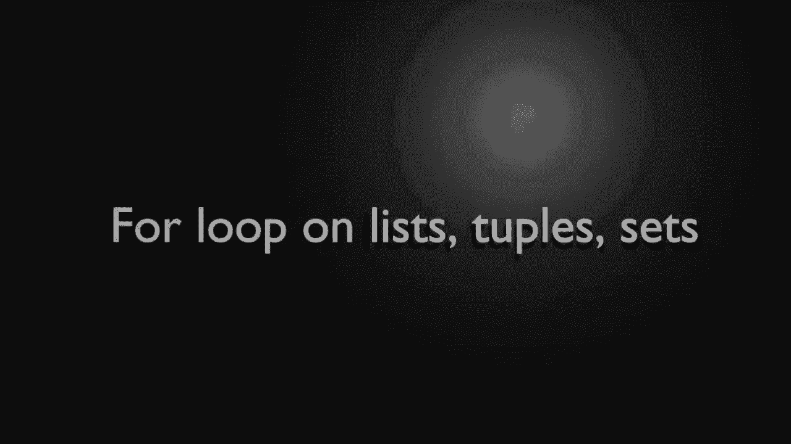
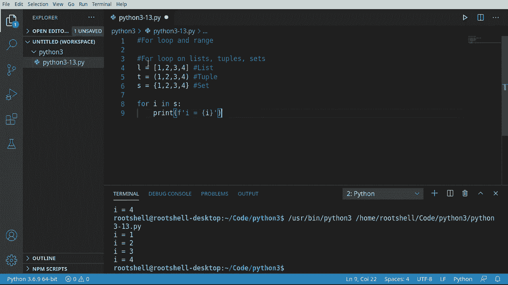
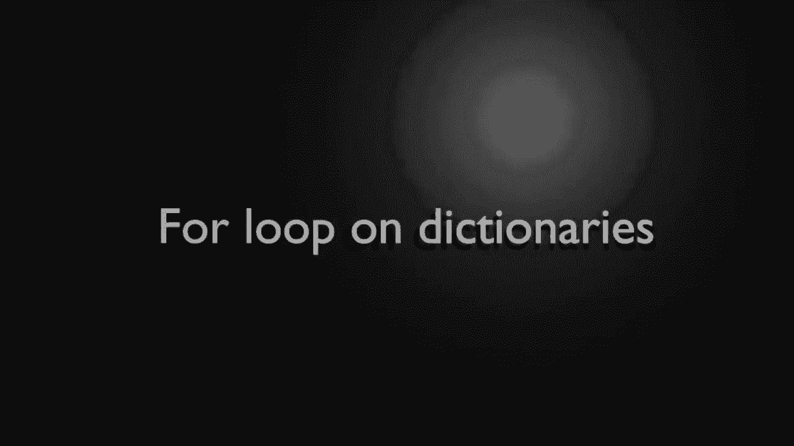
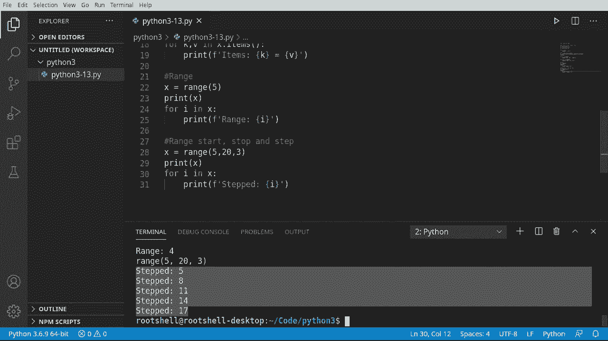

# Python 3全系列基础教程，P13：13）Python流控制：For 循环 

欢迎大家回来，我是布莱恩。这段视频我们将讨论for循环和range函数。与之前视频中讨论的while循环相比，for循环有一个开始和一个结束，而range函数帮助我们创建这个开始和结束。

真的帮助我们避免了无限循环的麻烦。让我们深入研究，看看。

好的，第一件事，Spts，让我们先看看列表、元组和集合上的for循环。这是非常简单的。我将创建一个简单的列表。我们将说4 I in。注意我们在这里做的是什么。我们说4，然后创建一个变量。这个变量叫I。你可以把它命名为X、Z、zebra。

随便你想命名它。我将说4 I in。现在我们必须给它某种容器。我们说x。然后是冒号。这个读取起来就像while循环，但我们现在是在语句本身中创建变量。现在我们可以简单地说print。我们假设，ae。

我们将打印出I的值。继续，运行这个。你会看到1，2，3，4，然后它停止。我们不需要告诉它要中断、返回或执行其他任何操作。我们也不需要增加某种计数器。它是在底层根据你猜测的这个列表的长度自动完成的。所以它在处理这个可迭代的容器。

每一个现在都是一个独立的变量。我们将独立处理它。你可以非常快速地做到这一点，并且可以在不同类型的对象之间进行操作。例如，想想我可能多做了一个。我们将说列表、元组和集合。我们将说这是L。这是T。

这是X，所以我们有各种不同的东西。让我们实际来看。这其中有个小细节，你必须把它放在正确的风格括号里，这里是圆括号。而集合有点奇怪，像个波浪形。这样就好了。我们可以直接切换。我要用列表。效果如预期。让我们把这个切换到元组。

效果如预期。我知道你可能已经在翻白眼了。我们知道集合会正常工作，而它确实如此。一切都如宣传的那样工作。这使得遍历一个容器变得极其简单。

让我们看看关于字典的for循环。我们将以不同的方式对待这个。所以我要创建一个字典。我会说Dickt，让我们开始构建它。Brian。我会说我的年龄是46。说Tamy。别告诉她我把这放进视频里。她会非常生气。

但她48岁。然后Heather，我们就说Heather是28。Chris。我们就说Chris是30，如果我们真的想的话可以添加更多。所以我们有了这个漂亮的字典。赶紧打印出来，以便我们看看它是什么样子。它为我们创建了一个字典。现在，我们将与这个循环进行处理。

当我说循环时，有几种不同的方法可以做到这一点。第一种方法。我们要说4K。在X.dot E。这里要小心一点，如果你忘了。把它当作函数来调用。我们还没有真正覆盖函数。但相信我。如果你只是这样做，你会很痛苦。

而且让我们实际看看它失败，以证明它确实会失败。然后我们会说他。好吧。等于，然后我们稍后再填写这个。但让我们先看看这个东西失败。看，内置函数或方法对象是不可迭代的。这里发生了什么？这在简单英语中是什么意思，内置函数或方法。好吧。

我们还没有真正覆盖这些，但基本上这是我们可以调用的一段代码，要做到这一点。你需要这些括号。所以如果你忘记了这些，你会很痛苦。而且它说对象是不可迭代的。这是什么意思呢，嗯。它需要某种类型的容器，例如，列表、元组、集合或字典。

所以仅仅通过说，嘿，使用那些参数，它现在会返回某种可迭代的数据，我们可以遍历并使用。好的。让我们继续。我们要说x。我们想要获取那个特定的键。我假设你看过之前的视频，但以防你跳过了它们。

让我们稍微慢下来。首先，我们需要修复我们的小错误。所以这里发生了什么是我们在创建我们的字典，字典只是一个键值对。键值，键值，键值，你可以在这里看到字典创建的那些键值对。现在，我们要说对于我们字典的每个键。

它会返回某种列表，我们要说对于其中的每一个。获取这些值。我们说x。所以实际上我们在这里说的是，X是一个字典。K是键。所以我们说对于任何键，例如，如果是Tammy。它会说打印出Tammy，因为那是键，然后打印出。这里的实际值。

就是那样。所以每个键将与一个值相关联。我想强调的就是这个。也许我解释得不太好。所以键。然后你有你的键值，键值，键值。还有另一种方法。我想提到这个，简单是因为你会看到人们以两种方式做。

所以我们将说对于Kma B。这会让你大吃一惊。如果你来自另一种语言。我们将这里有两个不同的变量。键和值。我们想把它换成项，再次。我们在调用一个函数，所以如果忘记括号，就会出问题。

我们会有一个糟糕的时光。因为我们现在正在提取或解包这些。我们不需要再做这小部分。我们可以简单地用我们的变量替换掉它。那么项的作用是，它实际上提取每个键值对并返回它。所以现在它可以解包键和值。你有两个不同的变量。

在这里看到实际效果。让我们保存并运行。实际上，让我们。所有这些项。以免与键混淆。果然，项。并且它正确地解包了。布莱恩46，塔米48，希瑟28，克里斯30。那么哪种方式更好？这取决于你想做什么。就我个人而言，我倾向于这样做，这样我就不需要乱搞。

在这些小括号中记住每个作用。每种方式都完全可以。让我们谈谈范围，我们已经简单提到过，但现在真正看看范围。我们来快速回顾一下。我们说x等于，并且我们想要一个范围。5。如果我们打印出来，这里你会很快感到困惑。

所以让我们运行这个。我们的x就在这里，范围0到5。等，什么？

你觉得这会返回一个列表或类似的东西。实际上它会返回一个函数调用，所以范围是0到5。这0到5是什么？它从哪里来，我们说了5。好吧，我们将在下一个小节中看看。但只需理解我们真正的做法是说X实际上等于对那个函数的调用。

我们将在其他视频中深入讨论函数。这实际上是一个大主题。所以我们会将其拆分为多个视频，但只需理解这里发生了什么。你实际上并没有得到某种可迭代的容器可以遍历。但是我们现在可以这样做。或者我和X。

注意我没有这些括号。因为我们不是直接调用一个函数，而是调用一个变量。你试着这样做，会遇到非常糟糕的情况。只需理解这两者之间的区别。然后从这里开始，它变得非常简单。这就是我喜欢Python的原因。

一切都变得非常简单明了。我几乎都不好意思谈论它。因为对我来说，作为一个老程序员，这似乎只是常识。好了，range 从0到4。那么这里发生的事情是，它在说对于 I。因此我们正在创建一个变量 x，而这个变量实际上指向一个函数。

所以它正在进行这个函数调用并获取那个值，然后它遍历每一个项目。现在，如果最后那一点让你感到困惑，请系好安全带，范围这里可能会变得有点复杂。所以我们有一个开始，一个停止和一个步长。这实际上意味着什么，让我们来做这个。假设 x 等于 range。我暂时就先停在这里，以便我们可以阅读并了解发生了什么。

我们有一个停止点。所以这是默认设置。但调用这个的方式有很多种。你可以设置一个开始点，这意味着你将要开始的数字，还有一个停止点，意味着你将要停止的数字。还有一个步长，意味着在这两个数字之间你想跳过多少个数字。

让我们看看这个，看看它在内部到底是什么样的。所以假设我们想从5开始。当我们到达20时停止，并且我们想每次跳过三个数字。好吧，pop quiz。这个看起来会是什么样子？让我们打印出来。如果你认为它会显示 range 5，23。

你绝对是对的，因为现在开始理解这里的内容是，它指向的是一个函数，而不是某种值。但我们现在可以使用它，因为我们已经将其分配给一个名为 X 的变量。继续说4 I 在 X 中。记住，我们是在调用一个变量，而不是一个函数。继续打印。好吧，额外一轮。谁知道这会打印出什么，让我们看看。从5开始。

然后它会跳到8、11、14、17，并且在20处停止。注意它并没有输出20。如果我们设定为21。让我们看看会发生什么。现在，突然间，它包括了这个。所以这里的主要结论是，它不会包括那个停止点。它会在到达那里时停止。记住，在内部，这使用的是某种循环。它可能说的是我们之前见过的，比如这样一个 while。

然后在小于20的情况下。因此，当它达到20时，它将跳出那个循环并停止。一旦你理解了这个工作原理，生活就变得异常简单。像这样的事情在其他语言中可能需要一点数学。但是，Iython 和往常一样，让它变得简单易懂。

