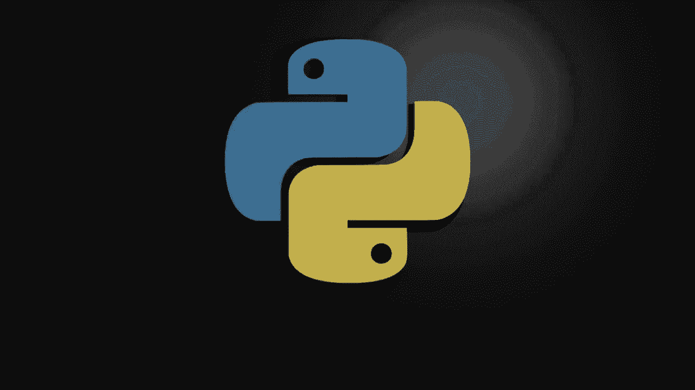
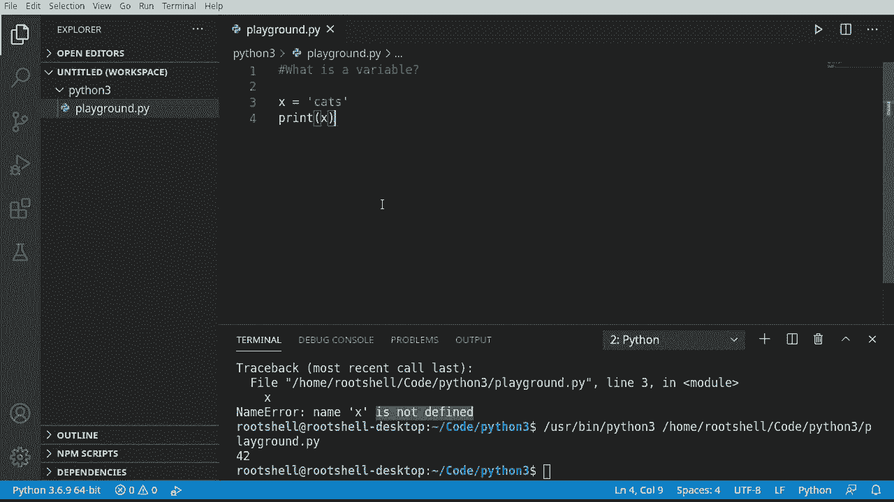
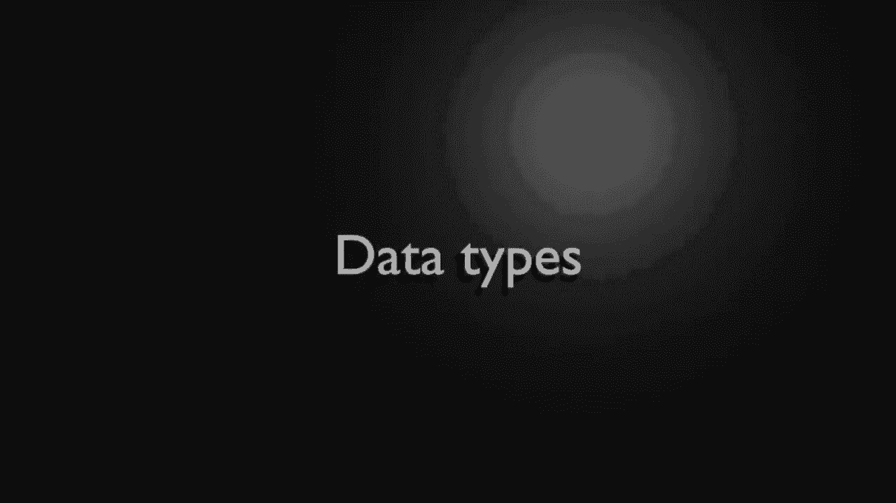
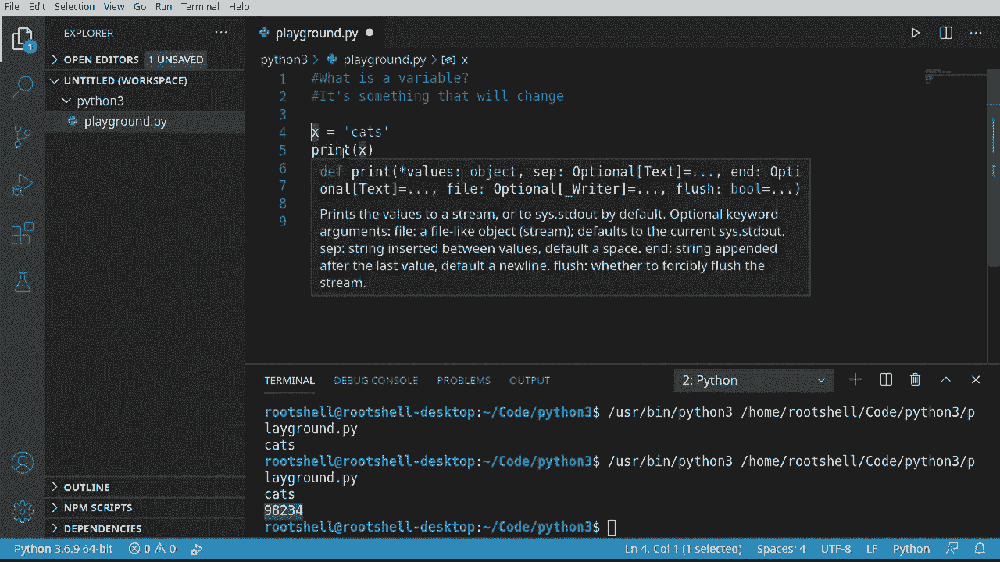

# Python 3全系列基础教程，P2：2）Python变量 

欢迎回来，我叫布莱恩，我们将继续讨论Python 3。无论你使用哪个IDE，请创建一个新文件并给它起个名字。我会把它命名为playground，名字并不重要，你只需要一个可以玩的文件。记住，这些视频假设你没有经验，所以我们实际上是从一个空白的状态开始。

你将学习的第一件事是变量是什么，我将在这里写下来。好吧，变量只是一些会变化的东西，例如，如果我声明一个名为X的变量。我必须给它分配某种值。试着打印X，看看会发生什么。注意，它会出现某种错误，它会说名称错误，名称X未定义。

这是什么意思？好吧，显然，我们定义了它。就在这里。实际上，Python想告诉你的是它并没有任何值。所以我会说，42。现在我们重新运行一下。突然之间它显示42。所以如果你得到的是未定义的，那么你实际上是在说你没有设置那个值。

你注意到这是一个数字。这就是我所说的变量是会变化的东西。我很容易就可以说，Hats。注意cats是一个字符串。字符串只是一系列字符，但我想强调的是它不是一个数字。如果我们运行这个。

它工作得很好。

所以在后台，你在这里看到的是Python知道它足够聪明，知道我们在这个变量中存储什么类型的信息，并且我们可以随时更改它。例如，我们有x等于cats，然后让我们抓取这个，进行复制粘贴操作。我们会说，x等于。我需要某种数字。为什么不呢？而IDE对我不太满意。

说无效的令牌。我只想去掉那个0。也许这样能解决。并没有。让我们继续，哦，它好了，让我们运行这个。你知道它是怎么说cats的。然后它有一个数字。所以我们可以用这个变量进行更改。Python在后台足够聪明，知道X是一个字符串，而X是一个整数。

所以我们真正要深入探讨的内容是数据类型，当我说很多时间时，我将不得不把它分成多个视频，因为每种数据类型，无论是字符串，还是像这里的整数这样的数字。

变量具有不同的属性，你可以访问它们。因此，关于变量的简单答案就是，它是某种会变化的东西。就这么简单。许多讲师可能需要几个月的时间来解释变量是什么以及它在内存中的存活方式，等等，作为程序员，我们对此并不关心，我们只想要它能够工作。

这就是计算机编程的基础。你声明某种类型的变量，设置值，而该值有某种类型，利用这个类型，你现在可以进行操作。有趣的是，如果你来自其他语言，或者对编程有所了解，Python中你不需要声明数据类型，例如，在其他语言中。

你可能需要说类似于 `int X equals 3` 的话。所以我们真正要做的是告诉解释器，这是我们要使用的数据类型。我们不需要这样做，Python聪明到能够自己搞定。好吧，让我们稍微偏离一下话题。现在，我们要讨论的是动态和强类型，Python同时具备这两个特性。

这对人们来说常常是令人困惑的，尤其是来自其他语言的程序员。正如你看到的，我们不需要声明数据类型，Python足够聪明可以知道。在其他语言中，你确实需要声明，这常常让人感到困惑。因此，我们经常被问到这个问题：为什么Python是动态语言，同时也是强类型语言。

这两者究竟是什么意思。动态性就是这样的，它是动态的。你不需要声明变量类型，并且可以随时更改。正如你在这里看到的，我们从字符串变成了变量。Python足够聪明，可以跟踪一切，并且没有抛出任何错误。

在其他语言中，你会遇到巨大的错误，因为我们声明了一个数据类型后，它就永远不能是其他任何类型。

这有点复杂。最好的答案是Python是强类型语言，因为解释器跟踪所有变量类型，意味着Python本身足够聪明，知道你想让它做什么，但它也在后台保证一旦你赋值，它会保持那个变量类型，直到你覆盖或更改它。记住这一点。

变量是会变化的东西。在Python中，这非常非常真实，因为你可以将它更改为完全不同的数据类型。在许多其他语言中，你根本无法做到这一点。
