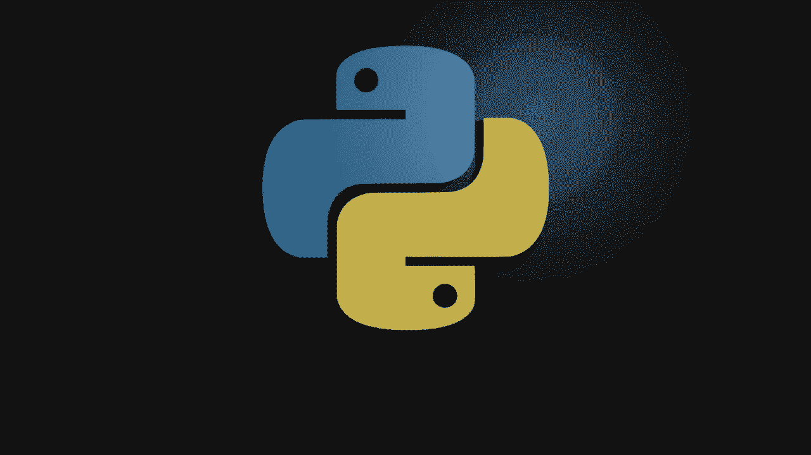
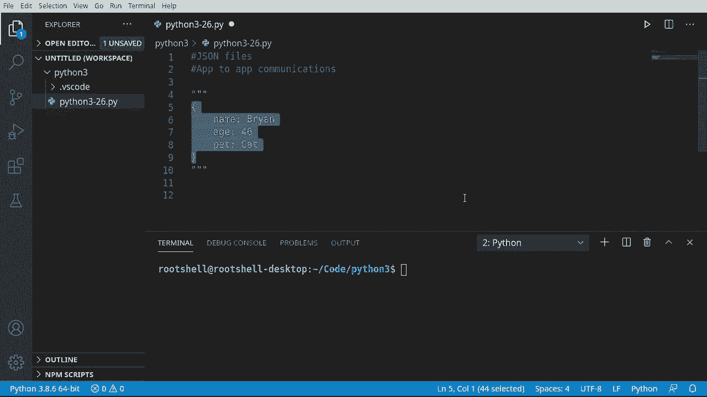
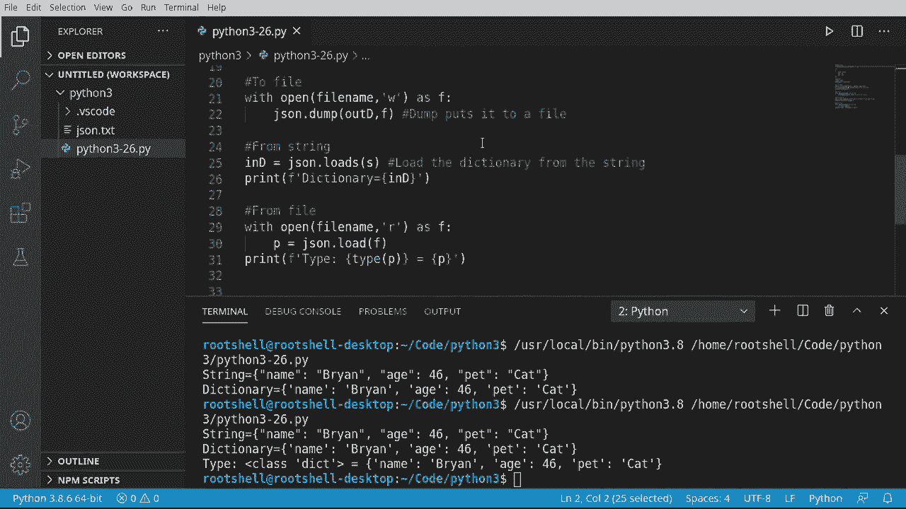

# Python 3全系列基础教程，P26：26）使用 JSON 

大家好，欢迎回来，我是布莱恩，这是第26集，我们继续我们的Python 3之旅，今天讨论的是JO文件，这有点误导。它实际上不必是一个文件，我们讨论的是数据。让我在这里发布一些JSON数据。我用这三重引号包住，以免IDE生气。但实际上我们要看的就是这部分。在括号之间的所有内容。

所以我们有开始和结束，然后有键值对。现在JSON可以复杂得多，但我想保持简单，因为我们并不是在学习JSON的复杂性。我们只是想学习如何在Python中使用它。首先，为什么你需要JSON？这是什么，你需要它做什么？它是用于应用程序。对应用程序。在某些场合。现在。

当我说通信时，这可以是从网络到远程调用，甚至只是简单的写入和读取文件。JSON旨在作为一种数据格式，因此不一定是文件格式。你可以在网络、内存等各个方面进行这些操作。但它将是一个达成一致的格式。所以假设我写一个程序，而你写另一个程序。

你想能够读取我创建的内容。我们必须有一个“达成一致的格式”。这就是JSON的本质。

正如你可能猜到的，JSON可能有点复杂。因此，在我们深入探讨之前，我们需要一些导入。实际上，我们只需要一个。我们将导入。JSON。使事情简单得多。我知道它看起来很复杂，但我们需要导入这个模块，因为我们不想重新发明轮子。

我们想使用已经编写并且有效的代码。让我们继续创建一个变量，我将称之为文件名。我们会一次又一次地使用它。我将称之为Jason。At T X T。

让我们开始吧。超级简单。所以我们将把一些字典转换为相邻格式的字符串。快五次说这个。虽然有点令人困惑，但这就是我们要做的。我将创建一个名为outd的变量。你可以随意命名。

但我只是想知道这是输出字典。这就是我们要转换的内容。所以我会说。字典函数。我想创建一个包含键值对的字典：姓名。布莱恩。年龄46。还有。那只猫。所以我们将取这个字典，并将其输出为J格式，所以让我们抓住它。稍微复制一下。

我想说 S 等于。我们想使用 J 模块。我们想要转储 S。不是简单的转储。现在，如果你的 IDE 可能会显示一些不同的内容。你可能会看到 dump 和 dumps，后者带 S。我们需要 S，代表字符串。所以它将输出一个字符串。

我将把我们的变量传递进去。实际上，我要借助复制粘贴的魔力，在那里放一个小备注，以防有人对 D 和 D S 之间的区别感到困惑。通常，当你被转储时，这是一件坏事。但在这种情况下，这会让我们非常高兴。好的，实际上这有点悲伤。我们要说，字符串将是。

我们的输出。让我们运行一下，看看那是什么样子。所以确认一下字符串。看，它看起来像个字典。这就是我喜欢字典和 Python 与 Jason 一致的地方，因为它们几乎看起来一模一样。很容易看出，并准确理解发生了什么，因为我们有键值对。😊

让我们继续将其输出到文件中。现在，记住，我说过。随着我们在 Python 中变得更加复杂，我们实际上写的代码更少。我发现这非常真实。这是 Python 的一个奇怪之处。所以我将说 with。打开。我们要去哪里。对。我会命名我们的变量。然后我们将写入它。

我们要创建一个名为 app 的变量。现在我们要说 Jason。转储。注意有两个转储。一个是 D 和 dump S。当我们看到 S 时，它代表字符串。我们想转储这个。我们想将我们的字典输出到文件中。我会在这里放一些备注，以防有人对发生的事情感到有些困惑。

非常非常简单，易于理解。让我们运行一下。它给出了相同的输出。现在我们有这个 J.txt。如果我们打开它，它包含字符串。我应该说是字符串化的 Jason，或者我们实际的字典以 Jason 格式呈现。它可能看起来完全像一个 Python 字典。这就是人们常常混淆的原因。他们会去。

哦，你在来回传递 Python。实际上，我们在传递 Jason 和数据。它看起来与 Python 中的字典对象非常相似。现在，让我们做一个完全相反的事情。我想从字符串中读取。所以我们要回到这里，并取这个 S 变量。

记住，Jason 进行了转储，或者说转储字符串到这个小家伙。现在我们来处理它。我想做一个与转储相反的操作，那就是加载。我想说 indie。一波。Jason。如果你在想像 D 这样的名字，没错，Python 开发者确实有幽默感。所以请耐心等待这些视频中的一些内容。

我们将要加载S。注意，不是load，而是load S，表示字符串。我们将把那个字符串输入。我会在这里加一些注释。以防有人有点困惑，所以从字符串加载字典。我将其命名为In，你可以随意命名，实际上无所谓。

我要进行一些魔法，把它复制并粘贴到这里。让我们继续运行这个。你可以看到我们的字典现在已经加载完成。这个工作方式非常酷。而且它看起来几乎是一样的。所以，是的，这会让很多人感到困惑。但请放心。我们正在处理Jason。现在，为了反向操作。

我们现在要从文件加载这个，所以我们回到这里，我们说用打开的文件以文本写入模式作为F。然后我们进行了转储，将那个字典转储出来。我们要做的正是相反的事情。必须说，用。打开。我想要文件名。我们将其作为纯文本读取。作为F。然后让我们创建一个我们之前没有用过的变量。

所以显而易见，这正在加载它。所以我会说文件字典或F D。等于Jason。我们想要。加载，而不是load S，因为那将是一个字符串。我们想要load。这将告诉它从文件源加载。如果你真的好奇，不。变量名称并不重要。我实际上可以将其命名为person或P或Brian。

无论我想做什么都无所谓。所以现在我们已经加载了它。好吧。现在复杂的部分来了。我们只需使用它。真的是非常简单。我说复杂时，我有点开玩笑。这真是简单得几乎令人恐惧。如果你来自其他语言和其他框架，你可能会觉得。

这怎么会这么简单，真是令人震惊。所以我会在这里调用类型函数。只是为了我们能看到。P是什么类型，什么数据类型？

这是我对Python的一点小抱怨，IDE很好，但如果你只是把它放在一个纯文本编辑器中，而不是IDE。你可能会看着它，试图弄清楚load到底在做什么，它返回什么。所以类型函数将打印出来，或者我应该说给我们返回数据类型，这样我们就可以把它打印出来。

然后让我们继续，安。打印出实际的变量。我们再运行一次。所以，输入。Lss di。所以这是一个类字典。记住，类是我们将在不久的将来讨论的内容。类是一个对象的蓝图。这是一个字典数据类型。它等于你猜的，就是我们刚从文件中加载的信息。

这现在是一个字典。非常简单，非常容易。主要的要点是。Jason是一种用于在应用程序之间交换数据的数据格式。这是一个应用到应用的通信数据标准。世界各地的人，不同国家。语言障碍无所谓，会说，嘿，把相邻的文件给我。

而且使用起来非常简单。当你查看它时，它是一个字符串。因此，只需在记事本或文本编辑器中打开它，如果需要可以轻松修改。但在编程层面上，操作起来也极其简单。
