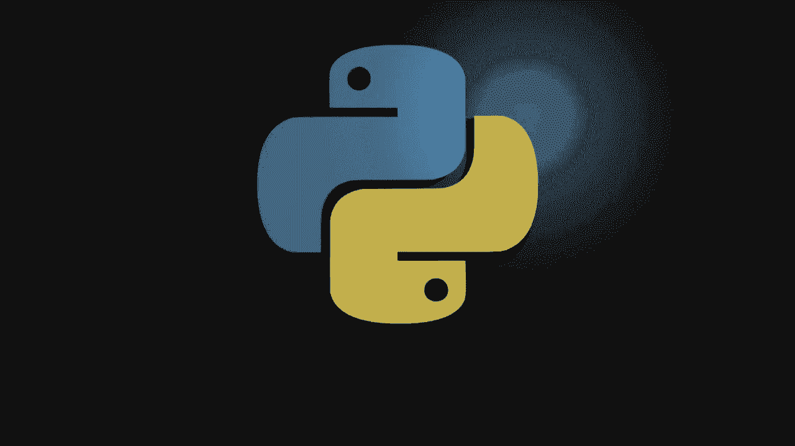
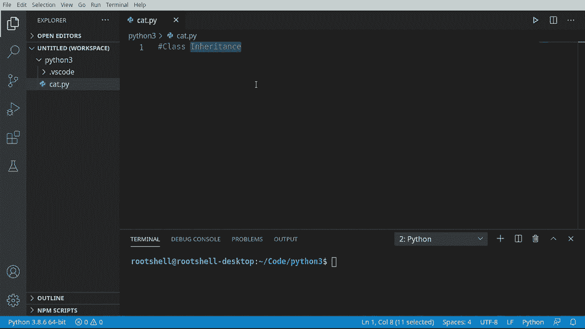
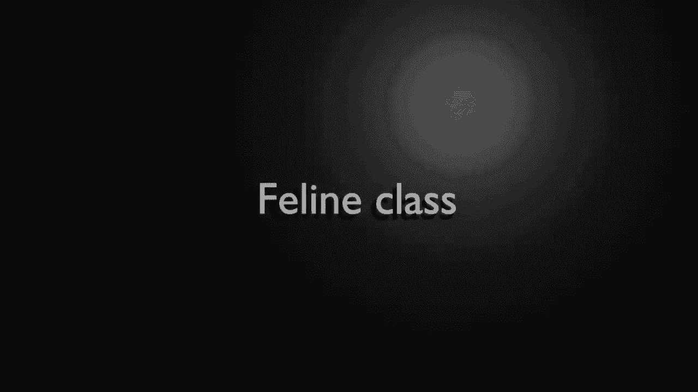
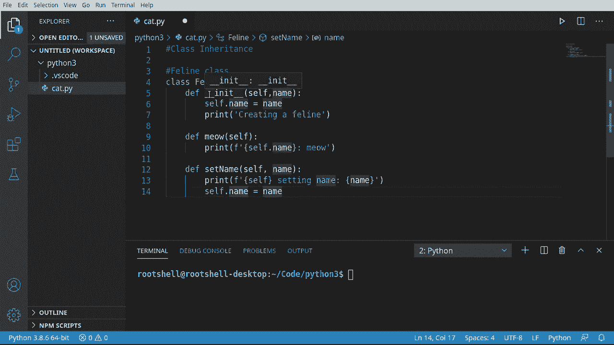
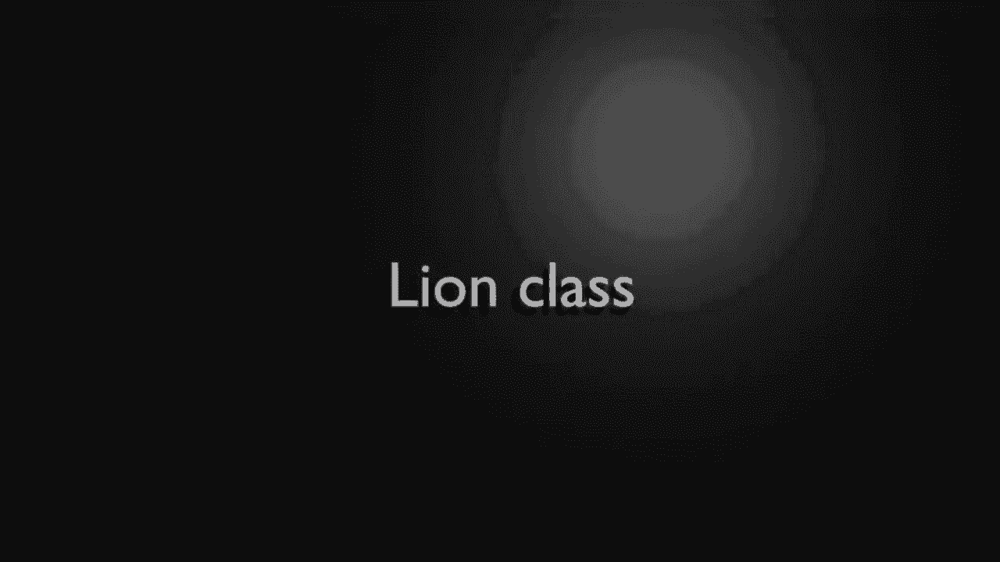
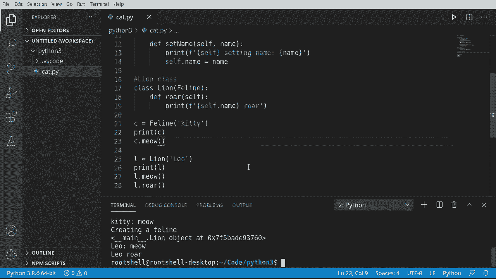
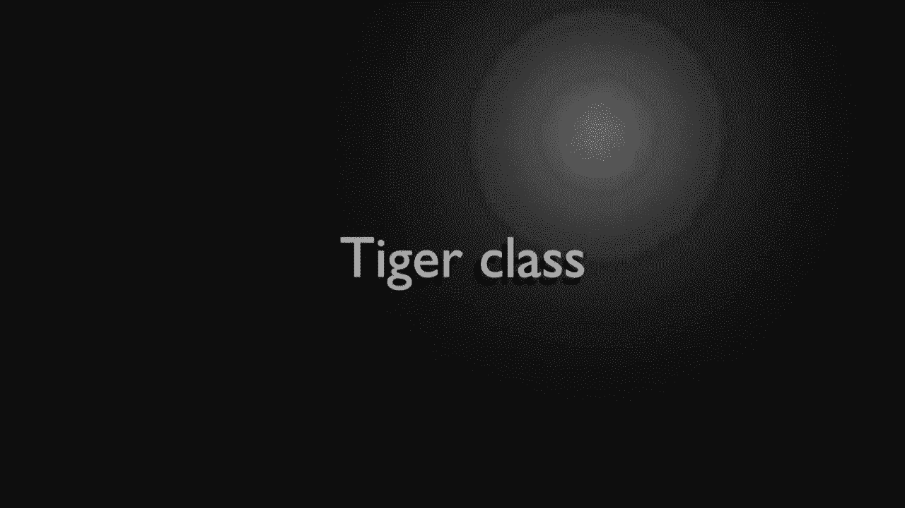
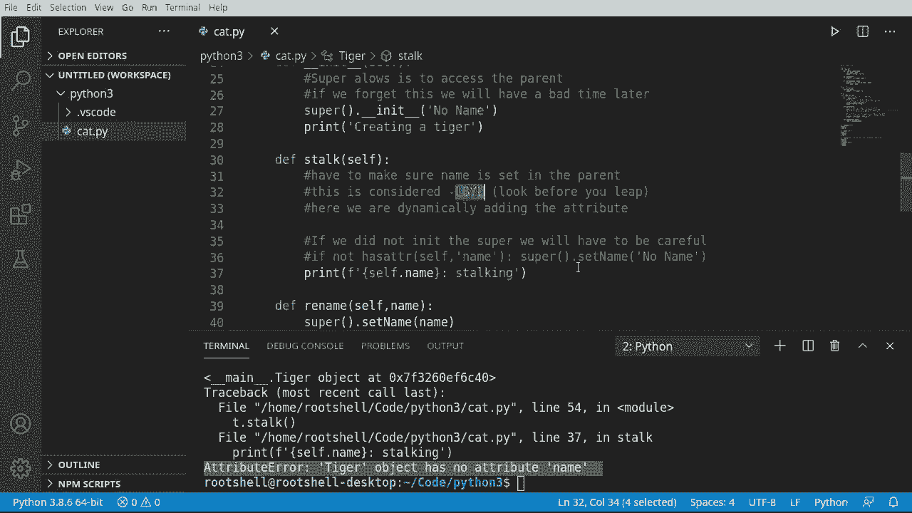

# Python 3全系列基础教程，P31：31）类继承 

大家欢迎回来。我是Brian。我们将继续Python 3的学习，讨论类继承。现在，当我们谈论继承时，我们并不是在谈论一个亲人去世后留下给我们的所有财物。我们在讨论一个类如何继承😊，或包含其他类的属性。所以，比如说，你出生在这个世界上。你有母亲和父亲。

你有发色和眼睛颜色，这些都是来自你的母亲和父亲。你继承了这些特征。这就是我们谈论类时的真正含义。这可能会变得非常复杂，我们将看看一些可能出现的问题。

好吧，我们将以极快的速度浏览这一部分，因为我们之前已经讨论过了。我不想浪费你们太多时间。我们现在要创建一个猫科类，记住，Gass只是一个蓝图。我将说猫科。然后我将继续定义我们的构造函数。Self，我们给它一个名字。这样就好了。请注意一件事情。

我们在说self name，但我们实际上并没有声明一个名字变量。请特别注意这一点。因为我们将会发现这真的是个糟糕的主意。这就是我为什么说我尽量在顶部声明所有变量。这样。

我立刻知道这个类包含什么，并且它已经被声明。这将会回来并被利用。我会说，正在创建一个D行。所以我们有一个构造函数在这里。现在我只是为了加快速度，准备在猫科类中加入一些函数。它现在可以了，我们可以设置名字。实际上，我们所做的就是Mao打印出自己的名字meo并设置名字。

你猜到了，打印出设置名字。然后我们继续设置那个变量。记住，我们还没有声明这个。

现在，我想创建一个继承自猫科类的另一个类。你会注意到当我将鼠标悬停在这里时，它显示的是猫科猫科。所以这只是一个自包含的类，没有继承。我们将创建一个类。我需要一个响亮的名字，让我来查查我的笔记。我们要创建狮子类。

我们要说class。Lion。你可能会好奇为什么类后面会有一个括号。好吧，我们马上就要知道。Eline，这就是我们在这里所做的。我们在说狮子将使用括号中的所有内容。它首先使用的是猫科类。这就是我们如何继承。现在，我们说deaf。Rar。再次强调，我们必须在其中包含self。

我们可以直接打印一些内容。好了， looks super， super simple。好吧。让我们在代码中玩一下。所以我们可以说C等于B line。我们得给它起个名字。就叫这个kitty吧。继续打印C出来。并且说看Miow。继续运行这个。它说正在创建一个feline。

所以我们的feline类的构造函数被调用了。我们有一个。Main。注意它有下划线main，所以我们在主部分。这意味着这是Python的根。它在这个内存位置创建了一个feline对象，而kitty在喵喵叫。现在，让我们来创建一些lions。我得说L等于一个lion。

让我们称这个为Leo。继续打印那个对象，以便我们能看到底下发生了什么。我们还可以说L.dot Miow。现在，你注意到一些神奇的事情刚刚发生了吗？狮子类没有meo函数。它是从feline继承的。所以简而言之，你继承的一切，你现在都有访问权。这是非常酷的。

我们也可以向这个类添加内容。所以我们说狮子不仅仅是fee line。所有这些类，所有这些蓝图，还有我们可以定义的额外内容。所以现在我们可以说像L.dot。Rar。继续运行这个。果然。正在创建一个fe line。你注意到fe line的构造函数被调用了吗？然后狮子被创建。

有趣的是它是如何工作的。我们没有为lions定义构造函数。所以我们看到的是fe line的默认构造函数，很有趣。这在下一部分会回来困扰我们。我一直在说我们会有个糟糕的时光，而那就在眼前。

但我希望你理解这里发生了什么。Hython正在创建一个fee line并创建一个line，这两个合并成一个对象在这个位置。但它会简单地说main.dot line。现在main，当然就是这个文件。而Leo将会喵，Leo将会吼，如果我只是稍微向上移动一点。

你可以看到小猫在喵，狮子在喵，狮子在吼。所以一切按预期工作。现在，系好安全带，因为事情将会变得非常，非常颠簸。

让我们在这里创建另一个类。我们将称之为虎类，因为我们将继承feline类。差点说成计时器。那会很有趣。好了，我们有了feline类。现在。有件事我要做。我会在这里抓取这个。我想引起你对默认构造函数的注意，我不应该说默认的。

我们的猫类的构造函数，其中有一个self和一个name。记得我说过我们没有初始化那个变量的原因吗？我们现在就在这个构造函数中初始化它。但我现在要做的是去这个ti类，猜猜我把它放在这里。我打算去掉name，因为猜猜看，我们在继承。猫类有一个名字。

所以我不想在老虎身上搞乱它。所以现在我有一个不同的构造函数。尽管你可以看到我们正在构建一只猫，但坏事即将发生。好吧，让我们继续说构建一只老虎。我想在这里添加一些注释。它们可能现在看起来没什么意义。Super让我们可以访问父类。

当我说父类时，我们在谈论的就是这一点。我们所继承的或者说基本类，如果我们忘记了。这将导致后续问题，意味着我们可以说super parent。在这种情况下，就是猫类。调用构造函数时使用一个名字。我们只会设置no name。没有。

我要把那个注释掉。我们只会说正在创建一只老虎。哦，天哪。我们这里有一些问题。所以现在让我们继续制作另一个函数。我们会说停止。现在我试图在进行中解释这个，以便你理解为什么会失败，因为它确实会失败。我们在这里做的事情。

我们试图依赖Python为我们管理所有这些。我们必须确保。在父类中设置了name。当我们说父类时，我们在谈论super或基本类。这被认为是“先看再跳”。我们正在动态添加属性。我的意思是，动态添加属性。就在这里。

我们在猫类的构造函数中添加它，如果我们在老虎类中使用自己的构造函数而跳过猫类的构造函数，那么那个变量就不存在。当你调用一个不存在的变量时，会发生什么？你会得到一个未定义的错误。所以让我们打印一下。我们将进行格式化打印，并且我们会说self不是name。注意，telecus说这是有效的，因为我们正在使用蓝图。

不是一个对象。更糟的是，我们认为这会起作用。让我们继续再添加一个函数。假设我想能够重命名它。我们会说super，因为我们知道有一个super的概念。我们实际上是在访问猫类，并且我们将调用猫类的set name。

如果你在想，是的，我们实际上可以调用老虎的set name并直接设置名字。但我想向你展示，如果你想的话，可以直接上升到super并调用猫类。如果这看起来非常复杂，那是因为它本来就是这样。我试图向你展示，super是一个与老虎不同的对象。

即使它们合并为一个类，但它仍然是 Python 理解和追踪的一个独立实体。因此，称呼 super set name 和仅仅说 set name 之间的区别非常微妙。Set name 是在 ti 类中设置名称，而 super 则是说，嘿，去上面的 feline 类中调用这个函数。因为记住，当我们创建一个类时。

第一个创建的是我们的父类或 super。天哪，这真是让人超级困惑。因此，这是我们在这里要处理的微妙复杂性之一。因此，主要的收获是我们设计得糟糕的 Tiger。我们基本上创建了自己的构造函数。😊，我想在这里插入一个注释，覆盖构造函数是个坏主意，因为我们现在有了“鸡或蛋”问题，其中 self.dot name 并不存在，这甚至没有被定义。

让我们展示这一切，只是为了表明它会爆炸。所以我要说 Tiger。我想在这里插入一个注释，是一个 feline，但有不同的构造函数。我们生活在不同的构造函数中。所以现在没有名称，我们已经偏离了我们的类设计。让我们打印出来。

保存并创建一只老虎。注意主老虎对象是如何被创建的。它没有爆炸。现在，回到 stock。记住，我们要打印 self.dot name。但我们从未说过名称。哦，哦，坏事要发生了。让我们看看这次失败，然后理解为什么会失败。哦。

属性 air ti 对象没有属性 name。记住，我们在覆盖这个构造函数，因此我们必须初始化它，这只是因为我们没有像这样做。如果我们在这里，它会在 feline 中被初始化，并且每当 feline 被构造时，它会强制初始化。但因为我们没有这样做，我们依赖于 feline 构造函数，而在 tiger 中。

我们定义了自己的构造函数，它在 feline 中从未被调用。这真是让人困惑。因此，主要的收获是，除非没有其他选择，否则不要在子类中覆盖构造函数。始终依赖于父类的构造函数。否则，你必须确保你在这里调用。要么是构造函数，要么在这里初始化变量。

哦，这就是为什么这个叫做“三思而后行”，因为我们想确保我们实际上可以做些什么。我们想确保名称在父类中，这就是“在精英之前”的原则。所以我们在这里做的是确保它存在，三思而后行还有很多其他内容，但这就是基础。现在让我们继续运行这个。突然，没有名称追踪。

它从哪里获得没有名称？它正是从这里获得的，所以我们在说 Tiger 创建。然后我们说，去 fee line 调用那个构造函数，但我们没有名称。因此我们只是说没有名称。我们可以在那里放任何我们想要的东西，它都会很好地工作。让我们现在重命名它，所以我必须说 t.dot rename。让我们叫它 Tony。

让我们说 T meow，只是为了证明我们在继承猫科动物的属性。T dot stock。再叫一遍。我将把这个提得更高，以便我们看到实际效果。清理一下并运行。好的，那么这里发生了什么？创建一个猫科动物，创建一只老虎。老虎已经创建。没有名称在潜行。我们已将其重命名为托尼。

托尼现在在喵喵叫并潜行。如果我们回到构造函数的领域，并注释掉这个。我们将会有麻烦。我想真正强调一下，崩溃的原因是因为我们绕过了这个构造函数，而名称从未定义。

让我们再看看它是如何失败的。果然，老虎对象没有属性名称。好的，所以从这个视频中主要得出的结论是，继承非常酷，非常强大，但有一些隐藏的问题你真的需要注意。除非你绝对知道自己在做什么，否则不要重写构造函数，并确保如果这样做，你要控制这个过程。

调用 super 的最简单方法是在其中调用父类的构造函数。但还有其他小问题，你需要确保在行动之前仔细查看，或者做某种错误检查，否则你会遇到一些疯狂的问题。

