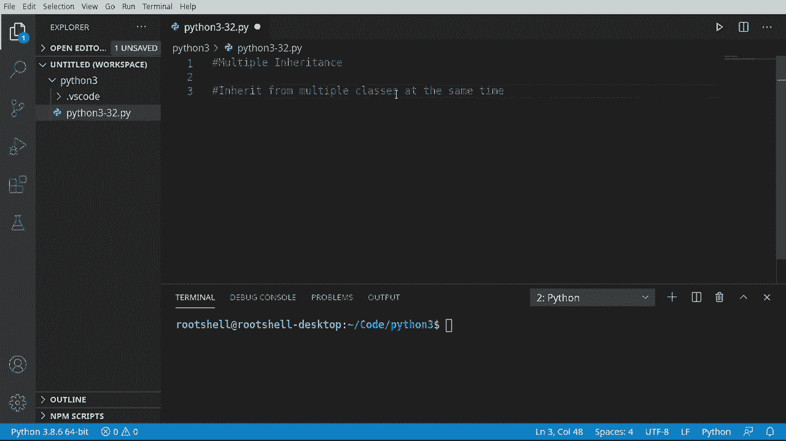
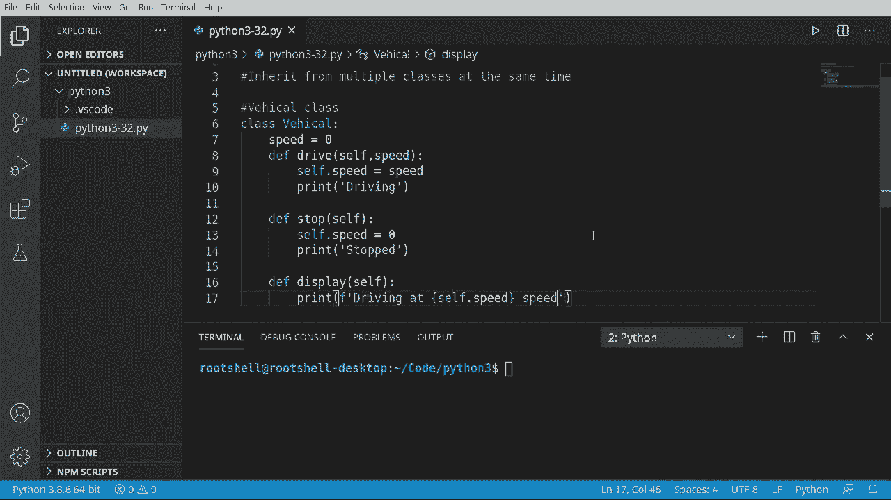
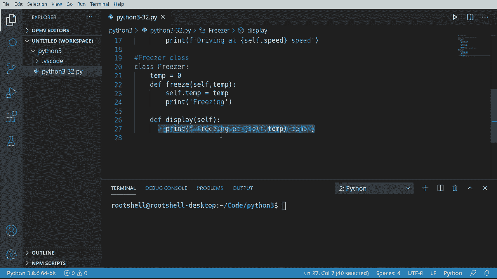
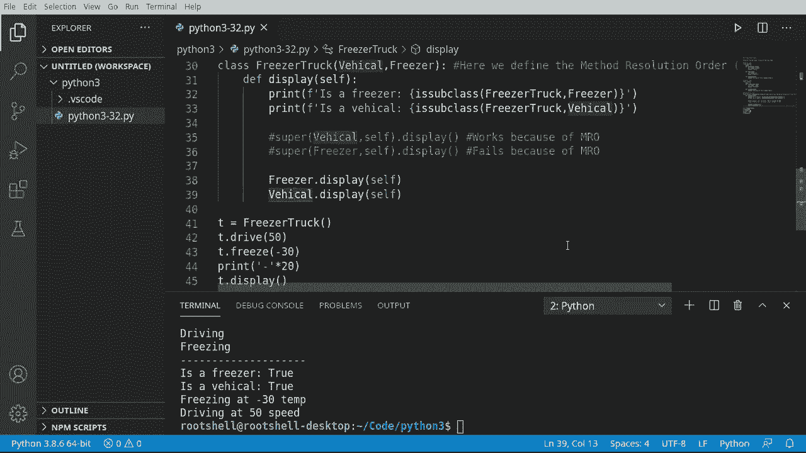

# Python 3全系列基础教程，P32：32）多重继承 

欢迎回来，大家好，我是布莱恩，我们要谈谈多重继承。我们已经覆盖了类，已经讨论了从另一个类继承。但是，如果你有多个类想要继承呢？

这正是我们要做的。有些语言甚至不允许这样，因为它变得非常复杂。让我们深入看看。

让我们在这里继续创建一个类。所以我们要创建一个车辆类。或者说是类。别说。如果你记得上一段视频，我绝对喜欢确保变量的实例确实被创建，这样我们就不会遇到那种讨厌的。

未定义错误。我们要继续保存驾驶。不是说我们没有放入初始化，这里我们根本不需要它。我们将保留默认构造函数。我会说，因此。逗号，然后是速度。我们会把这些保持得非常简单。我们会说驾驶，我们会设置速度，我们会简单地复制并粘贴这个。

我想要另一个叫做停止的函数。我们将把速度设置为0。我们不需要。那个参数。现在让我们继续创建另一个函数。全部显示。这个地方会变得有点有趣。特别注意这个函数，因为我们将在另一个类中再次使用这个函数。

当说打印。我们只会简单地说以某个速度行驶。

非常简单的小自包含类。

让我们继续创建另一个非常、非常简单的类。我只打算创建一个冷冻机类。这个东西存在的唯一目的是冷冻食物。有一个冷冻机。让我们继续创建一个变量。我们叫它temp，等于0。所以我们将在这里默认将温度设置为20。现在，我会说困难。冷冻。

所以我们能够在特定温度下冷冻一些食物。我必须说，自我.温度。是我们刚传入的温度。现在我们来打印一下。正在冷冻，以便我们知道冷冻机实际上会，你知道，令人震惊地冷冻食物。现在我要从车辆类中实际获取这个，显示自我。

我们将修改这个，但我们会把它放在冷冻机类中。你不必完全复制和粘贴，只要名称相同即可。我们要做的是故意在这两个类之间创建命名冲突。因此车辆和冷冻机都有一个显示函数。我必须说正在冷冻。自我.温度。

因为冷藏类中没有速度。非常简单，非常容易理解。所以我们可以独立调用这些，调用`display`，看看到底发生了什么。现在让我们看看如果使用多重继承并将这两者结合在一起会发生什么。

好的，让我们继续将这两者结合在一起。我们要创建一个冷藏卡车类。我将说`class FreezerTruck`。我们需要一个冷冻机和一辆车。我们将把它们合并成一个巨大的类，最初我只会说`pass`。所以我们只是声明这个类，它没有其他功能，这就是在 Python 中`pass`的作用。

然后我们将继续创建它。我将说`T = FreezerTruck()`。`T.drive()`，我们希望以每小时50英里的速度行驶，在美国这实际上相对较快。然后我们将说`T.freeze()`，我会把这个设置为负30。无论我们携带什么，我们都不希望它在去商店的路上融化。

然后我将继续打印。现在，我们将打印出一些破折号，以便进行分隔。现在，我们要说`tea display`和小测验。我们有多个显示。我们有冷藏类显示和车辆显示。哪一个将被显示？所以我们要么看到`Freezing`，要么看到`Driving`，到底哪个会发生呢？

让我们找出，保存并运行。以负30的速度冷冻。我们没有速度。我们看不到驾驶。因此，现在我们有多个问题，我们希望能够看到这两个。但是我们所定义的，无论我们意识到与否，是一个新概念，称为方法解析顺序，或称 MRO。你会一次又一次地听到这个。

你会看到论坛上的人们在问如何访问或为什么会发生这种情况。所以顺序非常简单。先来先服务。所以我们先定义了冷冻机。因此，它将显示冷冻机。如果我们只是交换这两个，我们仍然在做同样的事情。我们仍然在继承这两个。

但是看看这里会发生什么。以50的速度驾驶。所以这就是方法解析顺序。先来先服务。这真让人沮丧。那么我们怎么能解决这个问题呢？让我们说`def display()`。走吧，让我们继续，并打印这些，假设是`print()`。我想给你展示一个小把戏。我想确保这些实际上是子类。

所以我将说`is a FreezerTruck`。我们希望它是`Sb.Basss`。基本上我们是在给当前类定义，所以它是冷藏卡车。诶，`Freezer`。然后我们只会说，`is a Vehicle`。抓住这个。不错，听着，看看当我们现在调用`display`时会发生什么。是冷藏吗？是车辆吗？

现在我们调用自己的函数，实际上我们可以判断它是否继承特定类。你想检查的类总是放在第一位。你想对比的类放在第二位。现在。让我们看看我们如何解决这个问题。我将说super。所以我们要调用父类，问题是我们现在有两个父类。

那么我们试着独立调用它们。比如，冰箱。自己。那个显示。我要使用同样的东西。但我们要用车辆。所以我们在说“super”。调用车辆，super，使用当前对象调用冰箱，然后直接调用显示，看看这里会发生什么。哦，我们遇到了麻烦。

所以让我们在这里深入看看，在第42行，T显示，这个家伙在这里。然后它跳到第36行，就是这个家伙。Super对象没有属性显示。现在，等一下。我们是有的。如果我们看冰箱，它就在那。那么这里发生了什么。好吧，再次。

方法解析顺序出现了问题，提示我们“不能这样做”。所以为了证明这一点，我们先把冰箱和那些车辆注释掉，然后再运行一次。一切神奇地运作了。这真让人沮丧。好的，我们继续把这些注释掉。这并不是我认为的正确做法。

不过我会在这里添加一些注释，以防有人抓取源代码。那么，做这件事的最佳或正确方法是什么呢？我们将直接调用那个类，还有其他方法，可能还有更好的方法。但这就是我们在目前有限的Python知识下要做的。

我们要说冰箱.显示。记住我说过，当我们继承一个对象时，Python正在创建它。所以它知道冰箱卡车里有一个冰箱。因此，我们要调用冰箱的显示。我们要调用车辆的显示。让我们看看这个运作情况。现在我们可以看到我们在冷冻和驾驶。哦，天哪，超级 confusing。

所以这段视频的主要要点是，Python确实允许多重继承，但它有一些陷阱，主要是命名冲突。例如，我们看到车辆和冰箱都有一个显示函数。但是一旦我们同时继承它们，MO就会介入并说我们只会使用第一个。所以如果我们想使用多个。

我们必须独立调用它们。😊，超级具有挑战性，但一旦我们理解了这一点，它也是非常优雅的。
