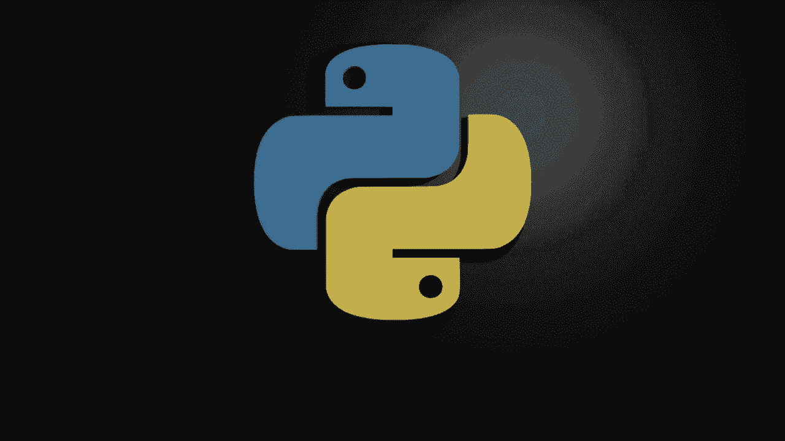
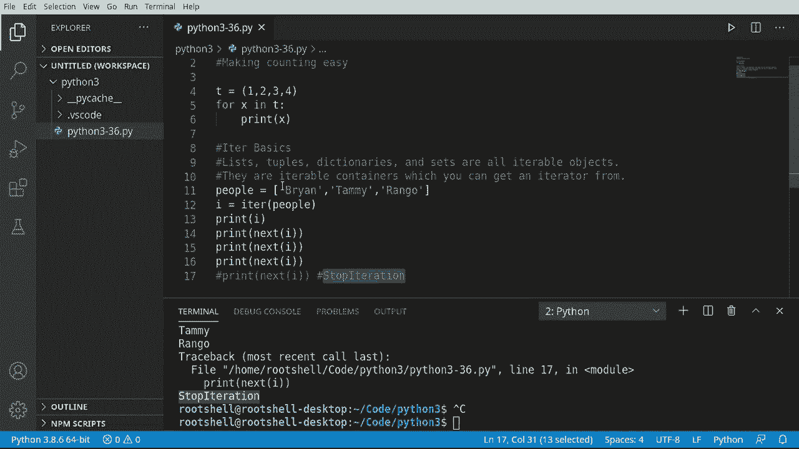
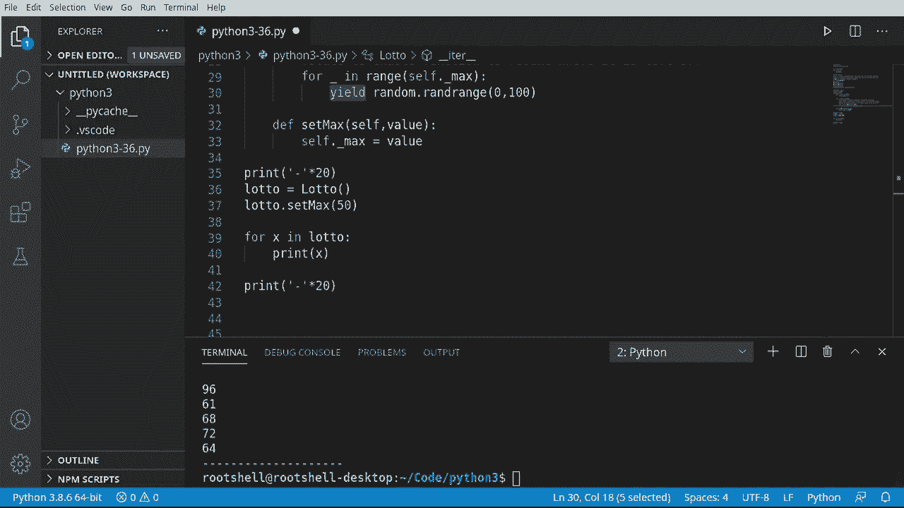

# Python 3全系列基础教程，P36：36）迭代器 

大家欢迎回来。这是布莱恩。在这一集里，我们将谈论迭代器。它们使计数变得简单，我们之前实际上已经使用过这些，但我们将深入探讨它们是如何工作的。因此，例如，如果你对迭代器感到困惑，就说。😊，1，2，3，4。

我们有一个简单的元组。我们将说4个x在。Qi。当打印。运行这个。看，1，2，3，4，但这到底是如何工作的，Python是如何知道如何遍历每一个项目以及如何处理每个项目的，这正是我们要深入探讨的内容。

让我们打开引擎盖看看这里发生了什么，所以我们在谈论迭代器的基础。好吧，列表、元组、字典、集合，甚至字符串以及大量其他对象都是可迭代的。我们使用一个称为iter的函数来获取可迭代对象。让我们看看这里。我将说people等于。我们将创建一个简单的列表。布莱恩，田明。

我们的家庭狗，老懒狗，臭狗，Rango。我们想要通过它。因此我将说，我等于迭代器。我们将使用那个列表。如果我们打印出来，快速看一下我到底是什么。这是一个列表迭代器对象，所以这是一个与我们的列表分开的对象。它不是列表。

这是一个迭代器，它告诉Python如何遍历那个列表。好的，很棒。现在让我们实际来看看。我将说打印。我将调用下一个函数。它会告诉迭代器，嘿，移动到下一个位置。假设从一开始，这个下一个位置是布莱恩，所以让我们继续运行这个。

当然，布莱恩就在这里。现在，我们不需要知道某种索引，只需说下一个。下一个，下一个。看，布莱恩，塔米，罗，它将继续移动或遍历那个列表。现在有一个有趣的地方是，如果我们试图超出那个列表的范围。注意它抛出了一个错误，这是停止迭代。

这就是Python在内部使用的方式，告诉自己需要停止遍历，因为它简单地达到了末尾。所以我们可以继续，我将把这段注释掉。但你必须明白什么是停止迭代，以及它存在的原因。它只是告诉Python，嘿，我们到了末尾，停止处理这个。

现在我们理解了基本概念，我们将创建自己的类。我们将说对我们自定义类的4个x进行迭代，在内部它将调用`next`等有趣的东西。我们不会玩停迭代，但我想让你理解这个概念的存在。如果你试图推进`next`并得到某种错误，你会知道它在做什么。

较旧的教程中，你实际上需要自己提高这一点，所以会有点混乱。我们将采用简单的方法，或者说是Python3的方法。我们将说`import random`，并创建一个随机数生成器或彩票类。很多人都想赢得彩票，我也是。天啊，如果我赢得彩票，我会做些什么。

所以我们将说`def __init__(self)`。这仅仅是我们的构造函数。我们将说`self._max = 5`，如果你不知道为什么有个下划线，请查看之前的视频。然后我们想调用`iter()`，这就是我们真正偏离其他教程的地方，因为其他教程会有`__iter__`，你会有一个`next`函数，并且你需要追踪你在某个内部列表中的位置。

我们不会做任何这些，因为我们根本不需要。因此在`__iter__`函数中，我们将使用所谓的`yield`。`yield`是非常酷的。我会在这里记一些笔记。`yield`语句暂停函数的执行并返回一个值，就像`return`返回一个值一样。然而，😊，我们不会返回，而是停留在这里。

我们保留足够的状态以继续我们离开的地方。这是极其强大的。因此，不返回，这将中断。然后我们不断调用这个函数，我们将说`for _ in range`。我们只需说`self.do_square(max)`。

我们将继续调用我们的生成器。我们要创建一个随机数。我们希望一个范围在0到彩票委员会希望的最大值之间。好吧，现在我们想允许他们进行调整。如果他们想的话。所以我会说，仅仅因为我是个好人，设置下一个自我值。

使用我们的小彩票类的人可以设置最大值。如果他们想的话。从这里开始，使用起来变得非常简单，你会看到其他教程中有许多功能，你还在追踪某个内部计数器，但我们不打算玩这些。

然后打印。只是想在屏幕上分开一下。我们去创建一个彩票类的实例。我们将说`lotto._max`。我希望最大值为10。现在来了有趣的部分，我们将说`for x in lotto`。所以让我们运行一下，看看今天发生了什么，我们得到了随机数。

我们甚至可以说我们想要说50个这样的数字。所以这将会输出很多数字，我们先清除一下，看看。这就是我们生成的50个随机数字。这种方式非常酷，所以快速回顾一下。我们在这里做的只是简单地创建一个类。

调用构造函数设置一些内部值，然后我们有这个迭代器函数。在其他教程中，你会看到类似的内容，但后面会有一些暂定位。接下来，你会有一些代码。我们不需要那样。因为我们使用的是yield。与return不同，yield将返回值。

但在当前上下文中要暂时停止。当执行恢复时，它会继续正常进行。这非常酷，功能强大，让生活变得非常简单，相较于以前的方式。真是太喜欢Python3了。
