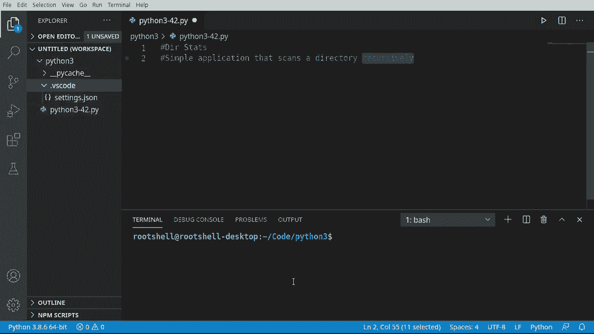
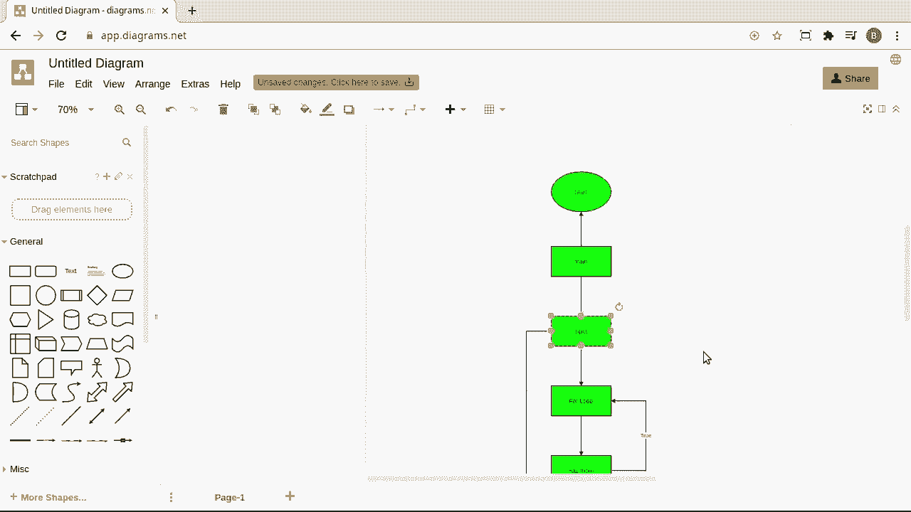
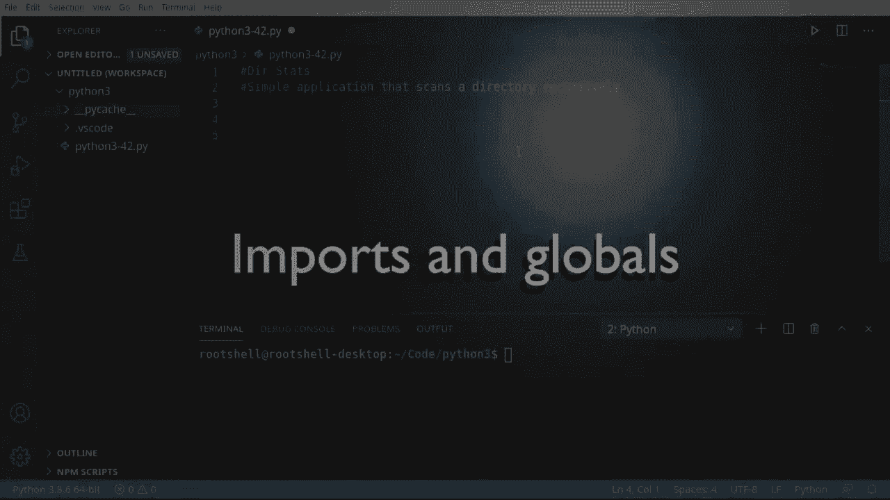
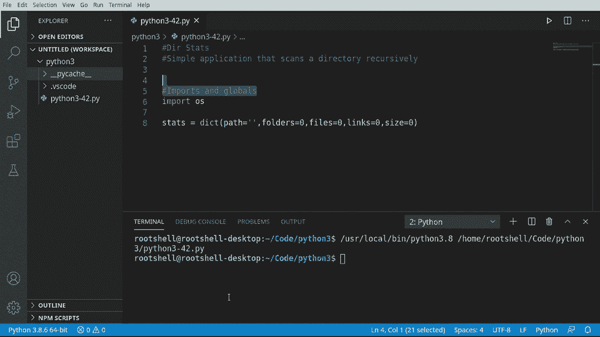
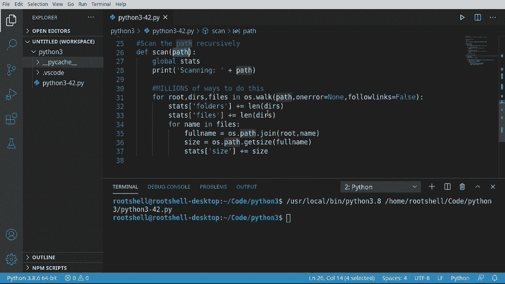
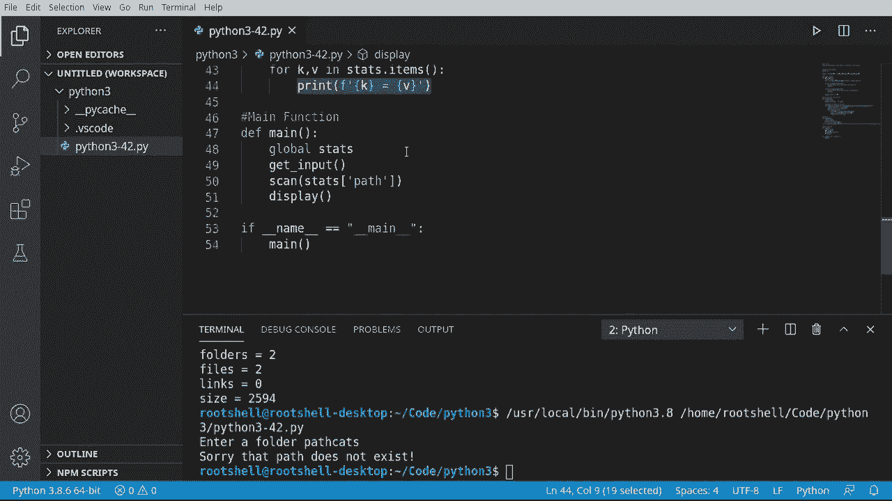

# Python 3全系列基础教程，P42：42）构建简单的应用程序：目录统计 

欢迎回来，大家好。我是布莱恩，我们将创建一个名为D Stats的简单应用程序。这个程序将递归扫描一个目录。你是编程新手，可能会问这是什么意思。假设你有一个目录，里面有子文件夹。

而这些文件夹又有子文件夹，依此类推。你有一个漂亮的树状结构，类似于我们这里所看到的。😊我们希望能够扫描整个树结构。

让我们看看一个简单的图示，不用担心，我会放大。但我们有一个开始和一个结束，我们的整体逻辑将是非常线性的，非常容易理解。让我们放大一下。我们将开始，进入主函数，获取一些用户输入。

我们将验证这个文件夹在操作系统中确实存在。如果不存在，我们将直接跳到完成。不过，如果它确实存在，我们将进入一个for循环。这是递归部分。我们将对每个项目进行处理。如果它有子项目。

然后回去扫描这些项目，依此类推，直到目录树的底部。如果我们扫描完所有项目，那就完成了。我们将结果显示给用户。非常简单，逻辑也很容易理解。

让我们深入探讨一下。

好吧，首先，我们想要进行一些导入并创建一个全局变量。我们的导入，只需简单使用OS。现在，OS本身，这个模块真的可以让我们深入操作系统，获取一些细节。我们将用它来获取文件夹结构以及文件大小等信息。

所以让我们现在创建一个字典。我将称之为stats。我们想要一个非常简单的字典，我必须说，路径等于个人。虽然我并不喜欢全局变量，但它们确实有其用途。我认为这是其中一种情况。所以我们将说路径，然后存储文件。

如果你在想，这实际上只会存储我们要扫描的度量。比如链接，然后是总大小（以字节为单位）。请运行这个，确保没有拼写错误，没有错误，那么我们可以开始了。

好的，起点，我们需要获取用户输入。我们必须有一些东西来扫描。所以我们将说深度输入。这个函数将非常简单，但我们需要解释一些复杂性。因此，第一件事我们要做的是使用这个全局变量。所以我们需要使用 global 关键字。

所以全局变量。如果我们忘记使用 global 关键字，我们现在正在创建一个新变量。然后 Python 将根据 Python 的版本选择使用全局变量或在函数内部创建一个全新的变量。所以我们想告诉 Python 从这里使用全局变量，我们将获取用户输入。

我们要说 RE 等于，并且我们将稍微不同地处理，而不是仅仅说输入然后获取输入。我们希望将其转换为路径，全部在一行中。所以有人会说 O S dot path。当我们想要绝对路径时，现在我们想获取用户输入。我们将简单地在一行中完成这一切。

我们将说获取用户输入并将其转换为绝对路径。很酷，现在我们有了这个小家伙。我们可以检查它是否真的存在。我们将使用 OS.path.exist。注意我们在说如果不是，这意味着如果它不存在，这将返回错误。

然后我们想采取某种行动。在这种情况下，我只是想让用户知道，嘿，你搞砸了。我们不能继续这个程序，所以。抱歉，路径不存在。然后我将退出我们的应用程序。如果你不知道退出代码是什么。通常，当你运行一个应用程序时，它会运行，做它的事情，然后退出。当它退出时。

它告诉操作系统发生了什么。0 意味着没有问题。这按预期工作。但显然，情况并非如此。所以我们将给它一个退出代码 1。这实际上取决于你作为开发者来确定这些退出代码是什么。可以是 1，可以是 99，91，随我们想要的，我们只会用 1。

这告诉操作系统这并没有按预期工作，如果我们有最终用户，他们可能会说，哦，程序给了我退出代码一，你可以说，“是的，你给了我错误的路径。”现在，我们想说如果不是 O S path，并且我们想确保这是一条目录，因为有时我们的用户并不是那么聪明，他们会给我们一个文件或类似的东西。

所以我们要说抱歉，那条路径不是目录。然后我们假设退出代码是 2，我们可以定义我们想要的任何内容。现在我们已经达到了这一点，我们知道我们有一个有效的路径，并且它存在且是一个目录。所以我们将更新我们的全局变量，在这里我们有一半。

所以这就是我们要在这里更新的内容。并且说统计信息。half等于。所以我们只是在设置字典值路径为他们输入的任何文件夹。非常简单，逻辑非常容易理解。现在我们已经得到了用户输入，并且知道他们想要扫描的路径，我们想要递归地扫描那个路径。我们将在一个函数中做到这一点。

所以我们将说de scan。给它一个路径。同样。我们想使用那个全局变量，所以我们可以说global。Thats。我喜欢这个词。统计信息让我想起医生之类的。如果我们想要非常好，我们实际上可以打印出我们正在做的事情。所以我们会说扫描。

然后无论我们的路径是什么。现在你可能会想，为什么我们要使用一个变量，当路径实际上在统计信息中。原因是我们将递归地做到这一点。意味着这个路径变量在这里会随着时间的推移而变化，而字典中的路径是根目录。所以这实际上可以是一个文件夹的文件夹的文件夹，类似的东西。

所以这就是为什么如果你在想这个问题。现在来了个花哨的部分。我们要使用一个叫做O S.dot walk的东西。我想先说明一下，有一百万种不同的方法来做到这一点。我们只是使用一种方法。所以我实际上会列出数百万种方法来做这件事。我相信评论区里会有人说，你不应该使用OSW。

你应该使用其他方法或Gob之类的，我们只是会使用OS walk，因为它简单易懂。所以我们会说四。Walk将返回三个值，它会说根目录、目录和文件。所以根目录显然是根目录，目录是目录的列表，文件是文件的列表。我喜欢这个非常自解释的方式。所以这将在O，S.dot walk中。

这就是我喜欢使用walk的原因，因为它非常简单易用。非常容易理解。我们将扫描那个路径，如果我能正确拼写路径的话。然后我想说在错误时。我们将其设置为none。我们必须这样做，因为会有一些文件夹你根本无法访问，比如你会得到访问被拒绝，或者你会遇到某种奇怪的硬盘错误，或者你不想让你的程序崩溃。

所以我们将说在错误时等于none。我们可以将其设置为一个函数或我们想做的任何事情。但是我们只会说none。所以不采取任何行动。然后跟随链接。我们将其设置为alts。这意味着如果你有一个链接。想象一下，它像是指向其他地方的快捷方式。如果那被设置为true。

你可以扫描很远的地方。所以比如说，如果你有一个文件夹一。为了注释掉这一点。假设你有文件夹一，在文件夹一里面有一个链接。那个链接指向文件夹三。你大概能看到这里发生了什么。Azure正在扫描文件夹1。如果你跟随那个链接，你将跳到一个完全不同的文件夹，即使说是文件夹3。

在根级别，就像上面那样，所以我们不想这样做。我们想确保不跟随那些链接。好的，从这里开始。我们将说 stats。我们想在这里更新我们的指标。所以我们想知道文件夹。文件夹将是 plus equals，我们想要链接。你猜对了，是你的。

所以这将是一个列表。我们想获取那个列表的长度或项目数量。我不记得它实际上是列表还是元组。但 Telec 告诉我它是一个列表，files 也将是一个列表。列出你的元组，我不在乎。我们现在只会获取它的长度，现在我们将说 files。

我们也将更新文件的指标。你需要小心一点，它是 folders。filess，我们拼写这些时要正确，否则我们实际上是在添加一个完全不同的键。从这里开始。我们想说。或者。Name in files。我们将逐一扫描每个文件。

我们将说 full name。等于 O dot。Half。At join。这样做将允许我们将根目录或文件夹名称与实际文件名连接起来。这将是两件不同的事情。这就像实际的路径，而这只是没有附加目录名称的名称。

所以这可能是类似于 S dot T X T，而不是实际的完整路径。我们想确保将它们连接在一起。O path join 正是这样，连接两个或多个路径名称组件。好的。这为我们解决了很多麻烦，所以我们不必担心它。从这里开始。

让我们继续获取一个大小。我们将说 O，S dot path。你看我们在很大程度上使用 O S，尤其是 path。所以 O S 的 path，我们想获取大小。这将获取那个文件的大小，我们将使用完整的路径名称，而不仅仅是名称。一旦我们得到了那个大小，我们可以进入这里，我们可以说 stats。然后跳上去。

让我们看看我们在这里使用的键，size。所以我们可以直接使用。Size。然后让我们增加它。所以，从顶部开始，我们将扫描一个路径，我们将不断扫描那个路径。这就是我喜欢这个的原因。现在，有一点你应该知道，这有点误导。其实我们如果想的话，可以完成我们的 stats。

但我希望在需要时能在其他地方使用这个，通过允许我们跳入那个路径。你稍后会明白我的意思。

现在我们已经递归扫描，我们只想简单地向用户展示我们到目前为止所做的事情。这实际上是在程序退出之前的最后一步。所以我们将说 depth display。再一次，我们可以用很多不同的方法来做到这一点。我们继续将其转换为小写。实际上，我们只想打印出我们的字典。

这就是我把所有东西放在字典里的原因，因为它整齐且紧凑。所以我们将说全局统计数据。现在你知道全局关键字的作用了。我们将打印单词结果。然后我们将打印字典中的键值对。所以我将说四。Acom a v。也了。那。还有个因思。那将给我们键值对。

然后从这里开始就非常简单，租赁。我们将格式化它。我想打印键，带等号，然后是值。非常简单的函数。但在屏幕上看起来会非常优雅。好了，是时候在这里结束了。让我们做我们的主函数。好吧，让我们继续说。De mean。一些Python nus将会说。

我们真的需要做一个主函数吗？我的意思是，如果我们想的话，技术上可以做一些像如果名称等于的事情。然后我们想说__main__。然后我们可以在这里做我们的代码。你绝对可以这样做。我不喜欢这样做。我喜欢把所有东西放在一个整洁的函数里，以防我想后期更换函数，这样我就不用复制粘贴做其他事情。

所以我只会在这里实际调用我们的主函数。现在记住，我们在这里做的是检查这个文件，这个单独脚本是如何运行的，如果它是由Python解释器直接运行的，它的名称将是__main__，我们之前谈过下划线。但这些是Python用来确定的特殊字符，嘿，这是Python内部的。

所以如果Python运行它，名称将是main。如果是其他名称，意味着另一个脚本在调用它。我不想触发这个主函数，而是调用脚本。调用脚本可能想要调用显示或扫描。这就是我为什么留着那里的原因，而不是使用这个全局。哇，很多解释。但我想你现在能理解了。一旦我们走到这一步。我们可以说，全局。那。实际上，我不需要那些。所以我们将告诉它，嘿，我们想要使用全局变量。从这里，我们将继续获取用户输入。

我们本可以稍微不同地做这件事。我们本可以让获取输入返回一个值。但相反，我想把所有东西封装在里面。这样，如果其他函数调用它，所有内容都直接融入我们的全局变量。这是一个设计选择。你可能需要根据你的需求进行调整。现在，让我们继续扫描。

注意我们现在有一个路径，我们必须提供这个，我们可以简单地说统计。半。我们正在获取路径。从git输入。如果我们想的话，我们可以很容易地把它硬编码到应用程序中。最后，让我们继续向用户显示最终结果。我们可以稍微简化一下，让它在视觉上更容易些。

所以主要逻辑非常简单。我们将使用我们的全局变量，获取输入。我们将扫描该路径，然后显示结果。让我们开始这个过程，看看会发生什么。好的，输入一个文件夹路径。如果我想扫描当前路径，只需按一个点，因为记住，点代表当前目录，而点点代表父目录。

结果显示，当前目录确实是这里的这个，Python 3。有两个文件夹，两个文件，长度为零，总大小为2594字节。好的。所以到目前为止，这个程序相当不错，简单。它易于理解和使用，但同时也在执行一些相当复杂的逻辑，适合初学者。

主要收获是，是的，你可以使用全局变量。尽管这可能并不总是最佳设计选择。始终，始终，始终验证用户输入，你绝对不想完全信任最终用户。我的意思是，例如，如果我运行这个，输入“猫”。抱歉，该路径不存在。

如果我们尝试扫描“猫”，你的程序将崩溃。现在，扫描。从这个过程中的主要收获是，有成千上万种不同的实现方式。我使用了OS S walk，选择适合你的方式。我个人更喜欢OS walk，因为它让我可以轻松地在需要时中断，因为它在一个整齐的for循环中。所以如果我想深入几层，我可以再次构建那个逻辑。

显示时，我们基本上只是使用目录项来获取键值对，然后打印出来。接着我们讨论了Python内部的命名约定。
