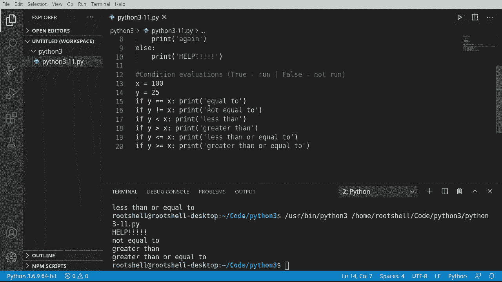
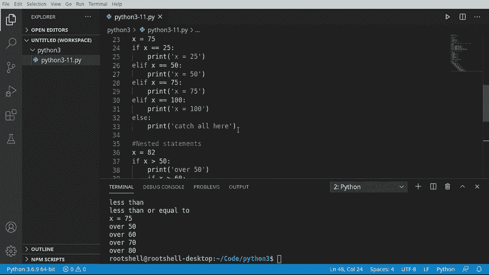

# Python 3全系列基础教程，全程代码演示&讲解！10小时视频42节，保证你能掌握Python！快来一起跟着视频敲代码~＜快速入门系列＞ - P11：11）Python流量控制：If - Else - Elif 

欢迎回来，大家好。我是Brian，让我们继续我们的Python 3之旅。在这个视频中，我们将讨论if else和ElF。这三者是什么呢？其实很简单，这是流程控制。当我们谈论流程时，我们在谈论应用程序的流，而这是流程控制的基本构建块。

在深入之前，我们需要谈谈一些基本理论。别担心。我会保持超级简短。我们有一个变量。我们称之为X，而x为真。一个非常简单的布尔值。我们可以打开它。我们可以关闭它。现在，我们在讨论流程控制。把流程控制想象成，当你还是个孩子时，你的父母看着你说。

如果你这样做，那么将会发生这个。这就是我们要讨论的本质。这是一个决策。理解起来并不是特别困难，但确实需要一些解释。所以X等于真。我们有我们的if语句。如果它将在某种条件下运行。条件。大多数情况下将评估为真或假。所以我们将说如果x等于真。

那么，做一些事情。如果它为真，我们将有一些代码会运行；如果它为假，我们也会有一些代码会运行。现在，这并不总是这样。我所说的意思是，有时候这边根本不存在。你只会评估为真，但你可以做这样的事情，比如说，如果它是真的。就这样，否则就那样。它可以像一本书一样阅读。你可以字面上说，如果Bob.Equals快乐。

如果Bob不高兴，那就做其他事情。就是这么简单。然而，你需要明白这是几乎所有应用程序的基本构建块。这叫做流程控制，你在控制应用程序逻辑的流。好吧。足够的理论。让我们直接开始。我们将查看if条件，所以。

我们将创建一个叫做X的变量。并且我们将说它是真的。这只是一个布尔值。我们以前见过这个。现在我要说if，你会注意到在VS代码中，它给了我们这些小模板。我们只会做普通的if。我们将说if x。Polen。

现在我们想打印一些内容。让我们运行这个，看看会发生什么。结果显示是的。所以我们的编程逻辑是x为真。如果x，注意我刚刚说的if x。我们可以说if x.Equals true。那它将打印出来。但它知道，你实际上不需要那样。还要注意这一点的深入。

我们之前谈过这个，还有这个冒号，所以如果你来自其他编程语言。这实际上是底层的样子。你有这些括号，大家都喜欢，C++、C#、JavaScript，以及所有C风格的语言，代码基本上是有缩进的。而Python省略了这些，所以所有这些都转换成那样。而且它更简短，更容易阅读。

你不需要担心那些奇怪的波浪线了。现在你可以继续执行。只要它在同一个缩进下。例如，如果X为真，则打印yes和again。看看yes和again。现在我们要说else，这就是我们返回的地方。需要在这里告诉Python我们还有更多内容要处理。

我们将简单地打印哦。当我们运行这个时会发生什么？好吧，x为真。所以如果x，然后它会运行这个。否则，它将运行那个else很有趣，因为else说。如果这没有发生，那么就运行这里的代码。每当你看到这些缩进时。把它想象成一个代码块，实际上称为作用域。

所以这将是一个作用域，这也将是一个作用域。这是一个更复杂的话题，我们将在未来的视频中讨论，但我希望你知道它的存在。让我们继续运行，你会看到yes和again，它从未打印no。我将说help，意思是确保这在屏幕上真的很突出。再运行一次。我们从未看到它。为什么，因为这是对的？如果x。那么打印这个。它从未跳到L。

所以让我们更改这些默认值。你会感觉到编程逻辑是如何进行的。X现在为假。它会说如果X。打印这些else，打印那个。那么这里会发生什么呢？它会到达x并说，不，X不为真。所以忽略这个代码块，而是跳到else并运行这个代码块，看看help。

按预期工作。

我们实际上讨论的是条件评估。它们基本上会是真或假，意味着真，就运行；假，就不运行，或者做一些完全不同的事情。让我们来看一些条件评估。我将说x等于100，y等于25。

所以我只是创建了两个小变量，我们将说如果。我们要说y等于x。我们想告诉Python还有更多内容要来。我们要打印这个。注意我在一行上完成这一切。你不一定需要做这些制表符缩进。如果你愿意，可以在一行上完成所有内容。所以我们在说如果y等于x。

注意有两个等号。如果你这样做，你是在说让y等于x的值。我们不想要那样。我们想在这里测试相等性。我们将说，be个潮。通过复制和粘贴的魔力，我们可以稍微加快这个过程。我们将查看我们的条件评估器。所以我将说如果y不等于。

然后我们可以说小于。所以如果 y 小于 x。而我想说大于。所以如果 wise 大于，这里真正要表达的是，你可以基于值进行一些非常复杂的决策。它们非常简单，易于理解，你所需要的只是理解符号。例如。

这个家伙看起来超级混乱，但我们在说如果 y 小于或等于。注意你有这个复合条件，所以现在这变得非常复杂，并且你把它都放在一行中。但这样做是非常方便的。你也可以做确切的应用，但你可以说大于或等于。我们来测试一下。

所以我们要运行这个，你可以看到它并没有打印出所有内容。它说不等于、小于和小于等于，那么这里到底发生了什么？

我们在评估 y 与 x，所以我们在说 y 是否等于 x，实际上并不相等。它们是两个不同的值。所以它不会运行这段代码。这就是我所说的条件评估会变为真，执行代码，或者为假，不执行代码。还有其他方法，但我们保持超级简单。

然后我们在说如果 y 不等于 x，这将评估为真，因为这两个是不相等的。那么打印这个出来，果然我们看到了。不等于。我不会逐行讲解，但你可以查看并看到这些哪个评估为真，例如。y 大于 x 吗？当然不是，25 小于 100，所以这永远不会运行。

而且我们在这里看不到它。现在，如果我们改变这个值。你会注意到输出也会变化。现在它不等于，但它大于或大于等于。这是极其酷且灵活的。现在，你开始理解我们的计算机是如何做决策的。它基于简单的 if 逻辑。😊

如果这个语句或这个条件评估为真，那么执行一些特定的代码。

好吧，这一切看起来都很酷，但看看这个。这有点混乱。它只是一大堆 if 语句。阅读起来非常困难。没有缩进。然后你得逐个阅读才能找到你想要的。我们来谈谈 LF，这实际上是一种切换解决方案，当我说切换时。

其他语言有一个叫做 switch 的概念，就像想象一个大型的灯开关面板，你可以开关它们。Python 并没有这个概念。有变通的方法，但它并没有这个特定的概念。所以让我们看看如何绕过这个。我要说 x 是 10。现在我们想要一个开关组。

我们希望能够随意开启和关闭代码。所以我将说如果。X 等于 25。那么我们只需打印出。Segals 25。现在，我们想把这个合并成一个不完全新的 if 语句的东西。我们希望这一切保持在一行，因为信不信由你，这实际上是两个不同的语句。它们将分别执行。所以我们要做的是 L F。X 等于 50。

所以现在它将把这一切作为一行来读取，因此它将说如果 x 是 25。执行这个，否则，如果 x 是 50，执行这个。我们可以将这个概念不断扩展。继续。说如果 X 是 75。然后我们可以说 100。我们可以结束这个，说你知道吗。如果我们没有找到任何这些开关，使用 L A 语句。

我们可以简单地说 else，然后做一个称为捕获所有的内容。如果没有这些触发，它将执行。所以它在 10。让我们看看这里会发生什么。它触发了我们的捕获所有，看到了吗？

所以它遍历并评估并说 x 是 25 吗，不，是 50 吗，是 75 吗，是 100 吗。Else 被触发。让我们把这个改为 75，看看会发生什么。你可以看到现在它只说 x 是 75。那么这里发生了什么呢？它说。评估这个，评估这个，评估这个，转为真。现在运行这段代码，我们完成了，所以它将跳出所有。非常简单，非常容易的逻辑。

它看起来比这堵巨大的文字墙好得多。非常容易理解。随着你深入编程，你会发现如果你不喜欢 L，还有另一种方法。还有一种方法，称为嵌套语句。这基本上是一个语句中的语句中的语句中的语句。

你可以一直继续下去。让我们去看看。所以我将说 x 等于，并且我们随便选一个数字 82。我们说它 X 大于 50。然后我们说超过 50。但把这个放在一些引号里。因为它大于 50，我们想继续。所以我想说 e x 实际上，大于 60。然后。

我们可以一次又一次使用相同的逻辑。这样就形成了一个非常重复的模式。例如。我可以这样说，我们只需抓住这个并继续。注意缩进是如何越来越大的。你必须这样做，否则。

Python 将其视为一个新语句。因此，例如，这里实际上会创建一个问题。它不会按照我们想要的方式执行。因此，我们需要缩进，缩进。这就是我喜欢 VS Code 的原因，它在缩进的位置放置这些行。现在你可以看到这是一个语句。这是一个语句。依此类推，它变得非常。

非常酷，非常迅速。现在，有时候粘贴会背叛你，你必须重新缩进。行会是你的指引，真的告诉你该去哪里。假设，如果超过90。我不想让这变得太荒谬。我们继续说，F。X大于或等于100。我们就到这里结束。Pri。

就说X代表某种进展吧。现在，一开始我们就遇到一些问题。我看到这个小波浪线，它表示意外的缩进。所以我们得把这个退回去，修正我们的缩进。哦，它不喜欢这个。所以我们可以抓住整个内容，然后把它放进来。应该修复了，看，成功了。保存并运行。哦。

我们又遇到了一个缩进错误。看看这里发生了什么。这是Python的一部分，会让你感到非常烦躁。如果你的缩进不正确，它会告诉你，并且你会收到缩进错误。现在我的所有缩进都正确，它应该按预期运行。那么你会使用哪个呢？好吧。

这取决于情况。所以，例如，在这个场景中，我们有所谓的“落空”，意味着x是82。所以它会判断为真，跳到下一个，真，再跳到下一个，真。然后再跳到下一个，真。接着突然故障。所以它在这里停止执行，尽管还有更多语句。而且你得面对这些可爱的缩进，爱它们或恨它们。

记住，缩进告诉Python你在编程逻辑中的位置。😊 所以有些人喜欢Liv，有些人喜欢落空，期待在其他人的源代码中看到这两者，选择适合你的解决方案。我的个人偏好是LF。
