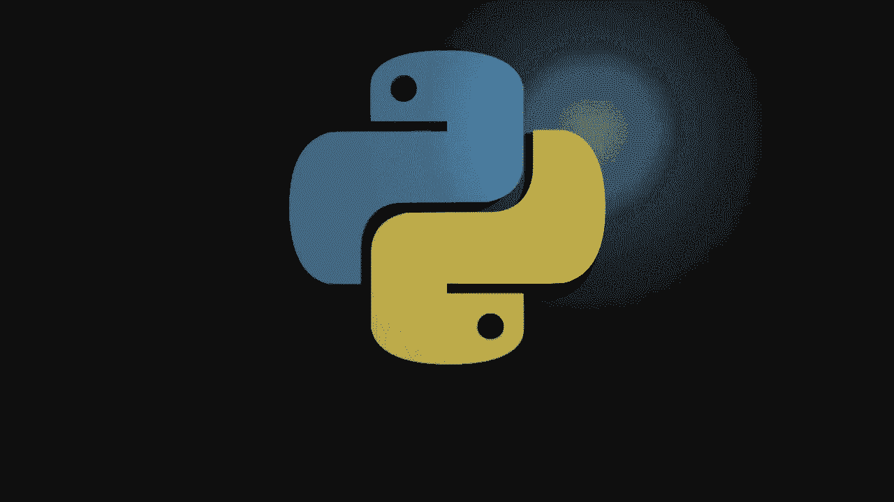
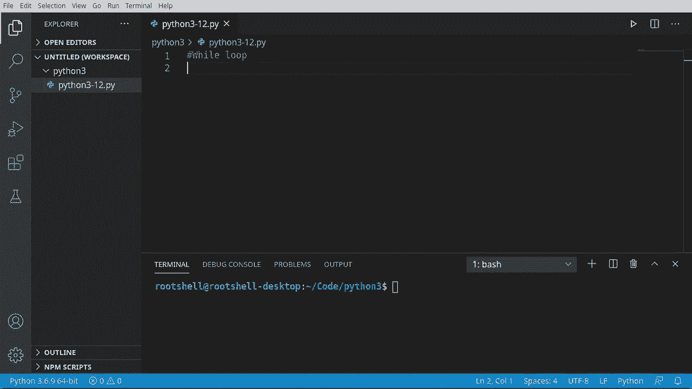
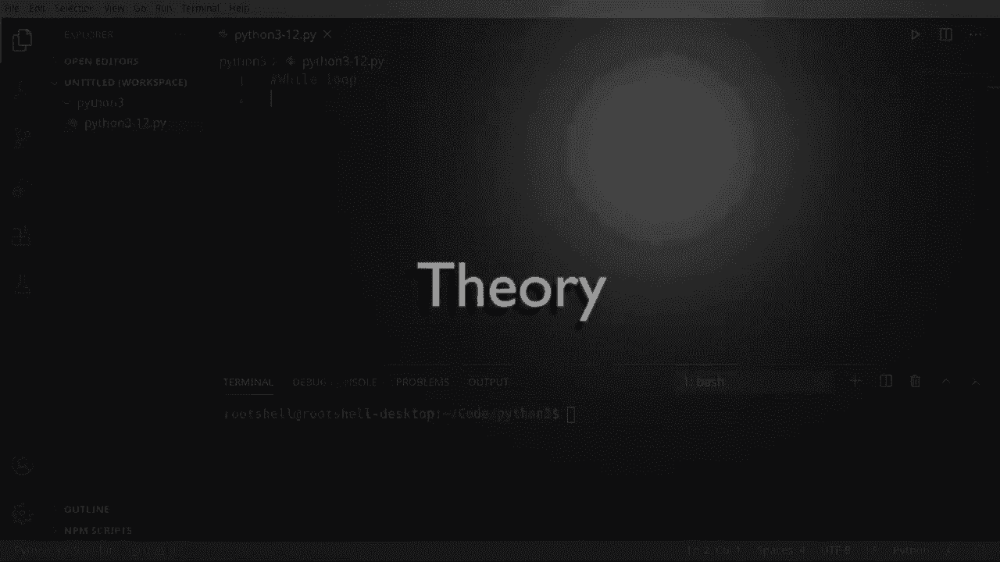
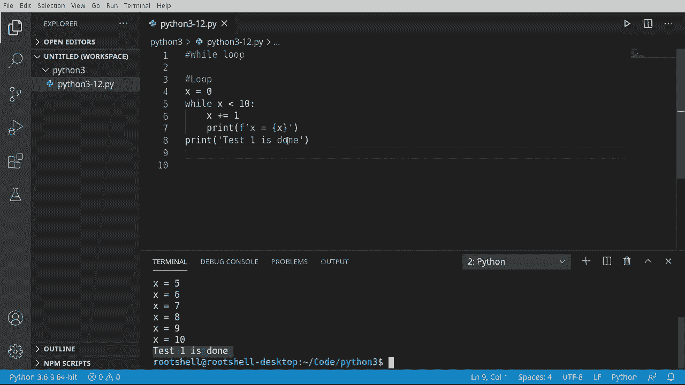
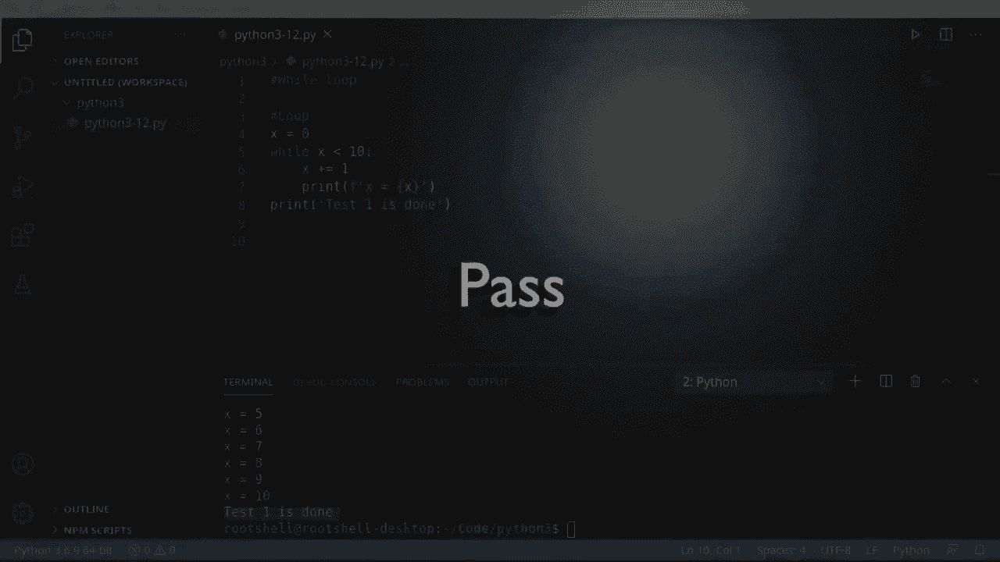
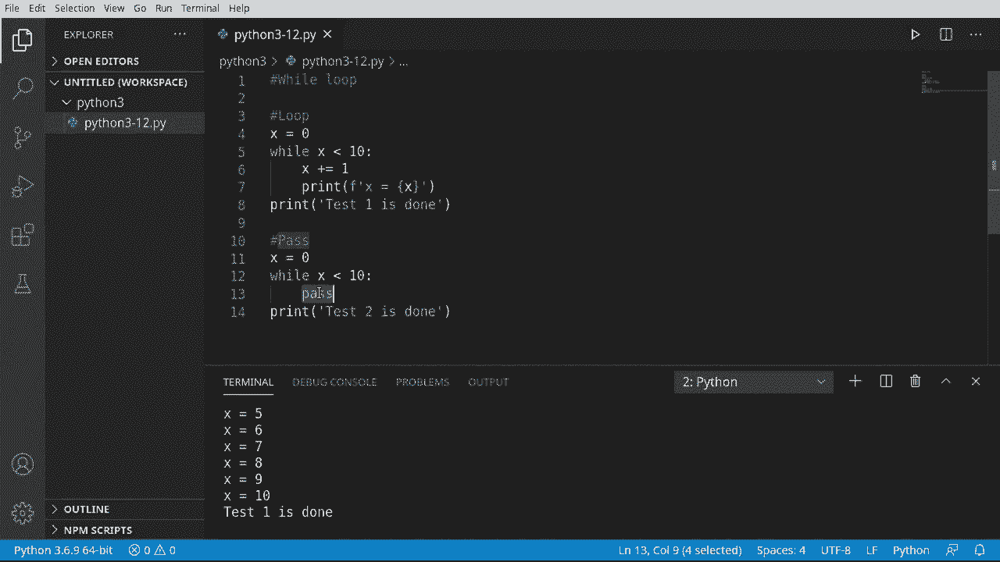
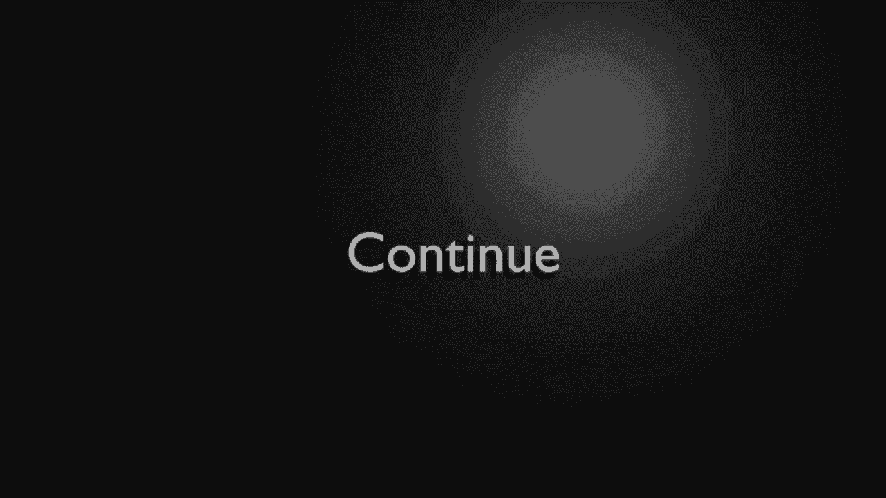
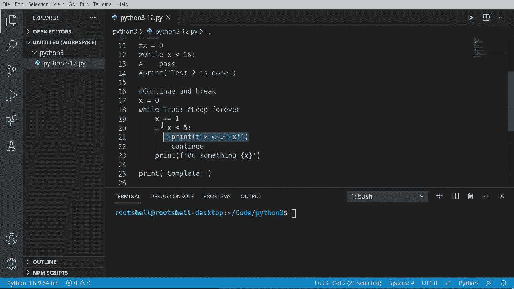
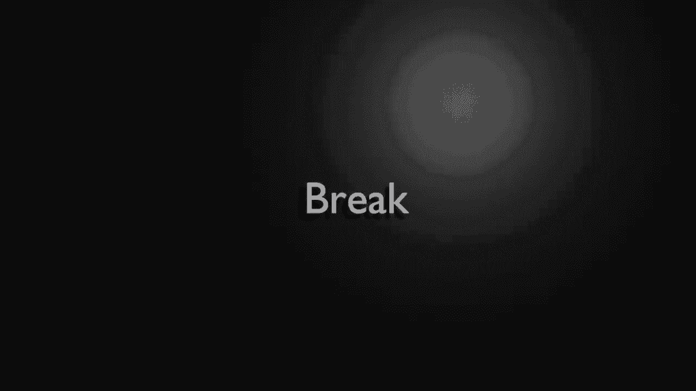
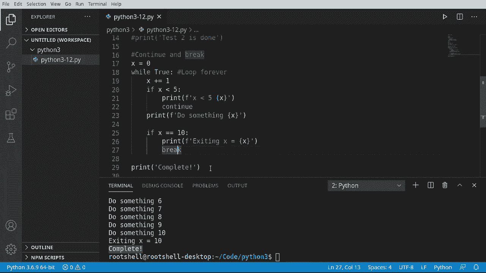

# Python 3全系列基础教程，全程代码演示&讲解！10小时视频42节，保证你能掌握Python！快来一起跟着视频敲代码~＜快速入门系列＞ - P12：12）Python流控制：While 循环 

欢迎回来，大家好，我是Bryant，让我们继续我们的Python 3之旅。我们要讨论while循环。这是基本的流控制。它将证明一点：你的计算机非常愚蠢。没错，我说的就是这样。你的计算机真的很笨，我们将证明这一点。

所以循环就是简单地重复执行代码，直到你告诉它停止，因为计算机并没有足够聪明去知道何时退出。

让我们来看看。

好的，在继续之前我们先来一点理论，我们有程序的入口，我们将进入某种循环。我们就称之为这个循环。它会评估这个条件并运行某种类型的代码。现在不管它运行什么类型的代码都没关系。让我们把那个小家伙去掉。通常你所做的是某种递增的功能。例如，计数某些东西。

增加数字，查找套接字上的数据或类似的东西。所以它会说，好的，开始循环。所以我想在这里连接，来了。然后执行某些操作。如果你不退出这个循环，它就会真的回到这个循环里，你的程序最终看起来会像这样。我们称之为无限循环，你将进入程序，进入一个循环。

然后你就反复循环这个代码，直到你告诉它停止并执行其他操作。你可能在问自己，为什么你甚至需要一个循环。好吧，想一想。你进入你的程序。你进入你的循环。假设你想做某件事100次。你现在需要增加某种计数器。

一旦你达到了那个计数器，你就跳出这个循环并停止你的代码。有一些循环是故意设计为无限的。我的意思是它们看起来是这样的。程序开始，你进入你的循环。然后它就会永远循环。例如，当你进行图形用户界面编程时。

你有一个叫做用户界面循环或事件循环的东西。基本上程序将永远运行，等待用户点击鼠标或移动某些东西。这个循环就会永远发生，直到程序关闭。

好的，现在我们理解了循环是什么，让我们看看实际操作。所以我要说x等于0。我们将创建我们的while循环。这将看起来非常类似于if语句，因为它会像if语句一样评估。意味着这个循环将执行，只要我们即将给出的条件为真。

有人说教训的行为少于10。那么就做点什么。这将是一个关于计算机愚蠢的很好的例子。它们会按你告诉它们的方式去做。正如你所要求的那样。有一点额外的。你看到这个陈述有问题吗？但我们所说的是x是0，而x小于10。打印这个，但我们从不增加X。它始终是0。因此，这将始终为真。

它将永远运行。这就是我告诉你无限循环的地方。你看它总是说0。它将永远运行，控制台也疯狂了。有人来终止它。它将永远继续，直到我关闭程序或关闭计算机。因此，我们实际上需要增加X。一旦我们这样做，我们就增加了计数器。

最终x会变成10或更大，这样就会退出。1到10的循环现在按预期工作。因此，循环可以非常强大且易于使用，但你可以通过意外创建无限循环来搞砸你的应用程序。现在，如果你想知道，可以继续打印这个。我们要说的是，下一个完成了。

我们想知道这个循环何时完成执行，我们使用。你猜对了，缩进，这决定了我们的范围或代码块。因此，当这个条件为真时，执行这个范围或这个代码块。然后，当我们完成循环时，我们将跳回这里。

让我们看看实际效果，我要清除这个。果然，1到10，然后测试完成，因此它的工作方式正如你所想的那样。

让我们稍微绕一下，谈谈pass。你在Python中会看到这个，很多人并没有真正解释它。所以我们假设while。我们就用这个小模板。它将说。while表达式pass。但这是一个有效的Python表达式。比如说0，并且给它同样的逻辑。

注意这将如何运行。现在引擎盖下发生了什么，这仍然在运行。或者说它在运行吗？让我们来看看。我将关闭这个终端，以防万一。那么我们说测试2完成。因此x是0。当x小于时，注意我们从未像在这个例子中那样增加它，我们将通过。然后最终打印出测试2完成。注意它从这里说测试1完成。

但它永远不会达到测试2。那么在引擎盖下发生了什么，这个脚本仍在运行。它只是在这里做一个无限循环。因此，每当你在循环中看到pass时，要非常小心，因为你正在创建某种无限循环。Pass是Python中的一个特殊关键字，告诉Python。

不采取任何行动，继续正常做你该做的事。

因此，对于pass要非常小心。

我们刚刚讨论过pass，这在循环中非常危险。仅仅因为你可能会意外地无限循环。嗯，底层的情况并不简单，但我们会尽量简化。我们将讨论continue和break。因此，我们将说x等于0。让我们做一些非常糟糕的事情。

我们要说的是，当条件为真时，执行某些操作。如果你在关注这个，你就会知道“while”会以“if”语句的方式来评估这一点，并且它会判断这个条件是否为真。执行循环，并一直重复，直到这个条件不再为真。然而，我们使用了Python的true关键字，所以这将无限循环。

你会在代码中看到这一点，因为有时人们只是想循环，直到满足某个任意条件。这个条件可以是键盘输入，也可以是某个网络连接，或者其他任何东西。你会经常看到这个。因此，你需要知道何时跳出循环或如何处理特定条件。首先，我们来谈谈continue。我们将说x加上goess1。如果x小于5。

我们想要的就是跳过这一部分。我们其实不想做任何事情。因此我只是说x小于5，无论数字是多少。然后我们将继续。而continue所做的是返回到开头，继续你原本要做的事情。

然后我们将添加一些逻辑。如果x大于10，我们就会执行某个操作，打印出X。并且我们会在最后一行放一个打印语句。请注意，这与while在同一行。因此，直到循环完成之前，这个打印语句不会执行。我喜欢VS Code和大多数编辑器的一点是，你实际上可以折叠。

实际上看起来是这样的。一旦这个循环完成，它将打印“完成”。让我们清理一下，在这里看看实际效果。哦，你注意到吗？它工作得正如我们所预期的那样，因为计算机虽然很快，但非常愚蠢。那么这里发生了什么？它会说如果x小于5。

打印出来，然后返回到开头，因此我们仍然在一个连续的循环中。我们需要修复这个。

所以我们的编程逻辑基本上是，如果小于5，就返回到循环的开头，并继续增加计数器。如果大于5，就执行某个操作，但我们也希望在达到10时停止，所以我将说如果x等于10。打印。然后x等于。这样我们可以看到x实际上达到了那个值。

现在我们要使用 break。说点关于它的事。别担心，我们不会破坏任何东西。Break 就像想象中的野外循环，这个家伙。就像一个小监狱，我们要从监狱里逃出来，直接跳到下一行。所以它将在这里继续执行代码，然后运行这个语句。

继续看看这个实际效果。好的，确实，我们有。X 小于 5。我们有 1，2，3，4。然后做点什么，6，7，8，9，10。当我们达到 10 时，我们将退出，完成。这就是循环的简要说明。这段视频的主要要点是，循环非常，非常强大，但你需要有某种条件来进行评估。

否则你会创建一个无限循环。创建无限循环的简单方法就是简单地使用 pass，这样它会永远循环。你也可以说 while true，这也会创建一个无限循环。但你可以使用 continue 来继续在循环内的流程，或者使用 break 来打断这个流程，应用编程逻辑。

