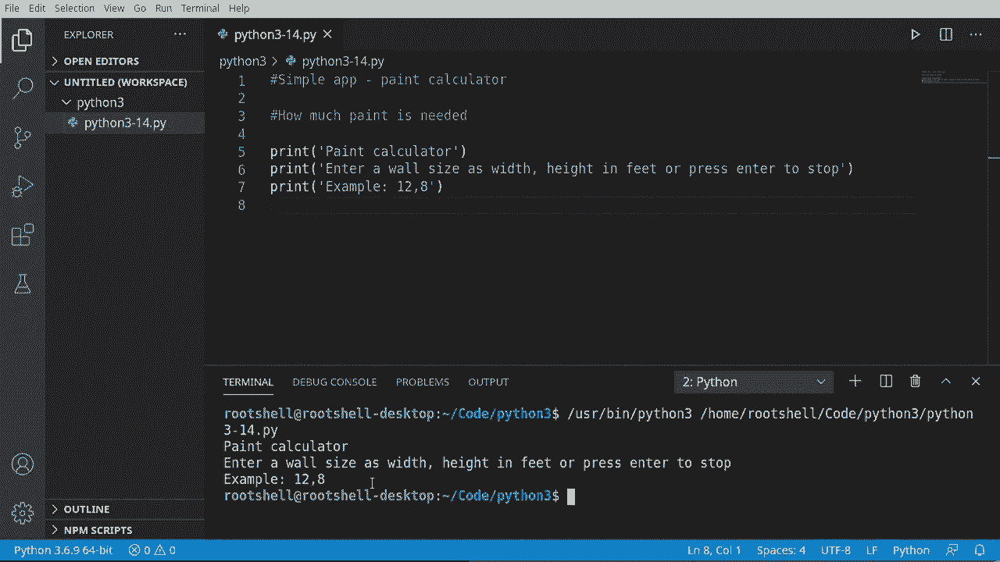
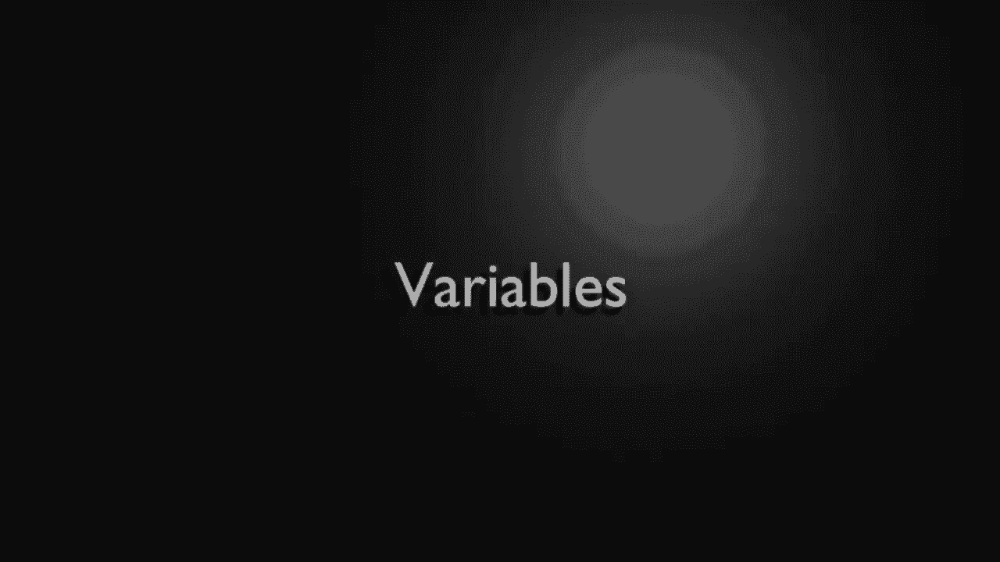
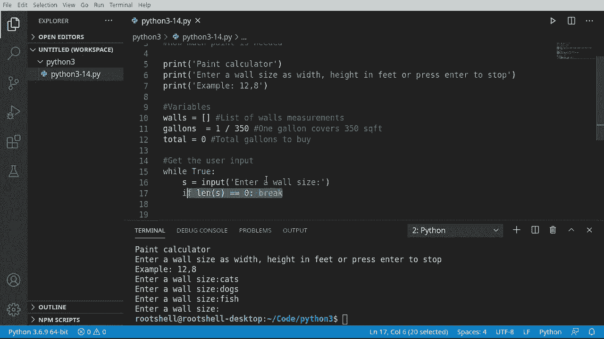
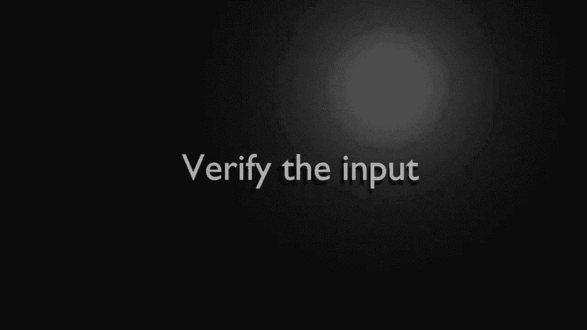
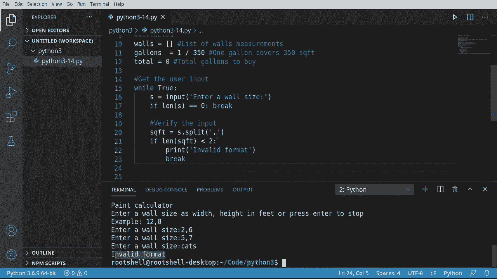
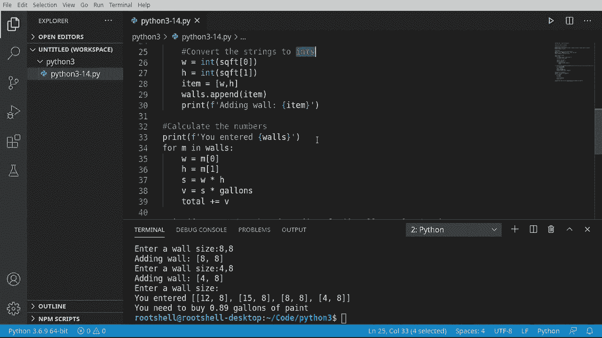
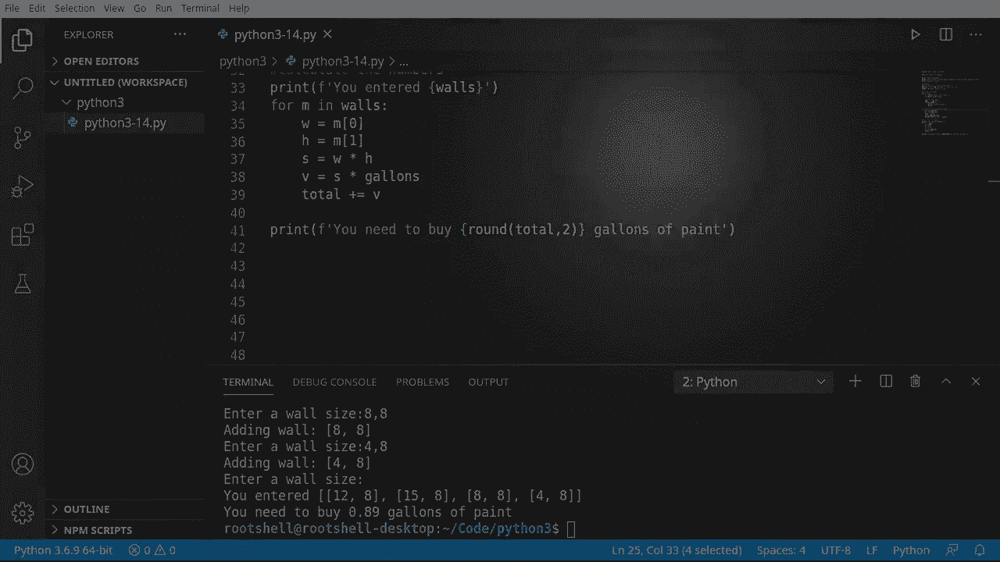

# Python 3全系列基础教程，全程代码演示&讲解！10小时视频42节，保证你能掌握Python！快来一起跟着视频敲代码~＜快速入门系列＞ - P14：14）构建简单的应用程序：油漆计算器 - ShowMeAI - BV1yg411c7Nw

欢迎回来，大家好。我是布莱恩。我们将使用到目前为止学到的一切来创建一个简单的应用程序。如果你刚刚调入，有13个其他视频在这个播放列表中，你需要回去看看，如果你不懂Python。

但我们将制作一个油漆计算器。因此，我们将确定实际需要多少油漆来粉刷一个房间。当我们运行这个时，用户将看到类似这样的内容。油漆计算器：输入墙的尺寸，格式为宽度，逗号，高度（以英尺为单位），或按回车停止，例如12a 8。没有空格之类的。他们可以输入任意数量的墙，最后。

这将神奇地告诉他们需要多少罐或多少加仑的油漆。我们来看看。😊。

我们需要做的第一件事是设置一些变量。因此我们将创建一个名为“walls”的列表。这个列表将仅用于保存测量数据。我们要添加的第二件事是加仑。这将是每平方英尺所需的油漆加仑数。我不是专家。

但我确实出去查了一下谷歌。根据谷歌，1加仑油漆覆盖350平方英尺。我对此表示怀疑，因为每次我买油漆时，我从来没有买够，必须回到商店再买。也许这个应用程序会有所帮助。而且总数将是我们需要购买的油漆总加仑数。

我们稍后会用到这个。购买的小加仑。到目前为止，我们的应用程序完全没有功能。但这即将改变。我们将获取用户的输入，而我们还没有谈论过这一点。我们将创建一个无限循环。我们将说“while true”。你可能会想，哦，哇，哇，哇。

你正在制造一个无限循环。没错。我们将跳出这个。我将向你展示如何。所以我们将获取一个变量。我们将使用内置的输入函数。有不同的方法来做到这一点，但我们将使用输入。我将说“输入”。墙的尺寸。

然后我们要跳出这个，如果他们没有真正进入。任何数据，所以我必须说“Ly”。的“S”。零。那么如果你有点怀疑这一切是什么，我们想要的就是调用“break”。请回去看看我之前做的13个视频。所以让我们测试一下。我们要运行这个，结果显示“内墙尺寸”。

她知道我们的程序停止了并在等待我们。好吧，我就输入一些无效的数据。我必须说猫。然后它想要另一个。吃。还有另一个鱼。然后我就按回车。果然，它退出了。所以这是使用无限循环来收集用户输入并测试何时需要退出这个循环的正确方式。

现在我们可以获取用户输入，我们需要对其进行实际处理。在尝试处理之前，我们首先应该验证用户给我们的内容确实是我们所期望的。我们可能会遇到麻烦。记住，这一切都是从12a 8的例子开始的。好吧，我输入了catstocks鱼。

我不确定你怎么计算猫的平方英尺，但我相信这会很有趣，可能还需要去兽医那里。不过，无论如何。我们要说SQFT等于，我们要说S分割。因为S是我们从输入函数得到的变量。在这里，它将是一个字符串。

所以我们可以把它当作字符串来处理并说，a分割。我们想要再次以逗号进行分割。如果你对我在做什么一无所知，请观看之前的13个视频，不过。字符串有一个内置函数叫做split，它可以基于一个字符或字符序列返回多个值。所以我们的平方英尺将是从那个split函数返回的值。

所以我们要做的第一件事是确保里面确实有两个值。如果少于两个。好吧，我们要告诉用户发生了错误。Brench。我们继续说，格式无效。然后我们将退出这里。现在记住，break不在乎它在哪里，它将跳出这个循环。

让我们在这里测试一下。所以我们要运行这个，它会显示内壁尺寸。我会说，好的，2，ma 6，运行得很好。5 逗号 7。让我们输入一些无效的数据。哦，格式无效，它停止循环并退出程序。所以它实际上是在测试确保有两个项目是以逗号分隔的。

好吧，我们还没完成。现在我们获得了用户输入。需要转换它，因为记住我们在处理字符串，而我们想要处理数字。具体来说，我们想要将字符串转换为整数。这可能会导致麻烦。我们将演示这一点。所以我要说W等于。我们将调用n。

我们将做一些叫做类型转换的事情。我稍后会做一个完整的视频来讲这个。但是当我说类型转换时，想象一个拿着魔法棒的巫师，他将施展一个法术，把某物变成其他东西。所以我们在说我们想要施展一个整型的法术，将我们给的任何东西转换为整数。在这种情况下。

我们将获取平方英尺的第一个值。去抓这个。给它复制粘贴。嗯，复制粘贴有点多。然后。让我们获取另一个维度。现在我们有了平方英尺0和平方英尺1的宽度和高度。有趣的是，如果我们尝试这样做而它实际上不是一个数字，我们将会遇到麻烦。

它实际上会出错，我们的程序会停止并遭受可怕的失败。我会在另一个视频中讲解如何处理这些情况。这个程序的整个要点是用我们在13个视频中学到的知识来做一个程序。现在，我要说项目，我想要制作一个包含宽度和高度的列表。

我们将把它添加到我们的墙上。如果你在想我从哪里得到墙的，记住，它在我们变量的最上方，只是一个空列表。所以我们要说墙。让我们把这个项目添加进来。现在我们有一个列表，保存他们添加的每一面墙的尺寸。

让我们先打印出来验证一下，嘿，我们做了些什么。所以，添加。哦。😮。继续，保存并运行，来测试一下内墙的尺寸。好的，3乘6。这是一面很小的墙，它显示添加墙。好的，太好了。那么8乘8。我们继续说9乘12。现在，让我们测试一下这个转换，看看它是如何惨败的。

所以我要说两个猫。哦，还有有效的整数字面量，基数为10的猫。这看起来很丑，而且确实如此。这是一个值错误。我们将在未来的视频中讨论错误。我只是想让你明白，如果你遇到值错误，发生的事情是我们基本上在说我们无法将其转换为数字，或具体来说，转换为整型。记住，想象一个拿着魔法棒的巫师，我们施展的法术叫做整型，这将把我们施展的任何东西转换为整型。一旦我们到了这一步，剩下的就是计算数字并告诉他们需要多少油漆。

我喜欢告诉他们他们输入了什么。所以我们会说F。你输入了。这样，如果有任何差异，我可以说给我发个应用的截图，我可以说，哦，不。你搞错了，你在这里输入了错误的值。然后我们要说4 M。M将用于墙的测量。我们会说宽度将是M 0。记住。

它是一个基于0的索引。在我们的墙内，我们创建了另一个列表。所以我们获取这个宽度。我们可以说H。1。记住零基索引总是让新手困惑。现在我们要计算平方英尺。因此我要再创建一个变量叫S。我会说这就是宽度乘以高度。

现在我想得到某种值。所以我会说这是S或平方英尺。乘以。加仑。你可能在想加仑从哪里来的。记住，它就在我们创建的全局变量的最上面。我查过了。一加仑的油漆应该覆盖350平方英尺，所以。😊，这个值就是1除以350。

不知道这是否准确，我高度怀疑，尽管我确实信任谷歌。然后我们将抓取我们的其他全局变量总数。我想说加上B。因此我们只是增加它。你可能在想加上等于。我们在之前的视频中讲过。这基本上意味着我们说总数等于总数加上。

值，但是我们只是简化它。现在我们要向下移动并深入。我们要进行一些调整。所以我们在这个代码块中退出。然后我们回到主程序。我们要说王子。我们只是告诉他们你需要去买一些油漆。

这是你需要购买的油漆数量。你需要购买。让我们继续。如果我们只说总数。它会给我们一个疯狂的数字。所以我喜欢让它更美观。我会说四舍五入。我们将总数四舍五入到两位小数。冇嘅。

告诉他们你需要去买多少加仑的油漆，四舍五入到两位小数。让我们测试一下这个东西，看看它是否有效。所以我会说。12乘8。再做一个，15乘9。其实，让我们用8来做。如果天花板的高度不同，那就奇怪了。让我们继续说我们有一个8乘8的。

一个4乘8的房间，形状有点奇怪。然后我不想再输入了。所以我就直接按回车，你需要买。一加仑的油漆。基本上它会使用不到一加仑，我应该会有一些剩余。我不知道这有多准确。老实说，我有点在看我的小办公室。

我觉得做这个需要超过一加仑。因此，遇到疑问就怪谷歌。但是，这个视频的主要要点是。尽管我们才刚刚做了13个视频，我们实际上只是触及了Python所能做的表面。你可以编写一些相当有趣的编程逻辑。我们刚做了一个简单的应用程序。那就是油漆计算器，告诉我们需要购买多少油漆。

我们允许用户输入他们想要的任何数量的墙。我们正在验证用户输入。然后我们将该输入转换为正确的数据类型。接着我们计算他们需要多少，并将其返回给最终用户。

