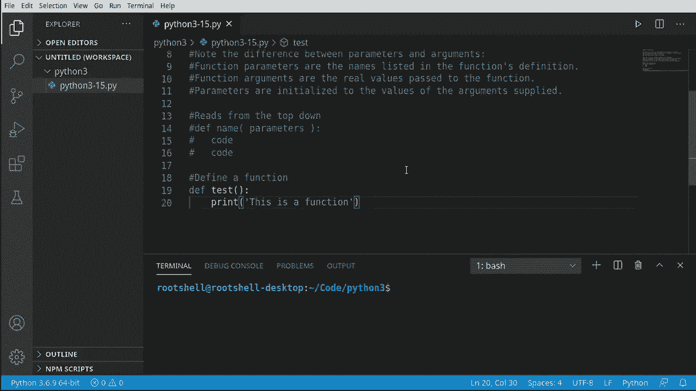
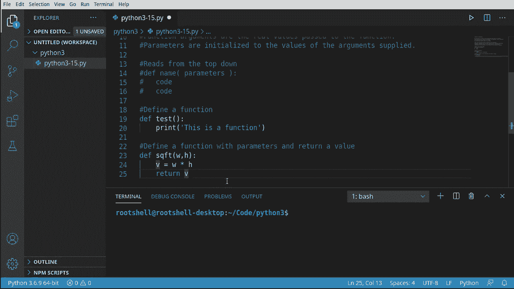

# Python 3全系列基础教程，全程代码演示&讲解！10小时视频42节，保证你能掌握Python！快来一起跟着视频敲代码~＜快速入门系列＞ - P15：15）Python函数介绍 

欢迎回来，大家好，我是布莱恩，我们将继续深入Python 3，介绍函数。那么，函数是什么呢？它是一个代码块，仅在被调用时运行，而我们之前写的所有代码都是在Python读取时立即运行的。

它会运行。这将改变这一点。我们将编写一些代码，并决定它何时运行。这是编程的另一个基本构建块，涉及许多理论和术语，因此我们会将其分成多个视频。不过，这个视频的一些关键要点是。

你可以将称为参数或实参的数据传入函数，你会听到这两个词是可互换使用的。这真的很困惑。因此，在下面，我写了一些注释，说明参数和实参之间的区别。函数参数是在函数定义中列出的名称，而实参是真实的值。这真的令人困惑。

为什么他们不直接称其为名称或值，而要称其为参数和实参呢？而且每个人，包括我自己，都会混淆这些。你会在一些视频中听到我称其为参数，而在其他视频中称其为实参。我也听过一些编程经验远超我的人也会把这两者混淆。

这确实有点令人困惑。另一个主要要点是，函数可以作为结果返回数据。返回实际上是一个关键字，我们将对此进行讲解。

暂时深入这一领域，到目前为止，我们处理过语句。我所说的语句是什么意思呢？到目前为止，我们做了类似这样的事情。有一个语句，一个语句，一个语句。Python从上到下读取。例如，我们想打印一些内容，也许在那个循环内做一个while循环。

我们可以像有一个if语句一样。它就像一本书一样从上到下阅读。但现在我们要做的是引入一个函数。这是一个独立的代码块，除非我们明确告诉Python去运行这段代码，否则它不会运行。在一个函数中，可以调用其他函数，依此类推。现在的最终结果是，我们可以从根本上。

决定我们的程序如何运行以及它的行为。我们可以使用这个进行一些相当复杂的编程逻辑。另一个关键要点是，我们正在引入范围的概念。到目前为止，我们所做的一切都在每个函数中的所谓全局范围内。每个代码块都有自己的范围，这是我们将在未来的视频中深入探讨的内容。

但请理解我们正在微妙地引入这一概念。

所以让我们测试一下，继续定义一个函数。我们将说 D EF，这是定义或定义的缩写。然后我们给它一个名称，接着就是那些小括号。如果我们忘记了它们，我们将会很糟糕。我们需要括号。在那里，我们可以定义任何参数。

我们将这个第一部分保持非常基础，并且不需要参数。但我们仍然需要在其中加上括号，然后是冒号。按下回车，注意大多数 IDE 会自动为你换行并自动缩进。然后我们可以填入我们的代码，这里几乎可以放入任何内容。

我只是放一个打印语句以便测试。我们只是说这是一个函数。现在我们可以根据需要使用这个东西。

好吧，这最后一个有点简单，让我们提高一下难度。因此我们将定义一个带参数的函数并返回一个值。在最后一个视频中，我们制作了一个油漆计算器，它根据平方英尺计算所需的油漆量。我们本可以很轻松地在其中使用函数，而大多数程序也会这样做。

所以我们将创建一个名为 S QFT 的函数，它是平方英尺的简写。括号，让我们定义一些参数，我要说的是，W 代表宽度，H 代表高度。现在我们可以在这里添加我们的编程逻辑，所以我们要返回的值将简单地是宽度乘以高度。

现在我们将使用 return 关键字来返回那个值。注意这两个都非常简单，但它们在根本上是非常不同的。第一个基本上没有参数并运行一些代码，一旦完成，它就直接跳回这里。而这个，我们必须给它两个参数，并且会有一些逻辑。

它将返回一个值。我们决定是否要实际使用返回的值，这并不是强制性的。如果我们想，可以忽略它。但这就是我所说的函数可以变得非常复杂，非常迅速。我们有两个非常小的函数，它们的作用截然不同。

让我们看看这实际上是如何工作的，我们将如何调用一个函数。我们所说的调用一个函数是什么意思，记住，这段代码不会执行，直到我们明确告诉 Python 运行它。让我们按原样运行我们的程序，看看会发生什么，绝对什么都不会发生。所以它所做的是从上到下读取。它在说定义 test，定义 S QFT。

它已经在内存中排队准备好了，但在我们告诉它之前，它不会实际使用它。所以让我们告诉它运行它。大多数编辑器足够聪明，会告诉你，嘿。这是一个实际的函数。在VS代码中，这个小块意味着它是一个函数。注意是一个块，因为它是一段代码。如果我只是点击确认或按回车或点击它。

它什么也不做。实际上它不会运行。我们必须添加这些括号。现在，突然间你会看到它显示“de test”，并且知道我们试图调用那个函数。我们继续运行，看看，这就是一个函数。所以Python是从上到下读取这个的。定义测试，定义SQFT，来到这里并说，哦，它想实际调用这个。

没有参数，所以我们不需要提供任何参数。你可能会想，这有什么大不了的，为什么我们还要玩函数，我是说。我们可以直接打印出来。好吧，让我们看看一个具体的情况。假设我们想多次调用那个函数，或者说4次在范围内。

我们将说范围为四，因此我们想多次调用它。现在我们可以这样写。但有时，我们可以这样做。你会看到有人这样做。然而，这不是最佳方式。如果你的老板过来，告诉你，我希望你这样做20000次。哦，你会有一个非常大的文件来调用它。

这是一种更简单的方法。你会说4次在范围内，然后你会调用它。所以我们现在所做的是创建一个循环，并有一个下限和一个上限。它将调用它。所以我们没有创建一个无限循环，它会调用我们的函数。让我们看看这个在实践中是如何运作的。它就在那里。所以这就是函数的力量。

你可以定义一段代码，然后决定何时以及如何运行。现在，按照这些视频的典型方式，我确实喜欢提高难度。所以我们将调用一个带参数的函数。这就是我说的，它会迅速变得复杂。记住我们的小伙伴。

SQFT函数，我们定义的，实际上我们还没有真正使用过。现在我们说x等于SQFT。现在我们有了一些参数，它足够聪明，知道这是一个p。所以我们现在必须给它一些信息，假设12乘以8。这里的额外问题。这些数字是参数还是参数。好吧，它们是参数。

所以上面的这些是参数，它们在函数定义中。我们输入的值是参数。你会遇到人们会争论这个，因为大家容易搞混。好的，让我们继续打印出平方英尺。所以平方英尺是96。现在你看到它有多强大。

你可以定义某种逻辑，然后在需要时按需调用它，并从中获取值并相应地使用它。快速回顾一下我们在这个视频中讨论的内容，函数是很神奇的。它们也非常复杂。代码是从上到下读取的，你必须使用`DEF`或`def`关键字来定义一个函数。函数可以有零个或多个参数，这些参数必须被传入参数值。

