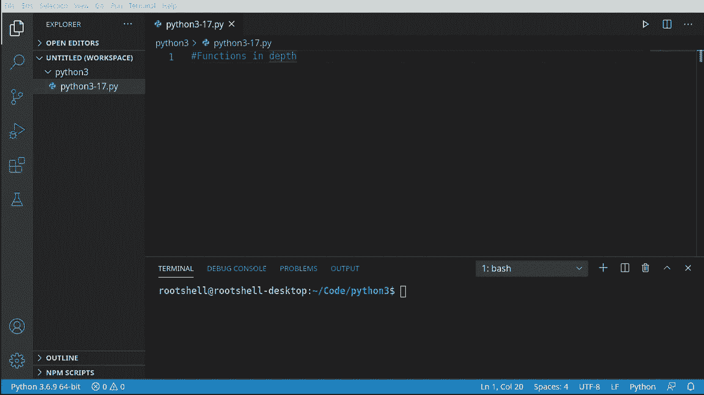
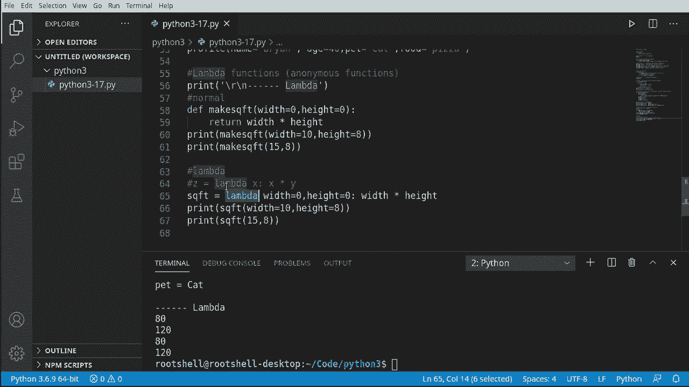

# Python 3全系列基础教程，全程代码演示&讲解！10小时视频42节，保证你能掌握Python！快来一起跟着视频敲代码~＜快速入门系列＞ - P17：17）函数进阶 

好的，在这个视频中我们将深入探讨函数，特别是参数和不同的处理方式。例如，你可以在一个函数内定义另一个函数。这太疯狂了。因此，让我们深入看看。

好的，我们先从简单的开始。我们讨论的是没有参数，没有争论。我们只会做我们之前做过的事情，这样我们就有一个良好的基础来开始。我们已经做过多次了。因此，我们将只打印出来，并说这是正常的。函数，这算是我们的起点。我们将开始一段小旅程。

我们将要做的是潜入疯狂的深渊，看看会变得多疯狂。因此。我们现在就来调用这个。你注意到我把这个放在这里吗？这些是转义字符。返回换行符和一些破折号及参数。我们将把它分开，因为在这个视频中我们会有很多输出。

我们希望能够看到这里发生了什么。因此，我会在进行时复制和粘贴这些。我们正在调用这个函数。它按预期工作。如果这一切在此时看起来不清楚，你需要停止观看这个视频，去看前面的16个视频，以真正理解我们将要讨论的内容，因为我们将毫无保留地直接潜入深水区。

让我们去掉辅助轮，谈谈位置参数和关键字参数。好的，这里会变得非常复杂，非常快。所以我们要定义一个叫做message的函数。我们要说名称。消息。然后我们需要一个年龄。所以我们有几种不同的数据类型要处理。

很明显，它会像一个字符串和一个蚂蚁，所以我会说打印。你好。然后我们想要名称。接着是消息。你是。然后无论多少年。他们告诉我们。因此，从根本上看。这似乎并不是火箭科学，但我们可以开始做一些非常，非常疯狂的事情。所以我会把这个抛出来。

位置关键字参数，所以当我们运行这个时，我们会看到输出被分开。我们来定义消息。并按照你预期的那样调用它。现在。我们在这里做的称为位置。你注意到有名称、消息和年龄。这些是位置。把它想象成一个列表。它是零基的，所以是0，1，2。

我们不需要给它一个索引。它足够聪明，知道索引是什么。但我会说。布莱恩。假设，早上好。然后给它一个年龄。假设我22岁，天哪，我希望我22岁。其实我并不是。这是位置参数。继续运行这个。我们将看到。果然，嘿，布莱恩。早上好。你22岁了。所以看起来不错。

让我们抓住这个，稍微玩一下。😊，我们将使用位置参数。但我们将使用错误的顺序。让我们搞砸这个。所以我会说22。和。早上好，所以我们真正做的是把这些调换过来。输出突然没有意义。嘿，布莱恩22，你是早上好岁。

这完全没有意义。这就像是一个连环杀手写的东西。好吧，所以。我们在这里做的是定位，并且我们搞错了顺序。那么我们如何修复它呢？我们使用所谓的关键字。所以我们要做同样的事情。我们要保存消息。在这里，我们要说。MSg等于。你可以在Visual Studio代码中看到这个。

它有那个括号和一点小块。它足够聪明，知道我们在尝试调用参数消息。带有参数的。早上好。现在你会立刻注意到，我们完全无视顺序，因为消息是。好吧，第二个而我们给它第一个。正如你将要看到的，这真的没有关系。

假设年龄等于，假设为46。然后，名字。等于。Rightan。让我们继续运行这个。果然，它显示，哈喽，布莱恩，早上好，你46岁了，现在一切正常。我们不需要给它一个特定的顺序。我们正在处理E单词。我希望他们把这个叫做Raammeteral参数或类似的东西。

但基本上就是关键字。所以发生的事情是Python正在将这些参数转化为关键字。在内部它有某种列表，告诉它，嘿。如果你给我一个关键字并将其放进去。它会神奇地知道如何排列它们，以及它们需要以什么顺序排列。

你也可以同时使用两者，所以让我们抓住这个家伙。让我们抓住这个。让我说，布莱恩。然后让我们调换这些。所以你可以随意混合和搭配。所以你可以说位置参数后跟关键字，让我们运行，看看它的效果。无论你怎么做，它都会有效。极酷。

我非常喜欢Python的这一点。让我们再让它复杂一些。我们将讨论内部或内联函数。内部和内联之间有微妙的区别。我们讨论的是内部函数，本质上是函数内部的函数。

所以我们要说“计数器”。在计数器内部，我们会立即调用另一个函数或创建一个名为“显示”的函数。我们想要说，计数是0。所以实际上我们所做的只是一个函数内有一个函数。注意它足够聪明，可以换行，所以它知道自己有自己的作用域。

我们将打印出来，并说“永恒”，这样我们就知道我本来要做的是圣·马尔。但我们就说“内部”，这样我们知道自己在哪里，然后打印出计数。在内部，这实际上是很复杂的，但我们做起来却超级简单，我们只需一个函数。

我们定义了另一个函数，该函数有自己的小作用域。我们现在可以在这里跳出并说一些类似这样的话。“4 x in range。”说五。这里没有太大的变化。让我们去调用我们的“显示”函数。我们将用X来调用它。所以我们说“4 x in range”。

所以它将这样做五次，并会说“调用显示1”。1，2，3，4，5。真有趣。让我们看看实际效果。我稍微复制和粘贴一下笔记，我们将讨论内部函数，并调用计数器函数。果然，0，1，2，3，4。我总是忘记从0开始，这让我困惑。好的。

所以我们在这里调用一个函数，它有一个内部函数，这个内部函数在内部调用自己，只是在内部进行所有这些疯狂的操作。所以我们来看看这个计数器。抓住这个名为“显示”的内部函数。试着调用它，所以我们现在提高了一个档次。让我们看看能否调用它。果然，我们不能。

我们得到了一个名称错误，显示未定义。记住，当你看到“未定义”时，意味着Python不知道这是什么，因为它在我们工作的作用域中不存在。所以你猜到了，你会折叠它，显示不存在。它在这里的作用域内部。

这很酷，但也很令人困惑，所以如果你要使用这个，请小心你如何调用它，否则你会遇到某种错误。好的，让我给你一个噩梦场景。老板走进来。你是一个新手Python程序员，他说：“我想让你写一个函数，但我不会告诉你我会给你多少参数。”

我希望你的函数能自动找出这些参数。我们在这里谈论的是“星号参数”，星号代表通配符。这是一个位置变量长度参数。好的，那么我们在谈论的位置是什么？

好吧，我们之前在这里稍微谈到过位置，这不是我们所谈论的内容。我们要谈论的是这里。我们要说“de”。让我们乘以“as”，我们可以随意命名它。现在，我们将传入一堆参数，这些参数将基于一个位置。

所以我们来设定，Z等于1。或者名。在作为。然后我们继续打印出来，这样我们可以看到发生了什么。现在我们只是要乘以这个，我们会说，Z乘以这个数字。现在让我们打印出来。从我的笔记中复制粘贴一点，只是为了在输出中图形化地看到我们的位置。让我们来称之为乘法。或者实际上是多个。

我们会说老板给我们三个数字。数字一，数字二，数字三。这就是我所说的位置。它将按照我们给出的确切顺序，1，2，3。我们可以交换这个，说2，3，1。你会看到位置变成231。好的，非常，非常简单，很容易理解。这里的主要收获是我们没有受到限制。

我们可以将这个提升到一个荒谬的水平。我们可以做这样的事情。

诶。按预期工作。

让我们来设想一个噩梦般的场景，我们的老板简直就是个混蛋。我们要说，好吧，他会进来并说，我将给你随机信息。我不会告诉你我会给你多少信息，也不会按特定顺序给你。是的，这真是个噩梦。

所以我们讨论的是关键词，这基本上是同样的事情，只不过我们使用的是关键词，而不是位置。我们之前提到过关键词，早些时候讨论过我们如何混合搭配，做其他很酷的事情。但我们会尽量简化，因为是的，这可能会很复杂。主要要注意的是，这里有两个星号。所以我们就说去掉配置文件。这就是老板要对我们做的事情。他会说，我将给你一个人。这个人只是一些数据。

你需要搞清楚该怎么做。所以我们要打印出我们的人。现在，让我们暂时跳出这里。我会说，添加我们的分隔符，这样我们就知道我们在输出中，并且让我们称之为。这就是我说的配置文件。现在，它足够聪明，知道选择关键词弧。

这给了我们双星号，现在我们要定义要给出什么信息。我只会说名字。如果你在想我从哪里得到名字，我实际上只是随便从脑海中抓出一些东西。这里给什么都无所谓。所以我们把名字设为布莱恩，然后我们继续设定年龄等于46。让我们运行这个看看会发生什么。我们正在打印这个人，所以注意它现在转化为字典。没错。所以现在我们可以像使用字典一样使用它，这个过程非常酷。好了。

让我们继续，安。使用内部函数，我将说。N 显示。让我们继续显示 K。现在我们要进行一些测试。我们在字典视频中涵盖了这一点，我们将说如果 K，它在。这个人。第一次。然后我们想打印出来。如果这太令人困惑。

我强烈建议你回到播放列表中观看我们讨论字典的视频。现在我们可以直接使用这个字典，因此我们在一个函数中有一个函数。这个内部函数显示只是会说如果这个关键字在人员键中，因为记住它正在将其转换为字典。然后继续打印出键并打印出值。

现在我们有了这个内部函数，接下来就调用它。我将说。他们玩。并给它一个关键字名称。现在，注意我们实际上是硬编码这个。你可以做不同的事情。所以我将说名称。年龄。我们在开会时，他们提到要增加一个宠物。

但他们实际上还没有这样做，这就是我们说如果关键字在键中。因为我们已经做到了，如果我们不必担心未定义。它将打印出名称。年龄，好的。市场部的人回来问，难道如果他们有一个宠物，不会很酷吗？

所以让我们把它加进去。现在你可以看到布赖恩 46 岁和凯，我们有两个不同的调用。因此，第一个没有宠物，第二个有宠物。它的工作方式正如你所期待的那样。现在我们可以测试这个或其他事情。因此，例如，假设。食物。是比萨。我们在这里做了什么，我们添加了一个我们没有使用的关键字。

它不会使你的应用程序崩溃，因为它在说。如果它在这里而我们甚至还没有调用它，所以让我们做相反的事，让我们。去这里，我不知道那是什么。我们只是在瞎搞。不会崩溃，因为它不在里面。非常酷，非常简单的工作方式。

理解起来超级简单，但我们真正想要强调的是这些是关键字参数而不是位置参数。位置根本不重要。好了，让我们简单谈谈 Lambda 或匿名函数。

你会听到它们被称为 Lambda 函数，但它们实际上并不是 Lambda 函数，而是匿名函数。我们使用 Lambda 来创建一个匿名函数。所以让我们迅速定义一下。首先，我们将制作一个普通的。作为参考，有些人可能会说。是的。

让我们称之为 make。S Q X T。所以我们在计算平方英尺。我们将说宽度。默认值和高度。也有默认值。我们只是返回。宽度和高度。所以我们实际上是在获取平方英尺。超级简单，超级容易理解。继续打印出来。让我说打印。实际上，我要暂停一下。

我们要添加一个小的分隔符，这样我们就能在输出中看到它。好的，回到我们正在做的事情上。我们将打印出平方英尺。让我们两种方式都来做一下，我们可以说宽度等于。试着想一个合适的数字，这里是10。高度，有没有观众，任何人。

有人叫它八，为什么不呢？你也可以直接说F。然后计算平方英尺，假设是15乘以8。我们可以两种方式调用。去吧，运行它，你会看到。哈，这里是我们的数字。现在让我们使用Lambda关键字来创建一个匿名函数。我故意称其为Lambda函数，尽管它们是匿名函数，因为你会听到人们说。

好吧，我要创建一个Lambda函数。我们实际上是将lambda关键字作为Q.F.T。等于。那么我们在做什么呢？我们在创建一个变量。我们将说lambda。现在我想慢下来，我在这里放一个注释。我们必须以某种特定的格式来做这件事。所以我们有一个变量，lambda关键字。

一个或多个变量的列表，然后是一些代码。所以我们在说lambda。让我们继续说宽度。等于，假设是零。好的。那么零。现在我们进入我们的代码，所以如果你看这个，实际上我们在说lambda将替换所有这些。

然后我们有我们的信息，我特意将这些命名相同，这样你可以在屏幕上看到它们被高亮显示。让我们再做一次。现在我们有了参数，现在我们有了代码。如果我们想的话，我们可以抓取这些，通过复制粘贴的魔力，而不是函数调用来计算平方英尺。我们将只是把这个变量SQFT，它的功能完全一样。看，8120，8120。

这简直就是巫术，我的意思是，这就像是老程序员们的巫毒魔法。但是，实际上在后台发生的事情是，当你调用lambda时，Python基本上是在做这个。但它都是在一行中完成的。作为程序员，这让你的生活轻松一点，因为它都在一行中。

你只需要记住这个变量名。它存在于全局作用域中，所以我们可以像对待函数一样对待它。如果我们将鼠标悬停在上面，你会看到它足够聪明，知道这是对lambda的调用。因此它是在创建一个匿名函数。我个人不是匿名函数的忠实粉丝，但它们在编程世界中确实有其存在的地方。

特别是当你进入图形用户界面编程和套接字编程等领域时。你会看到人们非常重视这些。有些人喜欢它们，有些人讨厌它们。就我个人而言，我更喜欢定义我要使用的内容，而不是依赖某些疯狂的巫术。我不想偏离这个Lada，它非常强大且实用。

