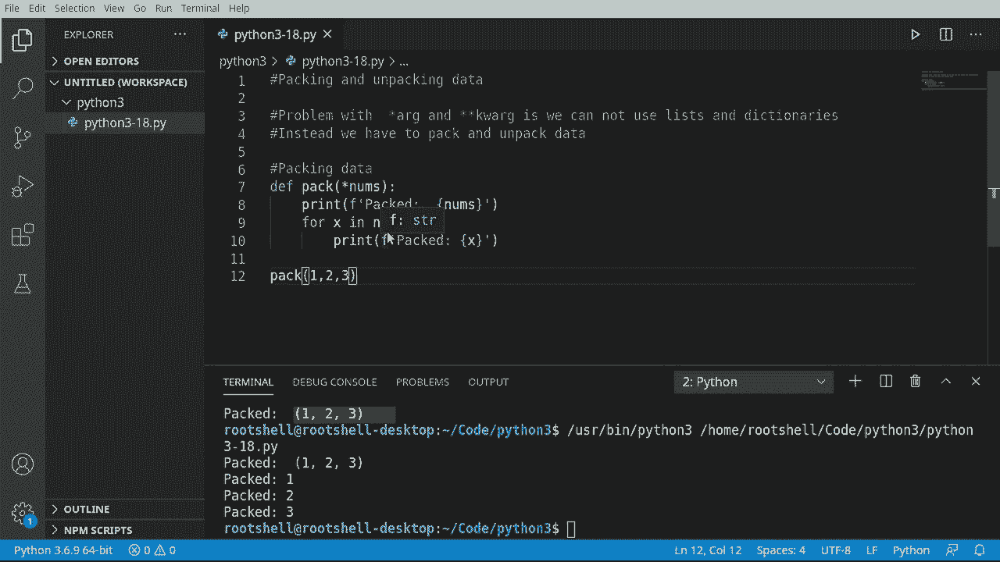

# Python 3全系列基础教程，全程代码演示&讲解！10小时视频42节，保证你能掌握Python！快来一起跟着视频敲代码~＜快速入门系列＞ - P18：18）打包和解包数据 

大家好，欢迎回来，我是布莱恩，我们要谈论打包和解包数据。现在我们到底在谈论什么呢？好吧，我们在 Arg 和关键字 Arg 的问题是我们无法轻松使用列表、集合、元组和字典，相反，我们必须打包和解包数据，这就是这段视频要深入探讨的内容，让我们看看。

所以让我们看看打包数据。这听起来好像会非常复杂。但实际上，按照 Python 的精神，这非常非常简单。所以我只是要创建一个名为 pack 的函数。我们将在这里创建一个参数，叫做 nuns。这是一个星号，意味着一个或多个变量。在这里，我们要说，继续打印出来。

这样我们就能看到我们实际得到了什么。现在，让我们调用这个 pack。我想打包 1，2 和 3。看看这里实际发生了什么。果然，它创建了一个元组。从这里，我们可以很容易地说或 X 在 nus 中。然后做类似的事情。将这些单独的数字取出来，看看元组内部到底发生了什么。超级。

非常简单，易于理解。这如预期般工作。然而，这里有一些问题。让我们看看如何解包数据。

好的，打包数据很好，简单，而且我们以前做过。但是如果我们尝试做相反的事情，解包数据，我们到底在谈论什么呢？解包，所以让我们做一个例子，我说 F 解包。并给它三个变量。A，B 和 C。从这里开始，我将打印出来。解包，这样我们就能看到发生了什么。

按租金跟随。我们可以直接抓取这些。超级简单。可能是我们写过的最简单的函数。说 BC，当然，把它们排列好。U B 和 C。看着这个函数，它相当直接，很明显会发生什么。但现在让我们引入一个问题，我要说。Numb。结个。😊，我想创建一个数字列表。

1，ma 2，逗号 3。如果我们说解包。并只给它我们的变量。你认为会发生什么呢？在 telesc 中已经告诉我们这里会有问题。没有参数值，它说，哦。看。😊，缺少两个必需的可选位置参数 B 和 C。等等，什么？但是我给了它一个列表，这个列表中有三个元素。

实际上发生了什么，我们必须具体告诉Python取这个列表并解包，我们只需在这里加一个星号。我们再试一次。我将清空这个。现在它神奇地工作了。所以我们要强调的是，当你看到这个星号，不管在什么上下文中，无论你使用AGs还是关键字参数。

或者你在这里用作参数，或者你用作参数。把这看作是告诉Python你将要打包或解包数据，而Python。我要你处理所有麻烦的细节，这样我就不用了。

与所有编程相关的事物一样，这并不简单。让我们看看另一个问题。字典问题。让我们创建一个字典，并说。B等于字典，并且必须说名称等于瑞安。年龄等于46。还有。它等于猫。随意输入你想要的任何值，只需要一个包含三个元素的字典。现在。

让我们打印一下。打包字典。接下来我们试着打包这个。所以我们将调用我们的打包函数。我们现在足够聪明，知道需要在这里放一个星号，因为我们要告诉Python你处理细节，我们将把字典放在那里。

继续清理我们这里的结果，看看会发生什么。哦哦，我们遇到了问题。它只获取了键。确实成功获取了键，但它只是获取了键。记住我们的字典是一个键值对，所以。这很让人沮丧。让我们尝试相反的。让我们尝试解包它。接下来我们说。解包。安迪，那里有个小函数名。

再次运行，解包，再次，ABC，它只是获取了键。所以你完全正确。我们必须以特殊的方式处理字典，让我们看看。看看字典的问题，它只获取了键，我们必须以特殊的方式处理它。所以我们将查看一个如何打包字典的例子。现在。

当你说打包字典时，我脑海中浮现出将字典放进书包去上学的画面。这正是我们在做的事情。所以我们要说定义。打包一个字典。接下来我们说，我们要使用星号。请注意，双星号代表通配符。

所以我们告诉它我们将得到两个东西。如果这看起来有些熟悉，那是因为我们在谈论，你猜对了，关键字as。字典无非就是键值对。这正是我们在谈论的内容。关键字it。让我们打印一下。实际上把它打印出来。

我想看看我们从Python世界得到的是什么。Nuns等于。然后让我们打印出来。现在，我们来调用这个。我想说。让我们给它一些任意的数据。随便编造你想要的，只要有三个值，它根本不在乎。我只是说名字是Brian。

8等于46。APa等于。Ats。运行这个，果然numbs。等于看这些小波浪线。一个字典对象。所以它自动。为我们完成了这件事，基本上在后台，它调用了diict函数，并将所有这些关键字参数转换为字典森林。

处理起来简单得离谱，这就是要打印的内容。接下来我们要说的是。我们实际上想要的是，进行一次循环，而不是一个一个地取出这些元素。或者k。然后。最后一分钟，计划有变。所以这是我们的关键字。然后我们想说等于。并给它我们的键，来吧。说Ron，让我们看看这看起来怎么样，果然如此。Pt名称。

只要里面有双星号，年龄和宠物按预期工作。你现在可以将整个对象作为字典访问。为了总结这一切。我们要做相反的事情，我们现在要解包一个字典。所以我们接下来要说D EF。解包它。哎呀，这是个有趣的名字。我可能会在评论中受到一些批评。

但是名称、年龄和宠物，我们就继续使用这个以及一个小范式。接下来我们要说打印。我们要在这里解包一个字典对象。接下来我们要说打印。你猜对了，这真的是太简单了。做魔术复制粘贴，我将加速这一过程。好吧，现在来调用这个。

嗯。我们实际上该如何调用这个呢？我们有一个字典对象在那儿。所以我们要重新使用那个字典对象，顺便说一下，就是这个家伙，我将把它抓过来。就这样重新创造轮子。它已经设置好了，我将再次设置，以便你能在屏幕上看到。我们要解包那个字典对象。

因为我们在使用字典，我们需要双星号告诉它，嘿。我们在后台使用关键字作为。看看这个东西的运行效果。所以它会创建一个字典。然后我们要告诉Python将其解包。看看，将一个名为Brian、年龄46的字典解包成猫。所以这个视频。看似简单。

我们实际上在后台做了很多工作，我应该说Python为我们做了所有的工作。我们在打包和解包数据，我们已经给出了如何打包和解包列表、集合和元组的示例，以及如何打包和解包字典对象及其出现的一些问题。

