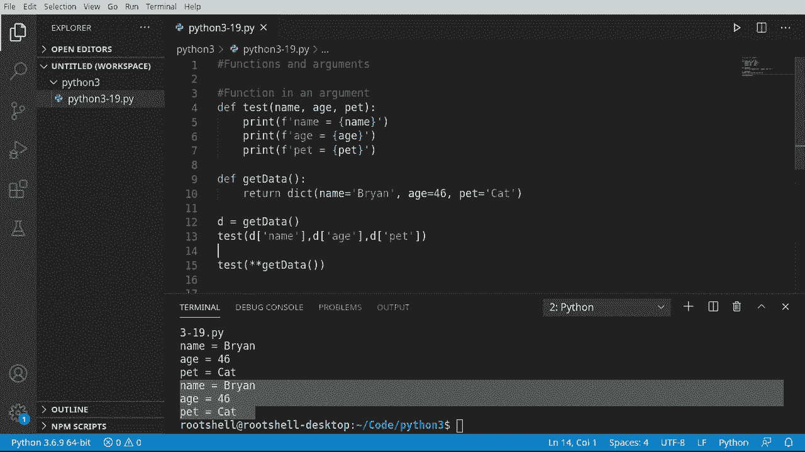
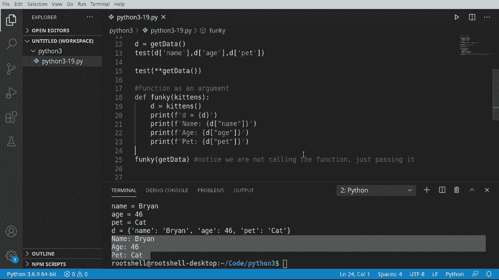

# Python 3全系列基础教程，全程代码演示&讲解！10小时视频42节，保证你能掌握Python！快来一起跟着视频敲代码~＜快速入门系列＞ - P19：19）函数和参数 - ShowMeAI - BV1yg411c7Nw

好吧，函数和参数，函数真的很酷。但如果你可以在函数中使用函数呢？我们所指的是什么？假设我们要做类似这样的事情，de。测试。在这里，我们将做一些像测试二或测试一之类的事情，或者我们想做的任何事情。

不完全是我们要怎么做，但确实，我们将使用函数作为参数。让我们深入研究一下。让我们直接进入这里。我们将查看一个函数作为参数。这听起来有点古怪，但让我们看看。所以我将说。定义测试。

我们将有一些参数。我将说名称、年龄和宠物。我们在之前的视频中见过这种情况。好的，打印出来。有些人说打印。做匹配。复制并粘贴，我们可以稍微加快这个过程。这将是一个超级简单的小函数。所以我们只是打印出名称、年龄和宠物。

我们本可以用更简单的方法来完成这一点。但我想逐行打印出到目前为止我们学到的信息。从这里开始，我们将创建一个名为获取数据的函数。这种做法在 Python 中非常常见，但几乎所有编程语言中都存在，你会有一个函数返回某种类型的数据，另一个函数实际使用这些数据。

所以，在这里，我们将返回字典。使用相同类型的模式。有些人说。输入你想要的任何年龄。如果你输入的年龄比实际年轻或年长，我不会告诉任何人。如果你喜欢这样，我不知道。所以我将返回一个包含名称、年龄和宠物的字典。

现在我们在这里有一些基本问题。例如，我们如何将这两者结合使用？

好吧，有我称之为的标准方式。你只需调用这个，单独获取数据。但现在你必须像这样输入。最好。你必须做得很长，令人烦恼。你必须把顺序弄对，所有这些其他麻烦事，实际上一点也不好玩。你可以这样做一整天。当然，如果你改变一件事。

你必须改变其他一切。这会变得非常麻烦，但确实有效。是的，我们确实考虑过一种更简单的方式来打包或解包数据，我应该这么说。我们要说测试。现在，我们要调用。数据。然而这里有一个根本性的问题。如果我们这样调用，实际上是在调用那个函数。

我们正在返回一个字典，但现在我们需要解包它。例如，如果我只是运行它。它会说缺少两个必需的位置参数。代理宠物。所以现在我们就告诉Python解包它。保存并运行，现在它可以工作了。非常简单，非常容易，你可以在一行中完成。这种工作方式太酷了。

好的，我们将讨论一些稍微不同的内容。这是一个作为参数的函数。我们已经在这里讨论了一个作为参数的函数，其中我们说了测试。然后我们用这些括号调用获取数据，我们得到了所有这些特殊字符，按照特定顺序处理，否则就无法工作。

我们将做一些简单一点的事情。我将说def。并且我需要一个好名字。我们叫它bunky吧。为什么不呢。我不知道该给它什么名字。所以我们称其为funky。我们将有一个名为数据的变量。到目前为止，一切都非常抽象。什么都没有真正定义，我们只有一个叫做数据的变量。

我们要创建另一个变量D。它将是数据的结果。请注意，数据是像函数一样被调用的，尽管它也是一个变量。在其他语言中，你会称其为函数指针，但基本上发生的事情是，我们说。抓住一些函数然后调用它，无论我们怎么命名它，我们可以把它叫做。小猫。

然后D将是小猫的结果。名称并不重要。重要的是我们将把它作为函数调用。Python足够智能，知道嘿。那个变量在内部是一个函数指针。做一些事情。所以我将继续打印。第一。现在为了做到这一点，我将说。放见。

我们将重用我们上面提到的Gi数据函数。它将返回一个字典对象。所以这里是重点。我想说的是。请注意，没有星号。没有额外的参数。它看起来不会像这样。它只是一个单词，yet data。我实际上要在这里放一个特别的备注。

让我们运行一下，看看效果如何。这就是结果。它是我们的字典。如果我们对此非常担心，我们可以说。E等于。然后运行一下以验证D等于。等等，等等。那么，这里发生的事情是我们说我们的函数将有一个变量。

我们将把那个变量当作一个函数来处理。Python足够智能，可以识别出这个家伙。我们现在将其转换为函数的一个参数，这实在是太酷了。只要一切都能正常工作，我们就可以继续做一些这样的事情。😊，假设打印一下。

我们可以用很多不同的方法来做到这一点。我将用较长的方式来做，为什么不呢。然后继续去D。我们又得担心单引号和双引号的问题了。还有其他方法可以做到这一点。如果你在想我这些输入是从哪里来的，其实是从我们上面的字典对象。所以我知道我们有一个名字、一个年龄和一个宠物。

所以我们继续把宠物也抓取过来。我们可以用很多不同的方法来做这个。我们可以使用for循环。我们也可以测试它是否在字典的键中，随便以我们想要的方式抓取这个项目。而Ta就是这样工作。这里的主要收获是，我们实际上可以将一个函数作为参数，然后将那个变量用作函数。

这种方式真酷。
