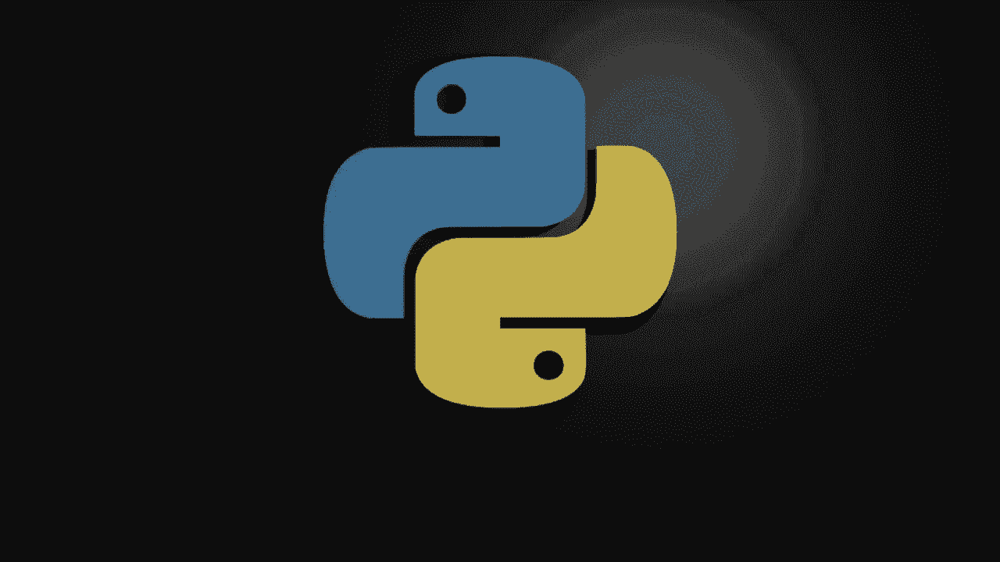
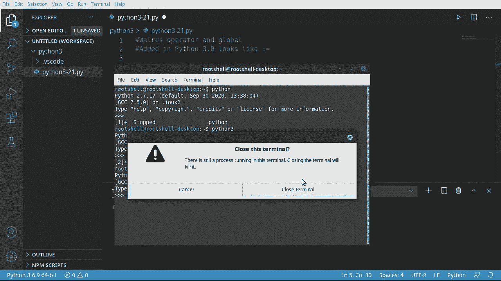

# Python 3全系列基础教程，全程代码演示&讲解！10小时视频42节，保证你能掌握Python！快来一起跟着视频敲代码~＜快速入门系列＞ - P21：21）海象运算符 - ShowMeAI - BV1yg411c7Nw

欢迎回来，大家。在这个视频中，我们将讨论**海象运算符**。没错，就是它。海象运算符，这个名字有趣，它源于这种语法。它是冒号和等号。如果你侧着头看，它确实有点像海象。它有小眼睛和獠牙，样子很可爱。

这就是它名字的由来。😊这有点让人困惑，可能会让你脑袋疼。而且为了让它更复杂，你必须有正确的版本，这在Python 3.8或更高版本中才可用。海象运算符允许我们从表达式中为一个变量赋值。

这意味着我们将把一段代码的最终结果转变为变量，而不需要做很多复杂的事情。如果你在想版本问题，记住如果你打开一个终端，有不同的方式可以做到这一点。你可以看到在角落里，我使用的是Python 3.6.9。安装了不同的版本。例如，如果我输入Python，那是2.7。嗯。

我的系统是Python 3.6.9，所以这行不通。我得用3.8。我有3.8.6。如果你没有安装3.8或更高版本，就得去Python官网下载、安装并配置Python 3.8或更高版本。

按照你的操作系统的说明，如果你有问题，谷歌是你最好的朋友，或者你可以在Voros Facebook小组找到我。视频结尾有详细信息。就我们这里的目的而言。

我们会下去选择Python 3，然后选择正确的工作区，应该是Python 3.8或更高版本。突然间，所有东西都开始弹出，问你想安装这个，想安装那个。我不会为这个视频做任何事情。如果一直弹出，我很抱歉。

不过，来吧。我们来深入探讨一下。让我们看看一些常见问题。我在这里放了括号是有原因的，因为这将是你在使用海象运算符时最大的问题。例如，如果我说“why”，然后是“walrus”，我只是想说“walrus”。len（“hello”）。你觉得我们在做什么？好吧，让我们试着打印“why”出来。呃哦。

在IDE中没有图形错误，因为实际上没有安装linter。我可以安装kite或其他类似的工具。但我只是想切换版本，看看它是如何工作的。结果显示语法错误，语法无效。你说什么？我在用海象运算符，而且我有正确的Python版本。嗯。

这就是我所说的，让我们抓住这个。然后把相同的内容放在这里的括号里。我将在最后添加一些注释。只为下载代码的任何人，让他们知道发生了什么。让我们把这个给注释掉。但我不是在最后加了什么吗？好了。

让我们重新运行这个。现在，突然间，我们得到了输出 L 5，它是有效的。但根据 Python 的官方网站，这并不推荐。为什么？因为看这里发生的事情会让人感到困惑。几乎就像我们在调用一个函数，记住，在编程和数学中。

括号内的任何内容几乎都是首先完成的。所以我们真正告诉 Python 的是，当你在阅读这个时，停止你正在做的事情。运行括号之间的所有内容，然后用值五替换掉这些括号。所以这实际上会生成一个名为五的变量。看起来令人困惑。确实是10次中有9次。

这将是你最大的麻烦，就是你忘记在括号里放入内容。所以让我们看一个现实世界的例子，我必须说。人等于。我们将创建一个人的列表。所以我，我的妻子安，家庭狗，大而臭的傻狗。他可能正在下面想要一块零食。

但他没有得到一个，因为我在这里录制视频。可怜的狗。所以我将说如果。然后是海象运算符。我们将仅获取该变量的长度。然后我想说小于或等于 3。然后继续打印出来。我们将打印出 n。有点令人困惑。但这里发生了什么？

我在说 n 是海象运算符等于这个表达式。人的长度。在这种情况下，应该是三，因为我有三个元素。我们在说如果它小于或等于 3，就继续打印出来。但当我们运行这个时，我们被背叛了。它实际上说是 2。怎么回事？为什么它是真的？因为我们忘了加括号，让我们用同样的东西再试一次。

让我们继续。在这里迅速添加括号。重新运行，结果我们得到了三。所以在10次中有9次，如果你在使用海象运算符时遇到问题，那是因为你漏掉了括号。我不喜欢在没有示例的情况下引入新概念。所以让我们来做这个。超级简短，但也超级令人困惑，因为海象运算符确实让人困惑。

好的，我将说 lines 等于，我们将创建一个列表。我们将使用一个函数。可以添加。默认最多五个。这将决定我们是否可以添加到该列表中。我们将说。嗯。漏宝。Lines。我不喜欢这样做，因为我们现在所说的是我们可以修改这个。

但我想确保 Python 知道我们想要这个列表。我们不是在创建某个新变量。这变得有点麻烦。当不确定时，你实际上应该将其作为参数/论据传递。让我们使用 walrus 操作符。让我们释放我们内心的 walrus。我将说 allowed 等于，知道 allowedud 未定义。

所以我们在做的是让 walrus 操作符定义这个变量。所以如果你担心会出现未定义错误，不用担心，这不会发生。但是每当你看到 walrus，就要想“walrus”需要张嘴。如果你看不到这些括号，你将会有一个糟糕的时间。

让我们继续说。这将是计数。而且再次，walrus 操作符。所以我们需要某种括号，但我们将使用一个函数。然后，我们将获取这些行的长度。现在我们要说我们想要最大值。这看起来真的很疯狂和混乱，但我们在这里做什么呢，我们正在创建一个。

两个变量，我们在说 allowed 将是这个代码表达式。如果我的鼠标想要合作，这个代码表达式。而 count 将是这个代码表达式。无论你看到这些括号。你正在处理某种表达式或范围，但通常两者都有。让我们继续打印。

我们要说 F。你可以输入。我们想要最大值，这个是计数。更多。所以我们想要实时告诉用户他们实际上还可以输入多少。我们将回退并说它返回。我们将返回这是否被允许。这看起来超级混乱。但 walrus 操作符的重点是我们减少了代码。

我们现在有一个变量被赋值为一个表达式。我们不需要说类似 aloud 等于某个东西，然后把 allowedud 放入 if 语句中。它会自动为我们完成所有这些。为了进一步让这个变得复杂，让我们做一些我看到人们总是做的事情。

我将说“while”，然后一个函数将返回一个布尔值。我们将循环，直到那个函数说我们不能再这样做。让这些行。你必须写下来。我们要创建另一个变量，叫做 L。我将获取输入。我们向用户。哇，太疯狂了，所以。我们在这里创建了第三个变量。

让我们继续，并打印出我们完成了。好的。突出显示墙的操作，看看我们在这里的小示例。我们正在创建一个、两个、三个变量。每当你看到“walrus”时，请立即想到左边的是我们正在创建的内容。右边，无论“walrus”嘴里有什么，就是我们用来创建它的。

有点疯狂。如果允许的话。计数减去最大值。然后我们将继续进行最大值减去计数的计算，这真的很混乱。我们将返回一个布尔值，并使用这个布尔值，然后在一行中获取这个输入的值。真的。

这确实减少了我们的代码，但也让代码变得稍微难以阅读。所以我想说我们只需输入一些内容。一个，我们可以输入四个，三个，两个，一个。你输入后，它会给我们一个整齐的小列表。这里的主要收获是，海象运算符非常方便，但也可能非常复杂。

每当你看到海象运算符时，*一定要立即想起*下方的牙齿。你需要口部，也就是这些括号。而括号内的内容将被赋值给变量，因为你实际上是在将一个表达式放入变量中。

你还需要 Python 3.8 或更高版本，否则你会遇到很多奇怪的错误，因为早期版本的 Python 根本不知道你在说什么。简而言之，这就是海象运算符。
