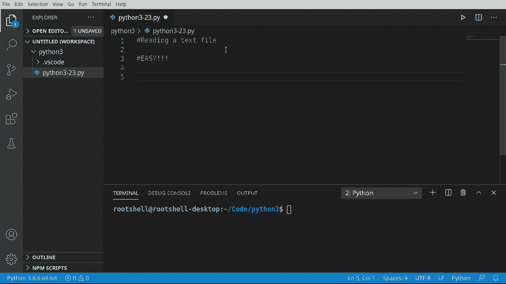
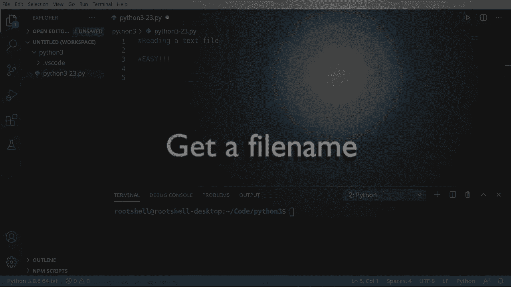
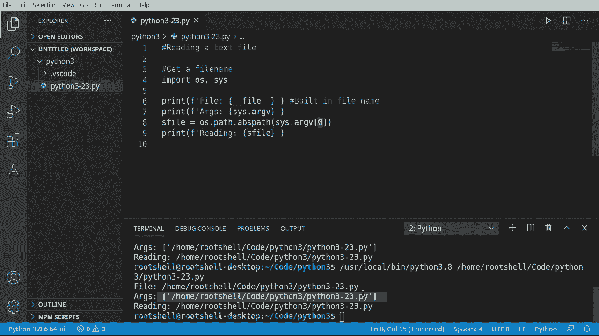
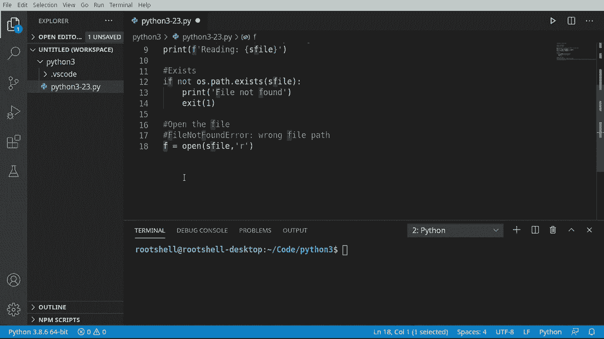
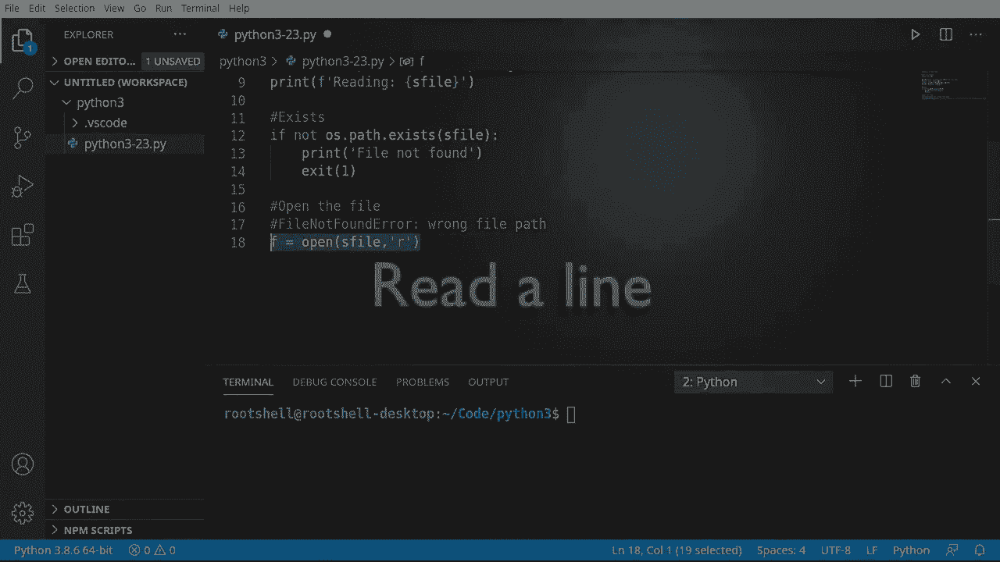
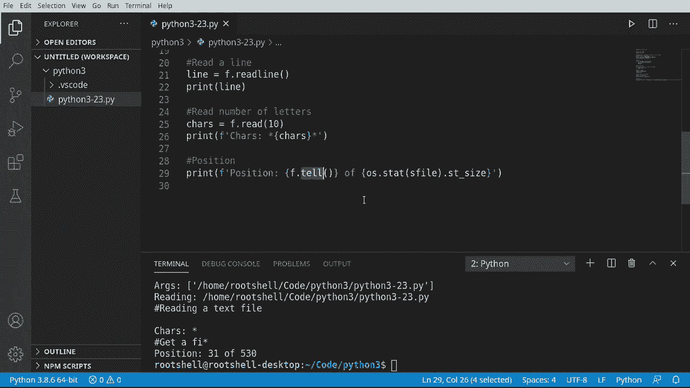
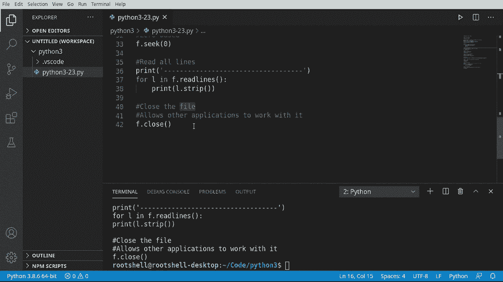

# Python 3全系列基础教程，全程代码演示&讲解！10小时视频42节，保证你能掌握Python！快来一起跟着视频敲代码~＜快速入门系列＞ - P23：23）写入文本文件 - ShowMeAI - BV1yg411c7Nw

欢迎回来，大家好，我是布莱恩。我们将讨论读取文本文件。这个过程非常简单，任何人都能做到。因此，如果你对文件系统感到害怕，不用担心，这非常简单。让我们深入探讨一下。

首先，我们先获取一个文件名。你的操作系统里有很多文件，但我们想要读取一个文件而不干扰任何其他应用程序。所以我们要读取自己。也就是说，这个你在屏幕上看到的文件。我们要读取它。因此，我们必须将这个脚本的文件名获取到。我们该怎么做呢？好吧。

有几种不同的方法。我们将展示几种方法。所以我们将说 OOS 和 cis，我们将导入这两个模块。你只需放一个逗号。我们可以通过一行代码导入模块。我只是想一次性完成。让我们说，打印。

你会在互联网上看到很多这样的情况。有人会说类似的话。每当你看到双下划线，它就像是 Python 中内置的一小段信息。变得稍微复杂一点，但只需理解双下划线意味着内置。你看到这个。

我们已经得到了脚本的完整路径。现在，这里有一个问题。问题是，这可能并不总是存在，有时你会遇到这种情况，这根本不起作用。所以，再次回到我们之前的讨论，总是有多种方法可以做到这一点。因此，我们将展示我认为更好的方法。我们将使用参数。

现在，关于参数，通常并不是好事。通常你希望避免争论。但在这种情况下，我们想直接进入它们。所以我们将打印出内容。我们想要 Arg B。这到底是怎么回事呢？在后台，当 Python 调用你的脚本时，这个家伙，Python da da da。它实际上会发送给你一个参数列表，你有过这样的经历吗？

在你的文件浏览器中，双击一个文件，你的操作系统知道用哪个程序打开它。这些是参数，所以它会调用你的脚本。还有另一个参数，它像是逗号，然后是你想要处理的内容。所以只需知道 Python 将发送给你的第一个参数是，嗯，就是你的名字。

你当前正在运行的内容，让这变得超级简单。现在，让我们继续说。我们想获取完整路径，只为确保。我们想要操作系统路径，我们想要ABS路径。现在。很多评论的人会问，为什么使用ABS路径或绝对路径。为什么不使用另一个。我们这样做只是为了演示。

我们还没有深入复杂性。我会做一个完整的视频，讲述不同类型的路径，它们的含义，以及哪个最好等等。但现在，我们仍然是新手。我们将只处理ABS路径。

然后我们将开始读取这个文件。让我们继续运行这个。结果就是这样。所以它只是简单地给我们返回了一个参数列表。第一个或零位置总是当前运行的脚本。

我真的想演示的一件事是，它是否存在。如果我们正在运行自己的文件，我们知道它是存在的，如果我们要运行这个并读取它，我们知道它存在，因为我们当前正在编辑它。但仅仅是为了好玩，我想讨论一下如何确定文件是否存在。伊恩，这就是存在主义问题。

文件是否存在。我们是否存在，Intering。所以，不管怎样，让我们说如果。然后让我们继续，假设不。哦。问一下路径。Exists你可能想知道不是什么。不类似于某种东西。与之不等，它是那种的简短缩写，但我只是想说如果不是OS路径存在。那么我想给出我们的文件名。我们在这里得到了它。如果它不存在。

然后我想说嘿。Rt。让我们打印那个文件，不绑定。因为如果我们尝试处理一个不存在的文件，我们会收到一个错误信息。最终我们会得到像这样的结果：文件未找到错误，这将在后面详细说明。

所以如果你只是一直在进行，并且给出了错误的文件名。你会过得很糟糕。但现在我们知道文件不存在。我们不想继续。所以我将说退出。我必须给它某种退出代码。我就说一个。让你感到好奇。

正常退出代码是0，然后你会给出某种错误信息，比如访问被拒绝或其他。但通常供应商会有不同的退出代码。所以我就说一个。这样我们可以告诉程序，嘿，发生了一些不好的事情。但因为我们正在读取自己的文件，它应该能正常工作。所以让我们运行这个。确实运行得很好。

让我们继续这个并给它一个我知道的名字，简单地说就是不在那里。Nope。txD。让我们再次运行这个。文件未找到，然后它退出。运行得很正常。现在到了令人困惑的部分，我们将真正开始处理文件。我们将从打开文件开始，如果在这个过程中你遇到文件未找到错误。

这意味着你有错误的文件路径，你没有遵循说明。或者有些地方出了严重问题。所以我们要做的是我们将说 f 等于，我们想调用打开。听起来非常简单，确实是。现在我们只需给它一个路径。现在来点混淆，我们必须给它一个所谓的模式。

现在我要做另一个关于模式的视频，但这一个将只涵盖读取文本文件。所以我必须说。二。只代表读取，我们将读取纯文本。但这个过程将会出去。在你的操作系统中。确保那个文件存在，如果没有，你会得到一个文件未找到错误。

然后它将尝试打开文件进行读取。并且它会将光标放在文件的零位置。它会把一个文件对象返回给你。所以这一小行中，实际上有很多复杂的内容。

现在我们已经打开文件，让我们继续读取一行，我将说行等于。我们将使用那个文件变量，并且我想说我们读取。你注意到我们有很多选项。读取、读取一碗、读取行和读取多行。我们想要读取多行。所以我们只读取一行。

让我们继续打印出来。保存 Ron 并读取一个文本文件，因此它读取了我们文件的第一行。非常，非常酷，你也会注意到它在这里放了这个小返回，因为猜猜看，那里有一个返回。在这个结尾，有一个不可见的 slash R slash n 或 slash N。具体取决于你的操作系统。只需知道。它还会包括这个。

所以当我们打印出来时，我们必须将其去掉。但是我们已经成功读取了一行。现在，如果读取一行很酷，你会真的喜欢这个。我们实际上可以控制这个。我将读取一定数量的字母。所以我将说 cares 等于 F.dot.read。

请注意，它想要一个数字，所以我们将读取 10。让我们继续打印出来。我将实际格式化这个，称为 cares。我们将放入星星。然后。我们实际上在读取的内容。所以如果你看看我们的文件，这里写着读取文本文件。现在光标在这里，让我们运行这个看看会发生什么。

你看到它说 cares star，然后有一个换行符。获取 A FiI，然后是 star。因此，我们实际上控制了我们读取了多少字符。我想这样做是为了真正展示这里的复杂性。请注意，我们在这里切掉了这个强制换行，我们可能并不想要它。

如果你使用read函数，你会遇到一些奇怪的事情。这就是为什么我在处理文本文件时倾向于使用read line。现在，非常细心的人会注意到，随着我们的阅读，事情在向前移动。这意味着我们读取了一行。然后我们读取了若干个字符。它说，get A FI。

它没有重新开始阅读。那么这里发生了什么。随着我们的阅读，有一个不可见的光标，就像在这个文本文件中一样。你看到那个光标就在那儿。它总是从0开始。因此，隐形中那里有一个0。它就像列表、元组或任何类似的东西。它是一个0为基础的索引。

它将从0开始。随着我们读取，它会向前移动。所以当它说read line时，它会移动到那里。当我们说ray 10时，它会移动到那里。因此它实际上会计数。这个不可见的光标将不断移动。我现在想做的是显示位置。我们如何确定自己在文件中的位置。

这有点高级，可能在初学者阶段对你来说不太明白。但当你进入高级文件处理时，你需要能够在文件中前后移动。所以我想相对较早地介绍这个概念。让我们说print。我们将格式化这个，让我们看看。位置。我希望他们称其为位置。

但他们称之为tell。所以我们将称之为tell函数。它将告诉我们位置。现在，我想说of。因为我想知道这个文件实际上有多大。所以说O S。我们将调用统计信息。我们将使用之前的S文件变量。

我想知道S T。下划线大小。如果这让你感到非常困惑，有时intelligencetelst会帮助你，如果你在使用像kitite这样的高级telece系统。但你可以浏览文档，或者你可以信任我。O，执行stat。文件名ST下划线大小，所以我们得到的是一个整数。

现在，大小是文件的字节大小，让我们运行这个。所以我们的位置是31的529，随着我们添加更多内容，你会看到这个位置变化。即使它是一个注释，文件的大小在增长，让我们再运行一次。足够了，5，38。移除那个和530，因为我们删除了一些内容。这就是你确定自己在文件和文件大小的方法。

这里的主要 takeaway 是，在我们阅读时，那个不可见的光标在移动。现在，我想把它放回最开始。所以我们将调用seek。再一次，这是一个更高级的函数，但我想很早就介绍它。这始终是8。0为基数。记住我们关于列表、元组和字典的对话。

它总是从零开始的索引。所以我会说我们的文件对象执行 seek。我们将要定位到 0。现在，如果你注意到我在打字时。你会看到这个可寻址的。有些文件是不可寻址的，因此如果你在做一些自定义工作时可能会出现问题。但就我们的目的而言，它应该工作得很好，我们只是告诉它去哪里查找。

所以 seek 0 会告诉我们返回到最上面。如果我们在工作，只是在阅读、阅读、阅读、阅读，seek 0 会说，回到这个零点。让我们运行这个，从图形上看没有效果，但如果我们再读取一次。你会看到它实际上重新开始，就像我们即将演示的那样。

现在我们理解了这个看不见的光标和定位，并且知道如何控制它的位置。我们已将其设置回零位置，现在让我们读取所有行。我在这里放入这一长行，我们将打印出来，以便将其分开，这样我们就可以看到它的实际效果。我想说的是 4 L 和 F dot。读取，我们想读取行，注意有 read line。

这将进行单行读取，而 read lines 将持续不断地读取。我们将逐行读取整个文件。我想说打印。它将返回给我一个字符串。所以我想说 L，我们想要剔除它。现在。strip 的作用是移除任何多余的空白。因此，这些硬回车就像这里。

我们是如何得到这些小东西的。返回值，如果我们不这样做，它将被剔除。我们会得到一些非常奇怪的结果，我会演示给你看。所以我们来运行这个。看。这儿停下来了。所以这是我们文件的开始，它一直延续到现在，非常酷。现在如果我们把这个注释掉。然后只抓取这个。这就是我所说的，如果你不剔除它，你会得到一些奇怪的结果，因为打印自动会加入。

回车换行符。让我们清除所有这些。你可以看到现在每行之间有了额外的空白。因此，这就是我们需要调用 strip 的原因。让我们把它重新放回原来的样子。今天。它就是这样工作的。好吧，系统资源 101，任何你打开的东西，你都必须关闭。

所以我们现在要关闭那个文件。把文件想象成在寒冷的日子里的一扇门。你打开那扇门。你让所有的天气进来了。现在你想关闭它。所以关闭操作做的事情有很多，但就我们的目的来说，它非常简单。它允许其他应用程序与之协作。如果我们打开这个，而底层操作系统锁定了文件以进行读取。

这意味着没有其他人可以对其进行修改。别担心，简单得离谱。F close。总是，永远。每当你打开一个文件时，关闭它。你不想有所谓的悬挂资源，现在 Python。大多数情况下，当你的脚本完成时，它会自动关闭文件。但不要依赖于此。有时你会看到，如果你打开一个文件却忘记关闭它。

它将永远保持打开状态。这非常令人沮丧，离成功如此之近。你不会看到任何图形上的变化，但现在它关闭了那扇门，以便其他人可以打开它并做他们想做的事情。快速回顾一下，这段视频我们讨论了读取文本文件时文件系统的复杂性。文本文件与二进制文件是不同的。

我们将在未来的视频中讨论二进制文件，所以我们这里只讨论普通文本。我们谈到了导入，获取当前文件，确定文件是否存在，打开文件，读取一些行和字母，以及如何在位置之间移动所有行，以及如何实际关闭文件。

