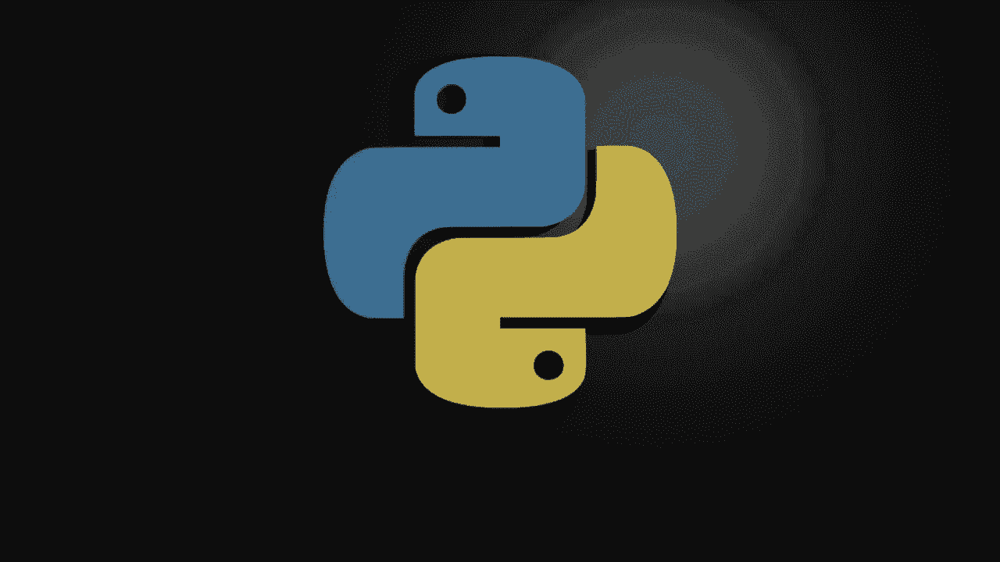

# Python 3全系列基础教程，全程代码演示&讲解！10小时视频42节，保证你能掌握Python！快来一起跟着视频敲代码~＜快速入门系列＞ - P24：24）二进制文件操作 - ShowMeAI - BV1yg411c7Nw

大家欢迎回来。我是布赖恩，我们将继续我们的Python 3之旅，我们要谈论如何写入文本文件。这是纯文本，而不是二进制。我们将在未来的视频中讨论如何写入二进制文件。我们将利用上一个视频学到的知识，使用函数进行过度简化。上一个视频有点冗长。我想让生活简单得多。

我们的首要目标是简化模式的使用。现在，我们在谈论什么。我们将覆盖两种不同的模式。我们要谈论写入和追加。它们做的事情完全不同。但我们可以使用相同的代码。那我们就来写一个函数。我将说到文件。还有。

让我们保存文件名。模式。数据，我听到我身后有割草机的声音。抱歉麦克风录到了。只是有点。Covid-19。对此你无能为力。我的邻居喜欢一天割草100000次。所以我会说打开。我们要打开那个文件名。我们需要模式。现在，记住。

在上一个视频中，我们用读取文本或R模式打开它。我们将使用W和A。但它们可以使用相同的代码非常相似地工作。正如我们将要演示的。我将说4我在范围内。我们就说，环，让我们选一个数字5。然后我们继续写出这个数字。我想说那个数字的字符串表示形式。

如果你不这样做，你将会收到某种错误信息。继续吧。在那里加一个小冒号。连同数据。让我们继续添加一个换行符，行结束符。/lash R/，这些就是我们谈到的转义字符，当我们在字符串La中时。实际上，我们要做的就是使用STR将数字的字符串表示形式写出，将其从整数转换为字符串。

然后我们将添加一个冒号，不论我们处于什么数据，然后RN数据将作为参数传递给我们的函数。现在。确实存在做类似事情的倾向。你会看到这个flush。我会将其注释掉。flush的作用是什么，为什么人们在他们的代码中使用它。当你写入文件时。

背景中有一个看不见的缓冲区。我应该说是Python有。那个缓冲区会填满，因为你添加的速度比它写入磁盘的速度快，特别是如果你的硬盘较慢。想想嵌入式系统，它们会变得非常缓慢。你实际上不需要调用flush。如果你要。

完成文件操作后请关闭文件，关闭时Ithon会自动调用此操作。然而，如果你在进行某种操作，比如顺序写入，想要分块写入文件，就需要定期刷新，以确保数据被写入磁盘。

我想把这个放在那里，因为我知道有人会问，为什么不刷新内容。你不需要这样做，因为关闭会自动调用这个操作。我讨厌这个名字，但同时，这让我感到好笑，因为你要刷新它。我总是想象着看着一个马桶，尽管这看起来令人作呕。

你就像是把数据扔进马桶然后冲掉。但这实际上是将所有缓冲区的数据冲到硬盘中。

我们将讨论两种模式，第一个是写入。当你听到“写入”这个词时，写入将会覆盖，这意味着它将完全擦除现有文件，并从头开始。在执行此操作时，你需要小心，因为如果你有敏感信息或者希望保存的内容。

这将彻底消除该数据，数据将不再存在，也不会在回收站中，永远消失。因此，在这里你需要小心。我们将要写入文件，假设我需要一个特殊的变量名，比如IL name，就这样。我们将调用这个文件功能，文件名的模式为数据。

那么，让我们继续执行这个操作。我们将调用我们的函数。我们将重用变量文件名，模式将切换为W（写入），我们将输入的数据为“Hello”。记住，写入将会覆盖，完全摧毁原有内容并重新开始。

我们要讨论的另一个模式是追加。现在，追加将会添加内容。因此，写入将会覆盖，而追加将会添加。这会打开文件，看到……记得我们谈过的寻址，移动文件中的位置，它会移动到文件的末尾，然后开始添加内容。

这就是我所说的简化模式使用。我们可以直接将其复制，然后简单地将其更改为A以进行追加。接着我们再将其改回ao。因此，在这里将会调用写入，它会彻底消灭文件，重新开始，然后……最多到5，它将显示“hellello world”。接着我们将调用追加。

它将添加内容。好的，这里的直接目标是写入aend，但我想要重新读取这个文件。因此，我想使用并导入，将其放在文件的最顶部。这不是强制性的，但几乎可以说是行业标准，应该把导入放在最上面。

而不是直接在这里添加，实际上你可以。但让我们把它放在顶部，这样。我们刚刚处理的任何内容，使用OS时也会得到它。如果我们决定回去修改这些函数并使用，我们就不必意外地多次导入它。因此，总之，总是把你的导入放在文件的顶部。

我们将说de，让我们继续读取文件。我需要一个特殊的变量名。某个真正突出的东西，比如，我不知道。文件名。我们可以把它命名为fuzzy button kitten或者我们想要的任何名称。好吧，我们要说如果没有，我们想要O S。让我们继续说路径。那存在。我们只会确保我们尝试读取的文件确实存在。

否则我们将遇到一些糟糕的错误。现在，我不想退出。我只是想直接返回这个函数，而不是终止整个脚本。现在，我想说。我们要打开这个文件，这就是使用Python处理文件时的简单程度。给它一个模式。因为我们打开了某个东西，让我们继续。在我们做其他任何事情之前。

现在关闭。在打开和关闭之间，我们可以做任何想做的事情。例如。我可以说4。A line。在F dot。Readed lines。像这样。或者如果我们真的想要过于简单化。我们可以一次读取整个文件。而我们只会调用。现在，剧透警告，如果你在一个非常大的文件上这样做。

否则你会有非常糟糕的经历，因为你可能会耗尽内存，你的小应用可能会崩溃。例如，如果你有3GB的内存。你试图读取一个30GB的文件。它根本无法做到。它会在那里待三小时才崩溃，但最终会崩溃。这就是为什么我们使用像or line in read lines这样的东西，因为它一次读取一行。

不要全部都读。好的，我们警告一下关于在一个函数中阅读全部内容。如果你有一个巨大的文件，尽管如此。我们就这样留下它，纯粹是为了演示目的。因为我们将处理一个非常小的文件。我们将看到它的实际应用。我会说我的文件。我们可以把它命名为任何我们想要的。好吧，让我们命名为Ho dot C。

X T。首先，我们要写这个文件。只是调用我们的函数。现在。让我们继续结束文件。然后让我们继续读取文件。我们将代码拆分成函数是有原因的，这样我们就可以重用这段代码。你在编程中会经常听到“代码重用”这个术语。

与其硬编码文件名，然后调用，或者说为每个文件重写这个函数，不如使用一个变量来重用代码。所以让我们继续执行这个。你看到它说。0到4，Hello world。然后这里有一些其他内容。Hello again。现在让我们来演示一下。

所以让我们去掉这个附加。让我们只做对的事。注意我们已经有一个文件在那儿，我们实际上可以打开它。它看起来就是这样。让我们去掉那个附加，看看我所说的对的文件将会覆盖。这个就是为什么它如此危险。你好世界，从0到4。如果我们重新打开文件。

你可以看到。你好世界，所有的再次问候，已经消失，因为它抹去了那个文件并重新写入了它。现在我们可以这样做。它回到了我们想要的方式。再次和再次。主要的收获是写入将会覆盖，且将寻址到末尾并追加。我们可以让读取文件变得极其简单。

