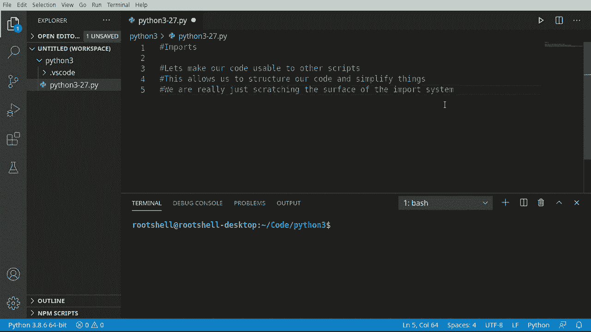
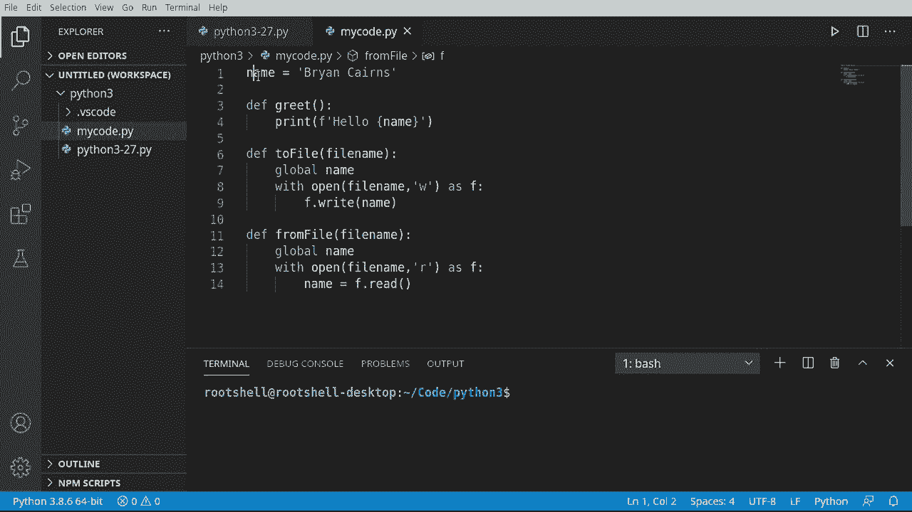
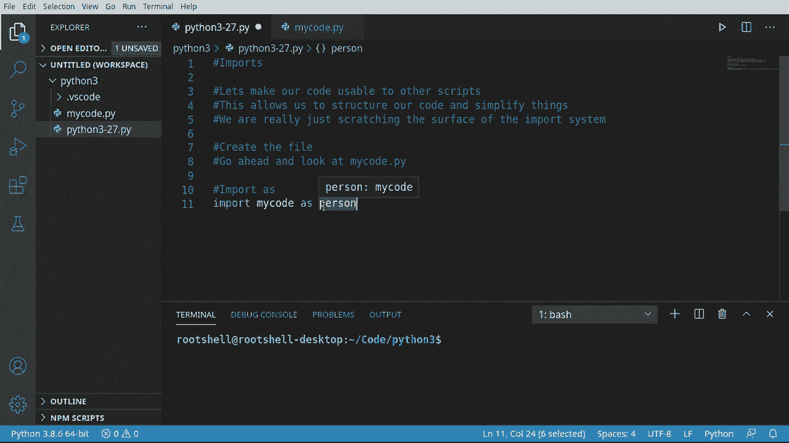
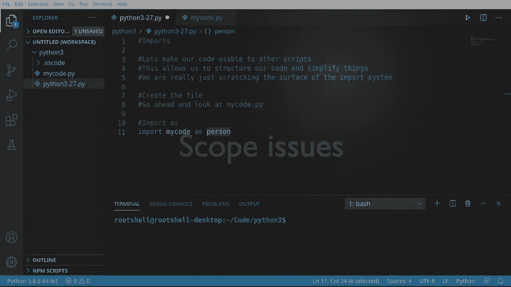
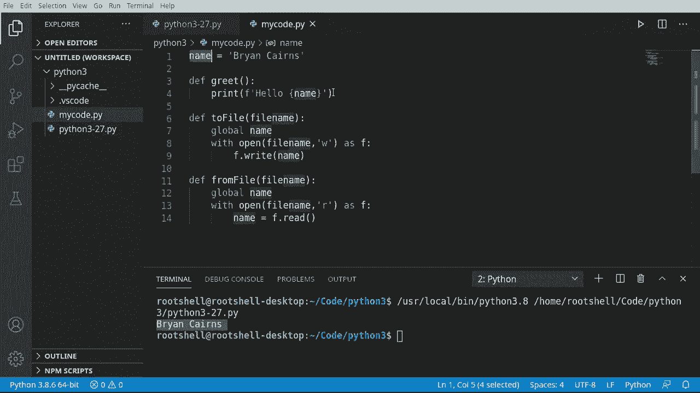
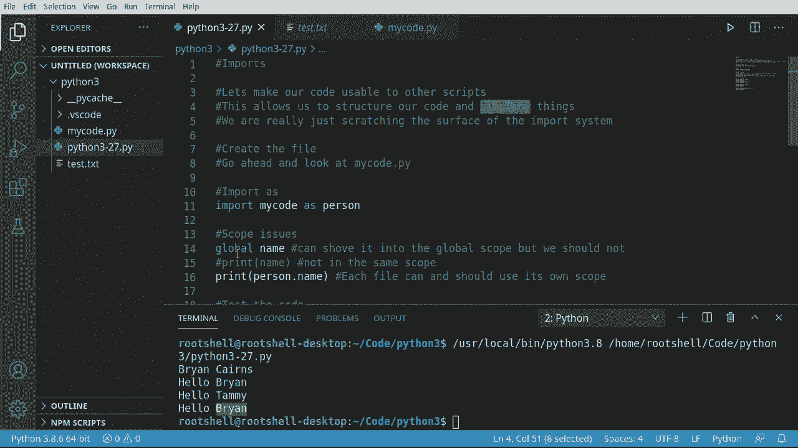

# Python 3全系列基础教程，全程代码演示&讲解！10小时视频42节，保证你能掌握Python！快来一起跟着视频敲代码~＜快速入门系列＞ - P27：27）导入工具库 - ShowMeAI - BV1yg411c7Nw

大家好，欢迎回来，我是布莱恩，今天我们要讨论导入。在这个视频中，导入使我们的代码可以被其他脚本使用，也让我们可以使用其他人的脚本。但最重要的是，导入实际上使我们能够简化事情，我们现在可以结构化我们的代码，并根据需要导入内容。现在导入系统实际上相当复杂，所以在这个视频中我们只是触及表面。

我们将讨论一些高级问题。我想展示如何将代码拆分成不同的文件。我们将不得不将这个拆分成多个视频。因此，在这个系列中我们将不断回到导入系统，逐步增加复杂性。

让我们深入了解。

首先，我们想要创建一个单独的文件，所以我将放入一些笔记。我们将创建一个文件，并且我会在里面留下这个注释，以便任何没有观看这个视频而只是在GitHub上找到代码的人可以看到。

它只会说，继续查看我的代码 Py，我们要去这里，实际上我们将创建一个新文件，我们将其命名为 mycode py。在这个文件中，我们将添加一些代码。所以我会说 name equals。嗯。不管你的名字是什么，我真是搞砸了。我连自己的名字都拼错了。其实，我拼对了。

我刚刚有一个大小写问题。我们将创建一个名为 greet 的函数。我其实是即兴发挥的。我并没有什么具体的想法。我们将添加一些代码和函数。所以我会创建一个函数叫 G，它将打印出 hello 和名字。

注意这里的作用域，name 实际上位于这个文件的全局作用域中。我会说 de。然后我们继续说 two file。我们已经在之前的视频中学会了如何处理文件系统。如果你错过了，赶快回到播放列表观看那个视频。M say file name。我不。其实不需要说 global，因为我们并不是想要修改它。

我们只是想读取它。Python 对此比较宽松，但为了安全起见，我们还是会说 global。然后打开文件名。我们希望再次写入那个文件。如果你完全跳过了那个视频，我强烈建议你去看一下。然后我们就会说 F right，写入所有内容到文件中。

在这种情况下，我们只是简单地写下名称，我们就这样做。非常简单的模式。然后改变一下。所以现在我们从文件中读取，准备以读取模式打开它。然后我们将这里做完全相反的事情。快速回顾一下，当我们说“with”时。完成后，它会自动关闭那个文件。

所以我们不必担心任何复杂性。好的。我们的文件都完成了，它并不难，只是有一个变量和一些函数。

让我们回到最初的Python文件，这实际上什么也不做。实际上。让我们跳回去确保你保存了它。现在，我们要做的是使用“import as”。我想我们已经涉及到这个，但我们还没有真正深入探讨发生了什么。所以我会说import。你想要我的代码。作为。让我们给它一个名称，叫做person。

这可以是我们想要的任何东西。我们可以称之为“冰淇淋圆锥小猫”。代码，随心所欲。但这里真正发生的事情是导入在说，导入这个模块。现在。模块是我们还没有真正覆盖的概念，我们将在未来的视频中讨论。但现在，当我说模块这个词时，只需想象外部代码，这些代码在我们的文件之外。

所以导入将查看，并且隐形地，这里有一个小点。它将在当前目录中查找名为“我的代码”的东西，导入的目录结构有点混乱。我们将在未来的视频中讨论这一点。所以现在所有东西都在你项目的根文件夹中。因此导入这个文件，最后有一个隐形的.py。

如果你拼错了这个，它将找不到它。现在我们说as。Person。所以它在做的事情是导入这个整个文件。我们已经写的这个东西有一个变量。所以现在它创建了一个名为person的变量。你可以看到person现在是我的代码。

所以整个文件现在保存在这个变量中供我们使用。比这要复杂得多，但这是我能解释得最简单的。基本上，我们将整个文件转换成一个变量。

现在，在这一点上，我强烈鼓励你测试一下，只需简单地运行它。它应该什么也不做，但如果你有某种拼写错误或其他问题。你会得到类似这个的“模块未找到”错误。然后“没有名为Na的模块”是你的关键。名称拼写错误。

所以让我们继续修复它。只是想演示一下。让我们讨论一些作用域问题。我们可以运行这个，看看它是否按预期工作，接下来我们清除它。我们来用我们的全局变量，来说明全局名称。不是错误。谢谢，`In teleence`。全局名称。继续打印出来。这儿发生了什么？名称，错误。名称。

名称未定义。等一下，什么？在我们的文件中，我们有名称，并且我们通过全局作用域在使用它。那么这里究竟发生了什么？我们试图说明的是，一个模块有自己的作用域。因此，模块的全局作用域并不是你脚本或应用程序的全局作用域。

两个完全不同的作用域。所以，即使我们可以明确地尝试强行将其推入全局，尽管它已经是全局的，我们也可以尝试将其放入全局。这真的没有帮助。它仍然未定义。现在，如果我这样做，注释掉这个，运行它会发生什么？同样的事情。名称，名称未定义。所以无论你试哪种方式都没有关系。哦，这太棒了。

如果你是新手，这会非常令人沮丧。那么我们该如何从这里获取名称呢？好吧，记住，我们已经将整个文件转换成了一个变量。我们几乎创建了自己的数据类型。所以我们将继续打印`Person`，或者无论你给它取什么名字。现在我们想要的是名称属性。

它自动知道这是一个字符串，所以生活现在会很好。让我们把它放在这里，以便在Github上任何人都可以轻松看到发生了什么。清除这个并运行。哦，是因为我还把它留在这里。对此感到抱歉。让我们再试一次。好了，来吧，`Brian Karen`。

所以如果你像我一样忘记将其注释掉，你会遇到那个令人厌恶的错误。这是一个很好的作用域说明，涉及导入和模块。每当你有一个新文件时，想想它有不同的作用域。有一些方法可以在它们之间跳转。但是从实际的角度来看，它们是两个不同的作用域，你应该将它们视为这样。

我们需要做的最后一件事就是进行一些测试。所以我们将继续测试代码。我将添加一些空间，以便获得一些屏幕真实空间。让我们继续说`person.name`等于，我将把这个改成`Brian`而不是`Brian Karen`。然后继续执行`person.greet`。所有的功能。让我们就这样做`person.file`。

让我们给这个起一个非常简单的名字。`Test.dotEXT`。它只是会将该名称转储到一个文件中。让我们继续说`person.name`。什么是`Tammy`。再执行一次问候，以便我们可以看到我们确实改变了那个变量。让我们加载那个文件。现在，只要我们的文件名匹配，就可以正常加载。再问候一次，以便我们可以看到我们确实从文件中加载了那个名称。

让我们继续运行，看看会发生什么。最初的名字是布莱恩·卡斯，我把它改成了布莱恩。然后改成了塔米，接着我们从文件中加载它。现在我们可以看到这个测试文本在这里。所以总的来说，简单回顾一下，导入是一个非常棒的代码结构方式，确实简化了许多事情。

它确实有一些复杂性，我们将在未来的视频中讨论这些问题，我们在这里也稍微提到了一些作用域的问题。实际上，它比这复杂得多，因为我们真正涉及到的导入，是模块的基石或基础。不幸的是，在我们深入了解模块之前，我们需要先学习其他一些东西，比如，类。

这很快就会到来。
