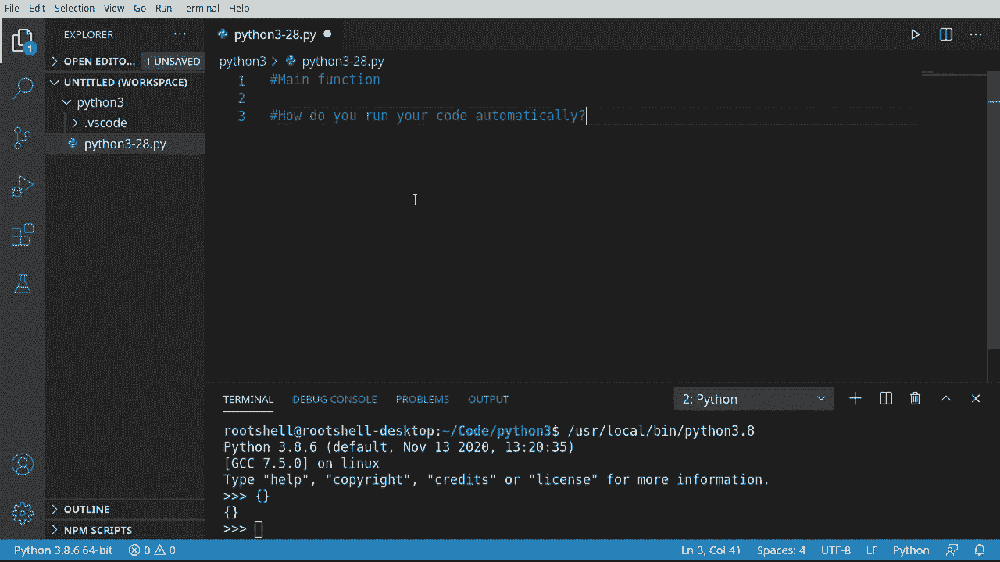
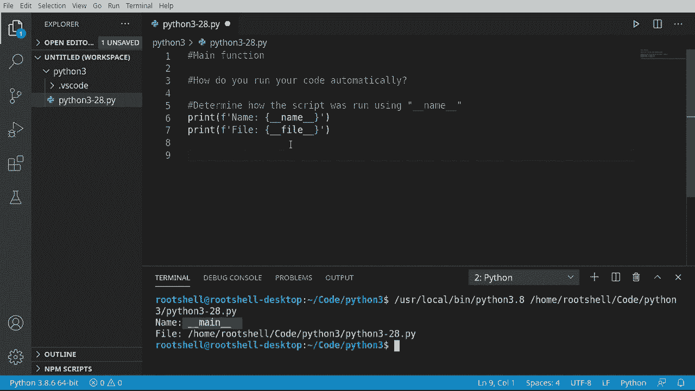
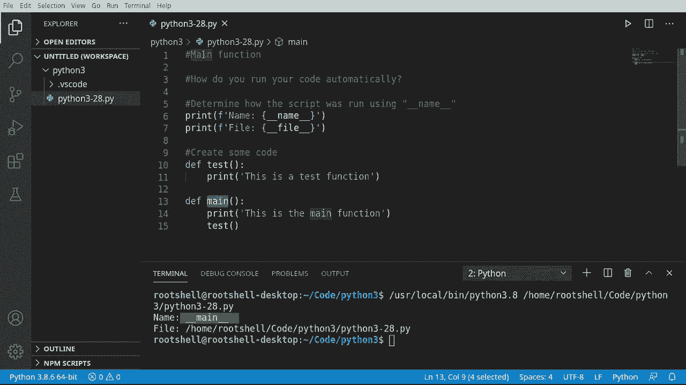
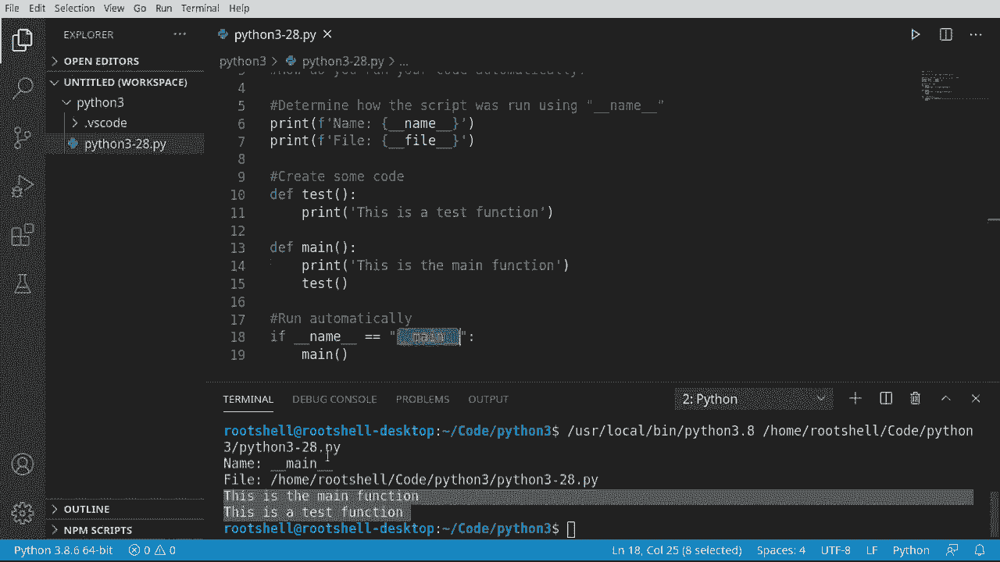
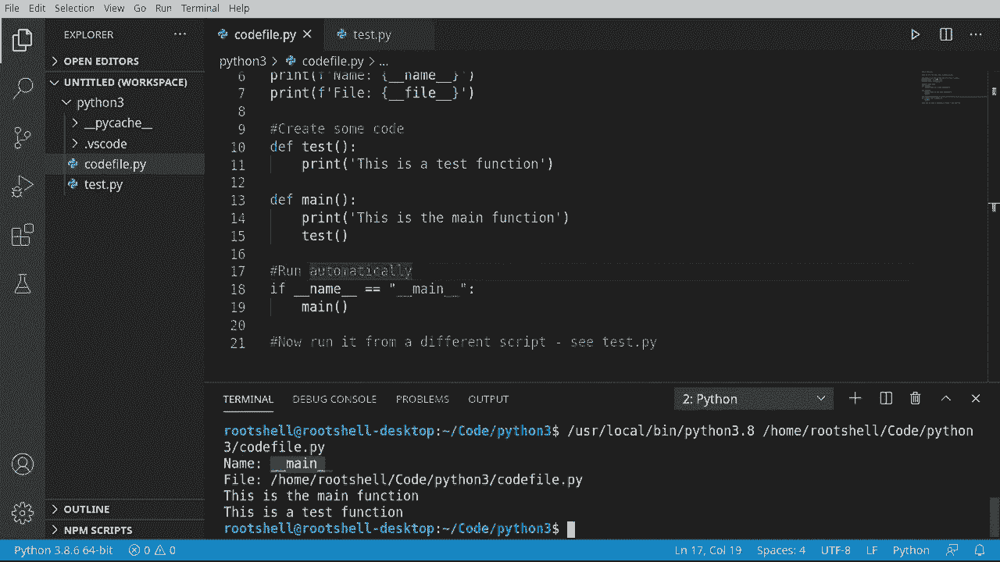

# Python 3全系列基础教程，全程代码演示&讲解！10小时视频42节，保证你能掌握Python！快来一起跟着视频敲代码~＜快速入门系列＞ - P28：28）主函数 - ShowMeAI - BV1yg411c7Nw

欢迎回来，大家好。我是Brian。今天我们要讨论Python中的主函数。现在，如果你在想大多数编程语言中的主函数是什么，你会看到类似这样的东西。这只是一个字面上叫做main的函数，当你的应用程序执行时，它将是第一个运行的函数或入口点。

没有主函数，你的应用程序根本无法运行。好吧，正如我们在Python中看到的，你并不需要主函数。这是完全可以的。那么，你如何让代码自动运行，这正是我们在这个视频中要讨论的内容。

让我们来看一下这个。所以我们首先需要确定我们的脚本是如何运行的。如果你一直在YouTube的播放列表中关注这个系列，你就会知道你可以直接运行脚本，脚本也可以被导入。所以我们要确保确切知道这个脚本是如何运行的。

所以我们来打印一下。我们要说F。我们要格式化并说名称等于。现在我们将使用一个特殊变量`underscore， underscore name`。每当你看到那个双下划线时，这就是内置于Python中的。我们将打印出来。现在我们把它改成文件。

我在之前的视频中提到过这可能有效也可能无效。所以如果你遇到问题与`underscore underscore file`有关，你需要观看我谈到的关于使用传递给脚本的系统参数的那个视频。大多数情况下，这应该可以正常工作。我们来运行一下。

你可以看到我们的名称是`underscore`，`underscore main`，所以记住。双下划线意味着它是内置于Python中的。而文件名就是我们当前运行的文件。这条剧透可能会改变。所以不要依赖它。我所说的是，如果我们以特殊方式基于导入来调用我们的代码。

文件名实际上不会是我们当前脚本的名称。所以你要稍微小心一点。但我想强调这些内容。最重要的一点是我们的名称是`underscore underscore main`，这意味着我们知道Python直接运行这个文件。这是主脚本文件。

现在，让我们在这里创建一些代码。我们的脚本实际上什么都不做。所以我们想做点什么。我们将创建一个测试函数。我并不在乎它做什么，只要它能在屏幕上打印出一些内容，以便我能看到它正在运行。现在我们将在这里创建一个主函数。注意名称是mainine。去打印一下。

让我们开个玩笑，直接在这里调用我们的另一个函数。实际上，我们想要做的是让这个脚本自动运行这个主函数。这样我们就知道我们在做什么，然后调用这个其他函数，开始一系列事件，进行一些代码处理之类的。所以，让我们先清除这些内容。

让我们看看很多刚接触Python的人犯的错误。他们会说，哦，我知道我在做什么，然后就去运行，但什么也没有发生。这真让人失望。所以，是的，在Python中，主函数实际上并不会自动调用，我们必须特别调用它。

现在，你可能会想我知道该怎么做。我只需在这里调用主函数。它就会工作。看看它在运行，确实运行了。这是主函数。这是一个测试函数，所以我们在调用它。问题出在这个名称上。我们将在这个部分之后演示。

我们将向你展示如果我们从另一个脚本运行这个会发生什么。我们不一定想要这段代码执行。也就是说，如果我们将这个文件作为变量导入到另一个文件中，我不希望这个函数被调用。因此，我们希望它自动运行。

但只有在某个特定条件被设定时。继续说主函数。我们将自动打印这段代码。这是我的ID。你可能需要手动输入，但我们会说如果`__name__`等于`__main__`，那么就执行。它实际上将不会做任何事情。所以我将把这个。所有主函数直接处理。

继续，保存并运行。果然，它运行了我们的主函数。它在说名称等于主函数，所以我们知道Python是在直接运行这个主函数。继续调用这个。

一旦你搞清楚了`__name__`等于`__main__`之间的区别，并且你知道这意味着Python正在直接运行这个，我们就可以做一些稍微不同的事情。我们可以实际上将这个代码文件拿出来。让我这里记一些笔记。然后我们可以从另一个脚本运行它，只是为了看看这里的区别。

所以我们将创建一个名为`test.py`的文件，我将故意犯一些错误只是为了展示发生了什么。我经常犯错，但这次，我确实是想给你展示发生了什么。首先，我们要做的是导入这个文件。所以让我们回去这里。我想说导入Python，注意到Intelligence正在帮助我们。

从我们之前的视频中，你知道我们正在做的是将整个文件转换成一个我们可以使用的变量。在我们进一步之前，让我们运行这个，注意我们得到了一个无效的语法错误。它有这个小的。

这里的箭头指向这个括号。所以它告诉我们，它不喜欢这个。我们的文件命名约定需要改变。我们可以做的是，右键点击这个。将其命名为`code_file.pyy`。功能没有改变。所以，例如，我们将运行代码文件。

之前使用的是Python 3.28。你会看到，它按预期工作，只有文件名改变。所以功能没有改变，只有名称。我们得回去更改名称。清除这个。让我们运行这个测试`do.py`。你可以看到，第一眼看到的就是名称。

代码文件，文件名，代码文件。这里发生了什么，我们运行了`test.py`。但是它正在打印这个。当我们点击导入时，它会从上到下读取我们的文件，并且实际上会采取一些行动。这有点危险。为了演示，我将抓取这个。进入这里。假设。

让我们讨论这个测试名称。和测试文件，以便将它们分开。清除这个，重新运行。现在你看到它们都在触发，即使我在运行`test.py`。导入先发生。所以它说导入代码文件，它去到代码文件，执行这个代码。它没有执行我们的函数。因为名称不同，它没有执行这个。看看。

名称是代码文件。所以名称不再是`__main__`，而是很好。简单来说，代码文件的短版本没有目录。没有`.py`的扩展名。这就是为什么我们需要`if name == '__main__'`。所以现在在这里，我们可以直接调用这个。保存，运行，看看效果，果然如此。

这是一个测试函数。主程序从未触发。这可能有点令人困惑，所以快速回顾一下。如果你打算将文件作为导入使用，命名时要小心。一些字符是非法的，比如之前看到的连字符。如果你要自动运行，你需要检查名称是否等于`__main__`。

因为如果我们把这个文件当作导入来运行，它会给我们文件的名称，前面没有下划线。这并不能保证是文件的名称。Python可以给我们任何我们想要的。关键是`__main__`意味着Python直接运行这个。为了说明这一点，我们将再次运行代码文件。看看。

名称是`__main__`。
