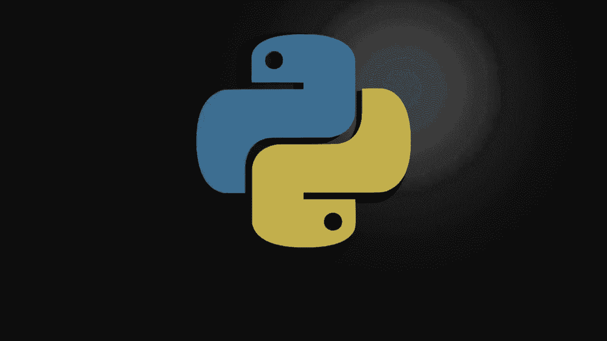
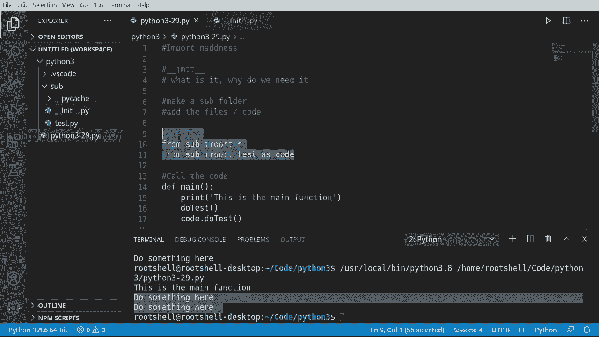

# Python 3全系列基础教程，全程代码演示&讲解！10小时视频42节，保证你能掌握Python！快来一起跟着视频敲代码~＜快速入门系列＞ - P29：29）导入自建工具库 - ShowMeAI - BV1yg411c7Nw

大家欢迎回来。我是布赖恩。在这个视频中，我们将谈论导入的疯狂。是的，我们将深入探讨这里的疯狂。所以我们谈论的是下划线。在它里面，下划线是什么，我们为什么需要它。😊

首先，我们需要创建一个子文件夹并向其中添加一些代码。所以我将写一些笔记。我们将创建一个文件夹，叫它sub。所以我在这里说新建文件夹sub。在我们的子文件夹内，确保你已经选中。你的IDE可能会根据你正在使用的不同而有所不同。

我们将添加两个文件。第一个文件将非常简单，命名为Test.py。我们将添加一些代码，为了节省时间，我将复制并粘贴。只是一个简单的函数，do_test，它只打印出“这里做点什么”，真的是不值得奖的代码。

我们还要添加另一个文件。这个文件必须命名为__init__.py。记住，每当你看到双下划线时，你就应该想到Python内部的东西。现在，一些论坛上关于是否在旧版Python中真的需要这个有很多争论。在较现代的Python版本中，确实需要，但这仍然有争议。

但我把它放在这里只是为了让我们理解。我会在这里写一些笔记，这些笔记有点多。这是必要的，因为我们在一个子文件夹中。每当你看到文件夹时，我希望你想到模块。记住，我们谈论过模块一点，但模块不仅仅是一个文件，它是整个文件夹结构。

创建某种文件夹结构的问题在于，Python需要理解如何处理该文件夹结构。所以在最简单的情况下，它可以只是一个空文件，但它也可以执行包的初始化代码。这就是复杂性所在。所以如果我们在处理类似于socket服务器或数据库的东西。

我们实际上可以初始化一些代码。我们可以说像port等于80或者用户名。你在生产环境中绝对不会这样做，但用户名可能是admin之类的。你可以在这个文件中直接指定所有这些内容。所以我们非常简单地使用这个文件，因为我们希望Python理解如何处理这个文件。

所以我们要在这里稍微修改一下。我们要说从 test 导入 St。我们之前见过 import，但还没见过这个。这到底是什么情况？所以我们所做的是说从 .test 导入星号。from 基本上就是在说，去找到这个。这里有一个小点，如果我们省略掉它。

我们可能会遇到一些糟糕的事情，它可能并不知道我们在这里试图做什么。所以在大多数情况下，我们必须把它放进去。然后神奇地，它知道这是目录，如果你曾经感到困惑。这是当前的目录。而且，我这是父目录。所以基本上我们所说的是从当前目录开始，然后取一个文件名test。

它的结尾没有 PY。继续导入，然后所有内容。所以我们是在说，把这个文件的全部内容拿进 Python 中。

让我们先玩一下 imports。我们将切换回主文件。在这里我们将玩一下 imports。让我们尝试用我们之前尝试过的几种不同方式来导入。我们只是简单地说，import Sub.test as code。然后，code.do_test。

我们实际上可以这样做。看看这个。现在，如果我们运行它，一切都运作良好，但我们跳过了这个初始化文件。在旧版本的 Python 中，这可能不适用。你可能会遇到一些小麻烦。如果你尝试说像从当前目录 .sub.test.do_do，你可能会，具体取决于你的 Python 版本，遇到类似无效语法的错误。那么我们该如何导入这个文件，以及如果我们还有其他文件呢？你猜对了，我们需要这个初始化文件，而且我们有一种特殊的方法来做到这一点。

所以我们要做的是回到这里，去掉所有那些东西。我们要说从。记住，当你看到 from 关键字时，我们是在说去找一个位置。所以从 sub。Sub 是文件夹的名称。所以从这个文件夹中，继续导入星号，也就是说，从这个文件夹中，导入所有内容。现在，这很大也很吓人，因为如果这里有成千上万个文件怎么办。

没错，我们要导入成千上万个文件。这就是这个 __init__.py 真正派上用场的地方，或者说初始化文件，简称为此。因为它将指示 Python 该做什么。

可能有一些文件我们想要直接导入，还有一些文件我们不想自动导入。我们可能想设置一些变量或一些设置或一些文件结构。我们会在这里做到这一切，如果需要的话，我们可以调用函数。这比这更深入得多。再说一次，我们仍然在初学者阶段。如果我们真的想要的话。

我们可以稍微玩味一下这些。我们可以说类似于`from S import`，然后是一个特定的文件。记住，这将是test.py，但你不需要写.py。所以我们是在说从文件夹中导入一个文件作为这个变量。这看起来有点冗长，似乎有点困惑，直到你真正理解它，但这非常简单。

一旦你理解了，就非常简单。这里的一个主要收获是如果你有一个子文件夹，你应该在其中包含`__init__.py`或初始化文件。如果跳过这一步，旧版本的Python将无法正常工作。

你可能会遇到一些奇怪的问题，如果你想在所有这些文件中进行任何初始化，几乎是必须的。好吧，一旦我们到了这一点，真的只剩下一个事情就是实际看到它的效果。所以我们将在这里调用代码。假设是`DE main`，如果你跟着我并且试着做些什么。

编辑器中的代码可能会背叛你，所以要小心。因此，我将说`main`。而此刻，我只会说`pass`。记住，Python中的`pass`意味着什么都不做。如果`__name__`，它将在这里下降。等号，等号。遵循之前视频的内容，我们说如果`__name__`等于`main`，就自动运行这个函数。

如果我们要导入这个文件，它不会启动这段代码。让我们去掉这个，并且我们会说`print("这是主函数")`。让我们调用我们的导入。因为我们做了`from sub import *`，这意味着导入所有内容。它将在这里读取这个初始化文件并说`from test import *`。

它将导入我们所有的代码。我们有一些东西需要处理。所以借助旧的复制粘贴魔法，我可以抓取它，跳回这里并说`est`，我们可以直接调用它并且它就能工作。看，做点什么。因为我们做了`from sub import test as code`，我们可以这样处理。

做同样的事情，但把它放在一个变量里面。现在，我可以说`code.do_test`。非常简单，非常容易，按预期工作。那么哪种方式是正确的，你应该使用哪一个？

就我个人而言，我倾向于选择第二行，因为从每个文件导入。如果你有名称冲突怎么办？如果有一个test2文件也有相同的do_test函数，你会想将它们分开到两个不同的变量或作用域中。记住，每个文件在作用域方面都是一个孤岛。

至少这是你应该在脑海中思考的方式。因此，从这一点来看，初始化文件很重要，如果省略了它，你可能会在Python中遇到麻烦。你确实需要它来初始化Python的工作方式，还有不同的导入方式进一步增加了导入的复杂性。

