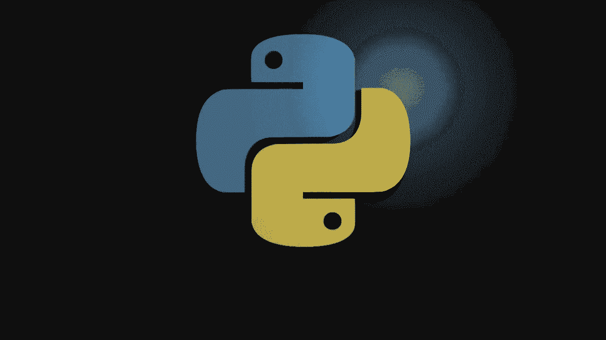
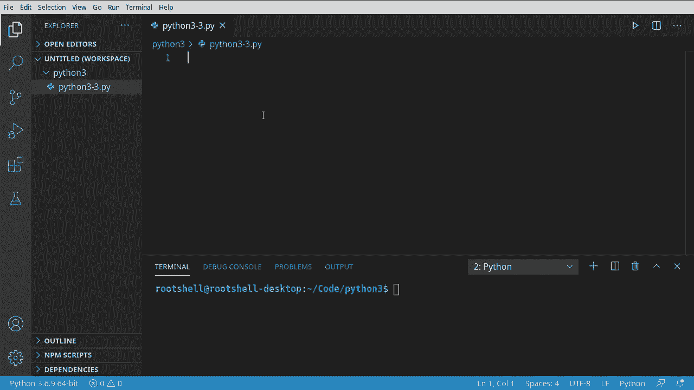
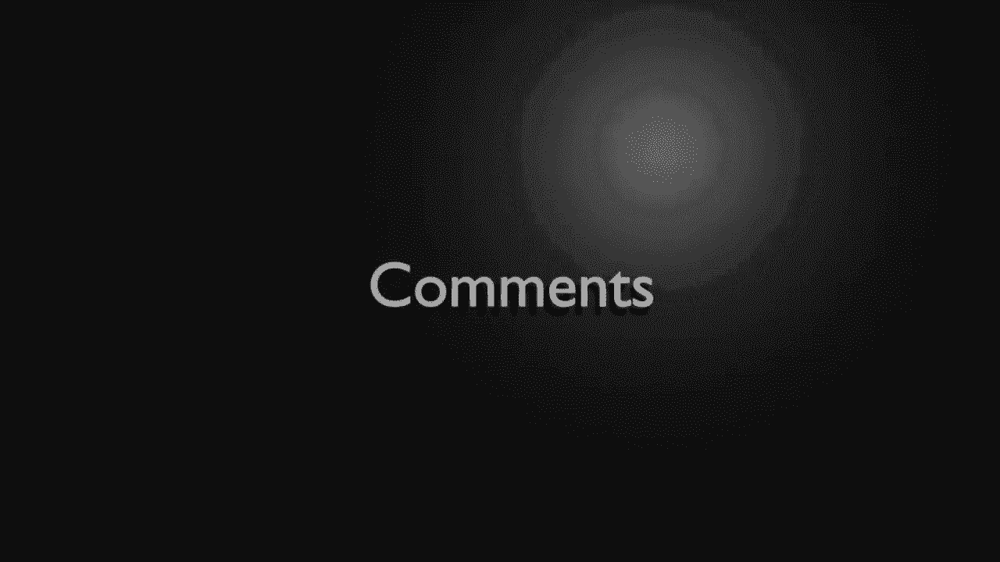
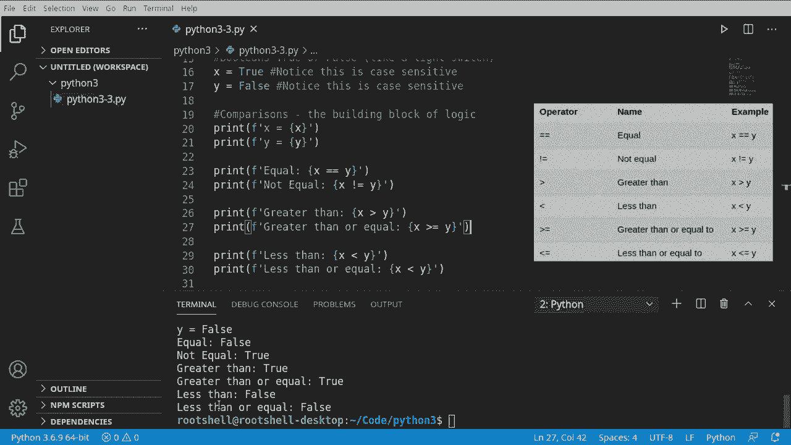

# Python 3全系列基础教程，全程代码演示&讲解！10小时视频42节，保证你能掌握Python！快来一起跟着视频敲代码~＜快速入门系列＞ - P3：3）Python注释、布尔值和比较 - ShowMeAI - BV1yg411c7Nw

欢迎回来，大家好。我是布莱恩。我们将继续我们的 Python 3 之旅。不论你使用的是哪个 IDE，请创建一个空白文件，我的文件名是 Python 33。在这个阶段，名字并不重要，只需准备好一个空白文件即可。我们将涵盖三个关键内容：注释、布尔值和比较。让我们马上开始吧。

好吧，注释，你们实际上见过它们，但我们还没有真正讨论过它们。什么是注释而不写任何代码，继续运行你的脚本。你会看到，它确实什么都不做。我们将按下井号并输入一些内容。这是一个注释。那么，这到底有什么用呢？如果我们运行我们的程序。

你会发现没有任何变化，它确实什么都没有做。注释就是注释，它对代码的存在仅仅是为了你，程序员，以便你可以保留一些笔记。例如，你可以说。这是我们的第三个。这个也有。你会注意到你可以添加字母、数字，或者你想要的任何东西。

当我们运行它时，它不会抛出任何错误信息。这完全是为了你。这是你的笔记。现在，如果你来自其他编程语言，你可能希望有一个多行注释。这意味着如果你有几行，比如“你好，世界”。我喜欢猫。哦，你会注意到我在输入时。

它试图帮助我，并且放入了我们称之为“智能提示”的内容，这些是已经为我们预写好的代码。不过，我们其实并不需要这个。所以它导致了各种错误。现在，如果我在输入一个注释，我会说“你好，世界”。我喜欢。你会发现智能提示突然并没有出现。

我可以通过按下控制键和空格键强制它弹出。但是它并不真正知道我们在做什么，因为我们在注释中。多行注释就像如果你有，我只是抓一些文本。这不是一个注释，即使它说它是一个注释，实际上它并不是。如果我们尝试运行它，哦。

你会看到“无效语法”。因为它试图将这个解释为代码。现在，我们可以在每个前面加上一个井号。例如，先来看看这个。还有这个。如果你需要处理大约 100 行代码，那就会变得非常乏味。所以许多 Python 开发者会这样做。这。

它们只需要用三重引号包围，三重引号内的任何内容都会变成字符串。这个我们将在另一段视频中深入探讨。只需知道这是一种数据类型。我们并不是在真正地写注释，而是在创建一个字符串。但这个字符串确实什么都不做。所以如果我们再运行一次，没有错误信息。

让我们清除这个讨厌的错误，以便你可以看到。你可以全天运行这个，且没有错误信息。但我们确实创建了一个变量，信不信由你。所以我不推荐这样做，要小心，这可能会导致后面的麻烦。尤其是如果你进入文档字符串等内容。

我们将在本系列后面讨论这个内容。所以你可能会问。注释的功能目的是什么？它仅仅是为你，开发者，提供的备注。你也可以使用注释启用和禁用代码。所以，例如，假设 x 等于 1。打印 X。你可以看到它现在打印出 1。我们也可以将其更改为。你好，世界。

这是我们在前一个视频中做的。现在，如果我们注释掉这个。这 X 在技术上不再存在。你看到它给我们一个小红色波浪线。它在说未定义变量。如果我们尝试运行这个，你猜对了，轰，名称 X 未定义。所以我们可以通过注释掉来禁用这段代码。我们可以通过简单地删除那一行来重新启用它。

那么我们来介绍第一个真正的数据类型，这非常基础，它叫布尔。有人简称它为布尔值。它是真或假。想象一下像房间里的灯开关。它要么开启，要么关闭，这就是这个数据类型所表示的。好吧，我们做几个。

我实际上会将这段代码注释掉。让我们做一些。我会说。X 等于 true。注意它的大写 T，智能提示正在帮助我们，嘿。它必须是大写。y 等于 false。同样，大写 F。如果你来自其他语言，可能会倾向于给它一个数据类型像这样。

你这么做的话，坏事会发生。它不会知道你想做什么。我们实际上可以尝试运行这个，你会明白我的意思。呃。无效语法。所以它不理解发生了什么。当我们去掉那个时，突然，神奇地它就正常工作了。清除那个错误，这样不会让任何人困惑。不啦。再次强调，这些是大小写敏感的。

所以如果我把它改为小写，你会看到智能提示不再把它标为蓝色。如果我们尝试运行这个，就会出现一个讨厌的小问题。名称 true 未定义。记住，当你看到未定义时。这是解释器的方式在说，嘿。我不知道你在这里想做什么。仅仅因为它不存在。

所以让我们把这个改回大写 T，生活很好。我要在这里复制粘贴一些备注。注意你可以将注释放在自己的行上，或者在之后，如果你把它放在之前，例如。如果我把它移动到这里，它会将那一行之后的所有内容变成注释。

所以这样做要非常小心。这些注释对我们的代码没有任何影响。例如，我们可以全天运行这些，完全没有错误消息。然后清除这一切。现在我们明白，我们想要做一些基本的比较。这就是我们接下来要讨论的内容。好的，让我们谈谈比较。首先。

什么是比较？好吧，它是编程逻辑的一个基础构件。因此，比较是逻辑的基础。这意味着我们想要某个值。将该值与另一个值进行比较，以查看我们在编程逻辑中需要做什么。例如，我只是打印出X和Y。我会稍微不同一些。

我将放入字母F，代表格式化。然后我会说x等于。括号。然后，X。看起来有点混乱，但实际上，我们只是在说，打印出X。但要以一种花哨的方式做。看。X X，现在我可以把这个改成y。这变得非常简单，易于理解。X是真的，Y是假的。

我们现在要比较这两个。我们要做的第一个比较是相等。其实相当简单，所以我只是抓住这个。我们来设定h。我们要在这里做逻辑，然后说。进行相等比较时要小心，因为如果你只这样做。

你实际上是在赋值。这些被称为运算符。这是赋值运算符。我们现在在说x等于y。我们不想这样做。我们想比较。所以我们要说x等于y。我们只是在比较。然后说那个的相反。我想要不等。注意这是一个感叹号，每当你看到感叹号时，想想你想要的完全相反。

我们想要的是什么？这是相等的反面，还是不等，让我们继续运行这个。看看会发生什么。你可以看到x是真的，而y是假的，它们不相等。当我们测试不等时，它实际上给我们一个真。能做到这一点真是太酷了。在这一系列中，我们对编程几乎一无所知。

但我们已经拥有了计算机逻辑的基础，真和假。我们可以测试这些条件。😊，让我们进一步推进。我们要做的是大于和大于等于。所以我会抓住其中一个。然后我说。大于。这非常，非常简单。

我们要说打印输出是x大于y。现在我想说大于，或者等于。这与不等于2的语法非常相似，我们在说大于等于2。接下来让我们做相反的，来说小于。然后把这些翻转过来。让我们继续运行这个，你可以看到这里是大于真，大于或等于。

true，小于false，小于或等于false。

这些确实对你来说不会很有意义，对吧？
