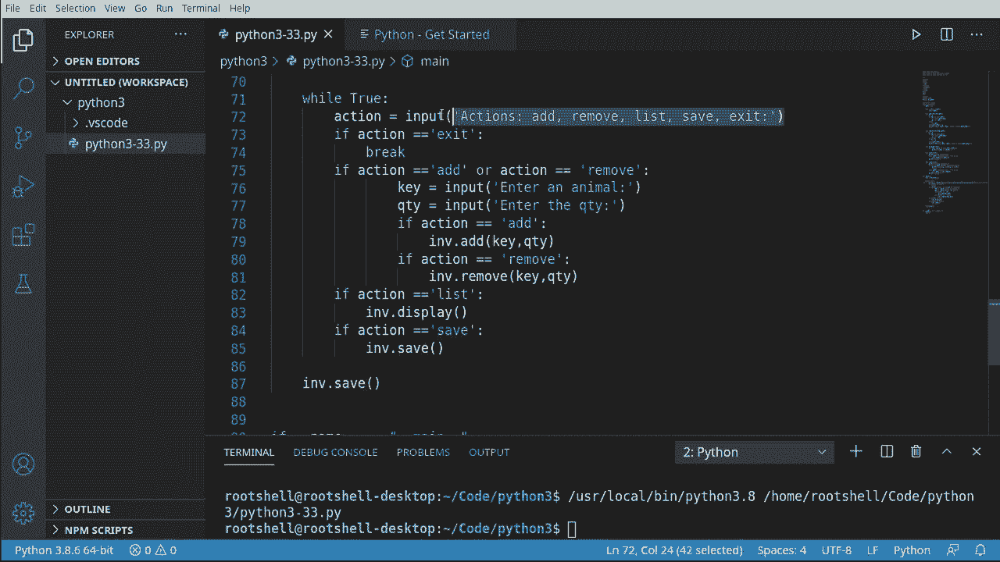

# Python 3全系列基础教程，全程代码演示&讲解！10小时视频42节，保证你能掌握Python！快来一起跟着视频敲代码~＜快速入门系列＞ - P33：33）构建宠物店应用程序 - ShowMeAI - BV1yg411c7Nw

欢迎回来大家，我是布莱恩。我们将把迄今为止学到的所有知识应用到一个宠物店应用程序中。这将像一个迷你库存系统。所以在深入之前，我们先快速谈谈设计。

首先要发生的事情是Python将启动我们的脚本。从那里开始，我们将去桌面加载任何现有的文件。然后我们将进入一个循环，让我找一个好的循环示例。这个循环只是会问他们想做什么？

它将会做一些类似于这样的事情，你可以选择几个选项。任何一个选项都会回到循环中，所以让我抓取这个。直接上到这里。最终，我们将退出程序，此时它会自动保存进度。

最终结果将看起来像这样。开始加载循环的一些选项。然后当我们退出时会保存。让我们深入看看。

好的，接下来我们将导入，我将在这里插入一些注释，这样我们可以看到之前小节中的结构。我们将创建一个类。这个类将有一些函数。

我们将有我们的主函数。然后我们将进行一些测试。但首先，我们需要导入我们将要使用的东西。所以我们将导入两个东西。我们将导入J和OS.path。杰森将用于保存和加载文件。我们希望有一个字典，能够将其持久化到磁盘。然后进行导入。

我们将使用OS路径，虽然有更现代的方式，但我们想检查文件是否存在。所以我们将使用OS路径，因为这有点像老派的做法。

一旦我们完成这些导入，就可以开始了。

现在，库存系统可能会变得有些复杂，所以我想创建一个类。我想将功能封装在这个类中，这样如果我们有多个库存，就可以分别处理。某个类。库存。接下来我们创建一个字典。我们将创建一些函数。所以我们将进行初始化。

对于这些初始的内容，我将暂时放入pass，因为我们现在不想在这里添加任何代码。我们将随着进展来填充这些内容。想要添加。我们可以稍微加快这个过程。因此我们将添加remove。我确实想能够显示库存中的内容。显然，我们还想能够保存，因为我们将把它输出到文件中。

而且因为我们可以说我们也想加载这个。现在你可能会想，为什么我不把它放到一个单独的文件中。我有点想要一个一体化的解决方案，只是想给你展示我们实际上可以做到这一点。下一步，现在我们有了类，我们将开始填充这些函数。

好的，到目前为止，我们有了一个类。这是这个类的一个高层次的视图。它包含init、add、remove、display、save和load。我们将填充并编写init和add。让我们下去看看我们的init。老实说，我想保持这部分简单到极点。我们在一开始就说，一旦这个东西启动，我们就想能够加载。

我会说self。😊，加载，我们将把所有功能放入这个函数中。现在，add在这里会稍有不同。我将去掉这个pass，并且我们将修改函数本身。我们想要一个关键字和一个数量。前提是，当我们添加时，我们会添加某种动物，比如猫。

一只狗或者其他什么，还有我们要添加到库存中的数量。所以我会说数量的简写Q将是零。现在，如果你看字典，它里面绝对什么都没有。所以我们不能直接去获取关键字。我们必须先测试它是否存在。所以它的关键字在self dot pets中。

然后我们将继续获取当前值，比如说我们在库存中实际上有多少。self dot pets。我们想要获取关键字。接着我们会更新我们的数量。也就是说取当前值并加上数量。现在，我们有了相反的情况。它根本不在库存中。

在这种情况下，我们将说Q等于。Thequ。从这里开始，相对简单。我们将说self dot pets。无论关键字是什么，我们只需用更新后的数量更新它。从这里开始。我将放入一些内容。为了节省时间，我将复制并粘贴。

添加了数量和关键字，当前总数就是我们库存系统中实际的数量。所以这相当简单，但这里有几个关键概念需要理解。首先，我们不想相信这个关键字真的在里面。我们需要测试以确保它存在，并且需要一些功能以防它不在那里。

在文件顶部，我们完成了导入。我们创建了类，填充并添加，现在我们将进行删除和显示。因此让我们到这里，删除一个显示，稍微跳过它们。所以我首先要做的是去添加，然后我想复制这个。

这样一来，我们就有一个非常相似、非常结构化的API来添加或删除，只需要一个键和一个数量。我们不会有任何奇怪的数据需要处理。所以删除正好是这里的相反，但我们实际上可以提取出这部分内容。例如，我们可以把整个结构直接复制到这里。所以我们将从0开始，我们会说如果键存在。

然后继续获取键。数量将是减法，而不是加法。然后我们想要一些其他的值。例如，我实际上不需要else，因为Q已经设置为0。实际上，让我把它放在正确的行上。我们现在要做的是测试，确保没有减去太多。

假设如果Q小于0。那么。我们想确保Q等于0。换句话说，你不希望在库存中出现负余额，这显然是没有任何意义的。然后，当然，我们正在更新库存，现在我们有某种输出给最终用户的显示。我们会说移除的数量键。

总数现在是，无论总数是多少。对于我们的显示，这将非常简单。或键值在。我们希望进入self.dot pets。如果我所谈论的任何内容让你感到困惑，我强烈建议你去观看我们讨论这些关键主题的视频。

例如，我们讨论过类。我们讨论过字典。我们讨论过四个循环和类似的事情。我们还讨论过Jason，以及几乎我们在这里谈论的所有内容。这些都在我们制作的32个其他视频中。现在让我们继续打印出来。

我将要说打印。并且我想要进行格式化打印。接下来我要说的是键。等于。然后是任何值。现在，在我们开始进行输入输出之前，我通常会在这一点上先运行一下，以确保没有任何奇怪的错误。

脚本将完全不执行任何操作。我们甚至没有主函数。我们只想确保没有任何奇怪的语法错误，类似的东西。好的，在我们的类中，我们处于保存部分，让我们一直往下到保存，我们将分别处理保存和加载部分。因此我们只专注于保存。所以我要去掉这个pass。

我想要提醒用户，我们要做一些事情，因为。好吧，因为我们在使用 Python，我会非常诚实地告诉你。我们不知道这将运行在什么样的终端设备上。它可能是一个高端的超快速服务器，也可能是一个极其缓慢的嵌入式设备。

我们根本不知道。所以我想告诉他们，我们要做一些事情，保存库存。当我处理任何 IO 相关的事情时，我通常会在之前和之后告诉用户，意思是我将要做某事，我已完成它，或者我遇到了一些错误。所以我会以这样的结构开始：保存和已保存。然后我会实际处理 IO。

原因是。如果你正在使用电脑，电脑的硬件驱动可能非常快。但如果你使用的是嵌入式 Linux 设备，脚本在上面运行，可能会非常慢。或者，如果硬盘进入休眠状态呢。

我相信你之前遇到过这种情况，保存文件时，听到硬盘转动的声音。我们希望确保用户知道我们的应用程序没有冻结。所以我们要说，打开，假设是 inventory.txt。现在，为了节省时间，我们要稍微打破自己的规则。

我们在谈论将所有这些放入一个类中，以便可以重用。问题是我现在在硬编码文件名。这不是个大问题，但如果你打算用于任何生产用途，你确实希望能够动态设置该字符串。好的。

所以使用 open，我们将以写模式打开这个文件，普通文本，FF 是文件的缩写。现在我们想做一个 J。记住，dump 和 dumps。你看到末尾的 S，这是我们要将其转换为字符串。我们不想这样。我们希望将内容实际导出到文件中。所以首先。

我们必须传递对象，在这种情况下，是 self.pets，以及我们要导出到的文件。关于 with 关键字，之前的视频中我们已经讨论过，它会自动为我们关闭文件，所以我们不必担心刷新内容或关闭文件。然后 JSON 将把这个字典转换为 JSON 格式。

将内容导出到文件中，然后 with 会为我们关闭文件。接着我们只需打印出已保存，这样最终用户就会知道，我们实际上已完成了 IO 操作，并且没有错误。

我们只剩下一个了。加载功能。哎呀，帮我选择对了。所以这是我们的类。我试着缩进一下，以便让函数在类内部看起来更明显。我们还有一个加载。它当然会加载文件。我们已经完成了保存，因此我们可以借用这里的小结构。

所以让我们抓住这个。😊，然后粘贴它。我们可以说我们可以拼写对，加载库存。然后加载它。请记住，文件名很重要。所以我们必须说使用同一个文件，我们将以纯文本格式读取它。现在。我们想要做的是转储的相反操作。因此在这里我们需要放慢速度。

我们在这里有点急于求成，我在想你是否能看到问题。如果你看不到的话。使用打开文件时，我们只是假设在加载时文件是存在的，我们需要对此稍微小心一些，因为这可能会引发一些真正的问题。但这就是我们一开始进行导入 OS 路径的原因，因为我们要检查文件是否存在。

所以让我们回到这里。我们会说。如果没有，O，S。点路径，点存在。在这里我们要确保文件名相同，所以我将字面上复制这个。然后粘贴它。接下来，我们想说。跳过加载。然后让我们退出这里。我们这样做是因为当调用加载功能时。

它会打印出加载库存。如果我们只是返回的话，它看起来像是程序挂起了，因为它会说加载库存并停止。因此我们要确保文件存在，如果不存在。然后我们会说跳过，没有要加载的内容，这样用户就知道那里根本没有文件。

你可以让这个看起来更好一点。然后我们会转到，如果有文件的话。我们将说用打开。以读取模式打开该文件。现在我们需要进行一个 J 加载，而不是转储。我必须说 self 点 pets。等于。Jason 点 load。请记住，如果以 S 结尾，则它会将其转换为字符串。

我们不想要这种情况。所以我们想加载，我们只需给它我们的文件。最后但同样重要的是，我们要打印出加载的信息，这样最终用户就知道，嘿。我们成功完成了输入输出操作，没有遇到任何问题。再次提醒，我喜欢运行。脚本不会做任何事情，但如果我有一个重大的语法错误。

它肯定会输出并告诉我。我们就可以继续了。看看我们的流程。我们已经走了很长一段路，我们完成了导入，整个类也做完了，现在我们要放入主函数。所以我要一直到底部。然后我会说。主，这会自动为我放入这里。

根据你的IDE，你可能需要实际输入这个，或者说如果名字是main。这意味着Python直接运行这个文件，那么我想要。调用一个主函数。很多人会想将其当作某种函数使用。我不喜欢这样做。我更喜欢实际创建自己的主函数。

这样我实际上可以直接复制并粘贴这个函数，在其他地方使用。无论我想做什么。所以我们需要创建一个实例。我们的库存，因为记住，一个类是一个蓝图。它并不是实际的对象。现在我们可以用这个蓝图告诉Python，拿去这个蓝图。

创建一个对象并将其以名为I N V的变量形式提供，I N V是库存的缩写。现在我们有了这个，我们可以创建一个循环。我知道在过去的视频中，我说过循环是万恶之源。应该避免，除非你知道自己在做什么，但。如果你一直在跟着。

到了这个阶段，我们应该知道自己在做什么。首先，我们要做的就是提示用户进行某种操作。所以我会说操作等于。我们想要输入。然后告诉用户，嘿。告诉我们你想做什么，我已经准备好这些内容，在我笔记中准备就绪。我应该说在屏幕的旁边。所以我们要说你可以添加、移除、列出。

保存或退出。这些是我们将在这里具体化的操作。所以首先。如果操作等于退出。那么我们就直接跳出这个循环。注意我没有返回，因为我想在最后做一些事情，让我回到这里。我们要说I和V，点保存。因此无论用户采取什么操作。

一旦我们完成这个循环，库存将在程序退出之前自动保存。我将把它放在这里。退出。Python处理脚本的方式是，一旦没有其他事情可做，它就会直接退出Python本身，这就是你看到它在这里停止的原因。好的，所以。一旦我们把这个放好，现在我们真正要具体化其他操作。所以，我要说。如果。

我们实际上可以复制这个，简化生活，老实说。我是复制和粘贴的忠实粉丝。如果操作是列出。那么我想要I N B那显示。如果操作是保存。我们可以直接说I和B，点保存。你可以做加载和其他所有操作，你注意到我没有把加载放进去，因为库存将会自动加载。

在构造函数中。但如果你真的想疯狂一下，你可以把那个操作放进去，Defite放进去如果你想要。现在。我将在这里放入一些逻辑，我们要说如果操作是添加。或者。操作是移除。那么我们将大致相同的内容。

这里的功能类型没有关系，无论是添加还是移除。我们有相同的API。让我们稍微向上滚动一下。所以移除时，我们需要键和数量，添加时也需要键和数量。所以无论我们在做什么，这里都没关系。在这里，我会说键等于输入。成熟。一个动物。而数量则是输入。一旦他们输入。

关闭了y。现在我们有了这两个，我们需要弄清楚实际调用的是哪个。所以我会说操作等于添加。然后做点什么。如果你已经了解一点Python，你可能知道有更好的方法来做这个，但我们只是使用到目前为止学到的东西。所以我得稍微简单点，不想说降低难度。

不过我得把它做得简单一点。所以，这就是障碍。我们将分支逻辑，假设是添加就做一件事，假设是移除就做另一件事。好了。最好实际调用移除。否则，我们就会添加两次。这就是拥有相同类型API的美妙之处。

如果你愿意，你现在可以开始将功能包装在这里，使其超级简化，超级容易跟随。😊所以遵循我们的逻辑，让我在这里抓取一些屏幕空间。当我们进入主程序时，我们将创建一个库存实例，然后开始一个循环。循环完成后，无论用户做了什么，我们都会保存这个库存。

在循环中，我们将不断询问用户：你想做什么，然后根据他们输入的内容采取行动。

剩下的事情就是系好安全带，测试一下。如果你有`__name__`等于`__main__`，并且你有主函数，没有语法错误，你应该就可以开始了。让我们抓取一些区域，这样我们就可以看到程序运行的情况，我们将运行这个。

它说正在加载库存，跳过没有可加载的内容，因为我们这里没有相邻的文件。它将显示操作：添加、移除、列表、保存和退出。所以让我们添加。我想输入一只猫。我输入数量为六只猫。因为生活中必须有六只猫，这是强制性的。

假设我们添加了6只猫，总数是6。所以让我们添加。我想在这里添加三只猫。所以我们添加了三只猫，现在总数是63。我们的程序中有一个bug。让我们结束这个终端。找出我们做错了什么。嗯。注意到输出有什么异常吗？它显示63而不是9。我们现在需要转换这个。

进行整数操作。记得我们简要讨论过类型转换。可以把类型转换想象成一个拿着魔法杖的巫师，他将施展法术，把一个东西转换成另一个。实际上，我们在幕后所做的是在说数量，然后动作添加到这里。它在说 V 加上 QTY，这就是 Python 及类似语言的祝福与诅咒，因为你没有类型。

它知道它们都是字符串，因此它只是将它们作为字符串相加。因此，一个字符串。它看起来像这样，正是我们刚刚看到的。够了。让我们重新运行这个。现在，由于我们关闭了控制台，我们仍然没有 JSson 文件。这正是我们此时想要的，所以让我们重新运行这个。好的，让我们再试一次。

添加。在6，因为你得有六只猫。和我一起说。我们要添加。在。我们想要添加3。现在我们总共有9。所以我们的逻辑现在按预期工作。让我们继续添加。一只狗。我说我们想要99只狗。然后我们意识到那太多了。我们真的不能有99只狗和9只猫。所以我们就。

放慢一点。让我们移除。狗。伙计，你知道，我喜欢狗和喜欢猫一样多。这对我来说是个很艰难的时刻。让我们继续。移除98只狗。我非常抱歉，狗们。今天不是你们的日子。我们已经移除了98只狗。现在我们总共有一只。现在，我们可以输入保存。但我将直接退出。保存的库存已保存。

所以它为我们自动保存了，并且生成了这个库存 TxT。如果我们出去看一下，我们有九只猫和一只狗，一切都如预期般工作。我将清除我们的控制台。然后重新运行，这里会发生一些神奇的事情。加载库存低。让我们调用列表。我们有九只猫和一只狗，所以它现在已经加载了那个 Json Voil，并将其装载到字典中。

一切都按预期工作。我将继续说，只需按下，按下，按下。你可以看到，由于没有有效的输入，它只是回到了循环中。我将输入一些垃圾数据。无论我们做什么都没关系。我将继续添加。鱼。我想要45条鱼。我将故意保存这个。保存的库存已保存。

我将继续显示。基本上，你可以一直这样做，但哦哦，显示。我不想显示，我想要列表。你可以看到我们有九只猫、一只狗和45条鱼。我们可以这样做整天，但我真正想表达的是，现在我们有了一些编程逻辑，一切都按预期工作。所以我将退出。我们将保存我们的库存。

我们可以去看看，果然一切都和我们完成应用时完全一样。好吧，这段视频的主要收获是。这是我们迄今为止所学内容的总结。我们学习了导入、类、函数、控制流程，了解了Ma，并进行了测试。

我们已经了解了Jason、O路径，以及在这里进行的拆解。😊，总是，永远，永远初始化你的变量，即使只是空的，因为你不想让某个变量未定义。构造函数是你的朋友，因为你可以设置某种默认行为。在不确定的时候，永远检查你的数据类型。确保你给用户提供某种视觉反馈。

生活有时并不那么简单，你需要检查文件是否存在或者类似的东西。我们还讨论了像with关键字以及如何以纯文本读取和写入文件，我想我们也涵盖了二进制文件。

但一个主要的收获是，不要像我那样将文件名硬编码。我这样做只是为了节省时间，但你可能真的想询问一下。如果你想进行一些调整，可以创建另一个函数并将其放入构造函数中，基本上说如果我们没有文件，你想使用哪个文件，让用户输入一些内容？

希望你觉得这次内容既有教育意义又有娱乐性，请在下面留言告诉我你的想法。
