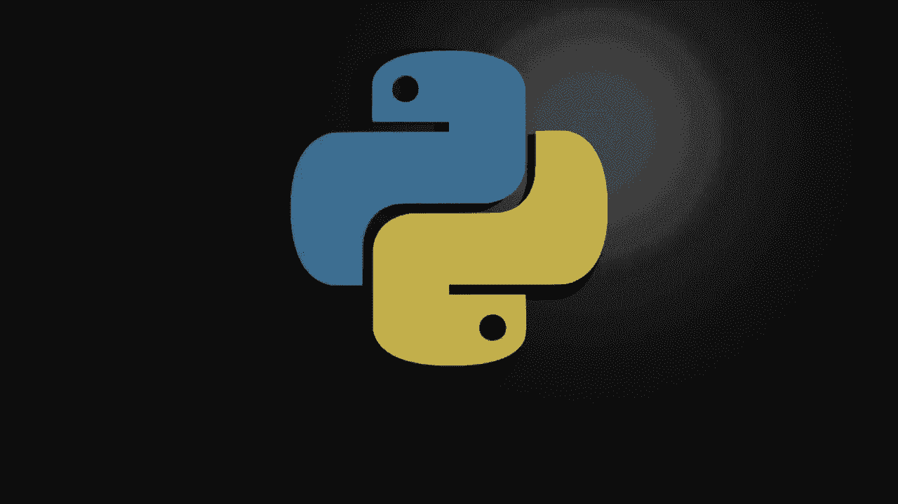
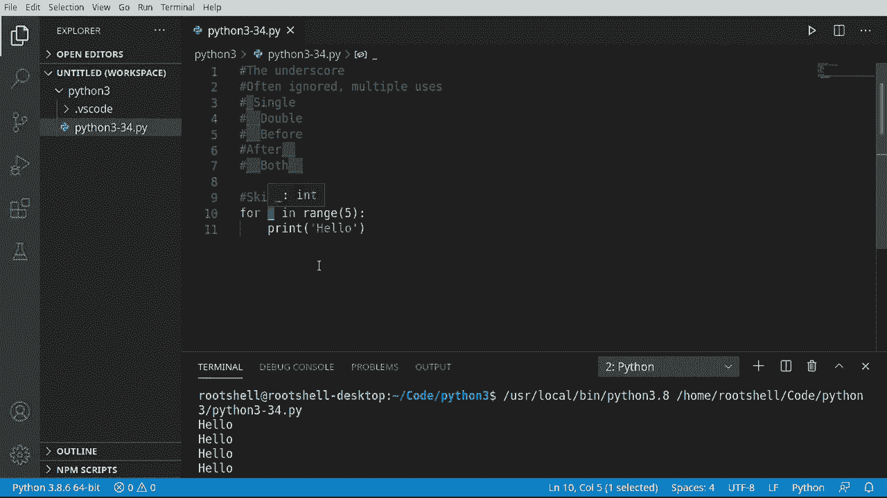
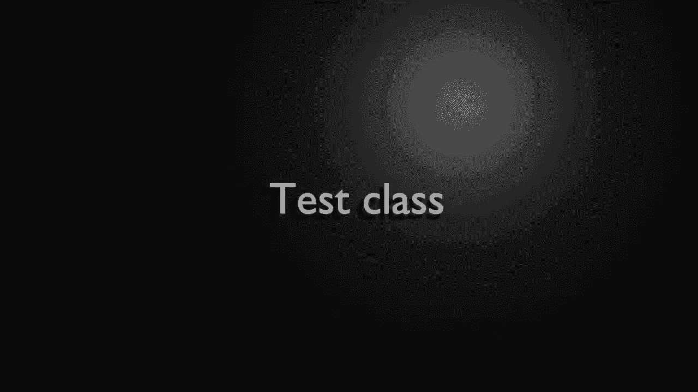
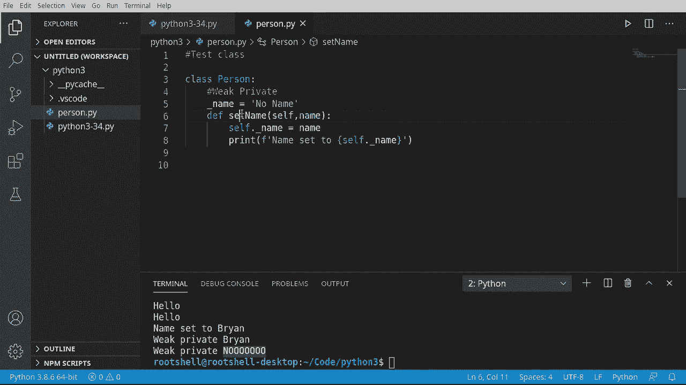
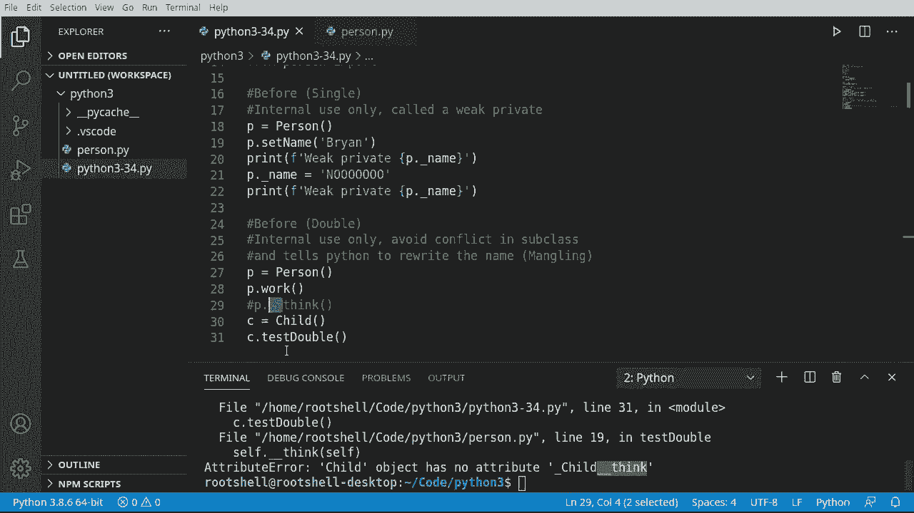
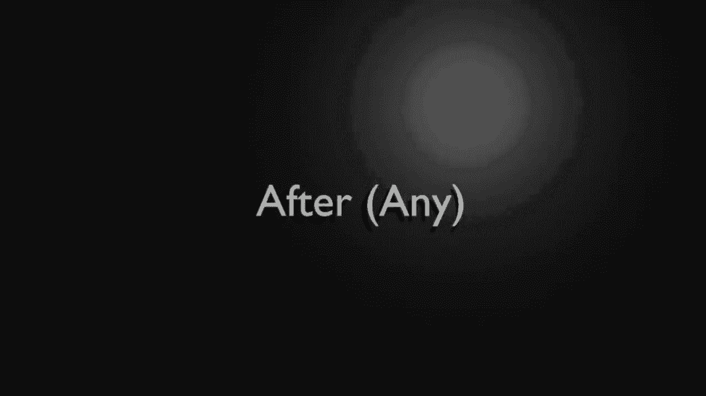
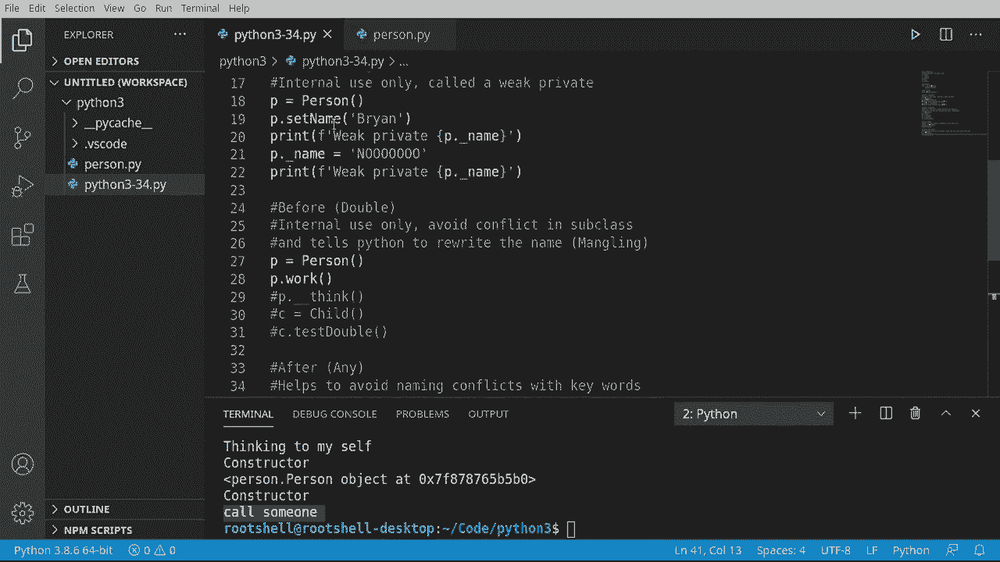

# Python 3全系列基础教程，全程代码演示&讲解！10小时视频42节，保证你能掌握Python！快来一起跟着视频敲代码~＜快速入门系列＞ - P34：34）底层核心 

欢迎回来，大家好。我是Bryan。在这个视频中，我们将讨论下划线。下划线通常被忽视，具有多种用法，确实让人感到困惑。学习不仅仅是Python，而是任何语言的一个障碍就是语法，而Python的语法与其他语言略有不同。因此，它常常让人感到困惑。

甚至季节性程序员对这些东西感到有些困惑。例如，你可以有一个单下划线，可以有一个双下划线。它可以在前，也可以在后，或者是前后结合。但这些不同的方法各有其存在的原因。

我们将深入研究并看看。😊 我们要做的第一个用例是一个单一的，它将是跳过。现在，当我还是个小男孩的时候，我常常逃学，这并没有给我带来多少好处。但在这种情况下，跳过实际上是件好事。我们将说4 X在范围内。我只想打印出hello，并且我想打印出hello。

比如说五次，做一些类似的事情。所以我就要在这里放一个数字。现在，你注意到了一个根本问题，X吗？它没有被使用。代码运行得很好。但如果你通过任何流线程序或任何试图告诉你如何让程序更快更好的解释器运行它，它将开始抱怨X没有被使用。

所以我们可以简单地用一个单下划线替换X。继续清空我们的程序，你会看到它运行得完全如预期。基本上，通过使用下划线作为变量，你是在说我不在乎。我只需要一个变量，我永远不会使用它，Python。

创建一个变量然后把它去掉，这实际上就是我们所说的，因此在某种意义上我们现在跳过了整个变量过程。

现在，为了深入探讨下划线的复杂性，我们需要创建一个可以在这里玩弄的测试类。所以我将进入这里。说person点P，Y。我们继续说class person。暂时我只想说pass。因此我们所做的只是简单地创建那个类。

然后我们将继续导入它。或者说从person导入start。请知道我们将会在脚本和类之间来回切换，因为我想真正演示许多下划线的用法，除非你在类内部工作，否则并不明显为什么需要它。

我们要看的第一件事情是所谓的**弱私有**，它是单个下划线。如果你向上滚动，这就是它的样子。它仅供内部使用，称为弱私有是因为我们在玩弄作用域。这就是我为什么要创建一个类，正如我们即将看到的那样。所以我要去掉这个**pass**。

我必须说，我们的自豪感。因此，当你在脑海中想象一个**弱私有**时，我们在谈论什么？我们谈论的是内部或外部的作用域。如果某样东西是私有的，它对于这个类来说是内部的，如果是公共的，则是这个类的外部。弱私有意味着它对于这个类来说是内部的。

但是这个保护措施很弱，这意味着你可以在类外访问。即使你真的不应该这样做，我们还是来演示一下。所以我必须说**下划线名字**。等于。有名字。我们在这里做了什么？我们创建了一个变量叫做**下划线名字**，等于**无名字**。

单个下划线表示它是一个弱私有。我们在告诉世界，嘿。我们想要在内部使用这个。我们并不希望外界干预。然而，我们可以演示为什么这是一个弱私有，因为我们实际上可以随意操作它。如果我们愿意的话。现在，我强烈建议你不要随意操作私有属性。

但是如果你真的想这么做，只需，嗯，确保你把这件事藏好。我们要说**self.underscoreing_name**。等于**name**。我们在这里做的事情非常明显。我们只是说**self**。这个家伙的名字将等于那个参数。现在我们可以打印出来，验证一下它确实改变了。

让我们回到这里，看看它的实际效果。我们要说**P等于Person.y**。然后我们想设置名字**Ran**。继续运行，看看会发生什么。果然，名字被改成了**Bryan**。所以它的工作如预期般正常。现在，通常情况下，你会被问到。如果你输入变量点，智能提示会弹出。你会看到所有这些带下划线的东西。

还有**underscore_name**。有趣的是，实际上我们可以抓住这个家伙并对其进行操作，即使我们真的不应该这样做。我们来演示一下。所以我打算说**弱私有**。让我们继续把这个改为**P_name**。现在我们实际上可以读取这个弱私有。

即使我们真的不应该。我只是想说，不。即使我们真的不应该。我们可以访问和修改**私有**的。我放了**无**，因为你绝对不应该这样做。如果你看到有下划线的东西，请不要尝试修改它，尽管Python会让你这样做。坏事可能会发生。那个下划线，单个下划线，表示仅供内部使用。

当我们说内部时，它在其作用域内。在这种情况下，就是类。所以是的。无论是谁创建了这个类，都很不错，让你访问它。你真的不应该。你不应该依赖于此。相反，你应该依赖于函数来获取和设置值。

好吧，让我们退一步，想想作用域。我们谈过仅供内部使用的弱私有。但现在我们要谈谈。双重。它在这之前仅供内部使用，并避免在子类中的冲突，并告诉 Python 重写名称。这也叫做名字改编。那么我们到底在谈论什么呢？

好吧，我们在谈论一个前面带有两个斜杠的变量。我们正在告诉 Python，我们希望它仅用于内部使用，并采取额外一步自动更改变量名称。哦，这听起来有点可怕。那么让我们搞清楚需要做什么。让我们进入我们的类。😰，我将在这里做个笔记，以免迷路。

强私有。这就是我们在讨论的内容。你想要一个强私有。开个玩笑，让我们看看这里。有人说是哑巴。我想要下划线，下划线，思考。所以。其实想一想，这看起来相当简单，所以我会打印。心想。我的意思是，没有人能真正读懂你的想法。如果可以的话。那么。

我们可能都会陷入很多麻烦。我们要说哑巴，并且我们将创建另一个名为 work 的函数。我将说 self。下划线。谢谢。因为我们在同一作用域，一切按预期工作。但现在让我们引入另一个类。Child。我们之前谈过继承。

所以这应该没什么新鲜事。只需继承人类。我们要说哑巴。T 双重，它需要一个名字。我真的不在乎是什么。我们要说 self。下划线和 u O。注意。尽管我们从人类继承，但它看不到下划线。下划线，思考。它只是有那个。好吧，让我们试着强迫它。

所以我们要抓住整个东西。让我们看看会发生什么。接下来保存我们的类，跳回脚本文件。我将这里创建一个新的实例。所以我会说玩得好的人。可以重用另一个实例，但我们只是做一个全新的。

我会说 P dot org。让我们看看这实际上是如何工作的。所以我在想，我可以按预期调用它。现在，我们要做的就是尝试做与一周相同的事情，我们要在这里说 P。不是下划线，下划线。想想看，inc是否会在这里帮助我们。我们将尝试运行它，但哦哦。没有属性。

这里发生的事情是，我们现在使它强制性。私有，并且在后台进行混淆以处理子类。所以我们甚至无法访问那个函数。它就消失了。根本无法从外部世界看到它。但我们可以在我们的内部类中完美地看到它。哦，天哪，好的，让我们来看看。我将C设为。孩子。记住，孩子实际上是从人那里继承的。在子类中。我们有一个测试双胞胎，它将调用self__think。

这实际上是一个人的一部分。你在哪里，你就在哪里。这是混淆将在这里真正演示的地方，有人说C。我想说，测试双胞胎。有人猜测这里会发生什么，让我们先清除一下。保存运行，哦哦。子对象没有属性。孩子们想，所以。

这里真正发生的是，我们说它仅在声明它的类中被允许。几乎有数以百万计的用途，但你需要知道的是，如果你想让某个东西对那个类及仅对那个类私有。

你将使用双下划线。我将注释掉这些，以便我们可以继续。

让我们来演示一个非常酷的功能。我们将讨论任何之后的内容。现在。我们在这里谈论任何之后的内容，任何数量的斜杠之后。这里有一个很好的用法。假设我想创建一个类对象，我将称之为。人。有人在我运行之前看到这个问题吗，举手，你在后面。哦。

类。你猜对了，语法无效，因为类是一个关键字。哦，这真令人沮丧。我真的想给这个类命名。好吧，这就是我们可以做的事情，实际上我们创建了一个全新的名称。但我们仍然可以称之为类。美化它，这甚至算是一个词吗，美化它。

所以我们可以使用单词类，但仍然不会与任何关键字发生命名冲突，这正是设计它的目的。它有助于避免与关键字的命名冲突，然后从这里。我们可以简单地说类似于无打印。类，然后我们可以打印出来。

根据我们的想法来使用它。看，他创建了一个对象，一切都将如我们所预期的那样工作。把这一切都包起来，我们将讨论后续的内容，我们之前也用过这个。这被认为是Python中对像init和main等功能的特殊处理，我们之前见过。但我想深入了解我们的类，看看我们如何实际使用它。所以。

我们来这里。我们要说前和后，当然，我们已经做过了。在其中。如果你跳过那个视频，基本上这是构造函数。但你注意到这里的语法了。我们有双前和双后。所以基本上，我们告诉Python这是类内部的内容。

我们想避免命名冲突。同时，它不会为子类混淆。但每个子类将有自己的实例。这就是我们可以为人类和儿童提供构造函数的方式。我们在关于初始化器的视频中讨论过这一点。所以让我们使用前后自己创建一个函数，我要说死亡。哦。

如果我第一次拼写正确那就太酷了。好了。我将说打印。太棒了。所以看起来很简单。实际上，这符合Python的精神。它简单到死，而且如预期那样工作。让我们继续说P等于。人。E点双下划线。

你会注意到这里有很多以双下划线开头的内容。我会说调用。我们只是在这里调用一个函数。说运行并调用某人，它就能正常工作。现在，旁注，我不建议以下划线开头来命名任何想要在这个类外部访问的函数。因为下划线意味着弱私有。

这基本上是在对外界说，嘿，这将是类内部的内容。而且从那里开始更强烈，你实际上可以开始混淆它。或者你可以告诉大家，嘿。内部，不希望你使用它，但也不要混淆。这就是前和后。当你有疑问时，双下划线是你的朋友。前和后。

如果你用强私有的混淆效果，可能会开始出现一些奇怪的问题。所以总是记住这一点。但一般经验法则是，任何私有的东西都会以一个下划线开头，并且不要在不同的作用域中访问任何私有内容。

尽管我们已经演示了如何做到这一点，但这并不是做事的最佳方法。你应该使用getter和setter，我们在这里展示过，比如设置名字。
