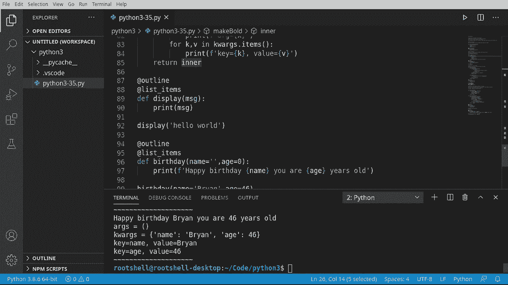

# Python 3全系列基础教程，全程代码演示&讲解！10小时视频42节，保证你能掌握Python！快来一起跟着视频敲代码~＜快速入门系列＞ - P35：35）装饰器 - ShowMeAI - BV1yg411c7Nw

大家好，欢迎回来。这是布赖恩。在这一集里，我们要谈论装饰器。而且不是为了让事物变得更美观，尽管在屏幕上看起来确实好看。所以在Python中一切都是对象。这意味着即使函数也可以作为对象使用。这正是装饰器将要展示的。我们可以做一些非常酷的事情。

在核心，装饰器接受一个函数，😊，添加一些功能并返回它。关键词返回它。

好的，让我们深入看看。

所以我会做一个装饰器，我会故意做错。我要故意做错，以展示装饰器实际上是如何工作的。我们会说de，假设deck或ator。我想给它一个函数。注意这只是一个变量，这是因为在Python中一切都是对象，所以说打印。

然后我们要真正调用那个函数。如果你有点困惑，我们有一个叫做funk的变量，它实际上是一个函数的引用。这是因为你可以像变量一样传递函数。因此它简单地表示在之前和之后，所以我们继续保存运行，但没有发生任何事情，因为我们没有调用这个函数。

现在，让我们介绍装饰器的概念，简单地说就是做一些事情。现在我们继续说打印做事情。如果你看看这两个函数，它们非常基础，我的意思是，这很容易理解。你有一个函数，它以另一个函数作为参数。

我们将获取那个参数，然后在内部调用它，所以它只是在调用另一个函数。因此我们有我们的做事情。现在，装饰器的真正目的是什么。可以说像这样。F等于。所以我们要获取某个函数。我们要说测试装饰器，做事情。这正是装饰器的目的所在。

所以让我们去掉那个，调用装饰器，这是许多新手真的很困惑的地方。创建装饰器真的很简单。你只需在你想装饰的函数上方加一个@符号和函数名。现在，这里有一个狡猾的小问题。

这个测试装饰器没有返回任何东西。所以当我运行这个时，你猜会发生什么。我将清除它，以便你可以看到。你发现问题了吗？我们从未调用这两个函数，但它却执行了。这是因为Python在后台做的是它取了这个并说在测试装饰器中。

它将拿着这个。放在这里，然后立即调用它。所以代码正在执行，即使我们没有直接执行代码。这是一个初学者的基本错误。所以请非常注意这一点。让我们看看一个真实的装饰器的例子，我们将以正确的方式来做。

这非常非常相似。我将说“de”。我想让它**加粗**。我们将遵循相同的模式。然后我将定义一个内部函数。现在，在我做任何事情之前，我将立即返回这个内部函数，而不调用它。

实际上，我所做的就是传回一个变量。这非常非常重要。你需要理解我们在这里做的概念。我们正在创建一个函数，并且我们在一个函数内部还有一个函数，我们返回内部函数。所以在这里的内部函数，我将继续遵循相同的模式。

所以现在我们有一个前后对比，因为我们要**加粗**，我们就说我们在处理一些HTML。所以我们只需做HTML的不同代码，如果你不知道HTML，基本上我们说的是开始**加粗**，停止**加粗**，就这么简单。好的，那么现在。我们可以拿这个来说，是的。

打印名字。把这个首字母大写，只是为了看起来好一点。然后我们将继续打印你叫什么名字。现在。我们从上一个部分学到，函数名前的@符号才是真正的装饰器。所以我将复制那个名字，去@，然后加粗。现在。

看我运行这个时发生了什么，我们会看到这里执行，但我们实际上看不到“Bryan Karens”。好的，所以实际上我们在这里做的事情是做一个等同于，我将在屏幕上复制一些东西。假设在屏幕外，我们说“@加粗等于函数等于加粗打印名字”然后调用那个函数。

但这个函数调用只是返回这个内部函数，如果这让你感到困惑，就这样想。我们说**加粗**，所以我们在说**加粗**，把这个函数作为变量。然后。我们将说“返回”将是。打印，调用我们的函数，打印。然后返回“返回”而不实际调用它。

现在我们有了可以操作的变量。哇，这似乎超级混乱。但实际上，在这里操作非常简单。现在我们可以说这样的事情。打印名字并调用我们的函数。记住，在后台，发生的事情是它会经过所有这些装饰器，返回这个内部函数。

当我们调用 print name 时，实际上它会调用。make bold 然后调用这个代码，变得有点困惑，但结果。是相当惊人的。好吧，以防你需要快速回顾一下。@符号意味着我们正在使用装饰器。我们在调用这个函数。我们把这个作为参数返回给函数。

然后内部函数将运行一些代码。我们只是将那个内部函数作为变量返回。因此基本上，我们在这里做的是。我们调用那个内部函数。可是我们没有直接访问它，这就是为什么人们对装饰器感到困惑。

一旦你理解了这一点，它们其实相当简单。

好吧，如果这还不够令人困惑，现在让我们让它更复杂。假如我们想要向这个传递参数，我们该如何向所有这些传递参数呢？你知道，函数和内部函数还有所有这些有趣的东西。所以这就是我们在这个小部分中真正要看的内容。带参数的装饰器。

所以假设我们想要创建某种函数。叫做 divide。这个函数应该。令人震惊地进行除法。我们在 Python 中遇到的问题是，嗯，它是非常。弱类型的。我的意思是 A 和 B 是整数吗？是浮点数还是字符串，是类？例如，你能用猫去除 A 吗？这是个很好的问题。所以我们需要做的是。

像这样打印。A 除以 B。现在，如果我们要，我只是。放一些东西在这里。复制并粘贴。你认为如果我们进行 100 除以 3，会发生什么？那 100 除以 0 呢？你会得到除以 0 的错误。100 除以一个字符串呢？好吧，你会得到一些非常糟糕的结果。我们来运行一下看看。没错，除以零。

噼里啪啦，让我们尝试一下。我传递这个，然后再试一次。结果是不支持的操作，字符串类型。超级，超级令人沮丧。我们想要的是一个装饰器。它将检查我们是否能够进行除法。如果可以的话，实际上进行除法并返回结果。

这意味着我们现在正在进行类型检查，并且我们正在传递参数。我们来快速实现一下。所以我创建一个网站。我们把这个叫做 numb check。我差点想叫它 nubchuck。得表现得好点。好了，numb check，数字检查的简称。这将是我们的装饰器，我们将在这里放入两个函数，我必须说一下。

检查整数。并不一定要是整数，但作为示例。我们将确保它是一个整数。我会立刻传递。然后我们假设输入。在内部，我们需要一个 x 和一个 y。你会注意到这有一个定义的参数数量。这里发生了什么。我们在匹配。

函数调用看我们有一个，2 和一个，2。因此我们基本上有两个参数。我们想确保与这两个参数对齐。我们将在下一个部分向你展示如何解决这个问题。但我想先展示如何传递参数。

这就是为什么我在一个特定的数字，1，2 和 1，2。这么说吧，在我们的内部。我会简单地说。F。不。检查。然后我想检查 X。我们将说。或者不。检查。我要检查为什么，因为我们将检查这两个。确保它们都是。数字。如果它们不是，我们将返回。我注意到我们没有返回内部。我们只是返回。

因此，它将完全不采取任何行动。然后我们将在这里退出，说明否则。我们将返回。该函数。如果你对我们从哪里得到这个感到困惑。它是我们装饰器的参数就在这里。我们将返回。X，Y。现在。让我们返回。我们的内部。如果这让人困惑。

这实在是太让人困惑了。我很抱歉，确实如此。我喜欢装饰器。但这些实在是太令人困惑了。所以😊，一旦我们将其变成装饰器。现在就让我们这样做。Python 会说 numch。然后它将说 divide，将 divide 传递给这个。

这将进入我们的内部和其他所有东西。它会像烫手山芋一样被传递，并试图搞清楚。这很让人困惑。实在是太让人困惑了。我们先来进行检查整数。然后我们将一步一步地处理这一切。确保我们理解这里的逻辑。

所以会说 F 是实例。0ero，逗号。我们只是进行一些类型检查。这是一些非常基础的类型检查。然后在类型检查之外，我们遇到了除以零的问题。因此如果它是一个整数，我们想确保如果。哦。等于零。想让用户知道这里发生了一些事情，打印。并且不除以 0。

然后我们只想返回假。好的。如果我们已经过了这一切。让我们在这里退出。我们将返回真，因为它不是 0 且它是一个整数。因此我们应该能够进行某种除法。如果我们已经到了这一点而还没有返回真或假。我只是想说打印，这不是一个数字。然后我们会解决这个恼人的字符串问题。

然后我们将返回假。好的，因此。这里的基本逻辑。伙计。为这个系好安全带。我们的装饰器将是 numbmchuck 一些函数。我们的内部将在这里下来，并说，好吧，我们有两个参数 X 和 Y，如果没有。然后检查 X 和检查 Y。检查将会说，它是一个整数吗。

如果它是一个整数。然后我们要问它是否为 0，如果是 0，那么我们将返回 false。然而，如果它是一个整数，我们将返回 true。如果我们没有从那里返回出去。我们将返回 false，并说这不是一个数字。可能有一种更优雅的方式来做到这一点。我只是快速写了一些代码。

一旦我们说，好吧，它不是一个整数，或者它没有通过这个检查。我们将不返回任何内容。然而，如果我们能够做到这一点，那么我们将返回函数 X Y，这意味着它实际上会为我们执行除法。哇，真是疯狂的艺术。我们的装饰器在这里。让我们用 103 来测试一下。运行。

确实，它返回了 3。3 重复。让我们尝试用 0 除以。不能被零除。所以它捕捉到了这一点。现在，让我们尝试用 100 除以猫。而猫不是一个数字。非常酷。非常实用的设计，而不需要做太多的来回。我们可以简单地定义一个装饰器。然后。你猜对了，使用它。

我们可以一次又一次地使用这个。一旦我们达到这一点，它就变得如此简单。

好的，最后一小节真的非常混乱。但这里的主要收获是，你可以通过一个简单的装饰器获得一些非常复杂的功能。最大的问题是我们有两个参数，而只有两个。如果我们想要有一个未知数量的参数，并且我们想将它们链在一起呢。

让我们来看一下。所以我要制作两个装饰器，叫做 de。和 outline。最初，我只是要传递。我可以复制这个。称其为 list items。现在我们要创建另一个函数，称之为 display。display 只是会显示一个名为 message 或 MSG 的变量。非常简单。

只是打印出来。不确定复制和粘贴在何处背叛了我，来了。好的，非常简单，非常容易理解的结构。我们将把这两个链在一起。当我说链时。我们说的是这样的东西。所以我们创建了一个链，它看起来像一条链，因为你有这些小的 at 符号或链中的链接。

这些可以。只是为了给你一个图形表示，看来你有一条链向下延伸在屏幕上。其实，这是一种先到先服务的方式。所以 outline 会首先被调用，然后 list items 会第二个被调用。如果我们想的话，我们可以不断地添加。

但这就是我们必须返回内部函数的主要原因。所以让我们开始详细阐述这些内容。现在，我想说的是。表示零个或多个参数，或者。零个或多个关键字参数。如果你跳过了那个视频。我强烈建议你回过头去看播放列表，链接在下面。

观看视频，理解 as 和关键词 as 之间的区别。然后，打印。我们只会打印出。T灯。I 的 20。因为大纲会令人震惊地概述我们在这里输出的内容。现在我们将调用我们的函数。用我们的 star as。和 Heward arks。一旦我们到了这一点，非常简单，只需返回。我们的内部。

我们的第一个装饰器差不多完成了。它将做的就是概述。我们的函数。非常简单。现在，列表项稍微复杂一些，但也不太复杂。首先，让我们下去修复这个。MS G。好了。更明显地展示 display 实际上将做什么。所以我们将输入。我们可以。

直接上去，抓住这个。保存作为稍微打字。好了。所以我们要做的第一件事就是，嗯。我一定是点了什么。好了。我们要做的第一件事就是调用我们的函数。然后我们想要能够列出它。但在那之前，我先打印。F。我们将说 as 等于。

我只是想看看 Python 实际上给了我们什么，这样你可以更好地理解。我们可以用我们的关键词 args 做同样的事情。让我们继续返回。我们的内部。所以现在我们有两个不同的装饰器，它们做两件完全不同的事情。然后我们可以调用我们的函数。看看它们的实际效果。所以。我们得到了 Hello world Args Args。

这实际上应该是关键词 as。注意，如果你期待的是 hello world 和一堆波浪线在下面，会发生什么。没有。所以基本上，列表项是在大纲内部被调用的。这是链式调用的一部分。大纲首先被调用。因为我们现在正在传递这个其他装饰器，它现在形成了那个链。看看这是如何工作的。我们的结束就在这里。

为了打破这个，我们实际上可以把它变成像一个加号之类的东西。只是为了让你看到开始和结束。对。叫呢。Asems start finish。非常，非常有趣。它的工作方式。我绝对喜欢它。😊 但注意，第一眼这里。Args 是一个元组。关键词 args 是一个字典。哦，好吧，这确切地告诉我们如何遍历这些东西。

有人说，4 x 和 as。让我们继续，打印。我们将格式化那个。我要 Arg 等于。然后，x。我们可以为我们的关键词 as 做非常非常相似的事情。只不过那是一个字典，所以我们要做一个键值对。如果我刚刚在屏幕上所做的看起来像黑魔法，回到播放列表。

链接在下面，观看关于字典中 for 循环的视频，我们将使用关键词 as。项。然后我们将说键等于 x，而值等于。实际上不是 x，抱歉。E 是 K，值是 V。好了。保存运行，确实如此，我们的 hello world，注意它没有。这个字典中没有任何内容，因为我们没有关键词参数。看。

我们只是在处理一个普通的参数。所以，让我们继续。在这里做些不同的事情。我们说生日。我想要一些关键字 a，名字。等于。随便什么，年龄等于零。我会说打印。格式。生日快乐。随便名字是什么。你是。随便他们的年龄是多少。岁。现在，让我们用关键字参数来调用我们的函数。

我们可以继续重用这些装饰器，所以我只是会直接复制。并粘贴。注意，这里有两个不同的函数，做着完全不同的事情，它们甚至有不同的参数类型，但我们可以使用相同的装饰器。让我们看看它的实际效果。生日快乐，布莱恩，你46岁了，现在我们没有作为。

但是我们有这个漂亮的字典，我们从中获取键和值。如果我只是。向上走。你可以看到它们都被触发了，一切都如预期般正常工作。所以装饰器的主要收获在于，它们很复杂，真的会很快变得令人困惑。但你应该从装饰器中真正理解的最大收获，从一开始就是它将调用这个函数。

如果你不返回，内部函数只会执行代码。所以一个真正的装饰器看起来像这样。你有你的函数，你有你的装饰器。装饰器将有一个内部函数，你将返回一个指向该内部函数的变量。从那里，实际上，你的想象力是唯一的限制。

你几乎可以做任何你想做的事情，这些变得高度可重用，你可以将它们简单或复杂化，随你的意愿而定，并且可以在许多不同类型的函数中重用它们。
