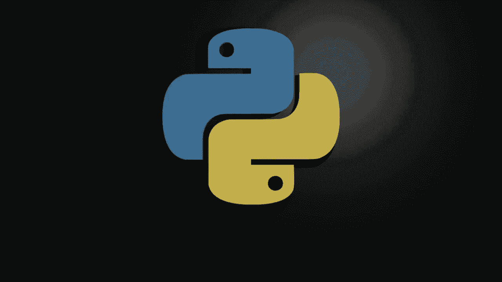
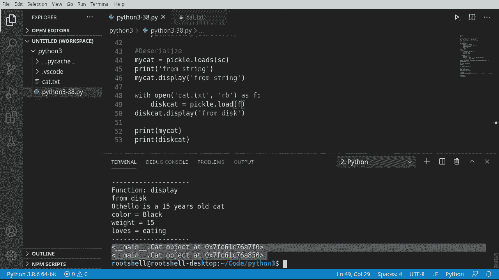

# Python 3全系列基础教程，全程代码演示&讲解！10小时视频42节，保证你能掌握Python！快来一起跟着视频敲代码~＜快速入门系列＞ - P38：38）使用 Pickle 进行序列化 - ShowMeAI - BV1yg411c7Nw

欢迎回来，大家好，我是布莱恩，在这个视频中我们将讨论pickle，大家最喜欢的。那么，pickle到底是什么呢？当我第一次阅读它时，我忍不住笑了。腌制是一种保存食物的方法。这是一种非常古老的做法。我们将对对象做同样的事情。所以我们将对它们进行序列化。

这是一个更现代的术语，但我们将保存一个对象。这个对象可以保存在另一个位置，例如，硬盘上。😊。没错，你可以创建一个对象，保存它，重新启动程序后重新加载这个对象，仿佛什么都没发生过。这非常酷。这被称为序列化，并且变得非常复杂。Pickle。

虽然很棒，但并不完美。它确实有一些局限性。我鼓励你去研究dill，D I L L。还有其他序列化工具可以克服pickle的一些缺点。我们将仅讨论pickling的基础知识。那么，你首先能pickle什么呢？

几乎所有的Python数据类型和顶级类。意思是如果你在类中再定义一个类，再在那个类中定义一个类，你会遇到问题。所以首先，让我们导入pickle。好的，直接进入这里。我们要做的第一件事是添加一个装饰器。

我们使用的装饰器和之前视频中相同，如果你错过了我的装饰器视频，可以回到播放列表观看装饰器教程。你错过了它。它将仅仅打印一行，打印函数名，所有的函数，并打印一行。好的，所以我们的类会非常简单，因为我专注于序列化和反序列化。

我们只是在查看序列化的基础知识。所以我们将说cat。然后，我们想去定义一个方法。我将要定义它。我们希望它包含name，age和info。所以name和age似乎很简单明了。我们要找的像是一个字符串和一个整数。但info是什么呢？这就是我们想深入探讨这个视频的原因，事情并不总是看起来那么简单。

我们将说self.name等于name。然后通过复制和粘贴的魔法，我最好直接从顶部抓取它。哎呀，我们不想搞混它们。好了，差点给我们带来了一些麻烦。所以我们会说self._name，self._age，self._info。再次强调，底线符号表示这些是类内部的。

我们不想让其他人玩弄它们。所以接下来我们将创建一个功能。我们想显示某种类型的消息。让我们使用我们的装饰器。只是为了装饰一下，让它在屏幕上看起来漂亮整齐。然后我们将打印出消息。不管消息是什么。

但现在我们也想打印。我们想放入。或者说名字。还有年龄。是的。或者我应该说，是岁。那样不太有意义，是吗？

我帮忙拼写了所有这些。好了，猫的名字是年龄岁的猫。好了，现在更有意义了，然后我们将获取信息，这将是一个字典项。所以我会说四。好的，变成自我信息项。这样我们就可以迭代这些字典项并打印出来。

然后我们要说。就是这样。这里发生的事情很明显。如你所见，这并不是一个超级复杂的类。我只是想覆盖一下基础内容。让你确切知道我们在做什么。我将继续创建这个实例。我会说“哦，奥赛罗”。这是我一只猫的名字。不幸的是，猫咪去世了。

他可能是我拥有过的最好的猫，但我爱他如命。好了，奥赛罗。15。然后我们将创建一个字典。并填充。哦，等一下，他是一只非常胖的猫。他喜欢。吃东西，这几乎是他的爱好，对这只猫来说，简直就像是一项竞技运动。然后我们将说。哦，奥赛罗，显示一下。只是想测试一下。

在我们做其他任何事情之前，我要说显示。接下来。相同运行，自我信息。我们这里有什么，38。9ine30h是的。有点问题。请参阅我之前关于错误处理的教程。好了，所以让我们去清理一下。好了。所以函数。现在我们可以看到我们的装饰器按预期工作。那就是我们的行。

这里是函数名，我们的消息，然后是奥赛罗的15岁猫的颜色、黑色、体重、喜欢吃东西。然后在装饰器中。所以一切现在都在正常运作。😊。接下来我们将实际进行序列化和反序列化这个对象。注意我们没有谈论序列化类。因为类是一个蓝图。

我们要序列化实际对象。好的，系好安全带。腌黄瓜来了。我几乎觉得我应该有个穿着斗篷的腌黄瓜。但我要说的是。让我们看看，哪一个是“序列化的猫”的简写。我们将说序列化的猫是腌黄瓜。说这话时我觉得像是个腌黄瓜。

所以我们将转储S。如果你记得之前的视频，如果它以S结尾，那就是字符串。所以这正是这里发生的事情。Sam约定。所以我们将转储为字符串，并将奥赛罗这个猫的实例转储为字符串。现在，我将继续打印出来。说运行。

这就是 Othello 在被腌制后看起来的样子。天哪，这腌制一只猫听起来真是太可怕了。不过你可以在这里看到一些熟悉的东西。强调主要内容，这样你就能确切知道那个对象在哪里。然后它有一个名字。然后你会看到 Othello，这里有一些数据。所以这实际上就是 pickle 所做的，它将数据转储到一个腌制格式中。

这个格式与 Python 之外的应用程序不兼容，并且不是什么你可以称之为向后兼容的东西。也就是说，你不能用最新版本的 pickle 来序列化某个东西，然后用旧版本的 pickle 来加载它。这是一个更高级的视频，我们将在未来深入探讨，但请记住这一点。

pickle 将尝试使用最新版本。😊，所以让我们保存这个。有人可能会说用。打开。我们想要某种生物在 cat。TXT。我们想要。以二进制方式写入。因为这是一个二进制文件。我们将把它写出。作为 F，记住，如果我们使用 with，它将打开它，并给我们一个名为 F 的变量。

代表文件，它会在我们完成时自动关闭。好的，所以我们有这个。我们将说 pickle。Dump，这是 dump S 和不带 S 的 dump 之间的区别。D 表示你想要转储什么，我将给它一个对象，并告诉它位置。因此我们将把它转储到一个文件中。

继续清理这个，让我们运行它。所以现在我们有这个猫文件，它说文件在编辑器中未显示，因为它使用了不支持的文本编码。好的，所以我们将右键点击，并打开它。在之前的视频中，我向你展示了如何安装十六进制编辑器。

但以防万一你在这里输入 Hex。有一个十六进制编辑器。你只需安装它。因此回到之前的内容，我们实际上要去掉这个。右键点击。用 exed 打开。这就是序列化对象的样子。你可以看到它与原文完全相同，但我们将这些字节写入了一个二进制文件。

我们现在可以拿这个文件。可以通过电子邮件发送它，或者在网络上传输，或者让它静静地放在硬盘上。无论我们想怎么做，都可以有另一个 Python 程序来反序列化或者重新打开它。好的，现在我们已经序列化了，并且对序列化或腌制过程有了一个清晰的理解。我们将进行反序列化，这正好是相反的过程。它是在读取信息。

有人可能会说，我的猫。等于，我想说 pickle。那 load S。因为我们要加载一个字符串。这个字符串是我们在这里序列化的猫。所以我们将抓住它。把它放在这里。我将打印。从字符串。只是为了让我们知道在控制台上的位置。我们实际上可以说。我的猫。来显示。

从字符串。所以实际上，我们所做的是取那个猫的字符串表示，注意它前面有一个 eat。这表示这是二进制的。所以我应该说，是字节。但它会将其作为字符串，放入序列化中，然后加载回一个可以调用函数并运行代码的可用对象。这真是太酷了。😊所以那里。Rumstring，rumstring。它完全是原来的样子。

它描述了一只15岁的猫。它是黑色的15岁，喜欢吃东西。所以我们把我的猫从死里复活了。听起来很疯狂。我们复活了我的猫。所以这真的非常酷。为了证明我们可以从文件中做到这一点。我们将字面上拿这个。复制，粘贴。然后我们将说，设置为写入二进制。

它是一个以二进制格式读取的文件，我们要进行序列化加载，而不是加载 S。我们想要加载那个文件。我将说。磁盘。取名为 disco cat，为什么不呢？

然后我们将取那个。接着我们会说从磁盘显示。这个代码将会去打开这个二进制文件。用十六进制编辑器打开，它将从文件中加载字节，创建一个对象。然后我们现在可以使用这个对象，但即使它们来自同一数据源，这些现在是不同的对象。

诶。R diskk。Othello，黑色，重15，喜欢吃东西。现在，如果我们做一些有趣的事情。为了总结一下。我将打印这些出来。我将打印。我的猫。我将打印。这个猫，来给你展示这里发生了什么。你可以看到。帽子对象在。然后它们是两个。不同的内存位置。

这意味着现在这两个对象是不同的。这是关于序列化和反序列化的小心故事之一，你实际上可以保存一个对象，然后多次加载该对象，但你可能不想要两个 Othello。就我个人而言，我希望有两个那个帽子。

但这可能不是你的本意，所以在反序列化对象时要稍微小心一些。
