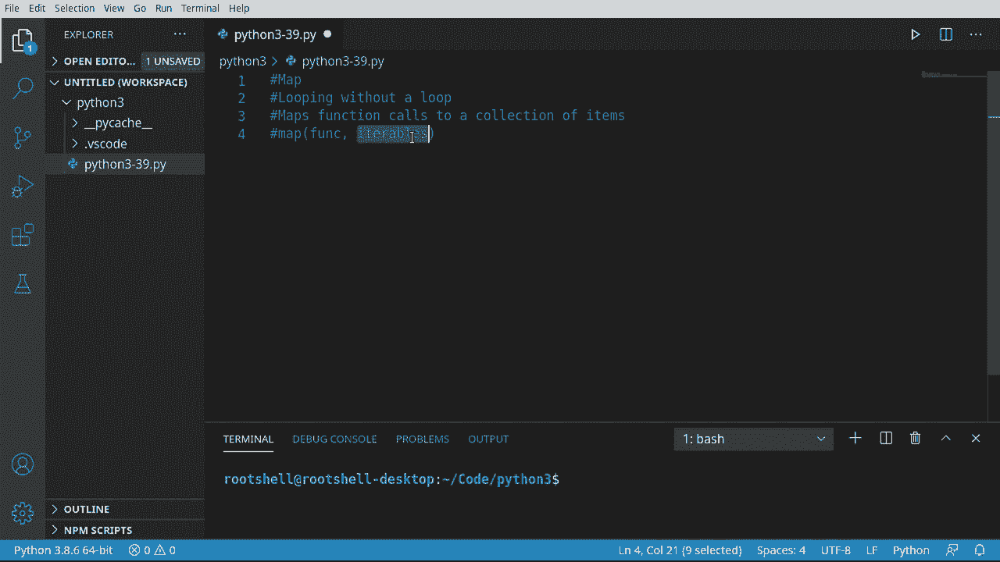
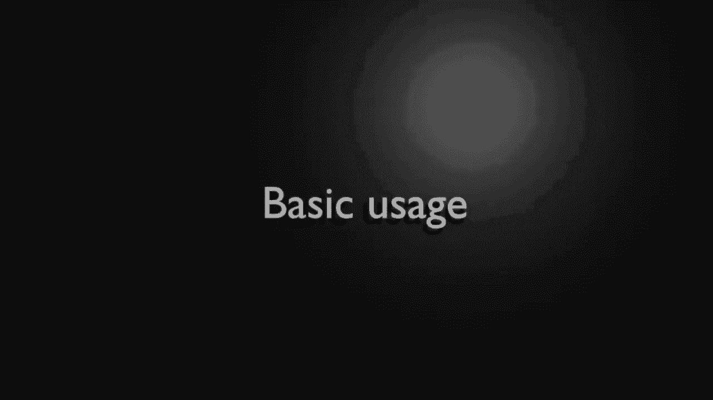
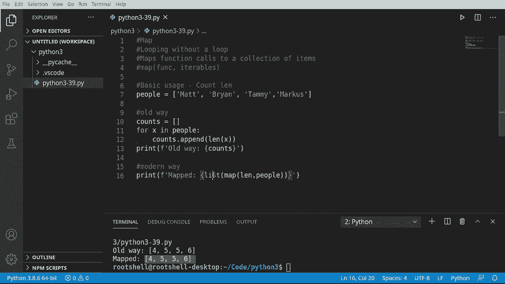
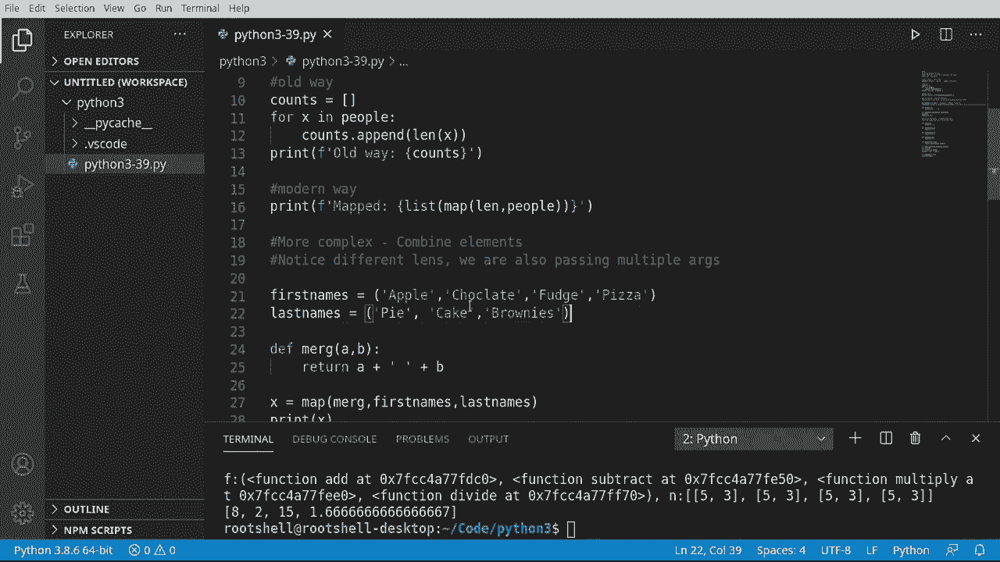

# Python 3全系列基础教程，全程代码演示&讲解！10小时视频42节，保证你能掌握Python！快来一起跟着视频敲代码~＜快速入门系列＞ - P39：39）Map函数 

大家欢迎回来，我是布莱恩，我们将讨论map函数。具体来说，这是在没有实际循环的情况下进行循环。其背后是将一个函数调用映射到一组项目上，类似于我们对任何集合使用的map函数。例如，我们可以有一个列表，并将列表中的每个项传递给函数。

让我们深入看看。

让我们从一些基本用法开始，我们将得到一个人名单。在这个人名单中，有Matt、Brian、Tammy、Marcus，我们希望将其传递给一个函数。并计算每个项的长度。我们希望获得一个包含这些长度的列表。因此，我们将覆盖旧的方式和现代方式。所以我们先做旧的方式。

旧的方式是像这样。counts。等于，我们将创建一个空列表，然后对于x in。结播。然后我们只想做一些类似的事情。Counce do append。我们在这里做的事情非常简单。我们说Ly。并希望获取每个元素的长度。然后完成后，我们只想将其打印出来。

所以我们将说print。所有旧的方式。让我们直接打印出来。非常简单，易于理解，确实按你想的方式工作。并且它有点啰嗦。现在，现代方式将使用map函数。我们要简化这个。记得我在一开始就说过，随着代码变得越来越复杂。

实际上，我们需要写的内容变得更短，更难理解。这是一个很好的例子。所以我实际上要先从print开始。然后我们将格式化它。相同的map。我想把它大写，这样它就能突出。现在我们将说list，实际上将其转换为列表，逐个列出每个元素。

我们正在调用map函数。在map函数内部，我们将调用L。年的。表格。这看起来很疯狂，让我们运行一下。确实，它按预期工作。那么这里发生了什么呢？我们在说，好吧。调用print，然后我们将列出map。现在map将做的是，它将获取这些人。

然后将其放入一个函数中。在这个例子中，我们使用内置的长度函数L，来获取大小。因此，实际上我们用一行代码替代了所有这些代码。这非常非常酷。然而，这个小段落的主要收获是，我们正在处理一组项目，并逐个将每个项目发送到该函数。

我们得到了一个map对象，因此我们必须将其转换为列表。

让我们更深入地进入复杂的领域，我们将使这变得更加复杂。我们将结合元素。我放了一些笔记，注意不同的链接。我们还传递了多个参数。那么我们在这里要做的事情，我已经准备了一些内容，准备粘贴。名字和姓氏。

我们有两个元组。我们将结合苹果和派，巧克力和蛋糕，软糖和布朗尼。哦，注意比萨饼没有我们可以配对的东西。我们将检查这如何工作以及它的行为。我们还将定义自己的函数。有些必须说解合并和合并，我们将有A和B。

它只是简单地返回。诶？😊，加上一些空格。加上B，非常简单的函数。就这样，它所需要做的就是返回一些东西。无论我们返回什么，都将被添加到映射对象中。因此，让我们说x等于映射。我们将使用我们刚刚写的合并函数。

现在我们将合并名字和姓氏。所以实际上，当我们看这个时，它应该是这样的参数。因此，我们可以有零个或多个参数。所以我应该说一个或多个参数。所以他们最初是这样做的。因此，我们将把我们的合并函数映射到这两个参数，名字和姓氏。

这些就是这里的元组。让我们打印X并看看我们得到什么。这是新手们经常被绊倒的地方。他们会问这是什么，我们有一个映射对象。那么，我们如何处理这个映射对象呢？问题是你不想直接使用它。你实际上要做的是将其转换为我们可以使用的东西。

所以我们将说打印。列表。我们将简单列出X。这将进入映射对象，并说给我每一个项目。然后，它将转换或转换为我们可以使用的列表。例如，苹果空格派，巧克力空格蛋糕，软糖空格布朗尼。

请注意，这些是合并在一起的独立项目，并且没有比萨饼。因此，因为没有任何我们可以配对的内容，所以它悄无声息地失败了，我们不必担心它会崩溃我们的程序。好的，我只想说，如果你是新手而且跳过了任何视频。

你即将经历一次糟糕的时光，所以我们将做多个函数。这意味着我们将结合函数，并在一个映射调用中调用多个函数。如果你没有跟着走，你即将面临非常混乱的时光。因此，我将支付一些函数，加、减、乘和除，它们非常简单。加广告。

减去，减法，乘法和除法，震惊的是除法。我不想让这些变得复杂，因为我不想关注数学。我们将创建另一个函数，死亡。屌我。它将有funk。还有Noumb。Bunk将是一个函数，而numb将是一个数字列表。我们将返回。

函数调用。与U0和nu1。所以我们所做的只是说获取列表的第一个元素并获取列表的第二个元素。所以匹配这两个，基本上，加。Numb 0，nu 1。所以这将是像bad nu 0。然后是nu1，类似那样。然后减法、乘法和除法等等。在生产级应用中，你会想确保这实际上有两个元素，并且它们是正确的数据类型。

等等，我不想关注任何这些复杂性。我只是想向你展示这是我们将使用的基本结构。现在我们将创建一个列表，或者实际上，在这种情况下是一个元组。包含加、减、乘和除。这些是我们之前粘贴的函数。

请记住，Python中的函数是上层对象，因此我们可以将它们视为变量作为对象。所以我只是制作了一个填充这些函数的元组。现在我要创建一些值。这将有点困惑。我们以前没有做过。我们将把一个列表放在另一个列表里，几乎是5和3的组合。如果看起来很困惑。

这是因为我们在一个列表里面有一个列表。这是该列表中的唯一元素。它可以是这样的。所以你在这个列表中会有1，2，3，4项。所以，是的。你可以将列表和其他东西放在列表中。非常酷。你可以这样做。我们还没有真正触及这个复杂性。但是今天就是那一天。

现在我要创建我们的数字。😊，我将提取值。将其反转为一个列表。这将乘以我们函数的链接。所以基本上，我会拿这个。然后问， 我们有多少个函数 1，2，3，4？

加，减，乘和除，我将按那个数字乘以。从这里开始。只需按暂停按钮。让我们打印出我们所拥有的，以确保我们所做的确实有某种逻辑意义。所以我们将打印出F，那是我们的函数。然后让我们打印出N。只是为了看看这是什么。保存运行。好的，所以F是函数a，函数减法。

函数乘法和函数除法。你可以看到每个函数的内存位置。现在我们有了数据列表。这是列表值乘以长度，分别是1，2，3。或者。这很重要，因为如果你向上滚动，记住我们在组合姓和名时。如果没有匹配的伙伴，它会静默跳过它。

我们想确保每一个函数调用都有一个列表，这将是加、减、乘和除。这就是我们得到这个非零数字 1 的原因。所以在这种情况下，零是 5，1 是 3。希望这能让你明白。如果不行，你可能需要重看一次。我尽量解释得清楚一些。

但是如果你一直跳过视频，或者没有完整观看，它可能完全没有意义。所以现在我们将说 M 等于 map。我们将调用映射函数，并将“do all”映射到 F 和 N。这是什么巫术？我们刚才做了什么？基本上。

我们只是想把“do all”功能映射到我们的函数列表上，每个函数要放入的数据是……这个大列表的列表，所以每个函数都有自己的一小段数据。哇。它会返回一个映射对象。所以我们就打印出来。然后我们想把这个映射对象转换成一个列表。继续保存并运行。

结果将是 8、15 和 1.6。那么这里发生了什么？嗯，5 和 3 是 8，5 - 3 是 2，5 乘以 3 是 15，5 除以 3 是 1.6 这个很长的数字。但这真的非常酷。我们基本上只是说在一个小调用中执行很多功能，并给出了每个函数将使用的信息。在我们结束这个视频之前，快速回顾一下，map 函数是非常。

非常强大的。一旦你理解了它，你将有一个函数，然后你会有某种可迭代对象，并且可以有多个可迭代对象。但它们必须排好顺序才能调用。😊，例如，名字和姓氏。

我们其实没有任何和比萨饼相关的东西，所以没有深盘比萨饼之类的。但我们有苹果派、巧克力蛋糕、软糖布朗尼。
