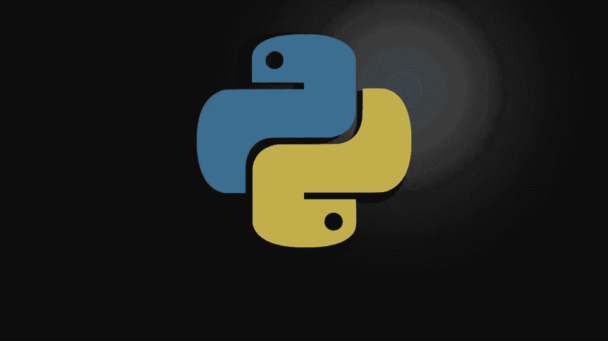
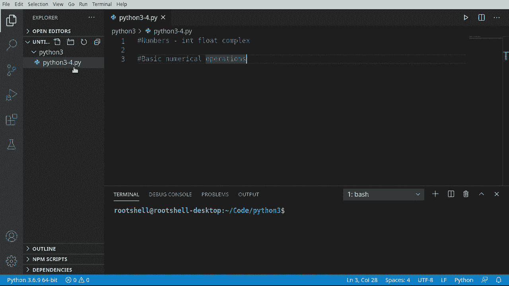
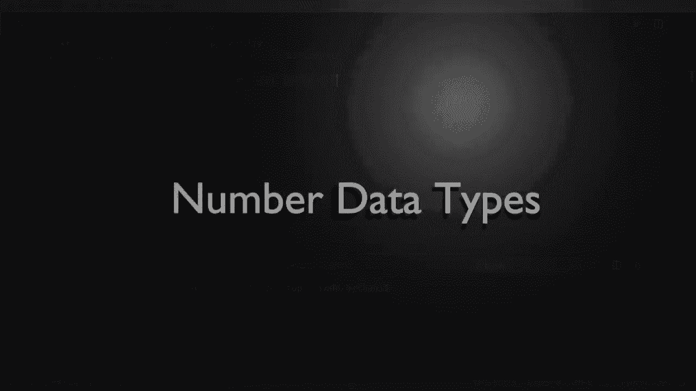
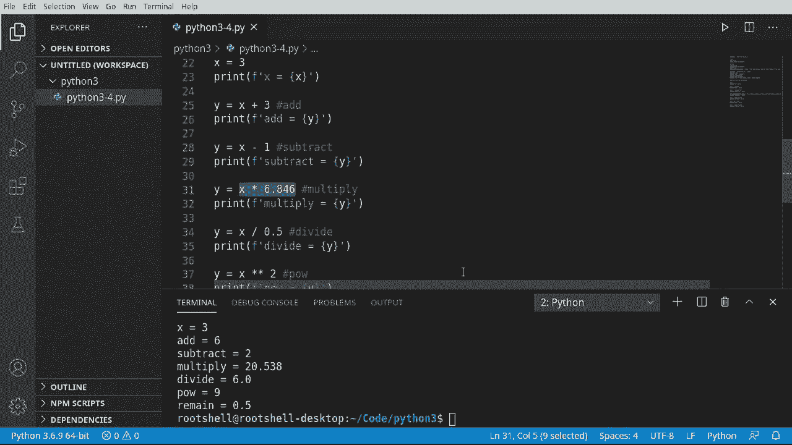

# Python 3全系列基础教程，全程代码演示&讲解！10小时视频42节，保证你能掌握Python！快来一起跟着视频敲代码~＜快速入门系列＞ - P4：4）Python数字和基本数字运算 - ShowMeAI - BV1yg411c7Nw

大家好，我是Brian。我们将继续探索Python 3。在这个视频中，我们将讨论数字，数字数据类型，特别是int、float和complex数据类型。我们还将讨论一些基本的数值运算。例如，加法、减法等等。不论你使用什么IDE。

继续并创建一个空文件。我创建的文件名为Python 34 Py。此时文件名并不重要。你只需一个空文件来开始。

上一个视频我们谈到了牛。这次我们要讨论数字。我知道大家都喜欢数字。那么我们就从整数类型开始吧。我们这里要创建一个简单的变量，叫做Ival。我们给它赋值为34。不过，赋什么值并不重要。比如，打印并。

我们这里将打印一些内容。好了。让我们称之为Ival等于。我们只想打印出这个值。只是为了看看这个是什么样子，Dave运行。这是非常基础的。你大概可以猜到它会做什么。它会说Ival等于34。非常简单，容易理解。

现在，我们将通过复制和粘贴来进行演示。我们将创建一个float。此时float听起来非常好，比如说ripier float之类的。但是我们在谈论数字，而不是ripier float。不幸的是。所以我们将创建一个浮点值，它将是3.14。运行时，表面上看。

我们正在做的看起来非常基础，但在幕后，Python为我们做了所有的工作。我们无需担心实际发生了什么。因此，比如说，整数和浮点数之间有一个根本的区别。在后台有很多精度问题。 

而且我们甚至不需要考虑这个。Python会为我们处理好这一切。我将导入。这个cis模块将允许我们使用他人的代码，我们将在另一个视频中深入讨论这一点。但现在请大胆相信，我们正在使用别人的代码。这实际上是Python的一部分，但我们需要导入它。再说一次，这有点令人困惑。

我们将在另一个视频中深入讨论。通常它位于文件顶部。我们就放在这里。不过我们希望能够获取一些额外的信息。有些事情我必须说cis模块做的。加载信息，让我们复制并粘贴一些笔记到这里，以便了解情况。我要把这个放进去。那是官方的Python文档。

如果你想出去，看看究竟发生了什么。我们可以运行它，看看底层。Python 在谈论浮点数时实际上在跟踪的就是这些。所以我们有系统浮点信息。你有一个最大值，确实是一个非常非常大的数字。你还可以有一个最大指数，你可以深入探讨这些内容。现在。

如果你对数字或数学感兴趣，你可能知道这些是什么。但我们这些凡人。通常并不在乎。基本上，如果你有一个有小数点的数字。你将使用浮点数。否则，你将使用整数。现在我们要谈论另一个，它叫复数，确实，复杂。现在，当我说复杂时。

事实上，Python 使工作变得超级简单，但数据类型本身在底层。你猜对了，不是超级简单，而是复杂，它看起来像这样。复数由两个数字组成，一个真实数字和一个虚构数字。听起来有点奇怪。但我们来看看。所以我们将说 C v 等于。

假设是3。加上6 J，这是一个我知道自己在做什么的巨大信心跃进。那实际上会做什么，它会让那个复数？

我们来抓取这个名字。Cval，Cval，然后打印出来。看起来我们没做太多，它只是说 Cval 等于 3 加上 6 J，正是我输入的内容。我们将其拆分开来。我们将展示另一种创建复数值的方法。你可以用 Floni 来做到这一点，但用复数更能强调这个要点。

所以我要说复杂的。注意它如何想要，它们浮动。在图像中。我们继续给它们一个鞠躬。所以必须说5，3。我们继续，我只是要通过魔法。复制并粘贴在这里。抓住这个。我们说。称之为。现在我想打印出来。真实的。而我们想要继续抓住这个。再粘贴。

我们想要那个数字的第二部分，以便看看它是什么。继续保存并运行。所以现在你可以看到复数由两个部分组成，实际上如果我。按照应该的方式来做，会更好。好了，真实和虚构。两个不同的部分。这就是使它成为复数的原因。我们要传达的基本点是，数字是非常基本和简单的数据类型。

但它们可以很快变得非常复杂，Python 去除了很多复杂性。如果你来自 Python 2 或其他语言。你会注意到这似乎过于简单化，而这正是设计使然。Python 3 基本上重塑了数字系统，消除了许多旧的头痛。

所以它非常简单。一般的经验法则。如果没有小数点，使用整数；如果有小数点，使用浮点数。如果你需要其他的，使用复数。还有其他数据类型，我们将在未来的视频中介绍，但这应该让我们现在开始。好的。让我们谈谈基本的数字运算，不用担心，我们不会变得超级复杂。

我们在谈论基础。Python可以做一些非常复杂的事情。例如，你可以进行计算、三角函数，几乎任何你能想象到的数学运算。Python实际上被用于科学计算，并且可以实现像人工智能这样的功能。我们从基础开始，需要讨论基础。我将说x等于3。

这就是一个整数。现在，我要打印出来。我会使用旧的打印函数，这样可以节省一点时间。没有什么特别的。但现在我们要做的是创建另一个变量。我们称它为Y。我们将说y等于x加3。那么我们实际上做了什么呢？

我们已经进行了基本的加法。让我们抓住这个。我们称之为add。这将是y。这是我们的基本模式，我们将做一些事情。然后我们将显示结果。我会说add，这样我们就知道自己在做什么。保存并运行，果然，add等于6，因为x是3。

我们加上3，3加3等于6。再次强调基础。现在。我们将开始加快这个过程，因为我认为你可能足够聪明以理解基本数学。我们将抓住这个。你猜对了，开始快速处理。所以如果我们可以加法，我们也可以减法。让我们说我们想要-1。运行，你可以看到。

3减去1实际上是2，所以这样没问题。正如你所期望的那样。所以我乘法。我们将说，嗯。这是其他语言中很难做到的事情。Python使这一切变得非常简单。所以我们将说6.846。我们使用什么数字并不重要，只要有这个。现在，如果你看，X是一个整数。

但我们在做什么呢？我们将其乘以一个浮点数。那么在这里发生的事情是，Python将确定输入值的类型。它会变成整数还是浮点数？

你会注意到当我们将鼠标悬停在Inence上时，它并没有真正告诉我们，因为解释器还没有完成工作，所以它根本不知道。所以让我们称之为multiply，最终结果是20.538，所以这是一个浮点数。现在我们要进行一些除法。让我们进行这个操作。我们想说x将被0.5除。

再次，它在后台进行所有繁重的数字计算。它实际上在做的叫做类型转换。当你想到类型转换时，可以想象一个巫师挥动魔法棒，把某个东西从一种数据类型转换为另一种。这是自动为我们发生的。我们不必考虑它。现在。

它不会总是自动为我们发生，但在这个特定情况下是的。并且这非常、非常方便。别担心，我们将在另一段视频中深入讨论类型转换。现在我们还在基础知识上。让我们稍微玩一下。我们将进行一个幂运算。所以我们说，这就是幂。3的平方是9，还有一个。

只是为了在这里玩玩。让我们来做取余。我认为这叫做模运算符。我们将得到这个。你不知道这是什么。这有点像相反的。我不应该说是相反的。这有点像进行除法并得到那个值的余数。这有点奇怪。让我们来看一下这里。所以0。5。

所以我们这里的做法是从x为3开始。然后我们得到2。5的余数，实际上是0。5。非常简单，非常易用。所以我们想要强调的基本概念是，有一些数字数据类型：int、float和complex。你可以进行一些基本的数值操作。Python让这些数值操作变得非常简单，因为它处理了所有复杂性。

这是我们的幕后工作。我们甚至不需要考虑它。
