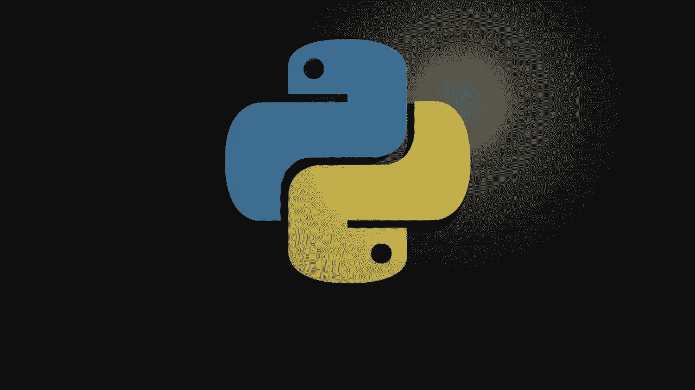
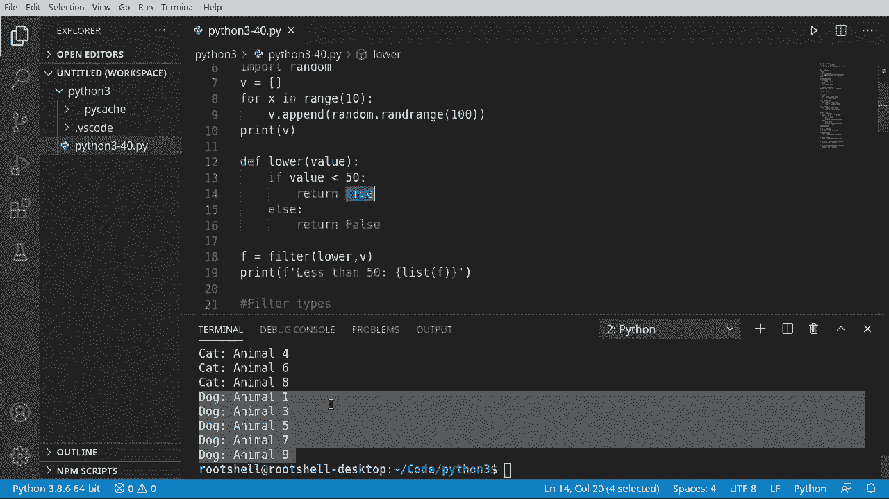

# Python 3全系列基础教程，全程代码演示&讲解！10小时视频42节，保证你能掌握Python！快来一起跟着视频敲代码~＜快速入门系列＞ - P40：40）过滤函数 

欢迎回来，大家。在这个视频中，我们将介绍过滤函数。这与我们在上一个视频中讨论的映射函数非常相似，我们有某种函数。我实际上把它称为fun，因为我认为过滤器很有趣，还有某种可迭代容器。如果匹配过滤条件，它将返回true。这很重要。😊如果它匹配过滤器。

它将被放入结果中。否则，它将不会。这是一种非常强大的过滤方式。我们将看两个过滤函数的示例用法。第一个只是简单地获取一个子范围。当我说简单时，这实际上相当强大。所以我将导入一个随机数。我们之前讨论过随机数。然后我将说一些值，我们将创建一个空的值列表。对于x在范围内。我们将创建10个项目。在这10个项目中，我们想获取一个随机数。某种必须说V添加。我们将说或随机。那。随机范围。

这将从1，我应该说，从0开始，一直到我们所需的范围。所以我们要说R范围。然后我们只需打印出来。这样我们就可以看到我们的范围实际返回了什么。我们来运行一下，所以我们得到一些随机数96，我是说。

你会看到它们到处都是，如果我多次运行这个，你会看到下面的数字在变化。那么我们现在要做的是说，我想注意这个的下半部分。老板走进房间说，我不想要超过50的东西。好的。所以我将创建一个小函数。我们将获取我们的值。我将说如果值。

是否小于50。然后我想对它做点什么。我想返回。真实。因为老板说他只想看到小于50的值，否则我将说else。我们将返回。假。这就是最简单的过滤。这就是过滤器的基本功能。是否匹配，是或不是。这就是全部。

这真的是它需要的复杂程度。所以我要说F等于。我们将继续过滤。使用下限函数。记住，我们在上一个视频中讨论过这个。因此我们有函数调用，然后是我们的值。这个值列表中的每一个都会被调用。

所以它将调用57、72，等等。这里的逻辑是，它将说，像57这样的单独值。它是否小于50是假的，70是假的，是真的。我想你明白这里的逻辑了。那么我们继续吧。打印出来，我要说打印F。我想说小于。如果我把它放在实际的投票中，那就更好了，少于50。

当你的键盘背叛你时，好吧，我们将把它转换为一个列表。否则，我们只会得到一个函数对象，这对我们帮助不大。所以这是我们的数字集合，以及小于50的项目，17、33、45和11。这就是我所说的，它非常有趣且强大。非常快。

你能否在这里拿一个数据集，然后说，我只想查看某些项目，然后构建某种自定义逻辑来获取该数据的子范围？虽然这个视频系列是针对完全的新手，但我不喜欢在新手阶段停留太久。因此，我们将跳入一个稍微高级一点的主题。

我们实际上要过滤类型。所以当我说过滤类型时，我们是在谈论类。我们将过滤一种动物。我们将在这里快速创建一个类，并设置你的名字。我的名字错误。我的键盘背叛了我。我们将说这里是构造函数。请耐心等我快速写一些代码，让我们的构造函数开始运行。

self.dot.name。好的，现在我们已经有了我们的动物类。我不会让它变得超级复杂。我们可以简单地复制一下。让我们称之为帽子。它将继承动物。因为我们在继承，我们可以去掉这个和这个。从这里开始超级简单。

我们就说超级。让它超级简单。无论如何，我不会辞掉我的日常工作。我们将用名字初始化它。我实际上可以拼写出名字。好了。因为我知道外面也有狗狗爱好者。我们还将创建一个狗类。任何了解狗和猫的人都知道，它们通常不太容易和谐相处。

尽管我在生活中非常幸运，每一对狗和猫的组合都相处得很好。所以动物。😊 我们有一只猫，它是动物；有一只狗，它也是动物，但这两个类根本不知道对方的存在。这就是复杂性所在，你将一次又一次地看到这一点。

我们刚刚做了什么？好吧，我们正在创建一个名为动物的列表。我们将把一些狗放入同一个列表中。有些可以说在范围内的可怜的X。我们希望在10以下。我应该说从0到9，但我们将继续，假设。如果。然后我们将做一些奇怪的事情。我们将说x模0。

基本上，我们在这里所做的就是，我们只想要偶数。然后我们将继续说animals.dot.append。我们将创建一只新的猫，并给它一些名字。所以让我们回到这里。我要说名字等于。动物加上，无论数字是多少。好的。

所以一旦我们达到这一点，如果它不是偶数，那就是，你猜的对，是奇数。我们可以简单地抓住这个。也许我应该反向操作，因为猫是奇数。狗通常是偶数，但猫通常真的很奇怪。好的，反正。我们已经得到了。现在我们将继续打印出我们的动物。

这样我们可以看到它们的混合，果然，屏幕上出现了一些神奇的东西。但我们有猫狗，猫狗，猫狗，猫狗。非常简单。非常容易理解我们刚刚做了什么。我们做了一个包含猫和狗的列表，只是一个杂乱的集合。现在，我想稍微整理一下。不能在动物中说4a。

我只是要把它打印出来，让它在屏幕上看起来漂亮。我今天过得很好，享受我的咖啡。我们说动物。做这个真是聪明。现在，看起来非常棒。我会给老板留下深刻印象，我会得到加薪，哦，名字。是的，因为我们硬编码了这个。修复它非常简单。是的。

我的老板正在转角走来。我将向他展示这个。我将为公司节省数百万美元。果然，我在这里有我漂亮的小动物集合。老板说，太好了。😊，但是。我只想要猫。然后我只想要狗。我想要两个不同的列表。

但你必须保持这个单一列表。现在，我得写下所有这些代码。好吧。这就是过滤函数的用武之地，正如你可能猜到的，某些人会说聋猫。我们要创建一个猫过滤器。听起来真的很酷，一个猫过滤器。所以我们将转为实例。我会说，这个值。是猫类的实例吗？

就这样，这就是我们需要使其复杂的程度。我们只想确保它是一个实例。我们可以对狗做同样的事情。然后我们可以使用那个过滤函数。充分利用这两个函数。因此，我要说4 C，然后我想创建一个列表。我们将进行过滤。因为记住。

filter将返回一个过滤对象。我们需要将其转换为一个较少的。我们要过滤猫。使用动物。慢下来一点。这在这里是合理的。我们将继续打印。实际上，我要说猫。我会解释这一点，以防你完全迷失方向。别担心。好的。

所以我们所做的与我们在动物中的4A非常相似。除了我们说4 C，我们将从过滤器给我们的任何内容中创建一个列表，我们告诉过滤器。使用猫的函数。并使用动物集合。记住，动物是猫和狗的混合。我们只是说对每个项目。

确定它是否是猫，这将返回实例。然后我们可以做同样的事情。或者是狗。非常简单，容易理解，当我们现在运行时，我们已经很好地将这些分开了。现在，我们有猫。这些是偶数，然后我们有狗，这些是奇数。好的。这段视频大致总结就是，filter将返回一个替代对象。

我们需要传递一个函数和某种可迭代容器。从那里，它只需要返回真或假。如果是真，它将最终出现在结果列表中。
