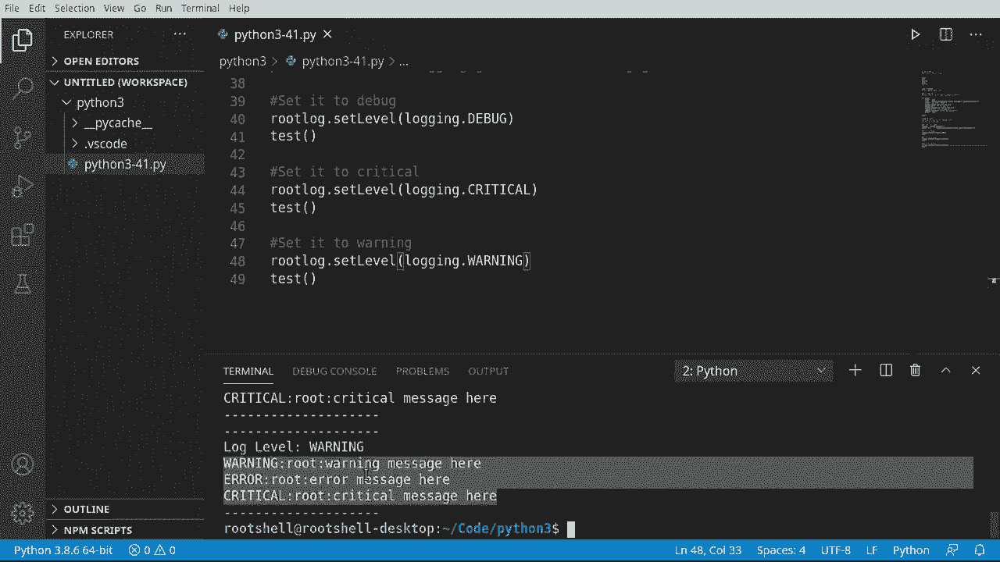
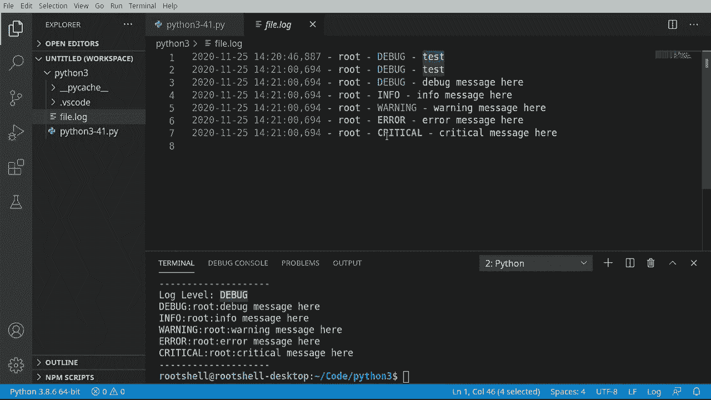

# Python 3全系列基础教程，全程代码演示&讲解！10小时视频42节，保证你能掌握Python！快来一起跟着视频敲代码~＜快速入门系列＞ - P41：41）日志基础 - ShowMeAI - BV1yg411c7Nw

欢迎回来，大家好。我是布莱恩。在这个视频中，我们将讨论日志记录的基础知识。那么，什么是日志记录呢？我们并不是在砍树之类的。目前为止，我们一直在使用方便的打印函数，但日志记录比打印要酷得多。这已经成为一种事实上的标准，但我们实际上还没有能够进行这个对话，因为我们还没有涵盖所有需要的技术来展开这个对话。

😊，那么，为什么日志记录比打印更酷呢？因为打印只是将某些内容输出到屏幕上，但日志记录，你可以有不同的级别。例如，你可以说这是一个调试消息、信息、警告、错误、严重，某些内容应该是自解释的。调试只是为了你，开发者，你想知道发生了什么。信息则只是嘿，发生了一些事情。

你可能希望用户看到这个，也可能不想。战争是，嘿，如果这种情况持续下去或者没有修复，可能会发生一些糟糕的事情。错误（Arrir）是自解释的，而严重（critical）则比错误更糟，所以。这些是不同的级别。首先，我们将导入日志模块。

你也可以这样做，从 `Lologging` 导入，接下来我们将导入根日志记录器。之所以添加这一点，是因为你需要理解，默认情况下有一个根日志记录器，当我说根时，我指的是顶层，你可以定义其他日志记录器，定制日志记录器，但我们将使用顶层日志记录器。好的。

所以我将把这段注释掉，这样人们就不会对我们正在处理哪个感到困惑。我们这里只是导入整个模块。我要使用基本的日志记录。注意，它们默认情况下不会显示。这是本节的主要要点。如果你不注意这一点，可能会非常混乱。

所以我要定义一个函数。我们将反复使用这个函数。它将只是简单的测试。我们将打印一些行。我们就打印20个吧。为什么不呢？然后我将把它复制。这样，当我们打印时，所有这些将会被分开。现在，从这里开始，我们想做几件事。

我想说。日志记录（Logging）。我们想调试。现在这有点混淆，因为我们并没有真正调试任何东西，我们是在说日志记录，生成一个调试消息，或者更具体地说，我们将在根日志记录器上发送一个严重性为调试的消息。

记住，我们在谈论日志记录的级别。调试（Dbug）是最低的，严重（critical）意味着嘿，你的程序刚崩溃了，发生了什么。所以我们将说。这里的调试消息。然后我们可以采用相同的模式，你猜到了，复制和粘贴时间。谁。林方。现在，信息性日志，其实，这些信息并不是特别重要。它只是。

嘿，文件被更改或某些东西修改了警告。然而，这时事情开始变得有点严重。你是否给过你的孩子警告，嘿，你最好去清理你的房间，否则就完了。并不提倡打孩子，但有时你就是得让他们清理房间。所以我们有调试、信息、警告。

随着我们进一步深入，这些数字在变化。后台有一个数字，我们稍后会真正回顾。现在，超过警告的是什么？你猜对了，是错误。我们讨论过错误处理和错误条件等问题。

这正是我们在这里所做的。我们在说，嘿，发生了一种错误，但使用这个不会抛出错误。我们只是记录发生了错误。而最后但并非最不重要的是严重错误。当你听到计算机中的“严重”这个词时，你需要相信这是至关重要的，意味着你所知道的一切都已停止存在。

你需要专注于这一点，否则你所知道的一切就会消失，因为它已经失效。这基本上就是在计算机术语中“严重错误”的意思。现在，我们要调用这个测试函数，看看会发生什么。注意它们并不会默认全部显示。我们继续运行。

我们看到的都是警告、错误和严重错误，但调试和信息在哪呢？要真正理解这一点，我们需要设置级别。当我谈到级别时，我们指的是调试、信息、警告和严重错误。实际上，每个级别都有一个数字分配给它。

想象一下，就像一栋建筑的级别，从底部到顶部，最重要的在上，最不重要的在下。好的，我们将设置一个级别。等于。我想进行日志记录。我们将使用日志记录模块。我们将获取级别名称。这将把后台的数字转换为字符串表示。但。

当然，这并不那么简单。我们现在必须进行日志记录。然而，日志记录器。这将获取根日志记录器，具有讽刺意味的是，我们已经在使用它。但问题是，你可以指定一个名称，这样你就可以有不同类型的日志记录器执行不同的操作。我们只需获取根日志记录器，然后我们将说获取有效级别。

获取有效级别将返回我们当前正在处理的日志级别。从这里开始，我们只需将其打印出来。所以打印出来。F。我们将说一个日志级别。好的，所以我们的日志级别当前是警告。我们将在下一节查看如何指定该级别。但我真正想谈的是，这个级别真正意味着什么，意思是警告。

意味着任何更关键的信息都将被包含，因此我们不仅会处理警告，还会处理错误和严重错误。但我们并不真正关心调试和信息。这是日志类的一个小陷阱，默认情况下人们会从这里开始并开始发送调试消息，然后什么都没有发生，他们会想，嗯，为什么，这就是我们需要设置级别的原因。

现在我们理解了日志级别的概念。让我们看看如何操纵它们，我们将获取和设置日志级别。这实际上允许进行过滤。而你想这样做的原因是在典型应用程序中。你会有很多信息在快速流动，你不想在屏幕上同时看到所有这些。

你只想看到对你重要的内容。因此，我们在这里要做的第一件事是获取根记录器。现在，根记录器是默认包含的。但我想实际去获取它，以便向你展示我们得到了一个对象。所以我将说根日志。等于记录器，或者我抱歉，记录模块的记录器。

看看这有点令人困惑。如果你有多个记录器，你将看到每个记录器的名称。如果没有名称，它就是根记录器或主记录器。从这里开始。我们将抓取这个，因为它看起来实在太糟糕了。我必须说打印。我们将打印级别。

想要把它粘贴在这里。所以我们在说记录。是的，级别名称。这有点误导，因为我们并不是在处理主记录器。我们在处理日志模块。我们在说模块。应该获取级别名称。现在我们希望从根记录器获取它。因此，实际上，我们不只是说这个。

我们可以用那个来替换。所以，记录模块，获取我们正在使用的任何日志的级别名称。获取有效级别，底层级别只是一个数字。让我们继续运行这个。所以警告级别，我实际上会放入一些内容来分开它。这样我们就知道我们处于警告级别，并且我们一直都知道这一点。

但现在我们将其设置为调试。那设置为调试意味着什么？嗯。这意味着我们将包括调试和任何更关键的信息。顶部的调试是链的顶端。任何内容都会被包括在内，不仅仅是调试。因此，我们将说根日志。设置级别。然后我们将说记录模块。调试。

然后我们可以调用我们的便捷测试函数，它包含所有这些。美丽的小记录器正在运行。果然，我们现在看到了调试信息、警告、错误和严重错误。因此，它按预期工作。我将抓取这个。我们可以非常快速地根据需要开始更改级别。有些改变只是过于关键而已。

记住，关键是好，`Cri`，这意味着像是某样东西爆炸了或者即将爆炸。我们将运行这个，你可以看到日志级别现在是关键的。我们可以看到，这里发生的事情很容易理解。然而，你需要明白的是，级别并不会使这些消息神奇地消失。

这只是意味着我们没有记录它们或捕获它们。这些消息仍然在发出。好的，现在我们再做一次。我想将其设置为警告。回到我们之前的状态。在关键根。这里是关键消息，你可能会想知道这个根是什么，这个根是什么？

好吧，这就是我们正在使用的实际记录器。这就是我为什么称其为根记录器的原因，因为我们正在使用根记录器。如果我们有不同的记录器，它将在那里显示记录器的名称。这种工作方式其实相当优雅，你可以根据需要随意切换这些。

所以，如果你获得了大量的详细信息而你只想看到关键的信息，你可以将其设置为关键。这样你就不会收到警告，因此你设置为警告。现在你获得了适合你需要看到的信息级别。

现在，虽然这很酷，但如果我们能够直接将日志记录到文件中，那将更酷。因此，当事件发生时，它会直接转储到文件中。这正是我们要做的。但我想给你展示一些东西，这将一次又一次地让你感到愤怒。😊如果你去谷歌搜索如何使用记录器。

你将会得到类似这样的输出：`logging that basic config`，设置为文件名。大家都非常兴奋。文件模式，对，没错，这将会有效。你甚至可以定义格式。这真的很酷。因此，我们要说级别和消息。然后我们要说级别等于`logging dot debug`。😊请注意这在做什么。

这正在设置配置，它设置了一些处理程序和所有这些有趣的东西。所以人们非常兴奋。然后他们做了类似这样的事情。`Loging dot Ebu`。我们要发送一个仅包含你好（hello）的调试信息。因此，理论上，当我们运行这个时，日志记录将调用调试，消息为“你好”，并将创建文件app。

在写模式下创建txt文件。然后它将以这种格式写入。我们知道这是因为我们设置了`logging debug`。所以，`Rm roll`。什么都没发生。没错，绝对没发生。因此，人们会非常沮丧，他们会做类似的事情去谷歌搜索“为什么日志没有记录”。这实际上是其中最流行的谷歌搜索之一。原因非常简单。

基本配置在我们已经配置了记录器的情况下将不起作用。需要在采取任何行动之前完成，因此我们已经在使用根记录器，并且已经配置了它。基本配置没有任何作用。没错。它绝对没有作用。这真让人沮丧。所以我只是打算写一些注释。然后我会把它们注释掉。

我们将向你展示如何解决这个问题。现在，如果这实际上是第一行，比如说如果我们把它放在这里。它会很好地工作，但由于我们做了所有这些，它根本无法工作。所以我们需要一个处理器。我将说 logging.dot。我们想要一个文件处理器。处理器的作用就是处理进来的日志信息。

我必须说文件的名称可以随便命名，真的没关系。现在我们想为那个处理器定义一个格式化器。我将说格式化器。你知道，这些是构造函数，所以在幕后，我们实际上是在创建类。现在。我会稍微复制粘贴一下，因为我们可能会花一天时间看我打这些。

我们要做的是获取时间、字符串表示、名称、级别和消息。如果你想知道名称是什么，它是记录器的名称。所以它将显示时间、记录器名称、级别和实际消息。你可以定义任何你想要的格式，官方文档中有指南。

重点是，一旦我们有了处理器和格式化器，我们就可以开始了。从这里，我们可以说，处理器.dot set。格式化器。那将告诉处理器如何格式化它正在处理的信息。然后我们可以简单地说 root。我们将说我们的根日志添加处理器。现在，我们可以进去，像这样说，让我把它提升到调试级别。

现在我们可以将其设置为 logging debug。然后我们可以说，根日志.dot debug。作为保存运行。果然，我们的输出文件被创建，并且格式如我们所希望的那样。这非常酷。我们甚至可以调用我们的测试函数。因为我们的日志级别在调试，并且我们设置了处理器和格式，因此我们可以返回到我们的文件日志，所有信息格式都很漂亮。

所以我们有日期时间，有记录器，有级别，有消息。你可以看到它甚至为我们进行了颜色编码。这真是超级令人印象深刻！
