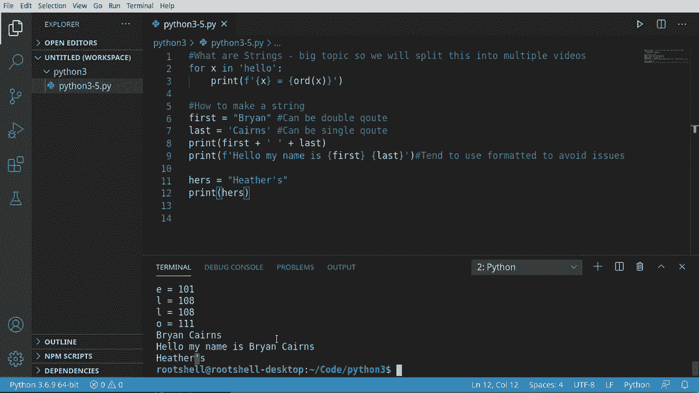
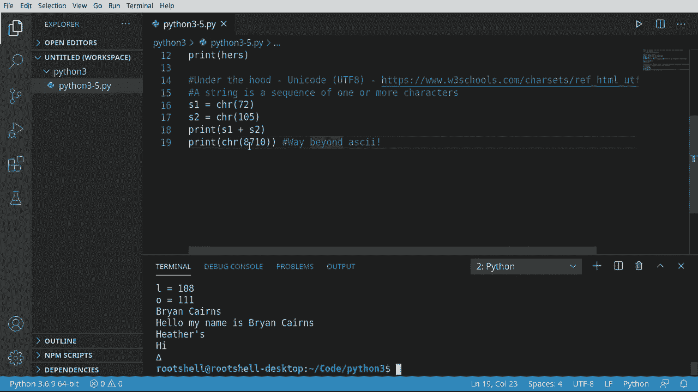
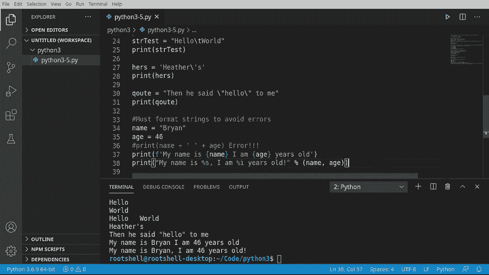

# Python 3全系列基础教程，全程代码演示&讲解！10小时视频42节，保证你能掌握Python！快来一起跟着视频敲代码~＜快速入门系列＞ - P5：5）Python字符串 

大家好，欢迎回来。我是布莱恩，我们将讨论字符串。那么字符串是什么？这是个很好的问题，我们面前有一个简单的图示。单词hello H E LLO，旁边有一些数字，我们将解释这些。实际上，字符串是一个列表。没错，字符中的每个字符都转换为一个数值。

如果你低头看你的键盘，把它看作字母H。那个字母，依赖于是否按下了shift键，将是104。我提到“依赖”是因为小写和大写之间有数值差异。这里我们讨论的是小写。有些人会说。

哦，那是ASCI，我以前听说过，这其实不是ASI，而是Unicode。具体来说是UTF-8，我想是通用文本格式8位或版本8，我忘了。但是基本上Python在底层以UTF-8处理。因此无论你是在输入英语、韩语还是西班牙语，都是一样的。

古希腊或某些数学算法。每个字母都有一个分配的数字。

计算机知道那是什么，并为你处理这一切，所以你不必担心。你应该关注的两件主要事是，构成字符串的字母，以及下面这个，位置。所有内容都是一个列表。所以当你看到H，E，L，L，O时，那里有五个字母，且从0开始有五个数字。这是一个基于0的索引，0。

1，2，3，4。所以如果我说给我第三个位置的字母。H，EL，这个家伙。实际上是数字2，因为它是基于0的。如果你是新手，可能会有点困惑，你会想等一下。实际上是数字3。记住，它是从0开始的。所以第一个总是0。我们考虑计算机的角度，0，1，2。这个家伙就在这里？

一旦你理解了这一点，你就比大多数人更了解这个问题，老实说，这并不太难。你只需理解屏幕上看到的每一件事都有某种数字与之关联，计算机处理那个数字。你只需要关注字母和位置。我们将深入探讨这一点。好的。

让我们翻转一下单独的Studio代码，我们将复制并粘贴一些代码，这看起来绝对是你之前见过的任何东西。别担心，只需迈出信心的一步。我们将在未来的视频中讲解这一点。

但实际上我们在做的是，针对字符串hello中的每个字母，打印出字母及其数值。你可以看到104，101，108- 108111。把它们变成内存104，101，108，108111。如果我们回头看看，这正是我告诉你的结果。那么让我们深入了解一下，看看发生了什么。

现在，我们将在未来的视频中讨论循环。这不是这个视频。我们专注于字符串。所以你要做的第一件事是如何制作字符串，简单得很。只需创建一个变量并赋值。再来一次。注意第一个名字或第一个变量。使用了双引号。

当姓氏或第二个变量使用单引号时。在 Python 中，你可以两种方式都做。他们这样做并不是为了让你困惑，而是因为作为程序员，你会在生活中发现很多小问题。

这非常方便，你可以随心所欲地调整它。所以你首先要尝试的就是简单地将它们合并成一个更大的字符串或打印出来。所以我们要打印。我想说 first。是。和 last 现在你认为这里会发生什么。

你注意到我们在使用加号吗？如果你是数学迷，你会说，哦。这会输出一些奇怪的数字，实际上不是。它会说你猜对了，我想这个术语叫做连接。它会把它们合并成一个内存中的字符串。

所以它说的是第一个带空格的布莱恩。和最后的，卡伦斯。非常简单。你还可以做一些叫格式化的事情，我们之前做过。这确实可以帮助你在长期内避免错误。所以你可以这样说。print F。注意我使用了引号，无论是单引号还是双引号都无所谓。

我要说的是，您好，我的名字是。然后，让我们看看。好吧。我得看看我的键盘来找出那是什么。然后我们只需输入变量名。First。然后是 last。现在，我们倾向于使用格式化来避免问题。你已经看到我这样做过，但你可能还没有真正意识到为什么。我们将在这里稍微讨论一下。

嗨，大家好，我叫布莱恩·卡伦斯。为了加深你的理解，让我们创建一个叫做 hers 的变量。我们要说 Others。注意我如何混合这些内容。我使用双引号，以便 Python 知道，嘿，这就是字符串，但我们也可以使用单引号，这样就会变得非常混乱。

它会取第一个，它会说，哦，你正在使用双引号来构造字符串，所以如果我把它改成单引号。注意这个字母突然变成了白色。即使我用单引号结束，它也会对我非常不满。看，语法错误，无效语法。

如果你看到语法错误，实际上，Python 想告诉你的是，你搞错了什么，它会告诉你具体在什么地方。在这个文件的第 11 行，Dat.dot do 和 hers。然后在 S 下面有一个小箭头。它不知道该如何处理这个，因为它不在字符串中。改变它。

它放了双引号，然后神奇地修复了它。看，这并没有太多意义，所以让我们改回去。这就是你可以混合搭配的原因，它让事情变得超级简单。我们可以直接打印出来，效果如预期那样，这是我们的小单引号，我们不需要担心任何特殊编码或格式或其他事情。

好的，为了巩固这一点，从底层来说，字符串是一个Unicode字符序列，特别格式化为UTF-8。如果你想要其他格式而不是UTF-8，你得去谷歌一下怎么做。我只是说我们还没有覆盖这个，将来可能会，但如果你需要立即的东西，去谷歌一下绝对没错。

字符串是一系列一个或多个字符，这些字符是数值，这正是我们现在要强调的。让我们创建一个变量，叫做S1。我们希望这是一个字符。注意它在寻找一个整数。返回一个包含字符的Unicode字符串，然后它给你一些示例。我将说，因为我把72记在脑海里。

然后我们要再创建一个。试一试这个字符，我们说105。现在，你看不到，但我这里有点作弊。我在看UTF规格和字符表，你可以通过访问这些链接和其他链接看到它们。它将给你数字值。如果你想做这样的事情。

你其实并不需要这样做。我只是演示一下，可以做到。所以我们说S1加S2。让我们运行一下，它拼出单词high。注意这是大写H和小写i。72。现在，小写h是104，大写H是72。这就是我所说的大写和小写之间的根本差异。现在，你可能会倾向于问，粗体和斜体呢，这实际上不在其中。

那些不是字母。它们只是你在屏幕上看到的样式和格式。因此，我们讨论的实际上是大写和小写。它实际上远不止于此，你可以这样做。比如说打印。我要说字符。我真的得作弊一下，看我的笔记，8，7，1，0。这就来了。

远不止于提问。让我们继续保存并运行，看看这是什么样子。砰！就是这个小数学符号。没错，它里面包含了数学符号。你可以用简单的字符做一些非常酷的事情。😊

你可能听说过转义字符。那么，什么是转义字符？这并不是小说中的东西，虽然它可能是。但基本上，不必记住这些奇怪的数字，它们实际上内置在大多数语言和操作系统中，称为转义字符。这意味着你可以转义字符串并打印出特殊字符，看看这如何在这里工作。

我们甚至会格式化这个，只是为了展示这个是如何工作的。我将说，您好，然后是世界。注意我把它们搞得有些混在一起。现在你可以这样做，你可以说，好吧，我查了一下，13表示硬回车，加上，我想做一个字符10表示换行。这会把它放在两行上。

我不得不去查这些数字，因为我没有记住，但它确实有效。你好，世界，或者你可以简单地做这样的事情。我们将把它抓取，去掉那些无用的内容。反斜杠R表示回车，反斜杠n表示换行，保存并运行。这会产生完全相同的效果。所以在幕后，这个小家伙反斜杠R。

注意，转义字符以反斜杠开始。我们说反斜杠R表示回车或N表示新行。效果是完全相同的。在实际使用中，你会看到这两种方式，有些程序员会要求你使用字符，有些程序员则会要求你使用转义字符。

这有点让人困惑，直到你习惯它，但其实超级简单。你可以做这样的事情。实际上，我们要做的就是打印出来。你好，世界，中间加一个制表符。反斜杠T表示制表符。当有疑问时，可以去谷歌搜索一下“什么是转义字符”。

它会给你一份完整的列表。有很多很多的，但它们非常简单易用。这是带有制表符的你好，世界。你可能会想，为什么要使用转义字符。这似乎有点基础。让我们回到这个问题。我们想把它放进去，结果如果这样做就可以。

在双引号中，但当我们将其改为单引号时，记住我们会遇到某种问题，它不会识别X，会提示你“猜猜看，这是无效的语法”。那么，不必逐一更改所有字符串。

我们只需在前面加个反斜杠。大多数情况下，这样会有效。它会正确转义。继续保存以清除这些内容。让我们实际上清除这个，给你展示它会有效。没有更多的语法错误。我们可以打印出这个坏东西。所以转义实际上成为了一种非常方便的方法。

打破你应该使用哪个引号的限制。我知道我会不断被问到我应该使用单引号还是双引号，其实这并不重要。只需选择一个并坚持使用，如果需要切换，可以随时跳出。其实并不难。你也可以这样做。

这是我经常被问到的，不仅仅是Python，而是几乎每种语言。所以我要说引号等于。你看到我们在做什么吗？

你可以有多个转义。其实没关系。基本上，我们在这里说的是，一旦你做了这个斜杠，计算机会尝试搞清楚你在做什么，如果无法搞定，它会给你一个错误信息，此时你可能需要像这样处理，或者你只是使用了错误的转义字符。如果有疑问，就去试试。通常在这里操作起来很简单，所以我们就继续。然后他说。

引号，霍，给我。

现在，你可能想知道，阅读书籍或观看Python视频时，格式化到底是什么回事。它们会深入探讨格式化及其重要性。实际上，你格式化是为了避免错误，尤其是在处理字符串时。让我给你一个很简单的演示，比如。名字是布莱恩。46岁。哇。

我今天感觉46岁。昨天我整天在扫落叶。哇，是的，真糟糕。好吧，我们要打印出来。我会说名字加上。然后我们要年龄。哦，这样可以。会很美妙，对吧？好吧，猜猜看。不，它并不能。这有个原因，乍一看并不聪明。我们将说第36行。

在这个模块中，打印，并且不会显示小箭头。但它确实告诉我们必须是STR而不是。它真正谈论的是这个。你要做的是把所有这些当作一个巨大的数字，然后把它们相加。我们正在尝试做基本的数值运算，而这些我们已经覆盖过了。

而Python不允许我们这样做。那么我们就把它去掉。这里放个注释。现在让我们展示一下如何正确处理这个问题，方法有几种。我们可以用我们一直在做的方式，即在字符串前加个F。然后我们说我们现在在格式化它。其实并不难。我们之前做过这个。

但如果你想要更多的控制，有其他方法可以做到。我们不会深入探讨每一种可能的方法。我只是给你展示我最常用的两个。这是下一个。我们只要打印。我想说，我们用双引号，为什么不呢，我的意思是。

在这里，我们要做的是说明我们想要什么。发送 S。我们在这里做的是创建自己的特殊自定义字符串，并且格式已嵌入其中。我是，然后我想要一个百分号 I。或者整数。从我在这里开始，不过，现在我们需要做一个百分号，并告诉它，嘿。我们将给你一些值。

这些值将被命名为名字和年龄。现在，我通常不喜欢这样做。因为你必须阅读整个内容。跳到这个百分号，然后看看这个小家伙，弄清楚我们要发送什么。好的，所以名字是第一个字符串，好的，然后年龄是第一个整数。好的。那么让我们运行一下，看看结果。它说我的名字是布赖恩。我46岁。

让我们来玩一玩。让我们放入 I 和 S。只是想看看我们能否轻易地破坏它。果然，我们几乎没有任何努力就破坏了它。类型错误。所以我真的倾向于简单的格式化，因为我们不需要在这些上面浪费时间或者担心搞砸。但如果你需要特殊格式，这真的非常简单，可以直接放进去。

如果有疑问，谷歌是你的朋友，老实说，有成千上万的教程可以帮助你深入学习。不过我们不会花太多时间在这上面。
