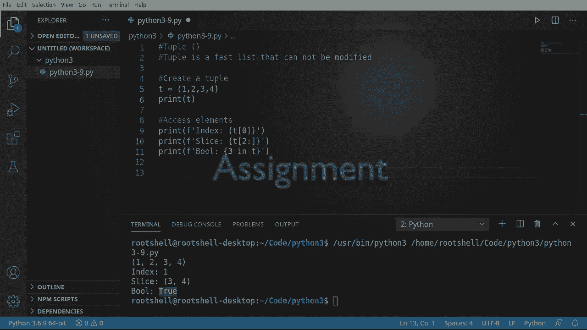

# Python 3全系列基础教程，全程代码演示&讲解！10小时视频42节，保证你能掌握Python！快来一起跟着视频敲代码~＜快速入门系列＞ - P9：9）Python元组：快速且只读 - ShowMeAI - BV1yg411c7Nw

欢迎回来，大家好。我是布莱恩。让我们继续探索 Python 3，谈谈元组这个有趣的名字，但这真的非常酷。元组是一个快速的列表，不能被修改。它是只读的。一旦你创建了它，你就不能对它进行任何更改。😊。这个东西存在的唯一目的是交换数据，通常用于类之间、对象之间。

在框架之间和设备之间。例如，假设有人制作了一个包，提供关于你的 CPU、内存和硬件的所有酷炫信息。他们不希望你能够修改这些内容。所以在表面上看起来可能有点普通和无聊，但正如我们即将看到的，你可以做一些非常酷的技巧。

我们要做的第一件事是创建一个元组。请创建一个名为 T 的变量，并给它赋值。注意它有这些小的圆括号。当你看到这些圆括号时，可以把它看作是一种防护，因为它是只读的。你无法更改它。我们只是给它一些信息。

我们不在乎放进去什么，因为我们只是测试一下，假设打印。你猜对了，它有这些圆括号，这就是标识它是元组的方式。这里的主要收获是不同风格的括号标识它将是什么，无论是元组、集合、列表还是字典，我们尚未覆盖字典。

现在我们有了一个元组，让我们看看如何访问这个元组中的元素。这非常简单。我们之前做过这个。让我们说，打印 F，并通过索引来访问。给出我们的索引位置。记住这是一个零基索引，所以零实际上是第一个位置，然后是 1、2，以此类推。

运行的结果正如你所预期的那样。让我们来做一个切片，因为切片非常简单有趣。我们将获取这个，并说，我想从两个开始，一直到元组的末尾。效果如预期。清空这个，让我们来看一下布尔操作。我们现在要做的是在元组中查找一些特定的内容，我想说的是 T 中是否有 3。

这样做的目的是告诉 Python，嘿，在这个元组中取这个值。它可以是列表、集合或字典。我们尚未覆盖字典。它将搜索并查看它是否确实在里面。让我们返回一个可以说是“是”或“否”的结果。在这种情况下，是的，因为 3 就在那里。

这非常容易使用，而且速度极快。

好吧，额外内容，让我们谈谈赋值。当我说赋值时，你真正指的是什么，我的意思是，元组有点无聊。你创建它们，可以访问元素，除此之外，你就完成了。好吧，你可以做一些很酷的事情，不仅仅是与元组，还是与列表和集合。

但是元组使得理解变得非常简单。所以我们要创建一个元组，放一些变量。这些不是值，而是变量。记住这些是变量，某些东西会改变 X，逗号 Y，逗号 Z。现在我要再创建一个元组，给它值，1，2，3。我们在这里做什么呢？

我们在说的是将这些变量和这些值配对，Python 在后台会弄清楚哪个需要是哪个。然后打印 X。让我们打印 Y。接下来打印 Z。看看这个效果，1，2，3。很美妙。现在让我们谈谈 range 函数，这是一件很多人不太谈论的事情。你只是看到它，并期望它能神奇地工作，让我们来获取这个。好了。

所以我们有了 X Y Z，我们要在这里删除这个，并且我们希望 Python 完成所有这些工作，我们不想坐在这里整天输入值。所以我会说 range。让我们给它一个，看看会发生什么。你可能期待会出现一个错误。

你得到了一个错误。没有足够的值来解包，期望三个，得到了一个。好吧。让我们在那里测试一下，假设我们要 6。我们给它比需要的更多的值。当然，又是一个错误，解包的值太多，期望 3。所以它在告诉你，我需要 3。它从哪里得到 3 呢？就从这里。实际上，Python 正在创建一个变量的元组。

我们可以使用 range 函数将这些变量赋值。现在，range 本身并没有返回一个元组。我们可以通过简单地获取这个来测试一下。然后打印出来。我们实际上将打印 range 3。注意我们得到了 0，1，2。所以这就是我们的范围，但我们打印 range 3，它显示为 range 0 到 3。

所以我们真正要扩展的是 range 本身在告诉 Python，进行循环，这个我们将在未来的视频中讨论。但是你有一个开始和一个结束。我们还没有真正给它一个起始名称。我们只是说，嘿，生成三个值。它将从 0 开始，执行三次。如果我们不想从零开始呢？

我们想从 1 开始。好吧，我们给它一个起始值。现在我们必须给它一个在这里的前进位置。为什么是 4？因为我们需要一个起始位置加上我们需要解包的数量，也就是 4。1 加 3 等于 4。现在它完全按你想的方式工作了。

