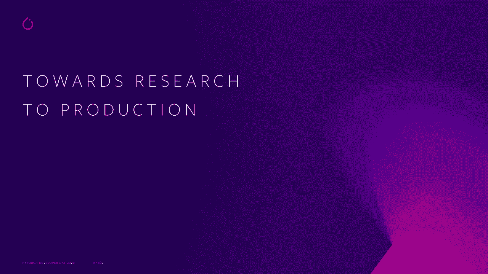
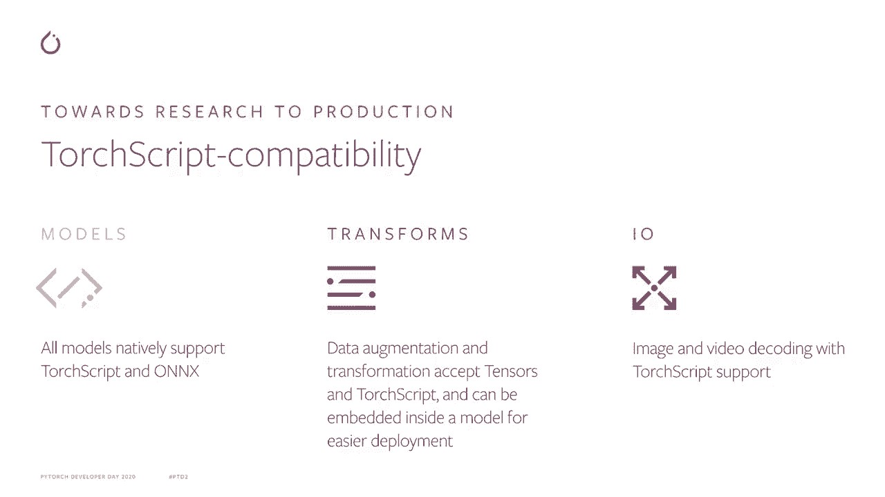
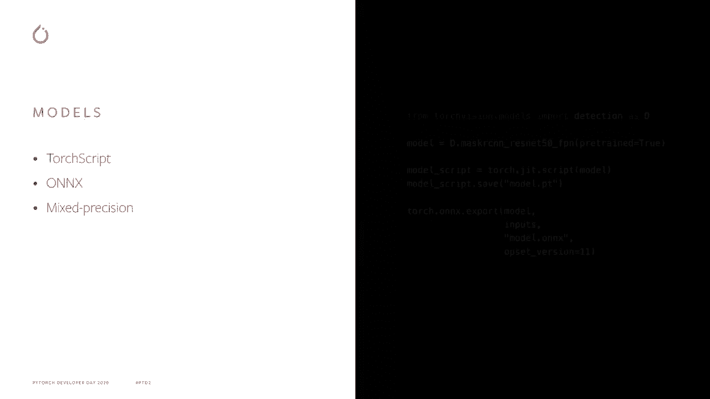
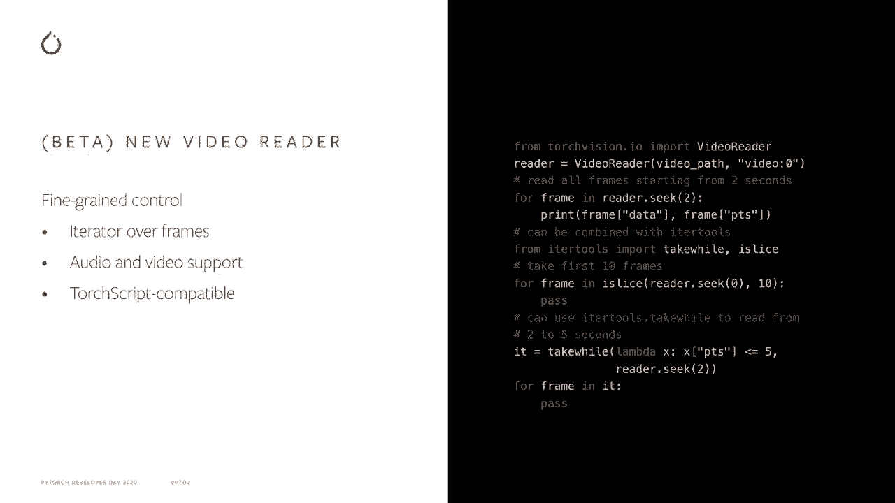

# Pytorch 进阶学习讲座！14 位 Facebook 工程师带你解锁 PyTorch 的生产应用与技术细节 ＜官方教程系列＞ - P8：L8- TorchVision 

🎼。

大家好，欢迎来到 2020 P Georgeor 开发者日。我是 Francisco Massa，Facebook AI 的研究员。我在 Ptorrch 团队工作，并且是 Torch Vision 的维护者。今天，我将讨论 TorteViion 是什么，以及它如何帮助你在 Byytorch 中开始计算机视觉的旅程。

最近一年中，TorVision 引入的最新功能。

你可能首先会问自己，什么是存储视觉？

Torch Vision 是一个旨在促进计算机视觉研究和实验的库。它扩展了 Pytorch，增加了非常特定且对计算机视觉有用的功能，从而保持 Pytorch 库的精简和专注于核心抽象。但我们的视觉中实际有哪些内容，让我们仔细看看。

T Divisionion 通过提供多个构建模块，促进计算机视觉的研究和实验，使你能够快速启动一个新项目。它提供数据集，常见数据集涵盖了许多主流视觉任务，如分类和目标检测。

它也有模型，我们提供分类、检测等模型的参考。TtVision 还具有专门针对计算机视觉模型的存储打印操作符，以及数据转换操作符，以简化数据增强管道的创建。此外，它包含高效图像和视频读取的原语，最后提供参考训练脚本。

下面几个文件展示了如何训练模型以进行视觉处理。😊。

利用我们提供的构建模块。在过去的一年里，我们一直在通过我们的视觉进行改进，以简化从研究到生产的路径。

Pytororch 通过 Trot 脚本来实现研究到生产的路径，Trot 脚本是你 Pytororch 程序的中间表示，可以导出以在 C++ 环境中运行。每个深度学习管道的核心部分都依赖于其模型。通过与 Torch 脚本和 Onx 团队密切合作。

我们已经使所有 Tortvis 模型原生支持 Trch 脚本和 OnX 导出。得益于预训练模型和视觉工具，你可以快速构建 C+ 分类，利用深度学习的力量。但在将你的 Python 代码嵌入 C++ 运行时时，模型仅仅是故事的一部分。你常常需要将输入数据准备成与模型兼容的格式。

DVi 以前依赖 pillow 进行大多数数据转换，因此将您的应用程序移动到 C++ 需要以兼容 C++ 的方式重新实现转换。现在，Torch Vi 转换可以直接在 Torch dance 上工作，并且可以导出到 Torch 脚本，因此您只需在 Python 中实现一次转换。最后。

T Divisionion 现在提供原生 IO 功能用于图像和视频解码，使得完整的原始数据到模型生产管道可以从 Python 转换为 C++。

现在让我们更详细地看看这些要点。

所有充电的 Vi 模型都支持原生 Trar 脚本和 Onx 导出，因此可以用几行代码将它们导出到 C+。此外，所有模型都支持混合精度训练和推理，使运行时间更快，同时内存占用更低。

😊，Tort vision 转换已从 N 模块继承，并接受带有 torch cry 兼容性的 torch 张量作为输入。这为数据增强管道带来了几个好处，例如现成的 GPU 支持，视频使用案例的启用，通过高效的帧批量转换，以及将转换与模型一起在 C++ 环境中导出的可能性。

TorchVision 现在提供 JPEG 和 PNG 格式的图像读取和写入操作符，支持原生 TorchQ。您可以将本地图像路径直接读取到 torch densesr，或者将操作符分解为原始文件读取，仅读取文件的字节并返回为 U8 densesor，并将原始数据切割为图像 densesr。

由于原生充电食品支持，图像解码可以与您的模型一起嵌入，实现端到端导出体验。最后，TVision 提供了一个基于帧的视频编写 API，支持音频和视频以及 Tr 脚本兼容性。

视频读取器是一个迭代器，可以与工具结合使用，实现高级视频读取模式，例如在指定时间戳后读取下一个 10 帧，或跳过视频的每隔一帧，或读取两个时间戳之间的所有帧。

这个新的视频读取 API 当前作为 beta 发布，其 API 可能会根据用户反馈而改变。

我们在 GitHub 上的示例中有一些新功能的附加示例，您可以找到 Vi Read API 及其转换的笔记本。在 Tro vision 中，我们欢迎任何贡献。如果您发现错误，或者有改进或新功能的请求，请通过 ToVision GitHub 页面的问题跟踪器告诉我们，或通过拉取请求贡献。

🎼感谢您观看，希望 Torch Vision 能帮助您构建利用 Torch 的出色新应用。

